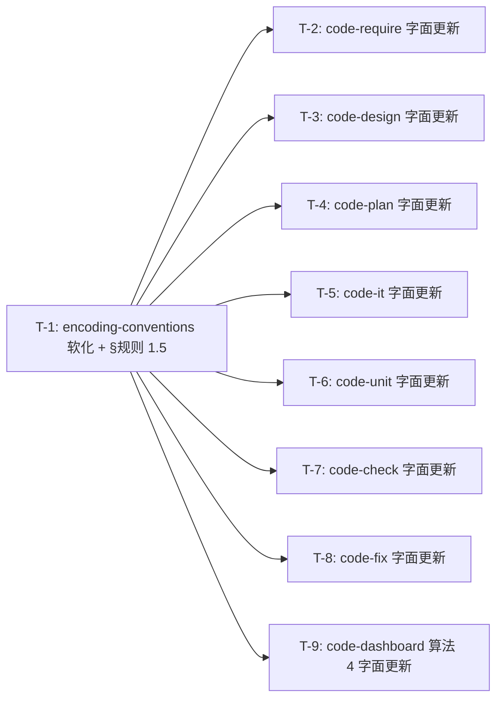

# 编码计划 — REQ-00025 — 软化编号正则约束(1 规范 + 8 SKILL.md 字面更新)

- 需求编码:REQ-00025
- 所属版本:V0.0.3
- 详细设计:./assistants/V0.0.3/plan/REQ-00025/RESULT.md (v1)
- 状态:草稿
- **开发完成度**:0 / 9
- **测试完成度**:0 / 9(全部"不适用",纯规范/纯文档修订,本仓库 0 测试框架)
- 创建:2026-06-08
- 最近更新:2026-06-08
- 当前版本:v1

---

## 1. 计划概述

- **任务总数**:9
- **类型分布**:9 修改(纯字面/字面量替换;0 新增代码逻辑;0 重命名)
- **关键里程碑数**:2
- **开发完成度**:已完成 0 / 9
- **测试完成度**:测试已通过或不适用的任务数 0 / 9
- **真正可发布任务数**:0 / 9(开发=已完成 ∧ 测试∈{已运行-通过, 不适用})

**关键观察**:本仓库 0 测试框架(纯文档项目),全部 9 任务的"测试状态"初值 = `不适用`(纯规范修订 / 纯 SKILL.md 字面更新),不适用理由 = "纯规范文件修订 / 接受静态校验 + 手动调用验证"。

---

## 2. 任务总览

| 任务编号 | 类型 | 触发/来源 | 标题 | 开发状态 | 测试状态 | 涉及文件/模块 | 前置任务 | 估算 | 责任人 | 关联任务 | 对应设计章节 |
| --- | --- | --- | --- | --- | --- | --- | --- | --- | --- | --- | --- |
| TASK-REQ-00025-00001 | 修改 | 详细设计 | [修改] encoding-conventions §规则 1/2/4 软化 + 新增 §规则 1.5 | 待开始 | 不适用 | `./assistants/rules/encoding-conventions.md §规则 1 §条款 表 + §规则 2 §条款 + §规则 4 §条款 + §规则 1.5(新)` | - | 0.3d | wangmiao | - | RESULT.md §4.1 / §5 算法 1 |
| TASK-REQ-00025-00002 | 修改 | 详细设计 | [修改] code-require §输入 + §工具使用约定 字面更新 | 待开始 | 不适用 | `./plugins/code-skills/skills/code-require/SKILL.md §输入 > 需求编码格式 + §工具使用约定 > 标题解析 > parseResultTitle` | T-1 | 0.2d | wangmiao | - | RESULT.md §4.2 / §5 算法 3 |
| TASK-REQ-00025-00003 | 修改 | 详细设计 | [修改] code-design §输入 + §工作目录约定 字面更新 | 待开始 | 不适用 | `./plugins/code-skills/skills/code-design/SKILL.md §输入 > 需求编码格式 + §工作目录约定 > 本技能的目录粒度` | T-1 | 0.2d | wangmiao | - | RESULT.md §4.3 / §5 算法 3 |
| TASK-REQ-00025-00004 | 修改 | 详细设计 | [修改] code-plan §输入 + §步骤 10A + §步骤 9B 字面更新 | 待开始 | 不适用 | `./plugins/code-skills/skills/code-plan/SKILL.md §输入 + §工作流程 > 步骤 10A > 任务编号 + §工作流程 > 步骤 9B > 任务编号分配` | T-1 | 0.3d | wangmiao | - | RESULT.md §4.4 / §5 算法 3 |
| TASK-REQ-00025-00005 | 修改 | 详细设计 | [修改] code-it §输入 + §步骤 1 + §步骤 7 字面更新 | 待开始 | 不适用 | `./plugins/code-skills/skills/code-it/SKILL.md §输入 > 任务编码格式 + §工作流程 > 步骤 1 解析任务编码 + §工作流程 > 步骤 7 写入 RESULT.md` | T-1 | 0.3d | wangmiao | - | RESULT.md §4.5 / §5 算法 3 |
| TASK-REQ-00025-00006 | 修改 | 详细设计 | [修改] code-unit §输入 字面更新 | 待开始 | 不适用 | `./plugins/code-skills/skills/code-unit/SKILL.md §输入 > 任务编码格式` | T-1 | 0.1d | wangmiao | - | RESULT.md §4.6 / §5 算法 3 |
| TASK-REQ-00025-00007 | 修改 | 详细设计 | [修改] code-check §输入 字面更新 | 待开始 | 不适用 | `./plugins/code-skills/skills/code-check/SKILL.md §输入 > 需求编号 / 任务编码` | T-1 | 0.1d | wangmiao | - | RESULT.md §4.7 / §5 算法 3 |
| TASK-REQ-00025-00008 | 修改 | 详细设计 | [修改] code-fix §输入 + §步骤 1 字面更新 | 待开始 | 不适用 | `./plugins/code-skills/skills/code-fix/SKILL.md §输入 > 缺陷编号格式 + §工作流程 > 步骤 1 收集输入 ID 并判定路径` | T-1 | 0.2d | wangmiao | - | RESULT.md §4.8 / §5 算法 3 |
| TASK-REQ-00025-00009 | 修改 | 详细设计 | [修改] code-dashboard 算法 4 字面更新(双正则兼容) | 待开始 | 不适用 | `./plugins/code-skills/skills/code-dashboard/SKILL.md §工作流程 > 算法 4 解析任务编号` | T-1 | 0.2d | wangmiao | - | RESULT.md §4.9 / §5 算法 3 |

**字段说明**:
- **任务编号**:`TASK-REQ-00025-NNNNN`(5+5 位嵌套式,沿用 `encoding-conventions §规则 1/3`)
- **类型**:`修改`(全部,纯字面量替换,0 新增代码逻辑)
- **触发/来源**:**全部** = `详细设计`(REQ-00017 强约束,不出现 `更新看板`)
- **开发状态**:`待开始`(初值,全部)
- **测试状态**:`不适用`(初值,全部;不适用理由 = 纯规范文件修订 / 接受静态校验 + 手动调用验证)
- **关联任务**:无
- **对应设计章节**:RESULT.md §4 模块详细化 + §5 算法

> **双状态语义**:任务的开发状态与测试状态是**正交两轴**。
> 任务"真正可发布" = 开发状态 = `已完成` **且** 测试状态 ∈ {`已运行-通过`, `不适用`}。
> 本计划 9 任务测试状态初值 = `不适用`(纯文档改动),故"完成开发"即"可发布"。

### 2.1 触发/来源枚举

(沿用既有 13 枚举,本计划全部用 `详细设计`)

| 值 | 含义 | 本计划出现 |
| --- | --- | --- |
| `详细设计` | 因 code-plan 首次拆分产生 | **9 次** |

> **不出现** `更新看板`(REQ-00017 强约束)。

---

## 3. 任务详情

每条任务独立成节,按任务编号顺序排列。

---

### TASK-REQ-00025-00001:[修改] encoding-conventions §规则 1/2/4 软化 + 新增 §规则 1.5

#### 基础信息
- **类型**:修改
- **触发/来源**:详细设计
- **触发任务**:无
- **开发状态**:待开始
- **目标**:将 `encoding-conventions.md` 从"5 位纯数字强约束"软化为"生成端 5 位纯数字(默认) + 接收端任意 1+ 位后缀(字符集 `A-Za-z0-9.\-_`)"
- **涉及文件/模块**:`./assistants/rules/encoding-conventions.md`
- **前置任务**:无(本任务为权威源修订,无前置)
- **关联任务**:无
- **关键变更**:
  - **§规则 1 §条款 表**(语义化锚点,3 行修改):
    - 需求行:正则 `^REQ-\d{5}$` → `^REQ-[A-Za-z0-9.\-_]+$`;容量 99999 → "按后缀长度(无限制,仅 OS 文件系统层 255 字符约束)";备注"5 位纯数字,父级 ID 维度" → "默认 5 位纯数字;接收可放宽,前缀固定 `REQ-`"
    - 缺陷行:正则 `^BUG-\d{5}$` → `^BUG-[A-Za-z0-9.\-_]+$`(同需求行)
    - 任务行:正则 `^TASK-(REQ|BUG)-\d{5}-\d{5}$` → `^TASK-(REQ|BUG)-[A-Za-z0-9.\-_]+-[A-Za-z0-9.\-_]+$`(同)
  - **§规则 2 §条款**(语义化锚点):
    - 1. **5 位固定宽度** → 1. **生成端 5 位纯数字(默认);接收端任意 1+ 位后缀,字符集 `A-Za-z0-9.\-_`**(其余 3 项不变)
  - **§规则 4 §条款 步骤 4(解析入口)**(语义化锚点):
    - `code-it` / `code-plan` / `code-unit` / `code-check` 解析任务编码**优先**使用 `^TASK-(REQ|BUG)-[A-Za-z0-9.\-_]+-[A-Za-z0-9.\-_]+$`(生成端仍 5 位纯数字)
  - **§规则 1.5(全新小节,插在 §规则 1 与 §规则 2 之间)**:
    - 标题:"第三方平台接入指南"
    - 条款:1. 用户调 `code-rule` 登记新前缀(如 `JIRA- → 等价 REQ-`);2. 后续 `code-require JIRA-123` 自动识别为"需求"
    - 表格:第三方平台前缀登记表(初始空)
- **边界与异常**:
  - 边界 1:既有 5 位纯数字编号(`REQ-00001` / `TASK-REQ-00001-00001`)→ 新正则超集,继续命中 → 处理:无操作
  - 边界 2:`EXISTING-NNN` 形式(基线特例)→ 沿用"不追溯"原则 → 处理:无操作
- **验证手段**:`git diff` + `Read` 文档(对照 U-1 / U-6 / U-7)+ 手动调用 `code-require REQ-00020` 验证既有编号继续工作
- **回退方式**:`git checkout` 回退 `encoding-conventions.md` 到 v1
- **对应设计章节**:RESULT.md §4.1 / §5 算法 1 / §6.1 / §6.2
- **依据规范**:`encoding-conventions.md §规则 1/2/4`(本需求直接修订)
- **创建时间**:2026-06-08
- **最近更新**:2026-06-08

#### 单元测试状态
- **测试状态**:不适用
- **不适用理由**:纯规范文件修订,本仓库 0 测试框架;接受静态校验(`git diff` 校验文档变更) + 手动调用验证(用户调 `code-require REQ-00020` 等)

---

### TASK-REQ-00025-00002:[修改] code-require §输入 + §工具使用约定 字面更新

#### 基础信息
- **类型**:修改
- **触发/来源**:详细设计
- **触发任务**:无
- **开发状态**:待开始
- **目标**:在 `code-require/SKILL.md` 中将"需求编号格式"字面更新为"默认 5 位纯数字,接收可放宽";`§标题解析` 段加注"完整编号不截断"
- **涉及文件/模块**:`./plugins/code-skills/skills/code-require/SKILL.md`
- **前置任务**:T-1 (encoding-conventions 修订完成,本任务才有"读什么"的依据)
- **关联任务**:无
- **关键变更**:
  - **§输入 > 需求编码格式 行**(语义化锚点):
    - 旧:"必须 `^REQ-\d{5}$`"
    - 新:"**默认** 5 位纯数字 `^REQ-\d{5}$`;**接收**可放宽为 `^REQ-[A-Za-z0-9.\-_]+$`(前缀 `REQ-` + 后缀 1+ 位字母数字/`.`/`-`/`_`)"
  - **§工具使用约定 > 标题解析(REQ-00013 新增) > parseResultTitle 注释段**(语义化锚点):
    - 旧:"按 5 位纯数字解析"
    - 新:"按前缀 + 后缀两段式解析;屏显保留完整编号(**不**截断 30 字符;30 字符限制只针对**标题**)"
- **边界与异常**:
  - 边界 1:既有 5 位纯数字(`REQ-00020`)→ 新正则超集,继续命中 → 处理:无操作
  - 异常 1:SKILL.md frontmatter 被破坏 → 触发 `skill-conventions.md §规则 1` 违规 → 处理:严格保留 frontmatter(L1-3 字节级)
- **验证手段**:`git diff` + `Read` SKILL.md(对照 U-1)+ INV-10/INV-16 静态校验
- **回退方式**:`git checkout` 回退 `code-require/SKILL.md`
- **对应设计章节**:RESULT.md §4.2 / §5 算法 3
- **依据规范**:`encoding-conventions.md §规则 1`(本需求修订后)+ `skill-conventions.md §规则 1`
- **创建时间**:2026-06-08
- **最近更新**:2026-06-08

#### 单元测试状态
- **测试状态**:不适用
- **不适用理由**:纯 SKILL.md 字面更新,本仓库 0 测试框架;接受静态校验 + 手动调用验证

---

### TASK-REQ-00025-00003:[修改] code-design §输入 + §工作目录约定 字面更新

#### 基础信息
- **类型**:修改
- **触发/来源**:详细设计
- **触发任务**:无
- **开发状态**:待开始
- **目标**:在 `code-design/SKILL.md` 中将"需求编码格式"字面更新;`§工作目录约定` 段加注"沿用新规则(后缀自由)"
- **涉及文件/模块**:`./plugins/code-skills/skills/code-design/SKILL.md`
- **前置任务**:T-1
- **关联任务**:无
- **关键变更**:
  - **§输入 > 需求编码格式 行**(语义化锚点):同 T-2
  - **§工作目录约定(强制) > 本技能的目录粒度是需求 > 涉及"需求编号路径" 行**(语义化锚点):
    - 加注:"沿用新规则(后缀自由,`[A-Za-z0-9.\-_]+` 字符集)"
- **边界与异常**:
  - 边界 1:既有 5 位纯数字 → 继续命中 → 处理:无操作
  - 异常 1:SKILL.md frontmatter 被破坏 → INV-11 触发 → 处理:严格保留 frontmatter
- **验证手段**:`git diff` + INV-11/INV-16 静态校验
- **回退方式**:`git checkout`
- **对应设计章节**:RESULT.md §4.3 / §5 算法 3
- **依据规范**:`encoding-conventions.md §规则 1`(本需求修订后)+ `skill-conventions.md §规则 1`
- **创建时间**:2026-06-08
- **最近更新**:2026-06-08

#### 单元测试状态
- **测试状态**:不适用
- **不适用理由**:纯 SKILL.md 字面更新,接受静态校验 + 手动调用验证

---

### TASK-REQ-00025-00004:[修改] code-plan §输入 + §步骤 10A + §步骤 9B 字面更新

#### 基础信息
- **类型**:修改
- **触发/来源**:详细设计
- **触发任务**:无
- **开发状态**:待开始
- **目标**:在 `code-plan/SKILL.md` 中将"需求 / 缺陷 / 任务编号"字面更新;`§步骤 10A` 任务编号定义明确"生成 vs 接收"分离;`§步骤 9B` 任务编号分配加注
- **涉及文件/模块**:`./plugins/code-skills/skills/code-plan/SKILL.md`
- **前置任务**:T-1
- **关联任务**:无
- **关键变更**:
  - **§输入 > 需求编码 / 缺陷编号 行**(语义化锚点):同 T-2
  - **§工作流程 > 步骤 10A 任务拆分 > 任务编号 小节**(语义化锚点):
    - 旧:"格式:`TASK-(REQ|BUG)-NNNNN-NNNNN`,如 ... ;任务序号自 00001 起递增,**五位补零**"
    - 新:"格式:`TASK-(REQ|BUG)-<父级>-<任务序号>`;**生成端**沿用 5 位纯数字(`\d{5}`),**接收端**放宽为 `[A-Za-z0-9.\-_]+` 字符集(后缀自由,新规则)"
  - **§工作流程 > 步骤 9B 增量更新 PLAN.md > 任务编号分配 小节**(语义化锚点):同上加注"新规则下后缀可非 5 位"
- **边界与异常**:
  - 边界 1:既有 5 位纯数字 → 继续命中 → 处理:无操作
  - 异常 1:SKILL.md frontmatter 被破坏 → INV-12 触发 → 处理:严格保留 frontmatter
- **验证手段**:`git diff` + INV-12/INV-16 静态校验
- **回退方式**:`git checkout`
- **对应设计章节**:RESULT.md §4.4 / §5 算法 3
- **依据规范**:`encoding-conventions.md §规则 1/3`(本需求修订后)+ `skill-conventions.md §规则 1`
- **创建时间**:2026-06-08
- **最近更新**:2026-06-08

#### 单元测试状态
- **测试状态**:不适用
- **不适用理由**:纯 SKILL.md 字面更新,接受静态校验 + 手动调用验证

---

### TASK-REQ-00025-00005:[修改] code-it §输入 + §步骤 1 + §步骤 7 字面更新

#### 基础信息
- **类型**:修改
- **触发/来源**:详细设计
- **触发任务**:无
- **开发状态**:待开始
- **目标**:在 `code-it/SKILL.md` 中将"任务编码格式"字面更新;`§步骤 1` 解析正则替换;`§步骤 7` 子目录生成时沿用新规则
- **涉及文件/模块**:`./plugins/code-skills/skills/code-it/SKILL.md`
- **前置任务**:T-1
- **关联任务**:无
- **关键变更**:
  - **§输入 > 任务编码格式 行**(语义化锚点):同 T-2
  - **§工作流程 > 步骤 1 解析任务编码 子节**(语义化锚点):
    - 正则从 `^TASK-(REQ|BUG)-\d{5}-\d{5}$` → `^TASK-(REQ|BUG)-[A-Za-z0-9.\-_]+-[A-Za-z0-9.\-_]+$`
  - **§工作流程 > 步骤 7 写入 RESULT.md 子节**(语义化锚点):
    - 子目录生成时,父级 + 子级后缀沿用新规则(用 `-` 切分)
- **边界与异常**:
  - 边界 1:既有 5 位纯数字 → 继续命中 → 处理:无操作
  - 异常 1:SKILL.md frontmatter 被破坏 → INV-14 触发 → 处理:严格保留 frontmatter
- **验证手段**:`git diff` + INV-14/INV-16 静态校验
- **回退方式**:`git checkout`
- **对应设计章节**:RESULT.md §4.5 / §5 算法 3
- **依据规范**:`encoding-conventions.md §规则 1/3`(本需求修订后)+ `skill-conventions.md §规则 1`
- **创建时间**:2026-06-08
- **最近更新**:2026-06-08

#### 单元测试状态
- **测试状态**:不适用
- **不适用理由**:纯 SKILL.md 字面更新,接受静态校验 + 手动调用验证

---

### TASK-REQ-00025-00006:[修改] code-unit §输入 字面更新

#### 基础信息
- **类型**:修改
- **触发/来源**:详细设计
- **触发任务**:无
- **开发状态**:待开始
- **目标**:在 `code-unit/SKILL.md` 中将"任务编码格式"字面更新
- **涉及文件/模块**:`./plugins/code-skills/skills/code-unit/SKILL.md`
- **前置任务**:T-1
- **关联任务**:无
- **关键变更**:
  - **§输入 > 任务编码格式 行**(语义化锚点):同 T-2
- **边界与异常**:
  - 边界 1:既有 5 位纯数字 → 继续命中 → 处理:无操作
  - 异常 1:SKILL.md frontmatter 被破坏 → INV-15 触发 → 处理:严格保留 frontmatter
- **验证手段**:`git diff` + INV-15/INV-16 静态校验
- **回退方式**:`git checkout`
- **对应设计章节**:RESULT.md §4.6 / §5 算法 3
- **依据规范**:`encoding-conventions.md §规则 1`(本需求修订后)+ `skill-conventions.md §规则 1`
- **创建时间**:2026-06-08
- **最近更新**:2026-06-08

#### 单元测试状态
- **测试状态**:不适用
- **不适用理由**:纯 SKILL.md 字面更新,接受静态校验 + 手动调用验证

---

### TASK-REQ-00025-00007:[修改] code-check §输入 字面更新

#### 基础信息
- **类型**:修改
- **触发/来源**:详细设计
- **触发任务**:无
- **开发状态**:待开始
- **目标**:在 `code-check/SKILL.md` 中将"需求编号 / 任务编码"字面更新
- **涉及文件/模块**:`./plugins/code-skills/skills/code-check/SKILL.md`
- **前置任务**:T-1
- **关联任务**:无
- **关键变更**:
  - **§输入 > 需求编号 / 任务编码 行**(语义化锚点):同 T-2
- **边界与异常**:
  - 边界 1:既有 5 位纯数字 → 继续命中 → 处理:无操作
  - 异常 1:SKILL.md frontmatter 被破坏 → INV-13 触发 → 处理:严格保留 frontmatter
- **验证手段**:`git diff` + INV-13/INV-16 静态校验
- **回退方式**:`git checkout`
- **对应设计章节**:RESULT.md §4.7 / §5 算法 3
- **依据规范**:`encoding-conventions.md §规则 1`(本需求修订后)+ `skill-conventions.md §规则 1`
- **创建时间**:2026-06-08
- **最近更新**:2026-06-08

#### 单元测试状态
- **测试状态**:不适用
- **不适用理由**:纯 SKILL.md 字面更新,接受静态校验 + 手动调用验证

---

### TASK-REQ-00025-00008:[修改] code-fix §输入 + §步骤 1 字面更新

#### 基础信息
- **类型**:修改
- **触发/来源**:详细设计
- **触发任务**:无
- **开发状态**:待开始
- **目标**:在 `code-fix/SKILL.md` 中将"缺陷编号格式"字面更新;`§步骤 1` 解析正则替换
- **涉及文件/模块**:`./plugins/code-skills/skills/code-fix/SKILL.md`
- **前置任务**:T-1
- **关联任务**:无
- **关键变更**:
  - **§输入 > 缺陷编号格式 行**(语义化锚点):同 T-2
  - **§工作流程 > 步骤 1 收集输入 ID 并判定路径 子节**(语义化锚点):
    - 正则从 `^BUG-\d{5}$` → `^BUG-[A-Za-z0-9.\-_]+$`
- **边界与异常**:
  - 边界 1:既有 5 位纯数字 → 继续命中 → 处理:无操作
  - 异常 1:SKILL.md frontmatter 被破坏 → INV-13 触发 → 处理:严格保留 frontmatter
- **验证手段**:`git diff` + INV-13/INV-16 静态校验
- **回退方式**:`git checkout`
- **对应设计章节**:RESULT.md §4.8 / §5 算法 3
- **依据规范**:`encoding-conventions.md §规则 1`(本需求修订后)+ `skill-conventions.md §规则 1`
- **创建时间**:2026-06-08
- **最近更新**:2026-06-08

#### 单元测试状态
- **测试状态**:不适用
- **不适用理由**:纯 SKILL.md 字面更新,接受静态校验 + 手动调用验证

---

### TASK-REQ-00025-00009:[修改] code-dashboard 算法 4 字面更新(双正则兼容)

#### 基础信息
- **类型**:修改
- **触发/来源**:详细设计
- **触发任务**:无
- **开发状态**:待开始
- **目标**:在 `code-dashboard/SKILL.md` 中将"算法 4 解析任务编号"正则放宽(双正则兼容)
- **涉及文件/模块**:`./plugins/code-skills/skills/code-dashboard/SKILL.md`
- **前置任务**:T-1
- **关联任务**:无
- **关键变更**:
  - **§工作流程 > 算法 4 解析任务编号 子节**(语义化锚点):
    - 正则从 `TASK-(REQ|BUG)-\d{5}-\d{5}` → `TASK-(REQ|BUG)-[A-Za-z0-9.\-_]+-[A-Za-z0-9.\-_]+`(双正则兼容,沿用 AC-7)
- **边界与异常**:
  - 边界 1:既有 5 位纯数字 → 继续命中 → 处理:无操作
  - 异常 1:SKILL.md frontmatter 被破坏 → INV-13 触发 → 处理:严格保留 frontmatter
- **验证手段**:`git diff` + INV-13/INV-16 静态校验
- **回退方式**:`git checkout`
- **对应设计章节**:RESULT.md §4.9 / §5 算法 3
- **依据规范**:`encoding-conventions.md §规则 1/3`(本需求修订后)+ `skill-conventions.md §规则 1`
- **创建时间**:2026-06-08
- **最近更新**:2026-06-08

#### 单元测试状态
- **测试状态**:不适用
- **不适用理由**:纯 SKILL.md 字面更新,接受静态校验 + 手动调用验证

---

## 4. 任务依赖图



**关键观察**:
- T-1 是权威源,8 个 SKILL.md 任务(T-2~T-9)**全部依赖** T-1
- T-2~T-9 互相独立(8 个文件互不引用)
- T-2~T-9 可并行执行(若有多人协作 / 多会话场景)

---

## 5. 里程碑

| 里程碑 | 包含任务 | 完成定义 | 预期时间 |
| --- | --- | --- | --- |
| **M1:软化编号正则上线** | T-1 ~ T-9(9 任务) | 9 任务开发状态=已完成 ∧ 测试状态=不适用 | 2026-06-08 |
| **M2:验证** | (无新增任务,仅手动验证 U-1~U-10) | 既有 5 位纯数字(`REQ-00020` / `BUG-00001` / `TASK-REQ-00020-00001`)+ 新格式(`JIRA-123` / `JIRA-V0.0.1.001` / `JIRA-2025-Q4-001`)均可解析;U-1~U-10 全部通过 | 2026-06-08 |

> 完成定义显式列出两轴状态要求,避免把"开发完成"误当"可发布"。

---

## 6. 状态管理规则

### 6.1 开发状态(主状态)

- **状态推进**:`待开始` → `进行中` → `已完成`
- **已完成不可逆**:本计划 9 任务**不**应回退开发状态
- **状态变更记录**:每次状态变更在"变更记录"中记录(变更类型=开发状态更新)

### 6.2 测试状态(平行状态)

- **初始化**:全部 9 任务初值 = `不适用`(纯文档/纯规范改动)
- **不适用不可逆**:一旦标为 `不适用`,**不**应再变为其他值
- **状态变更记录**:每次状态变更在"变更记录"中记录(变更类型=测试状态更新)

### 6.3 任务"真正可发布"定义

```
任务真正可发布 ⟺
    开发状态 = 已完成
    ∧ 测试状态 ∈ {已运行-通过, 不适用}
```

- 本计划 9 任务测试状态初值 = `不适用`,故"完成开发"即"可发布"

### 6.4 状态字段更新责任分工

| 字段 | 主要更新方 | 触发时机 |
| --- | --- | --- |
| 开发状态(待开始→进行中) | `code-it` | 步骤 7 任务开始 |
| 开发状态(进行中→已完成) | `code-it` | 步骤 14 任务完成 |
| 测试状态(任意→不适用) | `code-plan`(已锁定)/ `code-it` | 首次拆分 / 任务执行时确认 |
| 任务标题、关键变更等描述 | `code-plan` 增量更新 | 步骤 9B |
| 触发/来源 | `code-plan`(已锁定) | 首次拆分 |

---

## 7. 关联计划

| 关联计划编码 | 关联点 | 对本计划的影响 | 链接 |
| --- | --- | --- | --- |
| REQ-00002(编码权威源初版) | `encoding-conventions.md` 5 位纯数字初版 | 本计划是 REQ-00002 的"放宽版";保留 REQ-00002 既定契约(默认生成仍为 5 位纯数字) | [RESULT.md](../REQ-00002/...) |
| REQ-00007(code-auto 模式 B) | 0 直接影响 | (无) | [RESULT.md](../REQ-00007/...) |
| REQ-00024(路径感知) | 路径感知下 `code-auto` 可识别任意前缀的需求(如 `JIRA-123`) | 本计划放宽"需求编号"字面 → 路径感知可识别任意前缀 | [RESULT.md](../REQ-00024/...) |
| BUG-00001(INV 守卫) | BUG-00001 修复的 INV-10~16 守卫"项目可测性" + "不修改 SKILL.md"硬约束 | 本计划 9 任务全部"测试状态=不适用"(code-unit 守卫"项目可测性"会拒测);8 SKILL.md 任务由 `code-it` 实施(沿用 INV-12 "code-plan 不修改 SKILL.md"硬约束) | [RESULT.md](../../fix/BUG-00001/RESULT.md) |

---

## 8. 变更记录

| 时间 | 版本 | 变更类型 | 变更摘要 | 变更人 |
| --- | --- | --- | --- | --- |
| 2026-06-08 | v1 | 初始创建 | code-plan 完成 REQ-00025 编码计划(共 9 个任务:1 规范修订 + 8 SKILL.md 字面更新);整体=`--balanced`(沿用 design 锁定);0 派生"更新看板"任务(沿用 REQ-00017 强约束);2 里程碑(M1 完成态 + M2 验证态);全部 9 任务"触发/来源"=详细设计,全部"测试状态"=不适用(纯规范/纯文档修订) | wangmiao |
