# REQ-00025 — 详细设计(软化编号正则约束,允许用户自定义编号格式)

- 需求编码:REQ-00025
- 所属版本:V0.0.3
- 上游需求:./assistants/V0.0.3/require/REQ-00025/RESULT.md (v1)
- 上游概要设计:./assistants/V0.0.3/design/REQ-00025/RESULT.md (v1;2026-06-08 增量更新确认 no-op)
- 遵循规范:./assistants/rules/encoding-conventions.md §规则 1/2/4(本需求**直接修订** + 新增 §规则 1.5)、skill-conventions.md §规则 1、dashboard-conventions.md §规则 1、commit-conventions.md
- 状态:草稿
- 责任人:wangmiao
- 创建:2026-06-08
- 最近更新:2026-06-08
- 当前版本:v1

---

## 设计目标

<!-- 本节由 code-design / code-plan 步骤 0b 自动生成(写入或沿用) -->
- 整体设计目标:`--balanced`(code-design 检测到 `.code-auto-running` 文件,自动采纳默认值)
- 维度优先级:
  - 功能性:中(纯软化,非架构层;不新增功能能力)
  - 扩展性:中(为未来多平台接入预留扩展点)
  - 健壮性:中(向后兼容既有 5 位编号;非法输入有明确兜底)
  - 可维护性:中(1 规范 + 8 SKILL.md 字面更新,变更半径可控)
  - 封装性:不适用(本仓库 Markdown 自然语言,无函数级封装)
  - 可复用性:不适用(无业务逻辑代码,无复用问题)
  - 可读性:不适用(本仓库 Markdown 自然语言,无"非自然语言编程语言"维度需求)
- 已沿用 design/.../RESULT.md "## 设计目标"(本需求 plan 阶段未触发重新评估)

---

## 1. 详细设计概述

本详细设计在概要设计"D-1 生成 vs 接收分离"与"D-6 8 个相关技能字面更新"两条核心决策基础上,将改动精确落到 **9 个文件**(1 规范 + 8 SKILL.md)的具体语义锚点上:为每个文件指明**修改哪个章节标题下的哪些字面量**,确保 `code-it` 在并发开发中能基于当前真实结构精确定位。

**关键决策细化**:
- **正则模板集**:4 套新正则(需求 / 缺陷 / 需求任务 / 缺陷任务),统一为"前缀 + 后缀字符集 `A-Za-z0-9.\-_`"两段式
- **后缀字符集边界**:仅允许 `A-Za-z0-9.\-_`(共 64 个字符),排除 `/` `\` 路径分隔符 + 排除 `!@#$%^&*()` 等 OS 差异字符
- **屏显契约保留**:`formatReqTitle(reqNum, title)` 沿用既有(不截断编号本身,30 字符限制只针对**标题**)
- **INV 兼容**:既有 INV-10~16 关键字 grep 校验对自定义编号继续生效(基于关键字,不基于编号格式)

**任务数**:**9 条**(1 规范修订 + 8 SKILL.md 字面更新),全部"触发/来源"= `详细设计`,全部"测试状态"= `不适用`(本仓库 0 测试框架;code-unit 守卫"项目可测性"会拒测)。

**变更半径**:`./assistants/rules/encoding-conventions.md` 1 处 + 8 个 SKILL.md 字面更新;0 字段新增,0 触发 `dashboard-conventions §规则 1` 三同步,0 派生"更新看板"任务。

---

## 2. 上游引用

- **需求**:`./assistants/V0.0.3/require/REQ-00025/RESULT.md` (v1)
  - FR-1 解析端正则放宽(8 技能)/ FR-2 encoding-conventions 软化 / FR-3 解析两段式 / FR-4 屏显契约 / FR-5 INV 兼容 / FR-6 第三方前缀登记 / FR-7 旧新互操作 / FR-8 8 SKILL.md 字面更新
  - NFR-1 性能 / NFR-2 可用性 / NFR-3 安全(路径遍历 + 注入)/ NFR-4 可观测性 / NFR-5 兼容性(0 破坏)/ NFR-6 国际化(0 影响)/ NFR-7 可维护性(净 +20 行)
  - AC-1~AC-8(既有 5 位兼容 / Jira 风格 / 非法前缀 / 非法后缀 / INV 兼容 / encoding-conventions 软化 / 8 SKILL.md 字面更新 / 屏显契约)
- **概要设计**:`./assistants/V0.0.3/design/REQ-00025/RESULT.md` (v1;2026-06-08 增量更新确认 no-op)
  - D-1 生成 vs 接收分离 / D-2 后缀字符集 `A-Za-z0-9.\-_` / D-3 第三方平台前缀登记流程 / D-4 屏显保留完整编号 / D-5 0 破坏性变更 / D-6 8 个相关技能 SKILL.md 字面更新
  - 模块拆分(9 文件改动表)
  - 算法 `parseID(raw, type)` + `generateID(type)`
  - 13 份项目级规范自检结论
- **规范**:
  - `./assistants/rules/encoding-conventions.md` §规则 1 / §规则 2 / §规则 4(本需求**直接修订**;新增 §规则 1.5)
  - `./assistants/rules/skill-conventions.md` §规则 1:SKILL.md frontmatter 字节级保留(INV 严守)
  - `./assistants/rules/dashboard-conventions.md` §规则 1:看板字段扩展需 3 文件同步(本需求 0 触发)
  - `./assistants/rules/commit-conventions.md`:沿用 `chore(code-xxx):` 格式

---

## 3. 规范遵循

| 规范 | 触发? | 结论 |
| --- | --- | --- |
| `encoding-conventions.md §规则 1/2/4` | ✅ 强 | 本需求**直接修订**(1 处新增 §规则 1.5) |
| `skill-conventions.md §规则 1` | ✅ 强 | 8 个 SKILL.md frontmatter 字节级保留(INV 严守) |
| `dashboard-conventions.md §规则 1` | ❌ | 0 字段扩展,0 三同步 |
| `doc-conventions.md §规则 1-2` | ❌ | 本需求不涉及 README |
| `commit-conventions.md` | ⚠️ 软 | 沿用 `chore(code-xxx):` 格式 |
| `module-conventions.md` | ❌ | DEPRECATED,本修复不引用 |
| `directory-conventions.md` | ❌ | 占位待填,本修复不触发 |
| `coding-style.md` | ❌ | 占位,SKILL.md 是自然语言不涉及代码风格 |
| `dependency-conventions.md` | ❌ | 0 新依赖 |
| `framework-conventions.md` | ❌ | 0 架构变更 |
| `naming-conventions.md` | ❌ | 0 新增命名实体 |
| `migration-mapping.md` | ❌ | 0 编码重命名 |
| `marketplace-protocol.md` | ❌ | 0 JSON 字段变更 |

**自检结论**:1 强约束触发修订(encoding-conventions),1 强约束严守(skill-conventions,frontmatter 字节级保留),0 软约束变更,0 用户授权偏离,0 待澄清冲突。

---

## 4. 模块详细化

按模块逐一展开,**对应概要设计 §3 模块拆分(9 文件改动表)**。

### 4.1 模块:encoding-conventions.md(对应概要设计 §3.1 / D-1 / D-2 / D-6)

- **路径**:`./assistants/rules/encoding-conventions.md`
- **关键修改锚点**:
  - `§规则 1 §条款 表`(3 行正则 + 备注列):旧 `^REQ-\d{5}$` / `^BUG-\d{5}$` / `^TASK-(REQ|BUG)-\d{5}-\d{5}$` → 新 `^REQ-[A-Za-z0-9.\-_]+$` / `^BUG-[A-Za-z0-9.\-_]+$` / `^TASK-(REQ|BUG)-[A-Za-z0-9.\-_]+-[A-Za-z0-9.\-_]+$`
  - `§规则 1 §条款 表` 备注列:容量 99999 → "按后缀长度(无限制,仅 OS 文件系统层 255 字符约束)"
  - `§规则 2 §条款`:从"5 位固定宽度"改为"生成端 5 位纯数字 + 接收端任意 1+ 位后缀(字符集 `A-Za-z0-9.\-_`)"
  - `§规则 4 §条款` 步骤 4(解析入口):从"`^TASK-(REQ|BUG)-\d{5}-\d{5}$`"改为"**优先**用 `^TASK-(REQ|BUG)-[A-Za-z0-9.\-_]+-[A-Za-z0-9.\-_]+$`"
  - `§规则 1.5`(全新小节,**插在 §规则 1 与 §规则 2 之间**):"第三方平台接入指南",说明"如何登记新前缀" + "前缀等价表"(空表,初始登记由用户通过 `code-rule` 追加)
- **关键调用顺序**:本规范为权威源,8 个 SKILL.md 全部"读规范"模式,无调用关系
- **状态归属**:跨版本共享,所有 `code-*` 技能只读
- **资源管理**:N/A
- **错误处理范式**:N/A
- **日志埋点**:N/A
- **依据规范**:`./assistants/rules/encoding-conventions.md` §规则 1/2/4(本需求直接修订)

### 4.2 模块:code-require/SKILL.md(对应概要设计 §3.2 / D-6)

- **路径**:`./plugins/code-skills/skills/code-require/SKILL.md`
- **关键修改锚点**:
  - `§输入` 段中"## 输入"小节(说明需求编码格式):"必须 `^REQ-\d{5}$`" → "**默认** 5 位纯数字 `^REQ-\d{5}$`;**接收**可放宽为 `^REQ-[A-Za-z0-9.\-_]+$`(前缀 `REQ-` + 后缀 1+ 位字母数字/`.`/`-`/`_`)"
  - `§标题解析(REQ-00013 新增)` 段中 `parseResultTitle` / `formatReqTitle` 伪代码注释:"按 5 位纯数字" → "按前缀 + 后缀两段式解析;屏显保留完整编号(不截断)"
- **与概要设计对应**:§3.2 + D-6
- **依据规范**:`encoding-conventions.md §规则 1`(本需求修订后)

### 4.3 模块:code-design/SKILL.md(对应概要设计 §3.3 / D-6)

- **路径**:`./plugins/code-skills/skills/code-design/SKILL.md`
- **关键修改锚点**:
  - `§输入` 段:"## 输入"小节中"需求编码格式"行:同 code-require 放宽
  - `§工作目录约定(强制)` 段中"本技能的目录粒度是**需求**"小节下,凡涉及"需求编号路径"行:加注"沿用新规则(后缀自由)"
- **依据规范**:`encoding-conventions.md §规则 1`(本需求修订后)

### 4.4 模块:code-plan/SKILL.md(对应概要设计 §3.4 / D-6)

- **路径**:`./plugins/code-skills/skills/code-plan/SKILL.md`
- **关键修改锚点**:
  - `§输入` 段:"## 输入"小节中"需求编码 / 缺陷编号"行:同 code-require 放宽
  - `§工作流程` 段中"### 步骤 10A — 任务拆分"子节的"**任务编号**"小节:格式定义从"五位补零" → "**生成端** 5 位纯数字(默认,沿用既有);**接收端** `[A-Za-z0-9.\-_]+`(后缀自由,新规则)"
  - `§工作流程` 段中"### 步骤 9B — 增量更新 PLAN.md"子节的"**任务编号分配**"小节:同上加注"新规则下后缀可非 5 位"
- **依据规范**:`encoding-conventions.md §规则 1/3`(本需求修订后)

### 4.5 模块:code-it/SKILL.md(对应概要设计 §3.5 / D-6)

- **路径**:`./plugins/code-skills/skills/code-it/SKILL.md`
- **关键修改锚点**:
  - `§输入` 段:"## 输入"小节中"任务编码格式"行:同 code-require 放宽
  - `§工作流程` 段中"### 步骤 1 — 解析任务编码"子节:正则从 `^TASK-(REQ|BUG)-\d{5}-\d{5}$` → `^TASK-(REQ|BUG)-[A-Za-z0-9.\-_]+-[A-Za-z0-9.\-_]+$`
  - `§工作流程` 段中"### 步骤 7 — 写入 RESULT.md"子节:子目录生成时,父级 + 子级后缀沿用新规则
- **依据规范**:`encoding-conventions.md §规则 1/3`(本需求修订后)

### 4.6 模块:code-unit/SKILL.md(对应概要设计 §3.6 / D-6)

- **路径**:`./plugins/code-skills/skills/code-unit/SKILL.md`
- **关键修改锚点**:
  - `§输入` 段:"## 输入"小节中"任务编码格式"行:同 code-require 放宽
- **依据规范**:`encoding-conventions.md §规则 1`(本需求修订后)

### 4.7 模块:code-check/SKILL.md(对应概要设计 §3.7 / D-6)

- **路径**:`./plugins/code-skills/skills/code-check/SKILL.md`
- **关键修改锚点**:
  - `§输入` 段:"## 输入"小节中"需求编号 / 任务编码"行:同 code-require 放宽
- **依据规范**:`encoding-conventions.md §规则 1`(本需求修订后)

### 4.8 模块:code-fix/SKILL.md(对应概要设计 §3.8 / D-6)

- **路径**:`./plugins/code-skills/skills/code-fix/SKILL.md`
- **关键修改锚点**:
  - `§输入` 段:"## 输入"小节中"缺陷编号格式"行:同 code-require 放宽
  - `§工作流程` 段中"### 步骤 1 — 收集输入 ID 并判定路径"子节:正则从 `^BUG-\d{5}$` → `^BUG-[A-Za-z0-9.\-_]+$`
- **依据规范**:`encoding-conventions.md §规则 1`(本需求修订后)

### 4.9 模块:code-dashboard/SKILL.md(对应概要设计 §3.9 / D-6)

- **路径**:`./plugins/code-skills/skills/code-dashboard/SKILL.md`
- **关键修改锚点**:
  - `§工作流程` 段中"### 算法 4 — 解析任务编号"子节:正则从 `TASK-(REQ|BUG)-\d{5}-\d{5}` → `TASK-(REQ|BUG)-[A-Za-z0-9.\-_]+-[A-Za-z0-9.\-_]+`(双正则兼容,沿用 AC-7)
- **依据规范**:`encoding-conventions.md §规则 1/3`(本需求修订后)

### 4.10 不修改模块清单(5 个)

- `code-init/SKILL.md` / `code-version/SKILL.md` / `code-rule/SKILL.md` / `code-publish/SKILL.md` / `code-auto/SKILL.md` / `code-merge/SKILL.md`(共 6 个,**不**动)
- **理由**:与编号格式无关;`code-rule` 沿用既有契约(NFR-6 强约束:**不**为"前缀登记"新增契约);`code-publish` 接受版本号,无编号依赖(Q-1 锁定)

详见过程文档 `module-details.md`。

---

## 5. 算法与逻辑

### 算法 1:解析端正则(全 8 技能统一)

- **目的**:将 5 位纯数字约束放宽为"前缀 + 后缀"两段式
- **输入**:用户输入字符串 `<raw>`(如 `REQ-00025` / `JIRA-V0.0.1.001` / `TASK-REQ-00020-00001`)
- **输出**:`{ valid: boolean, prefix: string, suffix: string | string[] }`
- **复杂度**:时间 O(n) 正则匹配,空间 O(1)
- **依赖**:无
- **伪代码**:
  ```
  parseID(raw, type):
    // type: 'REQ' | 'BUG' | 'TASK-REQ' | 'TASK-BUG'
    // 沿用概要设计 §6 algorithm_1

    if type == 'REQ':
      m = match(/^REQ-([A-Za-z0-9.\-_]+)$/, raw)
    elif type == 'BUG':
      m = match(/^BUG-([A-Za-z0-9.\-_]+)$/, raw)
    elif type in ['TASK-REQ', 'TASK-BUG']:
      prefix = type == 'TASK-REQ' ? 'TASK-REQ-' : 'TASK-BUG-'
      m = match(new RegExp('^' + prefix + '([A-Za-z0-9.\-_]+)-([A-Za-z0-9.\-_]+)$'), raw)

    if m:
      if type in ['TASK-REQ', 'TASK-BUG']:
        return { valid: true, prefix: type, suffix: [m[1], m[2]] }
      return { valid: true, prefix: type, suffix: m[1] }
    return { valid: false }
  ```
- **关键决策与权衡**:
  - 用 `[A-Za-z0-9.\-_]+` 替换 `\d{5}`,正则**超集** → 0 兼容性破坏
  - 后缀字符集排除 `/` `\` 防止路径遍历,排除 `!@#$%^&*()` 避免 OS 差异
  - `TASK-*` 类型用 2 段后缀(父级 + 任务序号)→ 解析时按 `-` 切分(后缀字符集已允许 `-`)
- **边界条件**:
  - 后缀空(`REQ-` / `TASK-REQ--1`)→ `m == null` → 屏显 `⚠ 编号后缀为空`
  - 后缀含非法字符(`REQ-a/b`)→ `m == null` → 屏显 `⚠ 编号含非法字符: /`
  - 后缀超长(> 200 字符)→ `m != null` → 接受(OS 文件系统层有 255 字符限制)
  - 后缀全 0(`REQ-0000`)→ 接受(后缀"0000"是合法 4 位字符)
- **对应任务**:
  - 任务 1:encoding-conventions.md §规则 1/2/4 + §规则 1.5 新增
  - 任务 2-9:8 个 SKILL.md 字面更新
- **依据规范**:`encoding-conventions.md §规则 1/2/4`(本需求修订后)

### 算法 2:生成端(沿用既有,**不**改)

- **目的**:生成端继续按 5 位纯数字生成,保持 `code-skills` 体系生成逻辑不变
- **输入**:父级 + 新序号 N
- **输出**:`REQ-NNNNN` / `BUG-NNNNN` / `TASK-REQ-NNNNN-NNNNN` / `TASK-BUG-NNNNN-NNNNN`
- **伪代码**:
  ```
  generateID(type):
    // 沿用概要设计 §6 algorithm_2,**不**变
    next = (last + 1).zfill(5)
    return type + '-' + next
  ```
- **关键决策与权衡**:
  - **生成 vs 接收分离**(D-1):生成端仍 5 位纯数字,接收端放宽
  - 沿用既有 INV,**不**改实现
- **边界条件**:无新增
- **对应任务**:**无**(沿用既有,本需求 0 任务涉及生成端)
- **依据规范**:`encoding-conventions.md §规则 2`(本需求修订后**生成端约束不变**)

### 算法 3:屏显契约保留(沿用既有,FR-4)

- **目的**:即便后缀非 5 位数字,屏显仍按 `<完整编号> · <标题>` 格式
- **输入**:`reqNum` + `title`
- **输出**:屏显字符串 `<完整编号> · <truncated-title>`
- **伪代码**:
  ```
  // 沿用 code-plan §"## 标题解析" 算法
  function formatReqTitle(reqNum, title):
    return `${reqNum} · ${truncateTitle(title, 30)}`
    // 注:不截断 reqNum;只截断 title
  ```
- **关键决策与权衡**:
  - 30 字符限制是针对**标题**的可读性约束,**不**是**编号**的合规约束
  - 编号本身需要完整保留(便于审计 + 跨平台追溯)
- **边界条件**:
  - 编号 > 30 字符(如 `JIRA-2025-Q4-Very-Long-Custom-Id-1234567`)→ 屏显保留完整编号(**不**截断)
  - 标题 > 30 字符 → 按 `truncateTitle` 截断
- **对应任务**:任务 2-9(8 个 SKILL.md 的屏显函数**不**改,只需在 §"标题解析"段加注释"沿用新规则,完整编号不截断")
- **依据规范**:`encoding-conventions.md §规则 1`(本需求修订后)+ 既有 `code-plan` 标题解析契约(REQ-00013)

### 算法 4:INV 校验(沿用既有,FR-5)

- **目的**:既有 INV-10~16 关键字 grep 校验对自定义编号继续生效
- **输入**:SKILL.md 文件 + grep 关键字
- **输出**:命中行数
- **伪代码**:
  ```
  // 沿用既有 INV 体系
  function inv_check(skill_md_path, keyword):
    return count_grep_matches(skill_md_path, keyword)
  ```
- **关键决策与权衡**:
  - INV 校验基于**关键字**(`"不修改.*SKILL.md"`),**不**基于编号格式
  - 新正则下,所有 5 位纯数字编号继续命中关键字(纯数字属于 `A-Za-z0-9.\-_` 字符集)
- **边界条件**:0 触发
- **对应任务**:**无**(沿用既有,本需求 0 任务涉及 INV 校验)
- **依据规范**:`skill-conventions.md §规则 1` + BUG-00001 INV 体系

---

## 6. 数据结构完整变更

### 6.1 新增实体

- **§规则 1.5 第三方平台前缀登记表**(本需求新增,**插在 §规则 1 与 §规则 2 之间**):
  | 字段 | 类型 | 约束 | 说明 |
  | --- | --- | --- | --- |
  | 前缀 | string | 必填,如 `JIRA-` | 第三方平台编号前缀 |
  | 等价类别 | enum | `REQ` / `BUG` / `TASK-REQ` / `TASK-BUG` 之一 | 视为何种类型 |
  | 登记时间 | date | ISO 8601 | 登记时间戳 |
  | 登记人 | string | 必填 | 登记人员 |
  | 备注 | string | 可选 | 补充说明 |

  - 关系:N/A(纯文档表)
  - 存储选型:Markdown 表格(本仓库纯文档)
  - 迁移脚本:N/A
  - 依据规范:`encoding-conventions.md §规则 1.5`(本需求新增)

### 6.2 修改实体

- **`id-prefix` × `id-suffix` → `完整编号`**(沿用既有):
  - `id-prefix`(3 类):`REQ-` / `BUG-` / `TASK-REQ-` / `TASK-BUG-`**不**变
  - `id-suffix`:**从 5 位纯数字** → **1+ 位字符集 `A-Za-z0-9.\-_`**(本需求放宽)
- **`encoding-conventions.md §规则 1 §条款 表`**:
  - 字段变更:正则列(3 行)+ 容量列(3 行)+ 备注列(3 行)
  - 索引变更:N/A
  - 兼容策略:新正则 ⊇ 旧正则(超集)
- **8 个 SKILL.md 的"## 输入"小节 + 解析步骤小节**:正则字面量替换(详见 §4.2-4.9)

### 6.3 数据迁移

- 迁移脚本路径或要点:**无**;新正则超集旧正则,既有 `REQ-00020` / `BUG-00001` / `TASK-REQ-00020-00001` 等继续可用
- 灰度策略:**无**(纯加法)
- 回滚方案:回退 `encoding-conventions.md` 与 8 个 SKILL.md 到旧版本

详见过程文档 `data-changes.md`。

---

## 7. 接口细节

### 7.1 接口总览

| 接口名 | 形式 | 状态(新增/扩展/修改) | 对应任务 | 依据规范 |
| --- | --- | --- | --- | --- |
| `encoding-conventions.md §规则 1/2/4` | 文档字面量 | **修改** | TASK-REQ-00025-00001 | encoding-conventions §规则 1/2/4 |
| `encoding-conventions.md §规则 1.5` | 文档小节 | **新增** | TASK-REQ-00025-00001 | encoding-conventions §规则 1.5(本需求新增) |
| `code-require` 解析函数 | 伪代码 | 修改 | TASK-REQ-00025-00002 | encoding-conventions §规则 1 |
| `code-design` 解析函数 | 伪代码 | 修改 | TASK-REQ-00025-00003 | encoding-conventions §规则 1 |
| `code-plan` 解析函数 + 任务编号 | 伪代码 | 修改 | TASK-REQ-00025-00004 | encoding-conventions §规则 1/3 |
| `code-it` 解析函数 | 伪代码 | 修改 | TASK-REQ-00025-00005 | encoding-conventions §规则 1/3 |
| `code-unit` 解析函数 | 伪代码 | 修改 | TASK-REQ-00025-00006 | encoding-conventions §规则 1 |
| `code-check` 解析函数 | 伪代码 | 修改 | TASK-REQ-00025-00007 | encoding-conventions §规则 1 |
| `code-fix` 解析函数 | 伪代码 | 修改 | TASK-REQ-00025-00008 | encoding-conventions §规则 1 |
| `code-dashboard` 算法 4 | 伪代码 | 修改 | TASK-REQ-00025-00009 | encoding-conventions §规则 1/3 |

### 7.2 关键决策

- **鉴权方式**:N/A(本仓库 0 鉴权)
- **错误码体系**:
  - 非法前缀 → `⚠ 前缀 <X>- 未登记,请先调 code-rule 登记或使用 REQ-/BUG-/TASK- 之一`
  - 非法后缀字符 → `⚠ 编号含非法字符: <char>`
  - 后缀空 → `⚠ 编号后缀为空: <input>`
- **限流策略**:N/A
- **幂等保证**:N/A
- **链路追踪字段**:N/A

详见过程文档 `interface-specs.md`。

---

## 8. 异常处理

按异常类别组织:

- **输入校验**:
  - 编号后缀空(`REQ-` / `BUG-` / `TASK-REQ--1`)→ 屏显 `⚠ 编号后缀为空: <input>` → 检测:`match()` 返回 `null` → 处理:屏显 + 退出
  - 编号含非法字符(`/` / `\` / `!` 等)→ 屏显 `⚠ 编号含非法字符: <char>` → 检测:`match()` 返回 `null` → 处理:屏显 + 退出
- **外部依赖**:
  - OS 文件系统拒绝(如 `REQ-a/b` 在 Windows 路径层)→ 屏显 `⚠ 文件系统不支持字符: <char>` → 检测:`mkdir` 失败 → 处理:屏显 + 退出
- **并发冲突**:**无**(本需求**不**修复既有"无并发控制"语义)
- **资源耗尽**:**无**
- **业务异常**:
  - 第三方平台前缀未登记(`PROJ-123`)→ 屏显 `⚠ 前缀 <X>- 未登记,请先调 code-rule 登记` → 检测:前缀不匹配 4 类登记前缀 → 处理:屏显 + AskUserQuestion(在 `code-auto` 上下文跳过)
- **未知异常**:沿用既有全局兜底

每条异常给出:**触发条件 → 检测手段 → 处理策略 → 监控指标 → 对应任务**。

| 触发条件 | 检测手段 | 处理策略 | 监控指标 | 对应任务 |
| --- | --- | --- | --- | --- |
| 后缀空 | `match()` 返回 `null` | 屏显 `⚠ 编号后缀为空` + 退出 | 屏显率(0 性能监控) | TASK-REQ-00025-00001 (encoding-conventions) |
| 后缀含非法字符 | `match()` 返回 `null` | 屏显 `⚠ 编号含非法字符` + 退出 | 屏显率 | TASK-REQ-00025-00001 |
| 第三方平台前缀未登记 | 前缀不匹配 4 类 | 屏显 `⚠ 前缀未登记` + 引导调 `code-rule` | 屏显率 | TASK-REQ-00025-00001 (§规则 1.5) |
| 编号后缀超长(> 200) | 接受 | 接受(OS 文件系统层兜底) | OS 层拒绝率 | (无任务,沿用既有 OS 限制) |

详见 `risk-analysis.md`。

---

## 9. 安全要求

- **鉴权**:N/A(本仓库 0 鉴权)
- **授权**:N/A
- **输入校验**:
  - 后缀字符集 `A-Za-z0-9.\-_`(64 个字符,排除 `/` `\` `!@#$%^&*()` 等)
  - 长度上限 255(OS 文件系统层)
- **敏感数据处理**:N/A(本仓库无敏感数据)
- **防注入**:
  - **路径遍历**:后缀字符集排除 `/` `\`,**不**解析 `..`(虽然 `..` 字符在字符集内,但 OS 文件系统层会拒绝)
  - **命令注入**:N/A(本仓库无命令行执行)
  - **反序列化**:N/A
- **审计**:
  - 屏显保留完整编号(便于审计)
  - 变更记录追加 1 行"编号格式放宽"
- **依据规范**:`encoding-conventions.md §规则 1.5`(本需求新增)+ 既有 `skill-conventions.md`

---

## 10. 状态机 / 流程

(沿用既有 `code-require` 状态机,本需求**不**新增状态机,仅在 `OtherPrefix` 状态增加"屏显 + 引导调 `code-rule`"分支)

```mermaid
stateDiagram-v2
  [*] --> ParseInput: 用户调 code-require <input>
  ParseInput --> ExtractPrefix: 提取前缀部分
  ExtractPrefix --> ReqPrefix: 前缀 = REQ-
  ExtractPrefix --> BugPrefix: 前缀 = BUG-
  ExtractPrefix --> TaskReqPrefix: 前缀 = TASK-REQ-
  ExtractPrefix --> TaskBugPrefix: 前缀 = TASK-BUG-
  ExtractPrefix --> OtherPrefix: 其他前缀
  OtherPrefix --> [*]: 屏显 "未登记" + 引导调 code-rule
  ReqPrefix --> ValidateSuffix: 校验后缀
  BugPrefix --> ValidateSuffix
  TaskReqPrefix --> ValidateSuffix
  TaskBugPrefix --> ValidateSuffix
  ValidateSuffix --> PathDetect: 后缀合法 → 进入 REQ-00024 路径感知
  ValidateSuffix --> [*]: 后缀非法(屏显 + 退出)
```



---

## 11. 性能与资源

- **关键路径耗时目标**:正则匹配 `O(n)`,n = 字符串长度(典型 20 字符)< 0.001ms
- **并发上限**:N/A
- **资源限制**:N/A
- **缓存策略**:N/A
- **批量/异步**:N/A
- **降级策略**:N/A
- **新旧正则性能对比**:
  - 旧 `^REQ-\d{5}$`:线性扫描 `\d{5}` → 5 次 digit 匹配
  - 新 `^REQ-[A-Za-z0-9.\-_]+$`:线性扫描 `[A-Za-z0-9.\-_]+` → 1+ 次字符集匹配
  - 性能**相当**(< 0.001ms 级,无差异)

---

## 12. 测试要点

> **本仓库 0 测试框架**(纯文档项目),验证手段 = 静态校验 + 手动调用。

| 测试 ID | 描述 | 验证方式 | 优先级 | 对应任务 |
| --- | --- | --- | --- | --- |
| U-1 | 既有 5 位纯数字继续工作(向后兼容) | 调 `code-require REQ-00020` | 高 | TASK-REQ-00025-00001 (encoding-conventions) |
| U-2 | Jira 风格 `JIRA-123` 解析(需先 `code-rule` 登记) | 调 `code-rule` 登记 + 调 `code-require JIRA-123` | 高 | TASK-REQ-00025-00001 (§规则 1.5) |
| U-3 | `JIRA-V0.0.1.001` 解析(多 `.` 后缀) | 调 `code-require JIRA-V0.0.1.001` | 中 | TASK-REQ-00025-00001 |
| U-4 | `JIRA-2025-Q4-001` 解析(多 `-` 后缀) | 调 `code-require JIRA-2025-Q4-001` | 中 | TASK-REQ-00025-00001 |
| U-5 | 非法前缀 `PROJ-123` 拒绝 | 调 `code-require PROJ-123` | 高 | TASK-REQ-00025-00001 |
| U-6 | 非法后缀 `REQ-a/b` 拒绝 | 调 `code-require REQ-a/b` | 中 | TASK-REQ-00025-00001 |
| U-7 | 后缀空 `REQ-` 拒绝 | 调 `code-require REQ-` | 中 | TASK-REQ-00025-00001 |
| U-8 | 8 项 AC 静态校验全通过 | `git diff` + `Grep` 校验 8 个 SKILL.md 全部含新正则字面 | 中 | TASK-REQ-00025-00001~00009 |
| U-9 | INV-10~16 关键字 grep 校验 | `grep "不修改.*SKILL.md"` 等关键字命中 | 中 | TASK-REQ-00025-00001~00009 |
| U-10 | 屏显保留完整编号 | 调 `code-require JIRA-2025-Q4-Very-Long-Id-1234567` | 低 | TASK-REQ-00025-00001 (§规则 1/4 屏显契约) |

**测试策略推导**:
- 单元测试范围:无(0 测试框架;code-unit 守卫"项目可测性"会拒测)
- 集成测试范围:无
- 端到端测试范围:U-1~U-7(手动调用)
- 性能/安全测试:无(0 性能开销,0 安全风险)

---

## 13. 关联编码计划

`PLAN.md` 中本详细设计对应的所有任务编号列表:

| 任务编号 | 类型 | 标题 | 对应设计章节 |
| --- | --- | --- | --- |
| TASK-REQ-00025-00001 | 修改 | encoding-conventions.md §规则 1/2/4 软化 + 新增 §规则 1.5 | §4.1 / §5 算法 1 / §6.1 / §6.2 |
| TASK-REQ-00025-00002 | 修改 | code-require/SKILL.md 字面更新 | §4.2 / §5 算法 3 |
| TASK-REQ-00025-00003 | 修改 | code-design/SKILL.md 字面更新 | §4.3 / §5 算法 3 |
| TASK-REQ-00025-00004 | 修改 | code-plan/SKILL.md 字面更新 | §4.4 / §5 算法 3 |
| TASK-REQ-00025-00005 | 修改 | code-it/SKILL.md 字面更新 | §4.5 / §5 算法 3 |
| TASK-REQ-00025-00006 | 修改 | code-unit/SKILL.md 字面更新 | §4.6 / §5 算法 3 |
| TASK-REQ-00025-00007 | 修改 | code-check/SKILL.md 字面更新 | §4.7 / §5 算法 3 |
| TASK-REQ-00025-00008 | 修改 | code-fix/SKILL.md 字面更新 | §4.8 / §5 算法 3 |
| TASK-REQ-00025-00009 | 修改 | code-dashboard/SKILL.md 字面更新 | §4.9 / §5 算法 3 |

关键任务与本节设计的对应关系:
- **任务 1**(规范修订)是权威源,8 个 SKILL.md 任务(任务 2-9)**全部依赖**任务 1
- 任务 2-9 互相独立(8 个文件互不引用)

---

## 14. 待澄清 / 未决项

| 编号 | 问题 | 影响范围 | 阻塞方 | 期望回复时间 | 默认决策 |
| --- | --- | --- | --- | --- | --- |
| Q-1 | 自定义编号是否影响 `code-publish` 文档生成? | 5 个"非改动"技能(本需求 NFR) | 产品 | 2026-06-10(可推迟) | **否**(`code-publish` 接受版本号,无编号依赖) |
| Q-2 | 新正则 `[A-Za-z0-9.\-_]+` 是否允许中文 / Unicode 字符? | 编号字符集 | 产品 | — | **否**(沿用 ASCII 字符集,避免 OS 文件系统差异) |
| Q-3 | 自定义编号的"目录名"是否需在 `code-version` 切版本时跨版本携带? | 跨版本工作空间 | 产品 | — | **否**(沿用既有"每版本独立"语义) |
| Q-4 | 自定义编号与既有 5 位纯数字编号在 `code-dashboard` 算法 4 解析时,是否需双正则兼容? | dashboard 算法 4 解析 | AI 协作者 | — | **是**(本需求已包含此设计;AC-7 已覆盖) |

---

## 15. 变更记录

| 时间 | 版本 | 变更类型 | 变更摘要 | 变更人 |
| --- | --- | --- | --- | --- |
| 2026-06-08 | v1 | 初始创建 | code-plan 完成 REQ-00025 详细设计(15 章节;算法 1-4;9 文件改动锚点;U-1~U-10 测试要点);0 派生"更新看板"任务(沿用 REQ-00017 强约束);9 任务全部"触发/来源"=详细设计,全部"测试状态"=不适用 | wangmiao |
