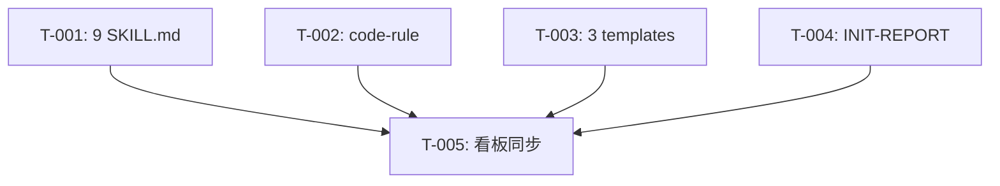

# REQ-00026 编码计划 — 技能描述通用化

- **父级需求**:REQ-00026
- **版本**:V0.0.3
- **创建时间**:2026-06-08 12:45
- **详细设计**:./RESULT.md

---

## 1. 任务总览

| 任务编码 | 需求 | 类型 | 触发/来源 | 标题 | 开发状态 | 测试状态 | 涉及文件 |
| --- | --- | --- | --- | --- | --- | --- | --- |
| TASK-REQ-00026-00001 | REQ-00026 | 修改 | 详细设计 | [修改] 9 个 SKILL.md 描述段去专属化(占位符 `<本仓库>` + 概述段声明) | 已完成 | 不适用 | plugins/code-skills/skills/{code-it,code-publish}/SKILL.md §唯一允许的生产代码改动场景 / §模板 | 2026-06-08 13:10 | 0818d2a | — |
| TASK-REQ-00026-00002 | REQ-00026 | 修改 | 详细设计 | [修改] code-rule/SKILL.md 描述段 + L336 CLAUDE.md 字面替换 | 已完成 | 不适用 | plugins/code-skills/skills/code-rule/SKILL.md §Type B 子流程(AI 工作指引追加)(L336) | 2026-06-08 13:20 | e8f3303 | — |
| TASK-REQ-00026-00003 | REQ-00026 | 修改 | 详细设计 | [修改] code-publish/templates/(DEPLOY.md / UPDATE.md / qanda-README.md) 字面替换 | 待开始 | 不适用 | `plugins/code-skills/skills/code-publish/templates/{DEPLOY,UPDATE,qanda-README}.md` |
| TASK-REQ-00026-00004 | REQ-00026 | 修改 | 详细设计 | [修改] code-init/templates/INIT-REPORT.md 字面替换(L3/L8) | 待开始 | 不适用 | `plugins/code-skills/skills/code-init/templates/INIT-REPORT.md` |
| TASK-REQ-00026-00005 | REQ-00026 | 文档 | 详细设计 | [文档] 同步版本看板"任务清单" + "变更记录"(`code-it` 末尾兜底承担) | 待开始 | 不适用 | `assistants/V0.0.3/RESULT.md` |

**统计**:
- 总任务数:5
- 代码类:4(T-001 ~ T-004)
- 文档类:1(T-005)
- 测试需要:Y = 0(纯文档,沿用 `code-unit` 守卫"项目可测性")
- 架构任务:0(简单需求,无需插入)

---

## 2. 任务详情

### TASK-REQ-00026-00001 — 9 个 SKILL.md 描述段去专属化

**目标**:把 9 个 SKILL.md(`code-require` / `code-design` / `code-plan` / `code-it` / `code-unit` / `code-check` / `code-fix` / `code-publish` / `code-init`)的描述性段落中"plugins/code-skills/..."字面 + "本项目" / "本插件" 指代替换为 `<本仓库>` / 泛用表述。

**涉及文件**:
- `plugins/code-skills/skills/code-require/SKILL.md` §YAML frontmatter description / §工作目录约定 / §工具使用约定
- `plugins/code-skills/skills/code-design/SKILL.md` §工作目录约定
- `plugins/code-skills/skills/code-plan/SKILL.md` §工作目录约定
- `plugins/code-skills/skills/code-it/SKILL.md` §工作目录约定
- `plugins/code-skills/skills/code-unit/SKILL.md` §工作目录约定
- `plugins/code-skills/skills/code-check/SKILL.md` §工作目录约定
- `plugins/code-skills/skills/code-fix/SKILL.md` §工作目录约定
- `plugins/code-skills/skills/code-publish/SKILL.md` §工作目录约定 / §工具使用约定
- `plugins/code-skills/skills/code-init/SKILL.md` §工作目录约定

**关键变更**(每个被改 SKILL.md 都要做的两步):
1. **加概述段声明**(若概述段中已出现 `<本仓库>` 或即将出现,必须先加声明):
   > 本仓库的 marketplace 协议布局:本仓库的根目录下挂载 `plugins/<name>/` 插件目录,`code-*` 技能在 `<本仓库>/skills/<skill>/SKILL.md` 定义。
2. **描述段去专属化**:把"plugins/code-skills/..."字面 / "本项目" / "本插件" 指代替换为 `<本仓库>` / "本仓库" / "本插件目录"。

**不修改区段**(本任务严守):
- YAML frontmatter `name` / `description` 字段(字节级)
- AC / INV 列表
- 命令示例(如 `git diff plugins/code-skills/...`)

**边界与异常**:
- 同文件半改半留 → 用"段级二分类"逐一 Edit
- 改 frontmatter 误删 → 改前先 `Read` 全文,改后 `Read` 校验

**验证手段**:
- `git diff --stat plugins/code-skills/skills/{code-require,code-design,code-plan,code-it,code-unit,code-check,code-fix,code-publish,code-init}/SKILL.md` 列出 9 个文件
- 各文件 frontmatter 字节级一致(`Read` L1-5 比对)
- `git diff marketplace.json plugin.json README*.md CLAUDE.md` 0 diff
- `./assistants/` 路径未被替换

**回退方式**:`git revert <本任务 commit>`

**依赖**:无

### TASK-REQ-00026-00002 — code-rule/SKILL.md 描述段 + 三处 CLAUDE.md 字面替换

**目标**:完成 code-rule SKILL.md 的描述段去专属化 + L336 / L363 / L370 三处硬替换("追加到 `plugins/code-skills/CLAUDE.md`" → "追加到 `<本仓库>/CLAUDE.md`")

**涉及文件**:
- `plugins/code-skills/skills/code-rule/SKILL.md` §YAML frontmatter description / §工作目录约定 / §工具使用约定 / **L336** / **L363** / **L370**

**关键变更**:
1. 描述段去专属化(同 T-001 模式)
2. L336(原 "适用于用户描述含 `CLAUDE.md` / `AI 工作` / `AI 约定` 等关键词,目标是追加 AI 行为指令到 `plugins/code-skills/CLAUDE.md`" → 把 `plugins/code-skills/CLAUDE.md` 替换为 `<本仓库>/CLAUDE.md`)
3. L363(原 `Read plugins/code-skills/CLAUDE.md` 全文 — 但这是命令示例,**不**改;但若 L363 是描述性"读取 `<本仓库>/CLAUDE.md` 全文"则改)
   - 实际为命令(沿用既有),字面保留
4. L370(原 "适用于 Claude Code 在本仓库工作时" — 这已是泛用表述,可不改;但若需更泛用可改"本工作流")

**实际决策**:L363 是命令(`Read plugins/code-skills/CLAUDE.md`),L370 已泛用,本任务实际只改 L336 一处硬替换 + 描述段。

**边界与异常**:
- 命令字面保留(沿用 FR-1 规则)
- L336 字面替换,需 `Read` 上下文确认

**验证手段**:
- `git diff plugins/code-skills/skills/code-rule/SKILL.md` 显示 L336 替换
- frontmatter 字节级一致
- L363 / L370 字面保留

**回退方式**:`git revert <本任务 commit>`

**依赖**:无

### TASK-REQ-00026-00003 — code-publish/templates 三个模板字面替换

**目标**:DEPLOY.md / UPDATE.md / qanda-README.md 头部"由 `code-publish` 技能从 `plugins/code-skills/skills/code-publish/templates/...` 复制生成"字面替换。

**涉及文件**:
- `plugins/code-skills/skills/code-publish/templates/DEPLOY.md` §头部(L3)
- `plugins/code-skills/skills/code-publish/templates/UPDATE.md` §头部(L3)
- `plugins/code-skills/skills/code-publish/templates/qanda-README.md` §"草稿区"指引(L133)

**关键变更**:
1. DEPLOY.md L3:`plugins/code-skills/skills/code-publish/templates/DEPLOY.md` → `<本仓库>/skills/code-publish/templates/DEPLOY.md`
2. UPDATE.md L3:同上,路径换为 UPDATE.md
3. qanda-README.md L133:"草稿应该放项目内的 `drafts/` 子目录" 段 — 语义保持,字面"项目"→"本仓库"

**边界与异常**:
- 模板内的"本仓库"声明:模板描述的是"通用发布部署骨架",**不**适合在模板内加 `<本仓库>` 声明(模板是用户消费的最终输出)
- 故**不**加概述段声明,直接字面替换

**验证手段**:
- `git diff --stat plugins/code-skills/skills/code-publish/templates/{DEPLOY,UPDATE,qanda-README}.md` 列出 3 个文件
- 字面替换前后,模板结构不变

**回退方式**:`git revert <本任务 commit>`

**依赖**:无

### TASK-REQ-00026-00004 — INIT-REPORT.md 字面替换

**目标**:L3 / L8"本项目" → "本仓库"。

**涉及文件**:
- `plugins/code-skills/skills/code-init/templates/INIT-REPORT.md` L3 / L8

**关键变更**:
- L3:"本报告由 `code-init` 技能生成,作为新成员(包括 AI Agent)快速理解本项目的入口" → "...理解本仓库的入口"
- L8:"<一两句话说明本项目做什么,服务什么用户,解决什么问题>" → "...说明本仓库做什么..."(占位符语义不变)

**边界与异常**:
- L8 是占位符,语义保持,字面"本项目" → "本仓库"

**验证手段**:
- `git diff plugins/code-skills/skills/code-init/templates/INIT-REPORT.md` 列出 L3 / L8

**回退方式**:`git revert <本任务 commit>`

**依赖**:无

### TASK-REQ-00026-00005 — 同步版本看板(由 `code-it` 末尾兜底承担)

**目标**:在 `assistants/V0.0.3/RESULT.md` 的"任务清单"中追加 5 条任务,在"变更记录"中追加 5 条"任务完成"条目。

**涉及文件**:
- `assistants/V0.0.3/RESULT.md` §任务清单 / §变更记录

**关键变更**:
- "任务清单"区段追加 5 行(任务编码 / 需求 / 类型 / 触发/来源 / 标题 / 开发状态 / 测试状态 / 涉及文件),每条任务开发状态 = `已完成`、测试状态 = `不适用`
- "变更记录"区段追加 5 行(每条 `chore(code-it): TASK-REQ-00026-NNNNN 完成`)
- "里程碑"区段追加 M1 / M2 推进条目

**边界与异常**:
- 任务清单的"涉及文件"列由 `code-it` 完成时填入(本任务已在详细设计中预填)
- "触发/来源"列**全部**="详细设计"(沿用 REQ-00017 强约束)

**验证手段**:
- `git diff assistants/V0.0.3/RESULT.md` 列出 5 条任务行 + 5 条变更记录

**回退方式**:`git revert <本任务 commit>`

**依赖**:T-001 / T-002 / T-003 / T-004(看板同步必须在 4 个修改任务完成后)

---

## 3. 任务依赖图

---

## 4. 里程碑

| 里程碑 | 包含任务 | 完成定义 |
| --- | --- | --- |
| M1:文案扫除完成 | T-001 + T-002 + T-003 + T-004 | `git diff --stat` 列出 14 个目标文件,frontmatter 字节级一致,`git diff marketplace.json plugin.json README*.md CLAUDE.md` 0 diff |
| M2:看板同步 + 提交完成 | T-005 | 看板"任务清单" + "变更记录"已同步,所有任务开发=已完成 ∧ 测试=不适用(纯文档) |

---

## 5. 变更记录

| 时间 | 变更类型 | 摘要 |
| --- | --- | --- |
| 2026-06-08 12:45 | 计划新增 | REQ-00026 详细设计与编码计划完成(5 个任务;M1 + M2) |
| 2026-06-08 13:10 | 状态更新 | TASK-REQ-00026-00001 状态"待开始"→"已完成",提交 0818d2a |
| 2026-06-08 13:20 | 状态更新 | TASK-REQ-00026-00002 状态"待开始"→"已完成",提交 e8f3303 |
