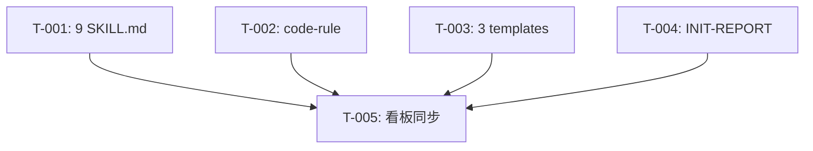

# REQ-00026 详细设计 — 技能描述通用化

- **上游需求**:`./assistants/V0.0.3/require/REQ-00026/RESULT.md`(v1,2026-06-08 11:55)
- **上游概要设计**:`./assistants/V0.0.3/design/REQ-00026/RESULT.md`(v1,2026-06-08 12:30)
- **版本**:V0.0.3
- **最后更新**:2026-06-08 12:45

## 1. 概述

本详细设计回答"如何把 10 个 SKILL.md 的描述性段落去专属化"。在概要设计给出的"占位符 `<本仓库>` + 9 条 INV"框架下,本设计落到任务粒度。

## 2. 范围

14 个目标文件,0 新增模块,0 新增接口,0 数据结构变更,0 新增依赖。

## 3. 模块详细化

详见 `module-details.md`(14 个模块逐条)。

## 4. 算法与逻辑

本需求**不**涉及运行时算法。改动模式为"段级二分类 + 占位符替换":

```
对每个目标文件:
  1. Read 全文
  2. 定位"描述性段落"集合(排除:frontmatter、INV/AC/命令示例段)
  3. 在每个描述性段落中,逐句替换:
     - `plugins/code-skills/...` → `<本仓库>/...`
     - "本项目" → "本仓库" / "本套技能"
     - "本插件" → "本插件目录" / "本套技能"
  4. 在概述段加 1 句"`<本仓库>` 指代本 marketplace 仓库的根目录"
  5. 校验 frontmatter 字节级不变
```

## 5. 数据结构完整变更

**0 变更**(详见 `data-changes.md`)。

## 6. 接口细节

**0 新增 / 0 修改**(详见 `interface-specs.md`)。

## 7. 异常处理

**N/A**(详见 `risk-analysis.md`)。

## 8. 安全要求

**N/A**。

## 9. 状态机/流程

**N/A**。

## 10. 性能与资源

**N/A**。

## 11. 测试要点

- 静态校验:
  - `git diff --stat` 改动文件清单 = 14 个目标文件
  - `git diff` 在 `marketplace.json` / `plugin.json` / 4 个 README / CLAUDE.md 上 0 diff
  - 旧需求档案 0 diff
  - 10 SKILL.md frontmatter 字节级一致
- 人工 review:
  - 每个被改 SKILL.md 概述段首句可读性
  - 占位符 `<本仓库>` 含义对读者清晰
- 详见 `risk-analysis.md`

## 12. 规范遵循

- 0 冲突(详见 `rule-compliance.md`)
- 0 触发 `skill-conventions.md §规则 1`(`name` 不变)
- 0 触发 `doc-conventions.md §规则 1`(本需求不改 README)
- 0 触发 `encoding-conventions.md §规则 1+2`(0 新增编码)
- 0 触发 `marketplace-protocol.md §规则 1`(本需求不改 marketplace.json)

## 13. 任务拆分

详见 `PLAN.md`。共 5 个任务:

| 任务编码 | 类型 | 触发/来源 | 标题 | 涉及文件 |
| --- | --- | --- | --- | --- |
| TASK-REQ-00026-00001 | 修改 | 详细设计 | 9 个 SKILL.md 描述段去专属化 | `plugins/code-skills/skills/{code-require,code-design,code-plan,code-it,code-unit,code-check,code-fix,code-publish,code-init}/SKILL.md` |
| TASK-REQ-00026-00002 | 修改 | 详细设计 | code-rule/SKILL.md 描述段 + L336/363/370 三处 CLAUDE.md 字面替换 | `plugins/code-skills/skills/code-rule/SKILL.md` |
| TASK-REQ-00026-00003 | 修改 | 详细设计 | code-publish/templates/(DEPLOY.md / UPDATE.md / qanda-README.md) 字面替换 | `plugins/code-skills/skills/code-publish/templates/{DEPLOY,UPDATE,qanda-README}.md` |
| TASK-REQ-00026-00004 | 修改 | 详细设计 | code-init/templates/INIT-REPORT.md 字面替换 | `plugins/code-skills/skills/code-init/templates/INIT-REPORT.md` |
| TASK-REQ-00026-00005 | 文档 | 详细设计 | 同步版本看板"任务清单" + "变更记录" | `assistants/V0.0.3/RESULT.md` |

(注:本仓库为纯文档仓库,所有任务类型为"修改"或"文档",**不**触发 `code-unit`,沿用 REQ-00017 强约束"不在候选集:看板更新"——T-005 由 `code-it` 末尾兜底步骤承担)

## 14. 里程碑

| 里程碑 | 包含任务 | 完成定义 |
| --- | --- | --- |
| M1:文案扫除完成 | T-001 + T-002 + T-003 + T-004 | `git diff --stat` 列出 14 个目标文件,frontmatter 字节级一致,`git diff marketplace.json plugin.json README*.md CLAUDE.md` 0 diff |
| M2:看板同步 + 提交完成 | T-005 | 看板"任务清单" + "变更记录"已同步,所有任务开发=已完成 ∧ 测试=不适用(纯文档),commit hash 记录在变更记录 |

## 15. 任务依赖图



T-001 / T-002 / T-003 / T-004 互相无依赖(改动不同文件);T-005 依赖前 4 个。

## 16. 待澄清 / 未决项

| 编号 | 项 | 状态 |
| --- | --- | --- |
| Q1 | Q5(硬约束是否替换为 `<本仓库>`) | 已决策:保留字面 |
| Q2 | Q6(后续 `code-check` 评审发现冲突如何裁决) | 留待评审阶段 |

## 17. 变更记录

- `2026-06-08 12:45` 详细设计完成(5 任务 / 0 数据变更 / 0 接口变更)
