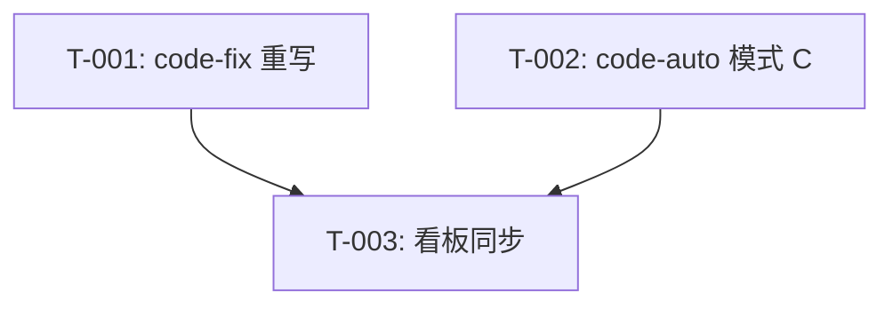

# REQ-00027 编码计划 — 优化 code-fix 流程(纯登记型)+ code-auto BUG 路径

- **父级需求**:REQ-00027
- **版本**:V0.0.3
- **创建时间**:2026-06-08 15:35
- **详细设计**:./RESULT.md

---

## 1. 任务总览

| 任务编码 | 需求 | 类型 | 触发/来源 | 标题 | 开发状态 | 测试状态 | 涉及文件 |
| --- | --- | --- | --- | --- | --- | --- | --- |
| TASK-REQ-00027-00001 | REQ-00027 | 修改 | 详细设计 | [修改] code-fix/SKILL.md 纯登记型重写(状态机收敛 + 不产出 fix-plan.md + 引导后续调 code-plan/code-it/code-check) | 待开始 | 不适用 | plugins/code-skills/skills/code-fix/SKILL.md |
| TASK-REQ-00027-00002 | REQ-00027 | 修改 | 详细设计 | [修改] code-auto/SKILL.md 模式 C 增加(模式识别正则 + BUG 路径子技能调用表 + fix/<BUG-NNN>/auto-report.md 输出) | 待开始 | 不适用 | plugins/code-skills/skills/code-auto/SKILL.md |
| TASK-REQ-00027-00003 | REQ-00027 | 文档 | 详细设计 | [文档] 同步版本看板"详细设计与任务计划汇总" + "任务清单" + "里程碑" + "变更记录"(`code-it` 末尾兜底承担) | 待开始 | 不适用 | assistants/V0.0.3/RESULT.md |

**统计**:
- 总任务数:3
- 代码类:2(T-001 / T-002)
- 文档类:1(T-003)
- 测试需要:Y = 0(纯文档,沿用 `code-unit` 守卫"项目可测性")
- 架构任务:0(简单修改,无需插架构任务)

---

## 2. 任务详情

### TASK-REQ-00027-00001 — code-fix/SKILL.md 纯登记型重写

**目标**:把 `code-fix` 从"全生命周期跟踪"重构为"纯登记型",不实施代码改动、不产出 `fix-plan.md`、不推进"修复规划中"及之后状态。

**涉及文件**:
- `plugins/code-skills/skills/code-fix/SKILL.md` §"目标"
- `plugins/code-skills/skills/code-fix/SKILL.md` §"工作目录约定"
- `plugins/code-skills/skills/code-fix/SKILL.md` §"工作流程 步骤 4 询问本轮状态推进"
- `plugins/code-skills/skills/code-fix/SKILL.md` §"工作流程 步骤 5 补充本轮信息"
- `plugins/code-skills/skills/code-fix/SKILL.md` §"工作流程 步骤 6 写缺陷详情"
- `plugins/code-skills/skills/code-fix/SKILL.md` §"工作流程 步骤 9 引导下一步"
- `plugins/code-skills/skills/code-fix/SKILL.md` §"过程文档格式"
- `plugins/code-skills/skills/code-fix/SKILL.md` §"不要做的事"

**关键变更**(每个区段都要做):
1. **§"目标"**:在原"提供**缺陷从登记到关闭的全生命周期跟踪**"段后,新增第 2 段"本技能仅产出 `fix/<BUG-NNN>/RESULT.md`,不实施代码改动、不产出 `fix-plan.md`、不推进'修复规划中'及之后状态;修复全流程请依次调 `code-plan` / `code-it` / `code-unit` / `code-check`"
2. **§"适用场景"**:删去"想实施代码修复(那是 `code-it` 的事)"(纯登记型不再管修复实施)
3. **§"工作目录约定"**:从"本技能维护的缺陷工作空间"中删去 `fix-plan.md` / `fix-work-log.md` / `fix-compile-and-run.md` / `fix-test-results.md` / `deviations.md`;保留 `fix/RESULT.md`(总览)+ `fix/<BUG-NNN>/RESULT.md`(缺陷详情)
4. **§"工作流程 步骤 4 询问本轮状态推进"**:把"状态推进表"改为仅含"报告 / 调查中 / 已关闭-非缺陷 / 已取消 / 阻塞" 5 个候选状态(详见详细设计 §3.1)
5. **§"工作流程 步骤 5 补充本轮信息"**:删除所有"→ 修复规划中" / "→ 修复编码中" / "→ 已修复-待验证" 等推进提示;改为统一的"若需推进修复规划/编码/已修复等状态,请先调 `code-plan <BUG-NNN>` 产出 `fix-plan.md`"
6. **§"工作流程 步骤 6 写缺陷详情"**:保留,但"修复方案"小节改为"若已调 `code-plan`,可链接 `fix-plan.md`"
7. **§"工作流程 步骤 9 引导下一步"**:完全重写,候选目标状态表仅含登记/分析类(详见详细设计 §3.1 流程图)
8. **§"过程文档格式"**:删去"fix-plan.md" / "fix-work-log.md" 等(本技能不产出)
9. **§"不要做的事"**:新增 3 条"不产出 `fix-plan.md`(由 `code-plan` 产出)" / "不实施代码改动(由 `code-it` 实施)" / "不推进'修复规划中'及之后状态(由 `code-plan` / `code-it` / `code-check` 推进)"

**边界与异常**:
- 状态推进:本任务仅重写 SKILL.md 文字,不动 `code-fix/SKILL.md` 之外的任何文件
- 兼容:重写后 `code-fix` 仍能产出 `fix/<BUG-NNN>/RESULT.md`(沿用既有模板)

**验证手段**:
- `git diff` 校验 9 个区段全部 Edit
- `code-fix/SKILL.md` frontmatter 字节级一致
- `code-fix/SKILL.md` 步骤 4 状态推进表仅含 5 个候选状态
- `code-fix/SKILL.md` 步骤 9 引导下一步表仅含登记/分析类
- 0 改 marketplace.json / plugin.json / 4 个 README / CLAUDE.md
- 旧需求档案 0 diff

**回退方式**:`git revert` 本任务 commit。

**依赖**:无

---

### TASK-REQ-00027-00002 — code-auto/SKILL.md 模式 C 增加

**目标**:在 `code-auto` 中增加 BUG-NNN 任务识别与编排路径。

**涉及文件**:
- `plugins/code-skills/skills/code-auto/SKILL.md` §"输入" 步骤 1.1
- `plugins/code-skills/skills/code-auto/SKILL.md` §"输入" 表"三种调用模式"
- `plugins/code-skills/skills/code-auto/SKILL.md` §"子技能调用表" 步骤 4
- `plugins/code-skills/skills/code-auto/SKILL.md` §"附加约束"
- `plugins/code-skills/skills/code-auto/SKILL.md` §"步骤 7 报告"
- `plugins/code-skills/skills/code-auto/SKILL.md` §"边界与异常"
- `plugins/code-skills/skills/code-auto/SKILL.md` §"不要做的事"

**关键变更**(每个区段都要做):
1. **§"输入" 步骤 1.1**:增加"模式 C"识别(首段匹配 `^BUG-\\d{5}$` → BUG 路径)
2. **§"输入" 表"三种调用模式"**:从"两种调用模式"扩展为"三种调用模式"(A / B / C)
3. **§"子技能调用表" 步骤 4**:新增 BUG 路径子技能表(7 步骤,详见详细设计 §2.2)
4. **§"附加约束"**:沿用 REQ 路径的"`AskUserQuestion` 自动选推荐项"
5. **§"步骤 7 报告"**:BUG 路径完成时写 `fix/<BUG-NNN>/auto-report.md`(非 `require/<REQ-NNNNN>/auto-report.md`)
6. **§"边界与异常"**:新增 E-18 / E-19 / E-20
7. **§"不要做的事"**:新增"不修改 `code-plan` / `code-it` / `code-unit` / `code-check` 的核心工作流"

**边界与异常**:
- 子技能调用表扩展:本任务仅扩展 BUG 路径编排,不修改 REQ 路径的子技能调用表
- 任务循环逻辑:BUG 路径的"任务循环"复用 REQ 路径的"任务总览 + 执行档案"模式

**验证手段**:
- `git diff` 校验 7 个区段全部 Edit
- `code-auto/SKILL.md` frontmatter 字节级一致
- `code-auto/SKILL.md` 模式识别表含 3 种模式
- `code-auto/SKILL.md` 子技能调用表 BUG 路径含 7 步骤
- 0 改 marketplace.json / plugin.json / 4 个 README / CLAUDE.md

**回退方式**:`git revert` 本任务 commit。

**依赖**:无

---

### TASK-REQ-00027-00003 — 同步版本看板(由 `code-it` 末尾兜底承担)

**目标**:在 `assistants/V0.0.3/RESULT.md` 中追加 REQ-00027 的详细设计条目 + 3 任务行 + 里程碑 + 变更记录。

**涉及文件**:
- `assistants/V0.0.3/RESULT.md` §"详细设计与任务计划汇总"
- `assistants/V0.0.3/RESULT.md` §"任务清单"
- `assistants/V0.0.3/RESULT.md` §"里程碑"
- `assistants/V0.0.3/RESULT.md` §"变更记录"

**关键变更**:
1. "详细设计与任务计划汇总"区段:追加 1 行(REQ-00027 / 标题 / 状态=已完成 / 创建时间 / 任务总数 3 / 链接)
2. "任务清单"区段:追加 3 行(T-001 / T-002 / T-003),每行字段对齐模板
3. "里程碑"区段:追加 M1-REQ-00027(所有任务完成,开发=已完成 ∧ 测试=不适用)
4. "变更记录"区段:追加 1 行(2026-06-08 15:35 设计新增 REQ-00027 详细设计与编码计划完成(共 3 个任务))

**边界与异常**:
- 本任务由 `code-it` 末尾兜底承担(沿用 REQ-00017 强约束)
- 任务类型=文档,测试状态=不适用
- 涉及文件留空(由 `code-it` 完成时填入)

**验证手段**:
- `git diff` 校验 RESULT.md 改动
- 看板"任务清单"中本计划 3 任务行存在
- 看板"统计"中真正可发布数 50 → 53

**回退方式**:`git revert` 本任务 commit。

**依赖**:T-001 / T-002 完成(看板同步必须在 2 个修改任务完成后)

---

## 3. 任务依赖图

T-001 / T-002 互相无依赖;T-003 依赖 T-001 / T-002。

---

## 4. 里程碑

| 里程碑 | 包含任务 | 完成定义 |
| --- | --- | --- |
| M1-REQ-00027 | T-001 + T-002 + T-003 | `git diff --stat` 列出 2 SKILL.md;frontmatter 字节级一致;模式识别表 3 模式;`git diff marketplace.json plugin.json README*.md CLAUDE.md` 0 diff |

---

## 5. 变更记录

| 时间 | 变更 | 关联 |
| --- | --- | --- |
| 2026-06-08 15:35 | 计划新增 | REQ-00027 详细设计与编码计划完成(共 3 个任务;M1-REQ-00027) |
