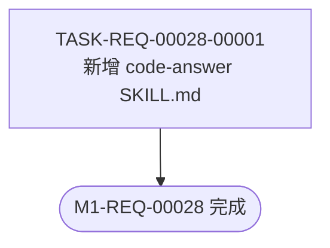

# REQ-00028 — 编码计划(PLAN.md)

- 需求编码:REQ-00028
- 所属版本:V0.0.3
- 计划状态:已完成
- 创建:2026-06-10
- 最近更新:2026-06-10
- 当前版本:v1
- 上游:`./assistants/V0.0.3/require/REQ-00028/RESULT.md` + `./assistants/V0.0.3/design/REQ-00028/RESULT.md`
- 详细设计:`./assistants/V0.0.3/plan/REQ-00028/RESULT.md`

## 1. 计划概述

将"新增 code-answer 技能"拆分为 **1 个完整任务** — 因为本需求是一个**单文件技能**(`plugins/code-skills/skills/code-answer/SKILL.md`),"创建该文件 + frontmatter + 11 个章节正文"是一个完整的用户可见能力,符合"1 个功能点 = 1 个任务"的拆分原则(`code-plan §任务拆分原则`)。

## 2. 任务总览

| 任务编号 | 需求 | 类型 | 触发/来源 | 标题 | 开发状态 | 测试状态 | 涉及文件 | 完成时间 | 提交哈希 | 关联任务 |
| --- | --- | --- | --- | --- | --- | --- | --- | --- | --- | --- |
| TASK-REQ-00028-00001 | REQ-00028 | 文档 | 详细设计 | [新增] code-answer SKILL.md(只读功能查询) | 待开始 | 不适用 | — | — | — | — |

**统计**:
- 任务总数:1
- 类型分布:文档 1
- 触发/来源分布:详细设计 1
- 真正可发布:0(全部"待开始")

## 3. 任务详情

### TASK-REQ-00028-00001 · [新增] code-answer SKILL.md(只读功能查询)

- **目标**:在 `plugins/code-skills/skills/code-answer/SKILL.md` 创建一个完整的"只读功能查询"技能定义文件,Claude Code 即可识别为 `/code-answer` 命令
- **触发/来源**:详细设计(本 PLAN.md 步骤 10A 拆分)
- **涉及文件**(语义化锚点):
  - `plugins/code-skills/skills/code-answer/SKILL.md`(新增,整文件为本任务产物)
- **关键变更**(整文件结构):
  1. **YAML frontmatter**(`SKILL.md §0`):`name: code-answer` + 完整 `description` 段
     - 锚点:`skill-conventions §规则 1` — `name` = 目录名 `code-answer`(kebab-case)
     - 锚点:`dashboard-conventions §规则 1` — `description` 须含目标 + 适用场景 + 触发条件
  2. **章节正文**(`SKILL.md §1 ~ §末尾`):沿用既有 10 个技能的章节布局
     - §1 目标(2-5 句,FR-1 + FR-6 强约束"严禁 Write/Edit/Bash")
     - §2 适用场景 / 不适用
     - §3 工作目录约定(全版本扫描,FR-2)
     - §4 输入(`<查询>` 格式 + 接收端正则放宽)
     - §5 输出(屏显报告结构,FR-5)
     - §6 工具使用约定(`Read`/`Glob`/`Grep` 白名单)
     - §7 工作流(步骤 0 → 1 → 2 → 3,带 mermaid 状态机)
     - §8 边界与异常(E-1 ~ E-9,9 条边界,沿用上游 RESULT.md)
     - §9 衔接
     - §10 不要做的事
     - §11 变更记录(初始空表)
  3. **frontmatter 字节级保留**:`name` + `description` 必须严格符合 `skill-conventions §规则 1`(INV-1)
- **边界与异常**:
  - 标题超 30 字符 → 沿用 `code-plan §标题解析` 截断(本技能 frontmatter description 不参与标题解析,仅 SKILL.md §1 目标简述)
  - 文件创建失败(权限/磁盘满)→ 沿用 code-it 既有错误处理
- **验证手段**(手工):
  - 验证 1:确认文件存在 + 字节级 frontmatter 正确
  - 验证 2:在 Claude Code 中调 `/code-answer REQ-00025`,屏显报告符合 FR-5 契约
  - 验证 3:`git status` 确认本文件已跟踪
- **回退方式**:`git rm` 移除文件 + 回退 commit
- **双状态初始化**:
  - 开发状态:`待开始`(`code-it` 执行时由该技能推进)
  - 测试状态:`不适用`(纯文档任务,沿用 `code-plan §任务双状态的初始化`)

## 4. 任务依赖图

无依赖(单任务,无前置)。

## 5. 里程碑

| 里程碑 | 包含任务 | 完成定义 | 状态 | 计划时间 | 实际完成 |
| --- | --- | --- | --- | --- | --- |
| M1-REQ-00028 | TASK-REQ-00028-00001 | 1 任务开发状态=已完成 ∧ 测试状态=不适用 | 待开始 | 2026-06-10 | — |

## 6. 状态管理规则

- **任务编码格式**:`TASK-REQ-00028-00001`(5+5 位嵌套式,沿用 `encoding-conventions §规则 1`)
- **双状态语义**:开发=已完成 ∧ 测试∈{已运行-通过, 不适用} → 真正可发布
- **本任务的特殊点**:`code-answer` 是只读查询技能,实施后**没有运行期代码可测**;测试状态固定为 `不适用`,验证手段全为手工
- **触发/来源**:`详细设计`(沿用 `code-plan §任务触发/来源字段` 13 枚举之一)

## 7. 关联计划

- **本仓库无其他与 `code-answer` 相关的计划**(新建技能,无既有代码资产)
- **与既有技能的关系**:`code-dashboard` (V0.0.2 REQ-00023) 提供范式参考,**不**形成依赖

## 8. 变更记录

| 时间 | 版本 | 变更类型 | 变更摘要 | 变更人 |
| --- | --- | --- | --- | --- |
| 2026-06-10 11:00 | v1 | 初始创建 | 完成首次编码计划(1 任务,文档型,测试=不适用) | wangmiao |
