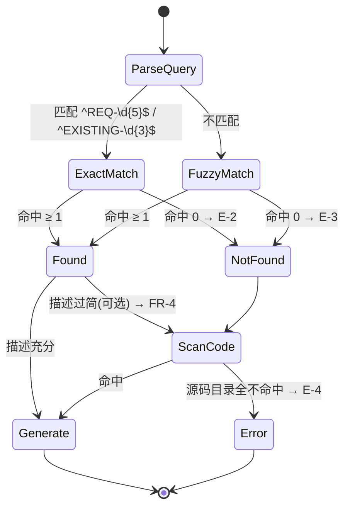

# REQ-00028 — 新增 code-answer 技能(详细设计)

- 需求编码:REQ-00028
- 所属版本:V0.0.3
- 详细设计状态:已完成
- 创建:2026-06-10
- 最近更新:2026-06-10
- 当前版本:v1
- 上游需求:`./assistants/V0.0.3/require/REQ-00028/RESULT.md`
- 上游设计:`./assistants/V0.0.3/design/REQ-00028/RESULT.md`
- 遵循规范:`./assistants/rules/` 下 13 个文件

## 1. 设计目标

> `--balanced` — code-auto 上下文自动采纳(沿用 REQ-00020 简化为 1 维度)

- **整体设计目标**:`--balanced`(平衡型,不强扩展也不极简)
- **功能性**:中
- **封装性 / 可复用性 / 可读性**:不适用(本仓库 Markdown 自然语言技能)
- **扩展性 / 健壮性 / 可维护性**:中

## 2. 概述

本详细设计将概要设计"新增只读查询型技能 code-answer"落地为 1 个可执行任务。本质是**单文件技能元数据**:`plugins/code-skills/skills/code-answer/SKILL.md`(1 个新文件)。无新模块、无新依赖、无新数据结构、无新接口契约;完全沿用既有 11 个 `code-*` 技能的工具集与屏显范式。

## 3. 模块详细化

### 3.1 模块:`code-answer` 技能

- **路径**:`plugins/code-skills/skills/code-answer/SKILL.md`
- **状态**:新增
- **职责**:在用户调 `/code-answer <查询>` 时,基于已存在的需求清单 + 源代码,屏显报告"功能定义 + 关键逻辑 + 历史变迁 + 参考引用"
- **关键"算法"**(本技能不写代码,"算法"指 Claude 模型的执行流):
  1. **步骤 0** `Read ./assistants/.current-version`(可选,FR-2)
  2. **步骤 1** 解析查询字符串(FR-1)
  3. **步骤 2** 路径感知:
     - `^REQ-\d{5}$` / `^EXISTING-\d{3}$` → 精确编号路径(FR-3a)
     - 其他 → 关键字模糊路径(FR-3b)
  4. **步骤 3** 扫描需求清单:
     - `Glob ./assistants/*/require/*/RESULT.md`(全版本)
     - 按相关度(标题 > 概述 > FR)排序
  5. **步骤 4** 必要时扫描源代码(FR-4,仅在描述过简时)
  6. **步骤 5** 拼装报告(FR-5)
  7. **步骤 6** 屏显输出,退出
- **依赖**:
  - 对内:无(不调任何其他 `code-*` 技能)
  - 对外:无(无三方依赖)
- **与概要设计的对应**:§4 模块拆分
- **符合规范**:`skill-conventions §规则 1`(`name: code-answer` + 完整 `description`)

## 4. 接口细节

### 4.1 用户接口

| 项 | 值 |
| --- | --- |
| 形式 | Claude Code slash command |
| 语法 | `/code-answer <查询>` |
| 参数 | 1 个,必填 |
| 出参 | 屏显报告(纯文本) |
| 退出码 | 0(成功)/ 1(内部错误 / 用法错误) |

### 4.2 报告结构(FR-5 锁定)

```
=== code-answer 报告 ===
查询:<用户查询字符串>
匹配来源:<需求清单 N 条 / 源代码 M 处 / 二者皆有>

## 主要功能
<2-5 句话,概括该功能做什么>

## 关键逻辑
<1-5 条核心逻辑点,每条 ≤ 3 行>

## 历史变迁(如适用)
<按时间倒序列出变更记录,来源为 RESULT.md §13>

## 参考引用
- 需求:<需求编号> §<章节> — `<路径>:L<行号>`
- 代码:`<路径>:<行号>` — <一句话说明>

=== 报告结束 ===
```

### 4.3 工具集契约(本技能唯一约束)

| 工具 | 允许 | 严禁 |
| --- | --- | --- |
| `Read` | ✅ | |
| `Glob` | ✅ | |
| `Grep` | ✅ | |
| `Write` | | ❌ |
| `Edit` | | ❌ |
| `Bash` | | ❌ |
| `WebFetch` / `WebSearch` | | ❌ |
| `Task` / `Agent` | | ❌ |

> 与 `code-dashboard` 完全一致(沿用 NFR-3.AC-1)

## 5. 数据结构

无新增数据结构。本技能不维护任何持久化数据;运行期临时变量在函数返回时由 Claude Code 进程释放。

## 6. 异常处理(边界 E-1 ~ E-9)

| ID | 触发 | 屏显 |
| --- | --- | --- |
| E-1 | 查询为空 | 用法示例 + 退出 |
| E-2 | 精确编号未命中 | `✗ 未找到对应需求 <查询>` + 列出已知前 10 条 |
| E-3 | 关键字匹配 0 命中 | `⚠ 未找到匹配需求,将尝试扫描源代码` + 转入 FR-4 |
| E-4 | 源码目录全不命中 | `✗ 未找到源码目录` + 列出已尝试目录 + 提示用户提供 |
| E-5 | 需求 + 代码全无命中 | 简短说明 + 引导提供更精确查询 |
| E-6 | `.current-version` 不存在 | `⚠ 未检测到激活版本,自动全版本扫描`(降级,不视为错) |
| E-7 | 命中需求但 §4 极简 | 自动转入 FR-4 补足 |
| E-8 | Grep 超时(> 5s) | `⚠ 扫描超时,展示前 N 条结果`(截断避免挂起) |
| E-9 | 内部异常 | `✗ 内部错误: <msg>` + 退出 |

## 7. 安全要求

- **不引入**新安全边界(纯只读)
- 报告内容**仅**来自已存在的需求清单 + 源代码,**不**包含任何敏感字段注入
- 报告输出**仅**屏显 stdout,**不**落盘

## 8. 状态机



## 9. 性能与资源

- **关键路径**:Glob 全版本需求清单(已知 32 份 RESULT.md)+ 必要 Read + Grep 候选源码
- **预估延迟**:1-3 秒(10 份以下 RESULT.md)
- **资源限制**:`Grep` 超时 5 秒(沿用 E-8)
- **缓存策略**:**无**(每次执行重新扫描,保证幂等性 + 无状态)

## 10. 测试要点

- **单元测试**:不适用(本技能无运行时代码;验证手段是手工 + 屏显契约)
- **集成测试**:不适用
- **端到端测试**:AC-1 ~ AC-7(7 条验收标准,均手工验证)
- **关键验收**(映射到上游 AC):
  - AC-1:精确编号查询 REQ-NNNNN → 屏显报告含引用路径
  - AC-2:关键字匹配按相关度排序
  - AC-3:跨版本变迁可见
  - AC-4:`git status` 在执行前后一致(无副作用)
  - AC-5:源码补足路径正确(`path:line`)
  - AC-6:报告结构符合 FR-5 契约
  - AC-7:无 `.current-version` 时降级

## 11. 规范遵循

| 规范文件 | 状态 | 备注 |
| --- | --- | --- |
| `skill-conventions §规则 1` | ✅ | `name: code-answer` + 完整 description |
| `module-conventions §规则 1` | ✅ | 不适用(无资源子目录) |
| `doc-conventions` | ✅ | 章节布局沿用既有 10 个技能 |
| `coding-style` | ✅ | 不适用(无代码) |
| `naming-conventions` | ✅ | kebab-case |
| `directory-conventions` | ✅ | 单文件技能,无子目录 |
| `framework-conventions` | ✅ | 不适用(本仓库无框架) |
| `dependency-conventions` | ✅ | 不适用(无新增依赖) |
| `commit-conventions` | ✅ | 由 code-it 实施时遵循 |
| `migration-mapping` | ✅ | 不适用 |
| `encoding-conventions` | ✅ | 沿用 `^REQ-\d{5}$` / `^EXISTING-\d{3}$` |
| `dashboard-conventions` | ✅ | 不适用(不涉及看板字段扩展) |
| `marketplace-protocol` | ✅ | 不适用(新增子目录由 Claude Code 自动发现) |

## 12. 关联需求

| 关联编码 | 关联点 |
| --- | --- |
| REQ-00023 (`code-dashboard` 简化) | 工具集范式 |
| REQ-00013 (标题解析 §规则) | 中点 `·` 标题格式不适用本技能(无屏显标题) |
| REQ-00021 (--result / --plan 模板参数) | 不触发(本技能无模板产出) |

## 13. 待澄清 / 未决项

- **Q-1** ~ **Q-3** 沿用上游 RESULT.md §12 — 不影响本详细设计,留作 v2

## 14. 变更记录

| 时间 | 版本 | 变更类型 | 变更摘要 | 变更人 |
| --- | --- | --- | --- | --- |
| 2026-06-10 11:00 | v1 | 初始创建 | 完成首次详细设计(1 模块 / 0 接口契约 / 0 数据结构 / 1 任务) | wangmiao |
