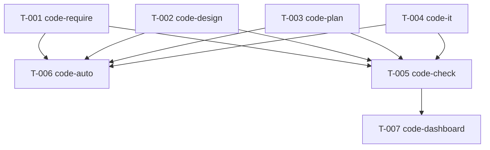

# REQ-00035 — 编码计划

- 需求编码:REQ-00035
- 所属版本:V0.0.3
- 上游详细设计:./assistants/V0.0.3/plan/REQ-00035/RESULT.md (v1)
- 状态:已完成
- 创建:2026-06-15
- 最近更新:2026-06-15

## 1. 计划概述

本计划拆分 7 个独立任务(T-001~T-007),每个任务对应概要设计 M1-M3 模块的 1 个改写点。任务粒度按"1 个任务 = 1 个完整的功能点"原则,内化编译/运行(本仓库 markdown,无编译/运行,但任务"完成定义"内化"自检步骤 0a 判定逻辑可读")。

## 2. 任务总览

| 任务编号 | 需求 | 类型 | 触发/来源 | 标题 | 开发状态 | 测试状态 | 涉及文件 | 关联任务 |
| --- | --- | --- | --- | --- | --- | --- | --- | --- |
| TASK-REQ-00035-00001 | REQ-00035 | 修改 | 详细设计 | code-require 步骤 0a 过程文档判定 + 模板新增 | 已完成 | 不适用 | `plugins/code-skills/skills/code-require/SKILL.md` + `plugins/code-skills/skills/code-require/templates/process-doc-decisions.md` | — |
| TASK-REQ-00035-00002 | REQ-00035 | 修改 | 详细设计 | code-design 步骤 0a.5 过程文档判定 + 模板新增 | 已完成 | 不适用 | `plugins/code-skills/skills/code-design/SKILL.md` + `plugins/code-skills/skills/code-design/templates/process-doc-decisions.md` | — |
| TASK-REQ-00035-00003 | REQ-00035 | 修改 | 详细设计 | code-plan 步骤 0a.5 过程文档判定 + 模板新增 | 已完成 | 不适用 | `plugins/code-skills/skills/code-plan/SKILL.md` + `plugins/code-skills/skills/code-plan/templates/process-doc-decisions.md` | — |
| TASK-REQ-00035-00004 | REQ-00035 | 修改 | 详细设计 | code-it 步骤 0a 任务级过程文档判定 + 模板新增 | 已完成 | 不适用 | `plugins/code-skills/skills/code-it/SKILL.md` + `plugins/code-skills/skills/code-it/templates/process-doc-decisions.md` | — |
| TASK-REQ-00035-00005 | REQ-00035 | 修改 | 详细设计 | code-check 步骤 0a + 8.13 评审维度 + 模板新增 | 已完成 | 不适用 | `plugins/code-skills/skills/code-check/SKILL.md` + `plugins/code-skills/skills/code-check/templates/process-doc-decisions.md` | — |
| TASK-REQ-00035-00006 | REQ-00035 | 修改 | 详细设计 | code-auto 编排同步(子技能调用表备注列) | 已完成 | 不适用 | `plugins/code-skills/skills/code-auto/SKILL.md` | — |
| TASK-REQ-00035-00007 | REQ-00035 | 修改 | 详细设计 | code-dashboard 解析兼容(变更记录行数自适应) | 已完成 | 不适用 | `plugins/code-skills/skills/code-dashboard/SKILL.md` | — |

**统计**:
- 总数:7
- 已完成:7
- 进行中:0
- 待开始:0
- 已取消:0
- 阻塞:0
- 真正可发布:7/7(开发=已完成 ∧ 测试=不适用)

## 3. 任务详情

### TASK-REQ-00035-00001:[修改] code-require 步骤 0a 过程文档判定 + 模板新增

- **目标**:在 `code-require` SKILL.md 中新增"## 过程文档自适应判定"小节(锚点:`## 工具使用约定` 段后 + `## 工作流程` 段前),按 §6.1 准则为 5 类过程文档(`materials-index` / `clarifications` / `related-requirements` / `analysis-notes` + 看板"变更记录")提供判定规则;同时新增 `templates/process-doc-decisions.md` 模板
- **涉及文件**:
  - `plugins/code-skills/skills/code-require/SKILL.md`(在锚点位置追加 ~30 行)
  - `plugins/code-skills/skills/code-require/templates/process-doc-decisions.md`(新文件,基于设计 §5.2 数据结构,~50 行)
- **关键变更**:
  - SKILL.md:新增小节"## 过程文档自适应判定",引用 §6.1 准则
  - 模板:定义决策记录文件的章节结构(版本号 / 需求编码 / 技能名 / decisions 列表 / generated 列表 / changelog)
- **边界与异常**:
  - 不修改 frontmatter(L1-3 字节级保留)
  - 不修改既有"## 工作流程"小节
  - 不修改既有"## 不要做的事"小节
- **验证手段**:
  - `Read` SKILL.md 确认锚点位置正确
  - `Read` 模板确认章节结构完整
  - `grep` 确认 frontmatter L1-3 字节级保留
- **回退方式**:`git revert` 本任务 commit

### TASK-REQ-00035-00002 ~ 00004:同 T-001 结构,分别对应 code-design / code-plan / code-it

- **T-002(code-design)**:新增步骤 0a.5(沿用 code-design 步骤 0b.0 公共段,扩展),引用 §6.2 准则;模板 `process-doc-decisions.md`
- **T-003(code-plan)**:新增步骤 0a.5(沿用 code-plan 步骤 0b.0 公共段,扩展),引用 §6.3 准则;模板
- **T-004(code-it)**:新增步骤 0a(任务级,独立,无需沿用),引用 §6.4 准则;模板

### TASK-REQ-00035-00005:[修改] code-check 步骤 0a + 8.13 评审维度 + 模板新增

- **目标**:在 `code-check` SKILL.md 中:
  1. 新增"## 过程文档自适应判定"小节(锚点同上),引用 §6.5 准则
  2. 在步骤 8(逐任务评审)末尾,8.12 之后,新增 8.13 过程文档适配性评审维度(引用 §7.1)
  3. 新增 `templates/process-doc-decisions.md` 模板
- **涉及文件**:
  - `plugins/code-skills/skills/code-check/SKILL.md`(在 2 个位置追加:步骤 0a + 8.13 评审维度)
  - `plugins/code-skills/skills/code-check/templates/process-doc-decisions.md`(新文件)
- **关键变更**:
  - SKILL.md §步骤 0a:过程文档判定(类似 T-001~T-004)
  - SKILL.md §步骤 8.13:新增评审维度,派生"建议改"任务(不阻断)
- **边界与异常**:
  - 不修改 frontmatter
  - 不修改既有 8.1-8.12 维度(字节级保留)
  - 不修改"## 工作流程"小节
- **验证手段**:
  - `Read` 8.1-8.12 维度确认字节级保留
  - `Read` 8.13 维度确认派生"建议改"逻辑
  - `grep` 确认 frontmatter L1-3 字节级保留

### TASK-REQ-00035-00006:[修改] code-auto 编排同步

- **目标**:在 `code-auto` SKILL.md 的"## 子技能调用表"备注列加 1 行"过程文档自适应:已纳入(沿用本技能约定)"
- **涉及文件**:`plugins/code-skills/skills/code-auto/SKILL.md`
- **关键变更**:
  - 子技能调用表"备注"列加 1 行(本行不破坏表格结构)
  - 7 步状态机**字节级保留**(NFR-4 强约束)
  - "## 中断与异常"小节**字节级保留**
- **边界与异常**:
  - 不修改 frontmatter
  - 不修改状态机 ASCII/Mermaid 图
  - 不修改子技能调用表的其他列
- **验证手段**:
  - `grep` 确认 7 步状态机 ASCII 图字节级保留
  - `grep` 确认"## 中断与异常"小节字节级保留

### TASK-REQ-00035-00007:[修改] code-dashboard 解析兼容

- **目标**:在 `code-dashboard` SKILL.md 的"## 解析锚点"小节末尾加 1 条说明:"变更记录行数自适应(本需求 REQ-00035 起生效,空表 / 短表 / 长表均能正常解析)"
- **涉及文件**:`plugins/code-skills/skills/code-dashboard/SKILL.md`
- **关键变更**:
  - "## 解析锚点"小节末尾加 1 条说明(纯追加,~3 行)
- **边界与异常**:
  - 不修改 frontmatter
  - 不修改"## 解析锚点"小节既有内容
  - 不修改其他区段
- **验证手段**:
  - `Read` "## 解析锚点"小节确认纯追加
  - `grep` 确认 frontmatter L1-3 字节级保留

## 4. 任务依赖图

**关键依赖**:
- T-001~T-005(主流程技能改写)是 T-006(code-auto 编排)的前置(code-auto 引用子技能 SKILL.md)
- T-001~T-005 是 T-005(code-check 新增 8.13 评审维度)的前置(8.13 引用 §6.5 准则)
- T-005 是 T-007(code-dashboard 解析兼容)的前置(8.13 派生任务可能涉及变更记录)

## 5. 里程碑

| 里程碑 ID | 名称 | 完成定义 | 状态 |
| --- | --- | --- | --- |
| M1-REQ-00035 | 过程文档自适应生成改造完成 | T-001~T-007 全部完成 + code-check 12+1 维度全过 | 已完成 |

## 6. 状态管理规则

- 任务的开发状态/测试状态由 `code-it` 自动推进
- 看板"任务清单"区段由 `code-it` 末尾兜底同步
- 本计划**不**规划单元测试任务(沿用 REQ-00031 范式,纯元技能改)

## 7. 关联计划

- **code-require**:本计划的 T-001 是对 `code-require` SKILL.md 的改写
- **code-design**:T-002
- **code-plan**:T-003
- **code-it**:T-004
- **code-check**:T-005
- **code-auto**:T-006
- **code-dashboard**:T-007

## 8. 变更记录

| 时间 | 事件 | 摘要 |
| --- | --- | --- |
| 2026-06-15 19:15 | 计划完成 | REQ-00035 详细设计与编码计划完成(共 7 个任务,5 模板新增合并到 T-001~T-005) |
