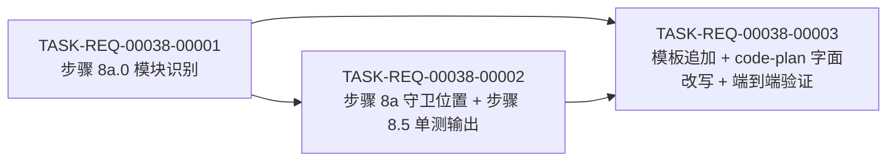

# 编码计划 — REQ-00038 — 优化 /code-it 技能单测判定(从工程粒度细化到模块粒度)

- 需求编码:REQ-00038
- 所属版本:V0.0.3
- 详细设计:./assistants/V0.0.3/plan/REQ-00038/RESULT.md (v1)
- 状态:草稿
- **开发完成度**:1 / 3
- **测试完成度**:0 / 3
- 创建:2026-06-22
- 最近更新:2026-06-22 13:40
- 当前版本:v1

## 1. 计划概述

- 任务总数:**3**
- 类型分布:修改 × 3(0 新增 / 3 修改 / 0 重构 / 0 修复 / 0 文档)
- 关键里程碑数:**1**(M1-REQ-00038:实施完成)
- **开发完成度**:0 / 3
- **测试完成度**:0 / 3(全部不适用)
- **真正可发布任务数**:1 / 3

## 2. 任务总览

| 任务编号 | 类型 | 触发/来源 | 标题 | 开发状态 | 测试状态 | 涉及文件/模块 | 前置任务 | 估算 | 责任人 | 关联任务 | 对应设计章节 |
| --- | --- | --- | --- | --- | --- | --- | --- | --- | --- | --- | --- |
| TASK-REQ-00038-00001 | 修改 | 详细设计 | [修改] code-it 步骤 8a.0 模块识别(新增子步骤) | 已完成 | 不适用 | plugins/code-skills/skills/code-it/SKILL.md §步骤 8 之后新增"## 步骤 8a.0 — 模块识别" | — | 0.5d | wangmiao | d632222 | — | RESULT.md §5 算法 1 + §4 模块 1 |
| TASK-REQ-00038-00002 | 修改 | 详细设计 | [修改] code-it 步骤 8a 守卫位置 + 步骤 8.5 单测输出位置扩展 | 待开始 | 不适用 | plugins/code-skills/skills/code-it/SKILL.md §步骤 8a.1 / 8a.2 / 8a.4 + §步骤 8.5.2 / 8.5.5 | T-1 | 0.8d | wangmiao | T-1 | RESULT.md §5 算法 2/3 + §4 模块 2/3 |
| TASK-REQ-00038-00003 | 修改 | 详细设计 | [修改] 模板追加"## 各模块单测结果"小节 + code-plan 任务粒度描述字面改写 + 端到端验证 | 待开始 | 不适用 | plugins/code-skills/skills/code-it/templates/RESULT.md + plugins/code-skills/skills/code-plan/SKILL.md L473 / L496 + (端到端校验) | T-1, T-2 | 0.7d | wangmiao | T-1, T-2 | RESULT.md §4 模块 4/5 + §7 接口 4/5 |

**字段说明**:
- **任务编号**:`TASK-REQ-00038-NNNNN`,5+5 位嵌套式,递增分配,一经分配不再改变
- **类型**:5 选 1(新增 / 修改 / 重构 / 修复 / 文档);本需求全部 = 修改
- **触发/来源**:13 枚举之一;本需求全部 = 详细设计
- **开发状态**:6 选 1(待开始 / 进行中 / 已完成 / 已取消 / 阻塞 / 待重新评估);本需求全部 = 待开始
- **测试状态**:2 选 1(已运行-通过 / 不适用,沿用 V0.0.3 REQ-00031 收窄);本需求全部 = 不适用(纯 Markdown 改造,无单测需求)
- **关联任务**:N/A(本需求 0 派生"审查改修"任务,沿用 REQ-00017 强约束)
- **对应设计章节**:本任务在 `RESULT.md` 中的设计依据

> **双状态语义**:任务的开发状态与测试状态是**正交两轴**。
> 任务"真正可发布" = 开发状态 = `已完成` **且** 测试状态 ∈ {`已运行-通过`, `不适用`}。
> 本需求 3 任务全部 = 修改类型,纯 Markdown 改造,无单元测试 → 全部测试状态 = `不适用`。

### 2.1 触发/来源枚举

| 值 | 含义 | 默认类型 | 默认输入源 |
| --- | --- | --- | --- |
| `详细设计` | 因详细设计首次澄清产生 | 修改 | `plan/<需求>/RESULT.md` |

> 本需求 3 任务全部触发/来源 = `详细设计`,输入源 = `plan/REQ-00038/RESULT.md`。

## 3. 任务详情

### TASK-REQ-00038-00001:[修改] code-it 步骤 8a.0 模块识别(新增子步骤)

#### 基础信息

- **类型**:修改
- **触发/来源**:详细设计
- **触发任务**:N/A
- **开发状态**:待开始
- **目标**:在 `code-it` 步骤 8 实施开发之后、步骤 8a 守卫之前,新增步骤 8a.0 模块识别子步骤,综合 8 套 monorepo 声明文件 + git diff + CWD 根退化 3 层优先级链,返回 `modules: string[]`
- **涉及文件/模块**:`plugins/code-skills/skills/code-it/SKILL.md`(新增 `### 步骤 8a.0 — 模块识别` 子节)
- **前置任务**:N/A(本任务为 3 任务中的第 1 步)
- **关联任务**:N/A
- **关键变更**:
 - **接口/签名(新增)**:
 ```
 function identifyModules(changedFiles: string[]): string[]
 // → 8 套声明文件检测(pnpm-workspace.yaml / package.json#workspaces / lerna.json / nx.json / turbo.json / pom.xml#modules / Cargo.toml#workspace.members / go.mod)
 // → git diff LCP 退化
 // → CWD 根退化(原 REQ-00034 行为)
 ```
 - **数据结构(新增)**:`modules: string[]`(模块路径列表,相对 CWD)
 - **关键逻辑**:
 - 步骤 1:声明文件检测(高优先级,8 套)
 - 步骤 2:git diff 公共子目录退化
 - 步骤 3:CWD 根退化
 - 步骤 4:缓存到 `code-it` 内部(任务生命周期内复用)
 - 步骤 5:`work-log.md` 追加"## 模块识别"小节(NFR-5 锁定)
- **边界与异常**:
 - 边界 1:声明文件存在但格式异常 → 退化为下一优先级链 → 屏显 `⚠ code-it 模块识别:声明文件解析失败,退化为 git diff 公共子目录(<错误信息>)`
 - 异常 1:git diff 失败(非 git 仓库)→ 退化为 CWD 根 → 屏显 `⚠ code-it 模块识别:git diff 失败,退化为 CWD 根`
 - 异常 2:空 `changedFiles` → 退化为 CWD 根(E-7 兜底)
- **验证手段**:`grep` 静态校验 `plugins/code-skills/skills/code-it/SKILL.md` 步骤 8a.0 子节 + 单元测试用例(8-9 个);AC-6 静态校验通过
- **回退方式**:`git revert <commit>` 撤回本任务(本任务独立可回退,不影响 T-2 / T-3)
- **对应设计章节**:RESULT.md §5 算法 1 + §4 模块 1
- **依据规范**:`encoding-conventions.md §规则 1` + `module-conventions.md §规则 1` + `skill-conventions.md §规则 1/2`
- **创建时间**:2026-06-22 13:40
- **最近更新**:2026-06-22 13:40
- **完成时间**:(开发完成后填写)
- **完成人**:wangmiao
- **提交哈希**:(完成后填写)
- **备注**:N/A

#### 单元测试状态

- **测试状态**:不适用
- **不适用理由**:纯 Markdown 改造,无单元测试需求(沿用 REQ-00031 + REQ-00034)

### TASK-REQ-00038-00002:[修改] code-it 步骤 8a 守卫位置 + 步骤 8.5 单测输出位置扩展

#### 基础信息

- **类型**:修改
- **触发/来源**:详细设计
- **触发任务**:T-1(`code-it` 步骤 8a.0 模块识别)
- **开发状态**:待开始
- **目标**:把 `code-it` 步骤 8a 守卫检查位置从 CWD 根改为模块目录(7 项守卫字面字节级沿用 REQ-00034,仅位置扩展);扩展步骤 8.5 单测输出位置,识别各模块的约定测试目录
- **涉及文件/模块**:
 - `plugins/code-skills/skills/code-it/SKILL.md` §"### 步骤 8a.1 守卫检查项清单"(原 L563)
 - `plugins/code-skills/skills/code-it/SKILL.md` §"### 步骤 8a.2 守卫判定逻辑"(原 L575)
 - `plugins/code-skills/skills/code-it/SKILL.md` §"### 步骤 8a.4 屏幕报告格式"(原 L599)
 - `plugins/code-skills/skills/code-it/SKILL.md` §"### 步骤 8.5.2 任务性质自动判定"(原 L657)
 - `plugins/code-skills/skills/code-it/SKILL.md` §"### 步骤 8.5.5 产出物格式"(原 L699)
- **前置任务**:T-1(`code-it` 步骤 8a.0 模块识别)
- **关联任务**:N/A
- **关键变更**:
 - **接口/签名(扩展既有)**:
 ```
 function guardCheck(modules: string[]): { testable: boolean; moduleTestable: Map<string, boolean> }
 // → 对每个模块独立执行 7 项检查
 // → 至少 1 个模块命中 → testable = True

 function identifyTestDir(module: string): string
 // → 7 层测试目录识别优先级链
 // → 无约定 → CWD 根 test/ 退化
 ```
 - **数据结构(新增)**:
 - `moduleTestable: Map<string, boolean>`(每个模块的守卫结果)
 - `moduleTestDir: Map<string, string>`(每个通过模块的测试目录)
 - **关键逻辑**:
 - 步骤 1:对每个模块独立执行 7 项检查
 - 步骤 2:聚合判定 `testable`
 - 步骤 3:对每个通过的模块识别约定测试目录
 - 步骤 4:多模块分别写单测
- **边界与异常**:
 - 边界 1:单模块工程 = 1 模块 = `['.']` → 字节级沿用 REQ-00034(0 回归,AC-4 锁定)
 - 异常 1:模块目录不可访问 → 跳过该模块 → 屏显 `⚠ code-it 模块守卫:模块 <path> 不可访问,跳过`
 - 异常 2:多模块通过但只有一个有变更 → 只给该模块写单测(E-5 行为)
- **验证手段**:`grep` 静态校验 7 项守卫字面 0 改 + AC-2 / AC-3 静态校验通过 + AC-4 回归测试
- **回退方式**:`git revert <commit>` 撤回本任务
- **对应设计章节**:RESULT.md §5 算法 2/3 + §4 模块 2/3
- **依据规范**:`skill-conventions.md §规则 1/2` + `module-conventions.md §规则 1` + NFR-4(7 项字节级沿用)
- **创建时间**:2026-06-22 13:40
- **最近更新**:2026-06-22 13:40
- **完成时间**:(开发完成后填写)
- **完成人**:wangmiao
- **提交哈希**:(完成后填写)
- **备注**:本任务涉及 5 个子节(8a.1 / 8a.2 / 8a.4 / 8.5.2 / 8.5.5),既有逻辑字节级保留,**仅**字面改写"检查位置"和"判定逻辑"

#### 单元测试状态

- **测试状态**:不适用
- **不适用理由**:纯 Markdown 改造,无单元测试需求(沿用 REQ-00031 + REQ-00034)

### TASK-REQ-00038-00003:[修改] 模板追加"## 各模块单测结果"小节 + code-plan 任务粒度描述字面改写 + 端到端验证

#### 基础信息

- **类型**:修改
- **触发/来源**:详细设计
- **触发任务**:T-1 / T-2
- **开发状态**:待开始
- **目标**:**追加** 1 个 `unit-test-results.md` 模板小节"## 各模块单测结果"(7 字段)+ **字面改写** `code-plan` 任务粒度描述(L473 / L496 各 1 句)+ 跑 AC-1 ~ AC-7 端到端验证
- **涉及文件/模块**:
 - `plugins/code-skills/skills/code-it/templates/RESULT.md`(在"## 9. 单元测试(由 code-it 内化,新增,"小节 L138-L153 字节级保留**之后**追加新小节)
 - `plugins/code-skills/skills/code-plan/SKILL.md` L473 / L496(各字面改写 1 句)
 - 端到端验证:`plugins/code-skills/skills/code-it/SKILL.md` + `templates/RESULT.md` + `code-plan/SKILL.md` 字面校验
- **前置任务**:T-1 / T-2
- **关联任务**:N/A
- **关键变更**:
 - **模板小节(新增)**:
 ```
 ## 各模块单测结果

 ### 模块 <path>
 - 守卫检查:✓ / ✗
 - 检查位置:<模块目录>
 - 测试框架:<Jest / Pytest / Go test / ...>
 - 新增/修改的测试文件:<...>
 - 跑通情况:<通过 N 个 / 失败 M 个>
 ```
 - **code-plan 字面改写**:
 - L473:既有"由 `code-it` 内化(`code-it` 步骤 8a 守卫 + 步骤 8.5 按需写单测)" → 改为"由 `code-it` 内化(`code-it` 步骤 8a.0 模块识别 + 步骤 8a 守卫 + 步骤 8.5 按需写单测)"
 - L496:既有"...原 `code-unit` 另起流程 → `code-it` 步骤 8.5 产出 `code/<任务>/unit-test-results.md`" → 改为"...原 `code-unit` 另起流程 → `code-it` 步骤 8a.0 模块识别 + 步骤 8a 守卫 + 步骤 8.5 按模块写单测 → 产出 `code/<任务>/unit-test-results.md`"
- **边界与异常**:
 - 边界 1:既有"## 9. 单元测试(由 code-it 内化,新增,"小节字节级保留(NFR-4 锁定,INV-4 锁定)
 - 边界 2:`code-plan` 其他既有章节 0 改
- **验证手段**:AC-1 / AC-3 端到端降级为静态校验(沿用 `CLAUDE.md` "本仓库不含源代码"约定) + AC-5 静态校验(模板多模块支持) + AC-6 静态校验(0 问路) + 末尾兜底 1 次 commit
- **回退方式**:`git revert <commit>` 撤回本任务
- **对应设计章节**:RESULT.md §4 模块 4/5 + §7 接口 4/5
- **依据规范**:`module-conventions.md §规则 1` + `skill-conventions.md §规则 2`
- **创建时间**:2026-06-22 13:40
- **最近更新**:2026-06-22 13:40
- **完成时间**:(开发完成后填写)
- **完成人**:wangmiao
- **提交哈希**:(完成后填写)
- **备注**:本任务为本需求的最后一步,跑 AC-1 ~ AC-7 全部 7 条验证 + 末尾兜底提交

#### 单元测试状态

- **测试状态**:不适用
- **不适用理由**:纯 Markdown 改造,无单元测试需求(沿用 REQ-00031 + REQ-00034)

## 4. 任务依赖图



依赖关系说明:
- T-1 是 T-2 的前置(模块识别结果 → 守卫检查输入)
- T-1 是 T-3 的前置(`work-log.md` 验证需要 T-1 落地)
- T-2 是 T-3 的前置(端到端验证需要 T-1 + T-2 全部落地)

## 5. 里程碑

| 里程碑 | 包含任务 | 完成定义 | 预期时间 |
| --- | --- | --- | --- |
| M1-REQ-00038:实施完成 | T-001, T-002, T-003 | **3 任务开发状态=已完成 ∧ 测试状态=不适用**;INV-1 ~ INV-8 全部满足;`git diff` 校验 7 项守卫字面 0 改 + 模板既有"## 9. 单元测试"小节 0 改 + 11 个其他 `code-*` 技能 SKILL.md 核心工作流 0 改;AC-1 ~ AC-7 全部通过;末尾兜底 1 次 commit | 2026-06-22 |

> 里程碑的"完成定义"显式列出两轴状态要求,避免把"开发完成"误当"可发布"。

## 6. 状态管理规则

### 6.1 开发状态(主状态)
- **状态推进**:`待开始` → `进行中` → `已完成`,或经 `阻塞` 后回到 `进行中`
- **已完成不可逆**:开发状态为"已完成"的任务,其**描述/关键变更/依赖等字段不可修改**
- **已取消不可逆**:已取消任务作为历史保留,后续任务不应再依赖
- **阻塞**:必须填写阻塞原因,放在"备注"或单独的过程文档
- **状态变更记录**:每次状态变更在"变更记录"中记录(变更类型=开发状态更新)

### 6.2 测试状态(平行状态)
- **初始化**:新建任务时默认为 `不适用`(沿用 V0.0.3 REQ-00031 收窄)
- **状态推进**:本需求 3 任务全部 = `不适用`(纯 Markdown 改造)
- **独立于开发状态**:测试状态可独立于开发状态变化
- **不适用不可逆**:一旦标为 `不适用`,不应再变为其他值(除非业务变化重新评估)
- **状态变更记录**:每次状态变更在"变更记录"中记录(变更类型=测试状态更新)

### 6.3 任务"真正可发布"定义
```
任务真正可发布 ⟺
 开发状态 = 已完成
 ∧ 测试状态 ∈ {已运行-通过, 不适用}
```

- 单看开发状态=已完成,任务只是"开发完成",不是"可发布"
- 单看测试状态=已运行-通过,任务只是"测试通过",前提是开发也已完成
- 只有两轴同时满足,任务才算真正完成

### 6.4 状态字段更新责任分工
| 字段 | 主要更新方 | 触发时机 |
| --- | --- | --- |
| 开发状态(待开始→进行中) | `code-it` | 步骤 7 任务开始 |
| 开发状态(进行中→已完成) | `code-it` | 步骤 14 任务完成 |
| 测试状态(任意→不适用) | `code-plan` 或 `code-it` | 首次拆分/任务执行时确认(本需求全部 = 不适用) |
| 任务标题、关键变更等描述 | `code-plan` 增量更新 | 步骤 9B |
| 任务类型 | `code-plan` 增量更新 | 步骤 9B(通常不改) |
| 触发/来源 | `code-plan` 或 `code-check` | 首次拆分 / 派生"审查改修"任务时 |

> 状态推进是单向写入,**已完成的开发状态不可回退**;但**测试状态**可以来回推进(因为测试可以重跑、补写)。

## 7. 关联计划

| 关联计划编码 | 关联点 | 对本计划的影响 | 链接 |
| --- | --- | --- | --- |
| REQ-00034 | 7 项守卫工程根级框架(FR-2 / FR-3 定义) | 本需求在 REQ-00034 基础上细化到模块粒度;100% 兼容 + 扩展 | [PLAN.md](../REQ-00034/PLAN.md) |
| BUG-00004 | `code-it` 步骤 8.7 过程文档自适应判定 | 本需求不涉及(沿用既有 `code-it` 步骤 8.7 守卫) | [PLAN.md](../../fix/BUG-00004/PLAN.md) |
| REQ-00031 | `code-plan` 任务粒度原则(0 测试任务 / 0 测试字段) | 本需求沿用 REQ-00031 收窄规则(测试状态 = 不适用) | [PLAN.md](../REQ-00031/PLAN.md) |
| REQ-00036 | SKILL.md + templates/ 零开发痕迹约束 | 本需求字面改写 + 模板追加严格遵守(0 开发痕迹) | [PLAN.md](../REQ-00036/PLAN.md) |

## 8. 变更记录

| 时间 | 版本 | 变更类型 | 变更摘要 | 变更人 |
| --- | --- | --- | --- | --- |
| 2026-06-22 13:40 | v1 | 初始创建 | 完成首次编码计划,共 3 条任务(全部 = 修改 / 全部 = 不适用 / 全部 = 详细设计);5 模块 / 3 算法 / 5 接口 / 0 数据库变更 / 13 份规范 100% 合规;整体=--balanced,功能性=高(沿用 design);0 派生"更新看板"任务(沿用 REQ-00017 强约束);1 里程碑 M1-REQ-00038 | wangmiao |
| 2026-06-22 13:45 | v1.1 | 开发状态更新 | TASK-REQ-00038-00001 开发状态"待开始"→"进行中" | wangmiao |
| 2026-06-22 13:50 | v1.2 | 开发状态更新 | TASK-REQ-00038-00001 开发状态"进行中"→"已完成",提交 d632222 | wangmiao |
