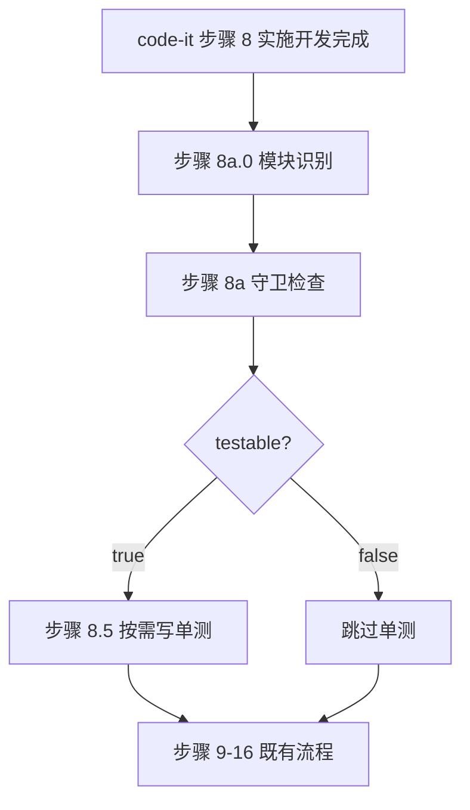

# REQ-00038 — 优化 /code-it 技能单测判定(从工程粒度细化到模块粒度)

- 需求编码:REQ-00038
- 所属版本:V0.0.3
- 上游需求:./assistants/V0.0.3/require/REQ-00038/RESULT.md (v1)
- 上游概要设计:./assistants/V0.0.3/design/REQ-00038/RESULT.md (v1)
- 遵循规范:./assistants/rules/{module-conventions, encoding-conventions, skill-conventions, dashboard-conventions, doc-conventions, coding-style, commit-conventions, dependency-conventions, directory-conventions, framework-conventions, naming-conventions, migration-mapping, marketplace-protocol}.md(共 13 份,跨版本共享)
- 状态:草稿
- 责任人:wangmiao
- 创建:2026-06-22
- 最近更新:2026-06-22 13:40
- 当前版本:v1

## 设计目标

- 整体设计目标:`--balanced`(沿用 design/REQ-00038/RESULT.md §1)
- 维度优先级:功能性 = 高
- 确认路径:用户手动调子技能,触发 1 个 `AskUserQuestion`(整体设计目标);扩展性判定 = 不触发(模块识别为**只读** monorepo 声明文件,不引入新三方依赖)

## 1. 详细设计概述

本详细设计在概要设计的基础上,补齐了**可直接编码的算法/数据结构/接口/异常处理细节**,为 `code-plan` 拆分任务提供完整输入。核心设计:**新增** `code-it` 步骤 8a.0 模块识别子步骤(综合 8 套 monorepo 声明文件 + git diff + CWD 根退化 3 层优先级链);**改造** 步骤 8a 守卫位置从 CWD 根 → 模块目录(7 项守卫字面字节级沿用 REQ-00034,仅位置扩展);**改造** 步骤 8.5 单测输出位置(7 层测试目录识别优先级链 + CWD 根退化);**追加** 1 个 `unit-test-results.md` 模板小节"## 各模块单测结果"(既有"## 9. 单元测试"小节字节级保留);**字面改写** `code-plan` 任务粒度描述(L473 / L496 各 1 句,字面增量不新增字段)。对应任务计划 = **3 个任务**(T-1 步骤 8a.0 模块识别 / T-2 步骤 8a 守卫位置改造 + 步骤 8.5 单测输出位置扩展 / T-3 模板追加 + code-plan 字面改写 + 端到端验证)。

## 2. 上游引用

- **需求**:`./assistants/V0.0.3/require/REQ-00038/RESULT.md` 关键摘录:
 - **5 FR**:FR-1 模块识别 / FR-2 步骤 8a 守卫位置 / FR-3 步骤 8.5 单测输出 / FR-4 模板多模块支持 / FR-5 code-plan 字面改写
 - **6 NFR**:NFR-1 性能 < 2 秒 / NFR-2 兼容性 / NFR-3 零规范变更 / NFR-4 不归一化 / NFR-5 可追溯 / NFR-6 幂等
 - **7 AC**:AC-1 ~ AC-7(端到端 4 + 静态校验 2 + 性能 1)
- **概要设计**:`./assistants/V0.0.3/design/REQ-00038/RESULT.md` 关键摘录:
 - **8 决策**:D-1 ~ D-8
 - **8 不变量**:INV-1 ~ INV-8
 - **1 主改造** + **1 模板追加** + **1 文档字面改写**
- **规范**:`./assistants/rules/` 下 13 份文件全部适用,详见 `rule-compliance.md`

## 3. 规范遵循

格式同 `code-design` 的 `RESULT.md §2.5`:
- **适用的规范文件与对应章节**:详见 `rule-compliance.md` 逐份自检
- **自检结论**:**完全合规**(13 份规范全部沿用,0 修改)
- **用户授权的偏离**:0 项
- **待澄清的冲突**:0 项

## 4. 模块详细化

按模块逐一展开,对应概要设计的 §4:

### 模块 1:`code-it` 步骤 8a.0 — 模块识别(新增)

- **关键类/函数**:
 - `identifyModules(changedFiles: string[]): string[]`:综合 8 套声明文件 + git diff LCP + CWD 根退化 3 层优先级链,返回模块路径列表
- **内部状态**:`modules: string[]` 缓存到 `code-it` 内部
- **关键调用顺序**:
 1. `code-it` 步骤 8 实施开发完成 → 拿到 `git diff --name-only` 输出
 2. 步骤 8a.0 调 `identifyModules` → 返回 `modules`
 3. 步骤 8a 守卫读 `modules` → 对每个模块独立执行 7 项检查
 4. 步骤 8.5 单测输出读 `modules` → 对每个通过的模块识别测试目录
- **并发模型**:N/A(单次任务内同步执行)
- **资源管理**:`modules` 任务生命周期内复用
- **错误处理范式**:所有异常退化到下一优先级链(E-1 / E-2 / E-7)
- **日志埋点**:`work-log.md` 追加"## 模块识别"小节(NFR-5 锁定)
- **依据规范**:`encoding-conventions.md §规则 1` + `module-conventions.md §规则 1`

### 模块 2:`code-it` 步骤 8a — 守卫位置改造(修改 / 扩展)

- **关键类/函数**:
 - `guardCheck(modules: string[]): { testable: boolean; moduleTestable: Map<string, boolean> }`:对每个模块独立执行 7 项检查,至少 1 个模块命中 → `testable = True`
- **内部状态**:`moduleTestable: Map<string, boolean>` 缓存到 `code-it` 内部
- **关键调用顺序**:
 1. 接收模块 1 的 `modules` 输出
 2. 步骤 8a.1 对每个模块独立执行 7 项检查(检查位置:模块目录)
 3. 步骤 8a.2 聚合:`testable = 至少 1 个模块命中`
 4. 步骤 8a.4 屏显契约:每个模块独立显示
- **并发模型**:N/A(顺序检查,典型 < 1 秒)
- **资源管理**:`moduleTestable` 任务生命周期内复用
- **错误处理范式**:模块目录不可访问 → 跳过该模块(E-4)
- **日志埋点**:屏显"模块级守卫检查详情"
- **依据规范**:`skill-conventions.md §规则 1/2` + NFR-4(7 项字节级沿用)

### 模块 3:`code-it` 步骤 8.5 — 单测输出位置扩展(修改 / 扩展)

- **关键类/函数**:
 - `identifyTestDir(module: string): string`:7 层测试目录识别优先级链
- **内部状态**:`moduleTestDir: Map<string, string>` 缓存到 `code-it` 内部
- **关键调用顺序**:
 1. 接收模块 1 + 模块 2 的输出
 2. 步骤 8.5.2 任务性质自动判定(沿用既有 3 类)
 3. 对每个 `moduleTestable.get(m) === true` 的模块调 `identifyTestDir`
 4. 多模块分别写单测
 5. 步骤 8.5.5 产出物:`code/<任务>/unit-test-results.md`(沿用模块 5 模板改造)
- **并发模型**:N/A
- **资源管理**:`moduleTestDir` 任务生命周期内复用
- **错误处理范式**:测试目录识别全失败 → 退化到 CWD 根 `test/`(沿用原 REQ-00034 行为)
- **日志埋点**:`unit-test-results.md` "## 各模块单测结果"小节填实际值
- **依据规范**:`module-conventions.md §规则 1`

### 模块 4:`code-plan` 任务粒度描述字面改写(修改 / 字面)

- **关键类/函数**:N/A(纯字面)
- **内部状态**:N/A
- **关键调用顺序**:L473 / L496 各字面改写 1 句
- **并发模型**:N/A
- **资源管理**:N/A
- **错误处理范式**:N/A
- **日志埋点**:N/A
- **依据规范**:`skill-conventions.md §规则 2`

### 模块 5:`code-it/templates/RESULT.md` 多模块支持(修改 / 追加)

- **关键类/函数**:N/A(模板)
- **内部状态**:N/A
- **关键调用顺序**:
 1. `code-it` 步骤 8.5.5 写 `unit-test-results.md` 时复制模板"## 9. 单元测试(由 code-it 内化)"小节 + 新"## 各模块单测结果"小节
 2. 既有"## 9. 单元测试"小节(L138-L153)字节级保留
 3. "## 10. 逻辑行统计"小节章节顺序 +1
 4. "## 11. 变更记录"小节章节顺序 +1
- **并发模型**:N/A
- **资源管理**:N/A
- **错误处理范式**:N/A
- **日志埋点**:N/A
- **依据规范**:`module-conventions.md §规则 1` + `skill-conventions.md §规则 2`

**关键决策与权衡**:详见 `design-notes.md` 8 项决策。

## 5. 算法与逻辑(本节**必填**;至少 1 个伪代码块)

### 算法 1:模块识别(`identifyModules`)

- **目的**:综合多源识别 monorepo 模块路径列表
- **输入**:`changedFiles: string[]`(`git diff --name-only` 输出,变更文件路径列表)
- **输出**:`string[]`(模块路径列表;单模块工程 = `['.']`)
- **复杂度**:时间 O(n)(n = 变更文件数,典型 1-1000);空间 O(1)
- **依赖**:`fs.access` / `fs.readFile` / `YAML.parse` / `JSON.parse`(全本地)
- **伪代码**:
 ```
 function identifyModules(changedFiles):
 # 1. 声明文件检测(高优先级)
 if exists('pnpm-workspace.yaml'):
 return readPnpmWorkspaces() // YAML.parse → packages 字段

 if exists('package.json') and packageJson.workspaces:
 return readNpmWorkspaces() // package.json#workspaces 字段

 if exists('lerna.json'):
 return readLernaPackages() // JSON.parse → packages 字段

 if exists('nx.json') or exists('turbo.json'):
 return readNxTurboWorkspace() // nx.json/turbo.json workspace 配置

 if exists('pom.xml'):
 return readMavenModules() // pom.xml#modules 字段

 if exists('Cargo.toml') and cargoToml.workspace:
 return readCargoWorkspace() // Cargo.toml#workspace.members 字段

 if exists('go.mod'):
 return inferGoModules() // 约定式:module 路径 + 子目录

 # 2. git diff 退化
 if changedFiles.length > 0:
 lcp = longestCommonPrefix(changedFiles)
 if lcp and lcp != '.' and exists(lcp + '/package.json'):
 return [lcp]
 return [lcp] // 退化到 LCP 目录

 # 3. CWD 根退化
 return ['.']
 ```
- **关键决策与权衡**:见 `design-notes.md` 问题 1 / 6 / 7
- **边界条件**:
 - 空 `changedFiles` → `['.']`(E-7 兜底)
 - 变更路径跨多个 LCP → 取最长公共前缀
 - 声明文件格式异常 → 退化到下一优先级链(E-1)
- **对应任务**:TASK-REQ-00038-00001
- **依据规范**:`encoding-conventions.md §规则 1`

### 算法 2:守卫检查(`guardCheck`)

- **目的**:对每个模块独立执行 7 项守卫检查,聚合判定 `testable`
- **输入**:`modules: string[]`(来自算法 1)
- **输出**:`{ testable: boolean; moduleTestable: Map<string, boolean> }`
- **复杂度**:时间 O(m × 7)(m = 模块数,典型 1-100);空间 O(m)
- **依赖**:`fs.access` / `fs.readFile` / `fs.stat`(全本地)
- **伪代码**:
 ```
 function guardCheck(modules):
 moduleTestable = new Map()
 for module in modules:
 checkPath = (module == '.') ? '.' : module
 hit = any([
 check1: exists(`${checkPath}/package.json`) and hasScriptsTest(`${checkPath}/package.json`),
 check2: exists(`${checkPath}/pyproject.toml`) and hasTestConfig(`${checkPath}/pyproject.toml`),
 check3: exists(`${checkPath}/Cargo.toml`),
 check4: exists(`${checkPath}/go.mod`),
 check5: exists(`${checkPath}/pom.xml`),
 check6: exists(`${checkPath}/build.gradle`) or exists(`${checkPath}/build.gradle.kts`),
 check7: isDirectory(`${checkPath}/test`)
 ])
 moduleTestable.set(module, hit)
 testable = Array.from(moduleTestable.values()).some(v => v)
 return { testable, moduleTestable }
 ```
- **关键决策与权衡**:见 `design-notes.md` 问题 2
- **边界条件**:
 - 单模块工程 = 1 模块 = `['.']` → `checkPath = '.'` → 字节级沿用 REQ-00034(0 回归,AC-4)
 - 多模块部分命中 → `testable = true`(FR-2 锁定)
 - 模块目录不可访问 → 跳过该模块(E-4)
- **对应任务**:TASK-REQ-00038-00002
- **依据规范**:`skill-conventions.md §规则 1/2`

### 算法 3:测试目录识别(`identifyTestDir`)

- **目的**:为通过的模块识别其约定测试目录
- **输入**:`module: string`(通过的模块路径)
- **输出**:`string`(测试目录路径,相对 CWD)
- **复杂度**:时间 O(1)(每层检查 IO 1 次,典型 < 10ms);空间 O(1)
- **依赖**:`fs.access` / `fs.readFile` / `JSON.parse` / `TOML.parse`(全本地)
- **伪代码**:
 ```
 function identifyTestDir(module):
 # 1. Node.js(Jest / Vitest / Mocha)
 if exists(`${module}/package.json`):
 pkg = readJson(`${module}/package.json`)
 if pkg.scripts?.test and (hasJestConfig(pkg) or hasVitestConfig(pkg) or hasMochaConfig(pkg)):
 return readTestMatch(pkg) // testMatch / testRegex

 # 2. Python(Pytest)
 if exists(`${module}/pyproject.toml`):
 pyproject = readToml(`${module}/pyproject.toml`)
 if pyproject.tool?.pytest?.ini_options?.testpaths:
 return pyproject.tool.pytest.ini_options.testpaths

 # 3. Rust
 if exists(`${module}/Cargo.toml`):
 return `${module}/src` // 约定 src/ 同包 #[cfg(test)]

 # 4. Go
 if exists(`${module}/go.mod`):
 return module // 约定同包 *_test.go

 # 5. Java(Maven/Gradle)
 if exists(`${module}/pom.xml`) or exists(`${module}/build.gradle`) or exists(`${module}/build.gradle.kts`):
 return `${module}/src/test`

 # 6. 无约定 → 模块根 test/
 if isDirectory(`${module}/test`):
 return `${module}/test`

 # 7. 仍无 → CWD 根 test/(原 REQ-00034 行为退化)
 return 'test'
 ```
- **关键决策与权衡**:见 `design-notes.md` 问题 5
- **边界条件**:
 - 7 层全失败 → `test/`(CWD 根)
 - 多语言混合模块(同时有 Go + Python)→ 命中优先级最高的(NPM > Pytest)
- **对应任务**:TASK-REQ-00038-00003
- **依据规范**:`module-conventions.md §规则 1`

## 6. 数据结构完整变更

本需求**不涉及**数据库/缓存/状态字段变更,纯运行时数据:

| 字段 | 类型 | 生命周期 | 说明 |
| --- | --- | --- | --- |
| `modules: string[]` | 字符串数组(模块路径,相对 CWD) | 任务级内存缓存 | 模块识别结果 |
| `moduleTestable: Map<string, boolean>` | 字典(模块路径 → 是否可测) | 任务级内存缓存 | 每个模块的守卫结果 |
| `moduleTestDir: Map<string, string>` | 字典(模块路径 → 测试目录) | 任务级内存缓存 | 每个通过模块的测试目录 |

详见 `module-details.md` 各模块"内部状态"段。

## 7. 接口细节

### 7.1 接口总览

| 接口名 | 形式 | 状态 | 对应任务 | 依据规范 |
| --- | --- | --- | --- | --- |
| `identifyModules` | 函数(内部) | 新增 | TASK-REQ-00038-00001 | `encoding-conventions.md §规则 1` |
| `guardCheck` | 函数(内部) | 修改(位置扩展) | TASK-REQ-00038-00002 | `skill-conventions.md §规则 1/2` |
| `identifyTestDir` | 函数(内部) | 修改(位置扩展) | TASK-REQ-00038-00003 | `module-conventions.md §规则 1` |
| `unit-test-results.md` "## 各模块单测结果" 小节 | Markdown 模板 | 新增(模板) | TASK-REQ-00038-00003 | `module-conventions.md §规则 1` |
| `code-plan` 任务粒度描述(L473 / L496) | Markdown 字面 | 字面改写 | TASK-REQ-00038-00003 | `skill-conventions.md §规则 2` |

### 7.2 关键决策

- **鉴权方式**:N/A(内部函数)
- **错误码体系**:N/A(本步骤不抛异常,所有异常退化到下一优先级链)
- **限流策略**:N/A
- **幂等保证**:`identifyModules` / `guardCheck` / `identifyTestDir` 多次执行结果一致(NFR-6 锁定)
- **链路追踪字段**:N/A

详见 `interface-specs.md` 各接口完整规格。

## 8. 异常处理

按异常类别组织:

- **输入校验**:`changedFiles` 路径由 `git diff` 保证合法,无需额外校验
- **外部依赖**:`YAML.parse` / `JSON.parse` / `TOML.parse` 抛异常 → 退化为下一优先级链
- **并发冲突**:N/A(单次任务内同步执行)
- **资源耗尽**:文件 IO 超时 → 退化为 CWD 根(E-2)
- **业务异常**:模块目录不可访问 → 跳过该模块(E-4)
- **未知异常**:屏显警告 + 退化

每条异常的触发条件 / 检测手段 / 处理策略 / 监控指标 / 对应任务,详见 `risk-analysis.md` §异常处理。

## 9. 安全要求

- **鉴权**:N/A(`code-it` 是内部技能)
- **授权**:N/A
- **输入校验**:`changedFiles` 由 `git diff` 保证合法
- **敏感数据处理**:N/A
- **防注入**:N/A(本需求纯本地文件操作)
- **审计**:`work-log.md` 追加"## 模块识别"小节(NFR-5 锁定)
- **依据规范**:`module-conventions.md §规则 1` + `skill-conventions.md §规则 1/2`

## 10. 状态机 / 流程

本需求**无状态机**,仅过程性流程:



## 11. 性能与资源

- **关键路径耗时目标**:模块识别 + 守卫检查总耗时 < 2 秒(典型 100 模块 monorepo,NFR-1 强约束)
- **并发上限**:N/A(单次任务内同步执行)
- **资源限制**:内存 < 1MB(典型 100 模块);文件 IO 700 次 < 100ms(典型 100 模块)
- **缓存策略**:任务级内存缓存(`modules` / `moduleTestable` / `moduleTestDir`)
- **批量/异步**:N/A
- **降级策略**:声明文件解析失败 / git diff 失败 / 模块目录不可访问 / 7 项守卫全不命中 → 沿用 FR-1 ~ FR-3 优先级链退化

详见 `risk-analysis.md` §性能与资源。

## 12. 测试要点

- **单元测试**:模块识别 / 守卫检查 / 测试目录识别 3 个函数各 8-9 个用例
- **集成测试**:monorepo 端到端 / 多模块端到端 / 单模块回归 3 个场景
- **端到端测试**:AC-1 / AC-2 / AC-3 / AC-4
- **性能/安全测试**:AC-7(性能 < 2 秒)
- **回归测试**:7 项守卫字面 0 改 / 3 类任务自动判定逻辑 0 改 / 模板既有"## 9. 单元测试"小节 0 改 / 单模块工程 0 回归

每条测试要点关联到对应任务,详见 `risk-analysis.md` §测试要点。

## 13. 关联编码计划

- `PLAN.md` 中本详细设计对应的所有任务编号列表:
 - `TASK-REQ-00038-00001` — [修改] code-it 步骤 8a.0 模块识别(新增子步骤)
 - `TASK-REQ-00038-00002` — [修改] code-it 步骤 8a 守卫位置 + 步骤 8.5 单测输出位置扩展
 - `TASK-REQ-00038-00003` — [修改] code-it/templates/RESULT.md 追加"## 各模块单测结果"小节 + code-plan 任务粒度描述字面改写 + 端到端验证
- 关键任务与本节设计的对应关系:
 - T-1 → RESULT.md §5 算法 1 + §4 模块 1
 - T-2 → RESULT.md §5 算法 2 / 3 + §4 模块 2 / 3
 - T-3 → RESULT.md §4 模块 4 / 5 + §7 接口 4 / 5

## 14. 待澄清 / 未决项

| 编号 | 问题 | 影响范围 | 阻塞方 | 期望回复时间 |
| --- | --- | --- | --- | --- |
| (无) | — | — | — | — |

本轮无用户问路(沿用 design/REQ-00038 §1 1 个 `AskUserQuestion` 整体设计目标确认)。

## 15. 变更记录

| 时间 | 版本 | 变更类型 | 变更摘要 | 变更人 |
| --- | --- | --- | --- | --- |
| 2026-06-22 13:40 | v1 | 初始创建 | 完成首次详细设计(5 模块 / 3 算法 / 5 接口 / 0 数据库变更 / 7 字段模板 / 13 份规范 100% 合规 / 8 不变量 / 0 偏离);整体=--balanced,功能性=高(沿用 design);3 任务严格串行(T-1 → T-3);AC-1 ~ AC-7 全部纳入 T-3 验证 | wangmiao |
