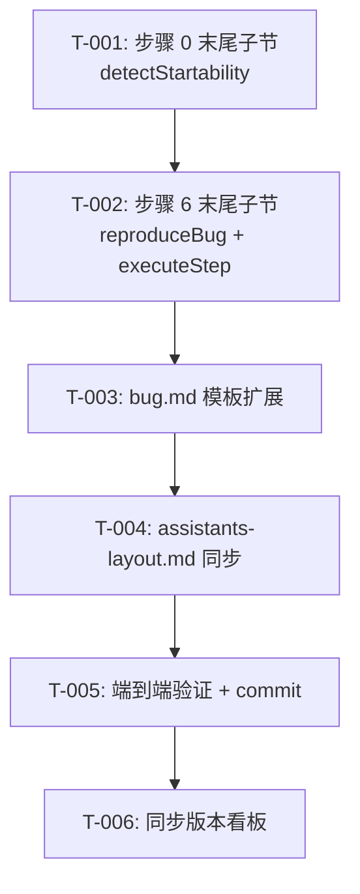

# 编码计划 — REQ-00040 · 优化 /code-fix 技能:登记缺陷时启动程序复现并登记证据

- 需求编码:REQ-00040
- 所属版本:V0.0.3
- 计划创建时间:2026-06-25
- 最近更新:2026-06-25
- 当前版本:v1
- 责任人:用户
- 上游:`./assistants/V0.0.3/plan/REQ-00040/RESULT.md`(v1,15 章节)
- 任务总数:6
- 里程碑:1 个(M1-REQ-00040)

## 1. 计划概述

本计划把"详细设计"落地为 6 个可独立执行、可追踪状态的任务。所有任务**全部** `触发/来源=详细设计`(沿用 REQ-00017 强约束),**不**出现"更新看板" 派生任务。任务按"应被编码的先后顺序" 分配序号 00001~00006。

**任务粒度判定**(沿用 REQ-00014):
- 整体设计目标 = `--balanced` → **不**插入架构任务(首个 TASK-001 不需要)
- 0.5~2 天可完成 ✓
- 1 任务 = 1 功能点 ✓
- 1 任务含完整"展示+逻辑+说明" ✓

**任务类型分布**:
- 修改 4 个(T-001~T-004)+ 文档 2 个(T-005~T-006)= 6 个

## 2. 任务总览

| 任务编号 | 需求 | 类型 | 触发/来源 | 标题 | 开发状态 | 测试状态 | 涉及文件 | 完成时间 | 提交哈希 | 关联任务 |
| --- | --- | --- | --- | --- | --- | --- | --- | --- | --- | --- |
| TASK-REQ-00040-00001 | REQ-00040 | 修改 | 详细设计 | [修改] code-fix 步骤 0 末尾追加"项目可启动性探测" 子节(detectStartability 7 步算法) | 待开始 | 不适用 | plugins/code-skills/skills/code-fix/SKILL.md §步骤 0.X | — | — | REQ-00040 |
| TASK-REQ-00040-00002 | REQ-00040 | 修改 | 详细设计 | [修改] code-fix 步骤 6 末尾追加"复现产物登记" 子节(reproduceBug 9 步算法 + executeStep 3 类采集) | 待开始 | 不适用 | plugins/code-skills/skills/code-fix/SKILL.md §步骤 6.X | — | — | REQ-00040 |
| TASK-REQ-00040-00003 | REQ-00040 | 修改 | 详细设计 | [修改] bug.md 模板新增"## 复现产物登记" 区段 + 文档头 2 字段 | 待开始 | 不适用 | plugins/code-skills/skills/code-fix/templates/bug.md | — | — | REQ-00040 |
| TASK-REQ-00040-00004 | REQ-00040 | 修改 | 详细设计 | [修改] assistants-layout.md 同步追加 reproduce/ 子目录行 | 待开始 | 不适用 | plugins/code-skills/skills/code-fix/templates/assistants-layout.md | — | — | REQ-00040 |
| TASK-REQ-00040-00005 | REQ-00040 | 文档 | 详细设计 | [文档] 端到端验证 12 条 AC(全部静态校验)+ 末尾兜底提交 | 待开始 | 不适用 | (无生产代码改动;NFR-7 静态校验) | — | — | REQ-00040 |
| TASK-REQ-00040-00006 | REQ-00040 | 文档 | 详细设计 | [文档] 同步版本看板"任务清单" / "里程碑" / "变更记录"(code-plan 末尾兜底承担) | 待开始 | 不适用 | assistants/V0.0.3/RESULT.md §任务清单 / §里程碑 / §变更记录 | — | — | REQ-00040 |

> **任务粒度自检**:
> - T-001:1 任务 = 1 子节(7 步算法),独立可验证
> - T-002:1 任务 = 1 子节(9 步算法 + 3 类采集),独立可验证
> - T-003:1 任务 = 1 模板改造(2 字段 + 1 新区段),独立可验证
> - T-004:1 任务 = 1 模板同步(1 行追加),独立可验证
> - T-005:1 任务 = 1 验证环节(12 AC),独立可验证
> - T-006:1 任务 = 1 看板同步,独立可验证

## 3. 任务详情

### TASK-REQ-00040-00001 — [修改] code-fix 步骤 0 末尾追加"项目可启动性探测" 子节

#### 目标
在 `code-fix/SKILL.md` §"## 步骤 0 — 版本上下文检测(强制前置)" 末尾追加"### 步骤 0.X — 项目可启动性探测" 子节,实现 `detectStartability(cwd)` 7 步探测算法。

#### 涉及文件
- `plugins/code-skills/skills/code-fix/SKILL.md > ## 步骤 0 — 版本上下文检测(强制前置)` 末尾追加子节(锚点:line 181 "4. 验证目录存在" 后,line 182 "### 步骤 1" 前)

#### 关键变更
- **追加**(不修改):
 - 步骤 0 末尾追加"### 步骤 0.X — 项目可启动性探测(本需求新增子节)" 小节标题
 - 7 步探测算法伪代码:
 1. Node.js(`package.json` + scripts.start)→ npm/yarn/pnpm start
 2. Python(`pyproject.toml` / `setup.py` / `requirements.txt`)→ `python -m <module>`
 3. Makefile(target start/run/dev)→ `make <target>`
 4. Docker Compose → `docker compose up`
 5. Rust(`Cargo.toml`)→ `cargo run`
 6. Go(`go.mod`)→ `go run .`
 7. Java Maven(`pom.xml`)→ `mvn spring-boot:run` 或 Gradle(`build.gradle`)→ `gradle bootRun`
 - 内存上下文写入说明(`context.canStart` / `context.startCommand`,**不**写文件,沿用 PD-1)
- **不修改**(字节级保留):
 - frontmatter L1-3
 - 步骤 0 主体(line 177-181)
 - 步骤 1~10 主体
 - "## 不要做的事" 段

#### 边界与异常
- 文件不存在 / JSON 解析失败 → 跳过该优先级,继续下一优先级(不报错)
- 全未命中 → `canStart = false`,`startCommand = null`(沿用 E-1)
- 屏显契约:**不**屏显任何内容(NFR-3 不触发 `AskUserQuestion`)

#### 验证手段
- AC-1 静态校验:`Read code-fix/SKILL.md` 步骤 0 末尾,检查"### X.项目可启动性探测" 子节存在,含 7 步伪代码
- AC-7 静态校验:`git diff` 校验 L1-3 + 步骤 0 主体 + 步骤 1~10 主体 + "## 不要做的事" 字节级未变

#### 回退方式
- 伪代码描述错误 → `Edit` 工具修订子节文字,**不**影响主体流程
- 子节位置错误 → 移动到正确锚点(line 181 后)

---

### TASK-REQ-00040-00002 — [修改] code-fix 步骤 6 末尾追加"复现产物登记" 子节

#### 目标
在 `code-fix/SKILL.md` §"## 步骤 6 — 写缺陷详情 RESULT.md" 末尾追加"### 步骤 6.X — 复现产物登记" 子节,实现 `reproduceBug()` 9 步算法 + `executeStep()` 3 类采集。

#### 涉及文件
- `plugins/code-skills/skills/code-fix/SKILL.md > ## 步骤 6 — 写缺陷详情 RESULT.md` 末尾追加子节(锚点:line 305 "**关键:不重写 RESULT.md 的稳定章节**" 注释前)

#### 关键变更
- **追加**(不修改):
 - 步骤 6 末尾追加"### 步骤 6.X — 复现产物登记(本需求新增子节)" 小节标题
 - 触发条件 3 条:`canStart=true` ∧ 新建分支 ∧ 有复现步骤
 - 9 步 `reproduceBug()` 算法:
 1. `mkdir -p fix/<BUG-NNN>/reproduce/`
 2. 启动子进程:`<startCommand> > run.stdout.log 2> run.stderr.log`
 3. 等 5s
 4. 执行复现步骤(用 `executeStep()`,详见 T-002 内联)
 5. 收集产物(日志 / 截图 / 交互数据)
 6. 终止子进程(SIGTERM 5s → SIGKILL)
 7. 合并 stdout + stderr → `run.log`(加时间戳,沿用 PD-4)
 8. 写 `RESULT-meta.json`(单行 JSON,沿用 PD-5)
 9. 写"## 复现产物登记" 区段到 `fix/<BUG-NNN>/RESULT.md`
 - `executeStep(step, reproduceDir)` 3 类分发:
 - `cli` → 执行命令(产物 = stdout/stderr)
 - `http` → curl 调 API + 写 `interaction-N.json`
 - `browser` → 链式降级 playwright → puppeteer → headless-chrome
 - 失败降级逻辑(11 边界 + 1 复合边界,详见 `risk-analysis.md §1`)
- **不修改**(字节级保留):
 - frontmatter L1-3
 - 步骤 6 主体(line 277-305)
 - 步骤 0~5 / 步骤 7~10 主体
 - "## 不要做的事" 段

#### 边界与异常
- 11 边界 + 1 复合边界(详见 `risk-analysis.md §1`)
- 任何失败 → 屏显 `⚠` + 继续登记(NFR-4 不阻断)

#### 验证手段
- AC-2 静态校验:子节存在,含触发条件 3 条 + 9 步算法
- AC-3 端到端降级为静态:检查产物收集子节完整性
- AC-4 静态校验:产物路径 + meta 字段
- AC-7 静态校验:`git diff` 校验 L1-3 + 步骤 6 主体 + 步骤 0~5 / 7~10 主体 + "## 不要做的事" 字节级未变
- AC-8 端到端降级为静态:检查失败降级逻辑字面

#### 回退方式
- 伪代码错误 → `Edit` 工具修订子节文字
- 触发条件错误 → 修正 3 条判定字面

---

### TASK-REQ-00040-00003 — [修改] bug.md 模板新增"## 复现产物登记" 区段 + 文档头 2 字段

#### 目标
在 `code-fix/templates/bug.md`:
1. 文档头"## 文档头" 表新增 2 行(复现方式 / 产物路径)
2. 在"## 缺陷描述" 段后(在 `---` 分隔符 + "## 根因分析" 段前)插入"## 复现产物登记" 区段

#### 涉及文件
- `plugins/code-skills/skills/code-fix/templates/bug.md`
 - 文档头"## 文档头" 表(line 8-22 后,line 24 `### 状态枚举` 前)
 - "## 缺陷描述" 段后(line 60 `---` 分隔符前,line 61 `## 根因分析` 前)

#### 关键变更
- **追加**(不修改):
 - 文档头表新增 2 行:
 - `| 复现方式 | \`程序复现\` / \`文本复现\` / \`未复现\` |`
 - `| 产物路径 | \`reproduce/\`(子目录相对路径;空表示无产物) |`
 - 在"## 缺陷描述" 段后插入"## 复现产物登记(由 code-fix 步骤 6 末尾)" 区段,含 3 子项:
 - `### 产物清单`(表格 4 列:产物类型 / 文件路径 / 大小 / 用途)
 - `### 实际行为`(复现过程观察)
 - `### 复现结论`(已复现 / 未复现 / 复现失败)
- **不修改**(字节级保留):
 - 文档头既有 11 行
 - 既有 9 区段(文档头/缺陷描述/根因分析/修复方案/修复实施/验证结果/修复日志/关联项/变更记录)

#### 边界与异常
- 模板**不**含"本需求 REQ-00040 新增" 等开发痕迹字面(沿用 `skill-conventions §规则 2`)
- 字段值用占位符 `<bugNum>` / `<command>` / `<时间>` 风格(沿用既有)

#### 验证手段
- AC-5 静态校验:新区段存在 + 子项完整
- AC-6 静态校验:文档头 2 字段存在
- AC-7 静态校验:既有 9 区段字节级未变

#### 回退方式
- 新区段位置错误 → 移动到正确锚点(line 60 前)
- 字段格式错误 → 修正表格字面

---

### TASK-REQ-00040-00004 — [修改] assistants-layout.md 同步追加 reproduce/ 子目录行

#### 目标
在 `code-fix/templates/assistants-layout.md` §"## 目录结构" 段,`fix/<BUG-NNN>/` 子目录列表中追加 `reproduce/` 行。

#### 涉及文件
- `plugins/code-skills/skills/code-fix/templates/assistants-layout.md > ## 目录结构` 段(line 16-19)

#### 关键变更
- **追加**(不修改):
 - 在 `fix/<BUG-NNN>/` 子目录列表中追加:
 ```
 │ └── reproduce/ # 复现产物(由 code-fix 步骤 6 末尾生成,可选)
 ```
- **不修改**:
 - 顶层目录结构
 - 其他 6 个 `code-fix` 子目录(`RESULT.md` / `investigation.md` / `fix-plan.md` 等)

#### 边界与异常
- 模板**不**含"本需求 REQ-00040 新增" 等开发痕迹字面(沿用 `skill-conventions §规则 2`)

#### 验证手段
- 静态校验:`Read assistants-layout.md` 检查 `reproduce/` 行存在
- 既有 6 子目录字节级未变

#### 回退方式
- 位置错误 → 调整到正确锚点
- 注释错误 → 修正描述字面

---

### TASK-REQ-00040-00005 — [文档] 端到端验证 12 条 AC(全部静态校验)+ 末尾兜底提交

#### 目标
对 12 条 AC 全部做静态校验(本仓库 0 测试框架 + 0 可启动项目,降级为静态校验);末尾兜底 1 次 commit 落地。

#### 涉及文件
- (无生产代码改动)
- 验证用:`plugins/code-skills/skills/code-fix/SKILL.md` / `plugins/code-skills/skills/code-fix/templates/bug.md` / `plugins/code-skills/skills/code-fix/templates/assistants-layout.md` / `./assistants/V0.0.3/fix/BUG-0000{1..5}/RESULT.md` / `./assistants/V0.0.3/RESULT.md`

#### 关键变更
- **不**修改任何生产代码
- 执行 12 条 AC 静态校验,产出校验报告
- 末尾兜底 1 次 `chore(code-it): REQ-00040 步骤 ...` commit

#### 验证清单(12 条 AC)

| AC | 关键步骤 | 期望 |
| --- | --- | --- |
| AC-1 | `Read code-fix/SKILL.md` 步骤 0 末尾 | "### X.项目可启动性探测" 子节存在 |
| AC-2 | `Read code-fix/SKILL.md` 步骤 6 末尾 | "### X.复现产物登记" 子节存在 |
| AC-3 | 检查"## 复现产物登记" 模板子项 + meta 字段 | 3 子项 + 8 字段完整 |
| AC-4 | 验证产物路径 + meta 字段 | `fix/<BUG-NNN>/reproduce/` + 8 字段 |
| AC-5 | `Read bug.md` 检查新区段结构 | "## 复现产物登记" 段含 3 子项 |
| AC-6 | `Read bug.md` 文档头表 | 新增 2 行(复现方式 / 产物路径) |
| AC-7 | `git diff` 校验 L1-3 + 既有"## 工作流程" + "## 不要做的事" | 字节级未变 |
| AC-8 | 检查失败降级逻辑字面 | `⚠` 屏显 + `复现方式 = 文本复现` 字面 |
| AC-9 | `Read BUG-00001~05/RESULT.md` | **不**含"## 复现产物登记" 段 |
| AC-10 | `Read fix-registry.md` + `version-RESULT.md` | 7 列表格 + 看板列未变 |
| AC-11 | `Grep` 关键词 | 0 命中(零开发痕迹) |
| AC-12 | 检查 `code-fix` 步骤 4 状态推进表字面 | 沿用 REQ-00037 |

#### 边界与异常
- 任何 AC 不通过 → 立即修复对应任务,不阻塞后续任务
- 末尾兜底 commit 失败 → 屏显 `⚠ 末尾提交失败`,请手动处理

#### 验证手段
- 12 条 AC 全部通过
- 1 次末尾兜底 commit 成功

#### 回退方式
- 任何 AC 不通过 → 立即修复对应任务(T-001 / T-002 / T-003 / T-004)
- commit 失败 → 手动 `git commit`

---

### TASK-REQ-00040-00006 — [文档] 同步版本看板"任务清单" / "里程碑" / "变更记录"

#### 目标
在 `./assistants/V0.0.3/RESULT.md` 同步 4 个区段(由 `code-plan` 步骤 16A + `code-it` 步骤 24 末尾兜底承担)。

#### 涉及文件
- `assistants/V0.0.3/RESULT.md > ## 任务清单` 区段(追加 6 行)
- `assistants/V0.0.3/RESULT.md > ## 里程碑` 区段(追加 1 行)
- `assistants/V0.0.3/RESULT.md > ## 变更记录` 区段(追加 1 条)
- `assistants/V0.0.3/RESULT.md` 文档头"最近更新" 时间刷新

#### 关键变更
- **追加**:
 - 任务清单追加 6 行(TASK-REQ-00040-00001 ~ 00006)
 - 里程碑追加 1 行(`M1-REQ-00040 | REQ-00040 全部 6 任务(T-1~T-6) | ... | 待开始`)
 - 变更记录追加 1 条(`YYYY-MM-DD HH:mm 设计新增 REQ-00040 详细设计与编码计划完成(共 6 个任务) REQ-00040`)
- **不修改**:
 - 文档头"最近更新" 时间(由后续 `code-it` 步骤 24 末尾兜底刷新)
 - 既有任务清单 17 列(沿用 `dashboard-conventions §规则 1` 字节级保留)

#### 边界与异常
- 看板同步失败 → 屏显 `⚠`,不阻断 `code-plan` 主流程
- 幂等检查:若已存在本计划条目 → 跳过(沿用 `syncKanbanBugList` 既有)

#### 验证手段
- 静态校验:`Read RESULT.md` 检查 4 区段同步情况

#### 回退方式
- 追加行格式错误 → `Edit` 工具修正
- 字段值错误 → 修正字面

---

## 4. 任务依赖图



**依赖说明**:
- T-001 → T-002:**强依赖**(T-002 读 T-001 写入的内存上下文 `canStart` / `startCommand`)
- T-002 → T-003:**弱依赖**(T-003 模板与 T-002 子节可并行开发;T-003 完成**前** T-005 验证 AC-5 / AC-6 失败)
- T-003 → T-004:**弱依赖**(同 T-002 → T-003)
- T-004 → T-005:**强依赖**(T-005 验证 T-001~T-004 全部)
- T-005 → T-006:**强依赖**(T-006 看板同步在 T-005 commit 后)

**关键不变量**:T-005 在 T-001~T-004 全部完成**前**不能开始(否则 12 AC 验证失败)

## 5. 里程碑

| 里程碑 | 包含任务范围 | 完成定义 | 状态 | 计划时间 | 实际完成 |
| --- | --- | --- | --- | --- | --- |
| M1-REQ-00040 | REQ-00040 全部 6 任务(T-1 ~ T-6) | 6 任务开发状态=已完成 ∧ 测试状态=不适用;AC-1 ~ AC-12 全过(全部降级为静态校验);1 次末尾兜底提交 | 待开始 | 2026-06-25 | — |

> 完成定义显式列出两轴状态要求,避免把"开发完成"误当"可发布"。

## 6. 状态管理规则

- 任务状态由 `code-it` 步骤 24 末尾兜底推进(沿用既有)
- `code-check` 评审完成时,所有任务维持`已完成`(本次不派生"审查改修"任务)
- 状态变更在 `RESULT.md` "## 变更记录" 区段追加

## 7. 关联计划

- **REQ-00037**(`code-fix` 状态推进):本计划**不**改 REQ-00037 状态推进路径,严守 INV-6
- **REQ-00036**(清理 SKILL.md 开发痕迹):本计划**不**引入开发痕迹,严守 INV-8
- **BUG-00001~05**:本计划**不**追加"## 复现产物登记" 段到历史 5 个 BUG,严守 NFR-5

## 8. 变更记录

| 时间 | 版本 | 变更类型 | 变更摘要 | 变更人 |
| --- | --- | --- | --- | --- |
| 2026-06-25 | v1 | 初始创建 | 完成首次详细设计与编码计划;6 任务(全部 `触发/来源=详细设计`);M1-REQ-00040 里程碑;12 AC 全部降级为静态校验;沿用 design 的 `--balanced` 设计目标 | 用户 |
