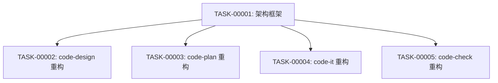

# 编码计划 — REQ-00041 · 技能多语言模块化重构

## 计划概述

- **需求**:REQ-00041 · 技能多语言模块化重构
- **设计目标**:`--extensible`
- **任务总数**:5 个(1 架构 + 4 技能重构)
- **预计工作量**:每个任务 0.5-1 天,总计 2.5-5 天

## 任务总览

| 任务编号 | 需求 | 类型 | 触发/来源 | 标题 | 开发状态 | 测试状态 | 涉及文件 | 完成时间 | 提交哈希 | 关联任务 |
| --- | --- | --- | --- | --- | --- | --- | --- | --- | --- | --- |
| TASK-REQ-00041-00001 | REQ-00041 | 新增 | 需求新增 | [架构] 建立 references/ 框架 + 语言检测逻辑 + common.md 模板 | 待开始 | 不适用 | — | — | — | — |
| TASK-REQ-00041-00002 | REQ-00041 | 修改 | 需求新增 | [修改] code-design 精简 SKILL.md + 创建 references/ 7 文件 | 待开始 | 不适用 | — | — | — | TASK-REQ-00041-00001 |
| TASK-REQ-00041-00003 | REQ-00041 | 修改 | 需求新增 | [修改] code-plan 精简 SKILL.md + 创建 references/ 7 文件 | 待开始 | 不适用 | — | — | — | TASK-REQ-00041-00001 |
| TASK-REQ-00041-00004 | REQ-00041 | 修改 | 需求新增 | [修改] code-it 精简 SKILL.md + 创建 references/ 7 文件 | 待开始 | 不适用 | — | — | — | TASK-REQ-00041-00001 |
| TASK-REQ-00041-00005 | REQ-00041 | 修改 | 需求新增 | [修改] code-check 精简 SKILL.md + 创建 references/ 7 文件 | 待开始 | 不适用 | — | — | — | TASK-REQ-00041-00001 |

## 任务详情

### TASK-REQ-00041-00001:[架构] 建立 references/ 框架 + 语言检测逻辑 + common.md 模板

**目标**:建立 4 个技能的 references/ 目录框架,编写通用 common.md 模板,实现语言检测逻辑集成到 code-design 步骤 5。

**涉及文件**:
- `plugins/code-skills/skills/code-design/references/` > 新建目录
- `plugins/code-skills/skills/code-plan/references/` > 新建目录
- `plugins/code-skills/skills/code-it/references/` > 新建目录
- `plugins/code-skills/skills/code-check/references/` > 新建目录

**关键变更**:
1. 为 4 个技能各创建 `references/` 目录
2. 为每个技能创建 `references/common.md`(通用流程细节,15 章节)
3. 为每个技能创建 6 个语言文档骨架(`nodejs.md` / `python.md` / `rust.md` / `go.md` / `java-maven.md` / `java-gradle.md`),各含 7 章节标题
4. 在 code-design 的 `references/common.md` 中内嵌语言检测算法伪代码(§5 步骤 5 通用项目探索)
5. 在 code-design 的 `references/common.md` 中定义语言标签传递接口(§6)

**边界与异常**:
- 目录已存在 → 跳过创建,仅更新文件
- common.md 模板须与 4 个技能共享相同结构,但内容因技能而异

**验证手段**:
- 4 个 `references/` 目录各含 7 个文件
- 每个 common.md 包含 15 个章节标题
- 每个语言文档包含 7 个章节标题
- 语言检测伪代码可读

**回退方式**:删除新建的 references/ 目录即可

### TASK-REQ-00041-00002:[修改] code-design 精简 SKILL.md + 创建 references/ 7 文件

**目标**:将 code-design/SKILL.md 从 ~669 行精简至 ~250 行,提取内容填充 references/ 7 文件。

**涉及文件**:
- `plugins/code-skills/skills/code-design/SKILL.md` > 精简
- `plugins/code-skills/skills/code-design/references/common.md` > 填充
- `plugins/code-skills/skills/code-design/references/nodejs.md` > 填充
- `plugins/code-skills/skills/code-design/references/python.md` > 填充
- `plugins/code-skills/skills/code-design/references/rust.md` > 填充
- `plugins/code-skills/skills/code-design/references/go.md` > 填充
- `plugins/code-skills/skills/code-design/references/java-maven.md` > 填充
- `plugins/code-skills/skills/code-design/references/java-gradle.md` > 填充

**关键变更**:
1. 从 SKILL.md 提取"过程文档自适应判定"→ common.md §3
2. 从 SKILL.md 提取"修改文件定位语义化约定"→ common.md §4
3. 从 SKILL.md 提取"命令行参数解析"→ common.md §11
4. 从 SKILL.md 提取"模板填充步骤"→ common.md §8
5. 从 SKILL.md 提取"过程文档格式"→ common.md §7
6. 从 SKILL.md 提取步骤 0a/0b.0/0b 操作细节 → common.md §1-2
7. 精简 SKILL.md 工作流程:步骤仅保留编号+标题+references 引用
8. 填充 nodejs.md §1-2:Node.js 项目结构识别 + 构建命令检测
9. 填充其他语言文档对应章节

**边界与异常**:
- SKILL.md frontmatter(L1-3)字节级保留
- 提取内容时确保不丢失任何细节
- 引用标记格式统一:`> 详见 references/<文件>.md §<章节>`

**验证手段**:
- SKILL.md 行数 ≤ 300
- SKILL.md frontmatter 不变
- SKILL.md 所有步骤编号完整
- references/ 7 个文件均非空

**回退方式**:git checkout 恢复 SKILL.md,删除 references/ 目录

### TASK-REQ-00041-00003:[修改] code-plan 精简 SKILL.md + 创建 references/ 7 文件

**目标**:同 TASK-00002,对象为 code-plan/SKILL.md(~1187 行 → ~300 行)。

**涉及文件**:`plugins/code-skills/skills/code-plan/SKILL.md` + `references/` 7 文件

**关键变更**:同 TASK-00002 模式。差异:
- code-plan references/common.md 侧重任务拆分原则、PLAN.md 撰写规范
- code-plan references/<语言>.md 侧重实现细节探索(项目代码核对)

**验证手段**:SKILL.md 行数 ≤ 350

### TASK-REQ-00041-00004:[修改] code-it 精简 SKILL.md + 创建 references/ 7 文件

**目标**:同 TASK-00002,对象为 code-it/SKILL.md(~1551 行 → ~350 行)。

**涉及文件**:`plugins/code-skills/skills/code-it/SKILL.md` + `references/` 7 文件

**关键变更**:同 TASK-00002 模式。差异:
- code-it references/common.md 侧重编码原则、编译验证流程、错误修复循环
- code-it references/<语言>.md 侧重构建/测试/运行命令、monorepo 检测(步骤 8a.0)、代码行数统计

**验证手段**:SKILL.md 行数 ≤ 400

### TASK-REQ-00041-00005:[修改] code-check 精简 SKILL.md + 创建 references/ 7 文件

**目标**:同 TASK-00002,对象为 code-check/SKILL.md(~703 行 → ~250 行)。

**涉及文件**:`plugins/code-skills/skills/code-check/SKILL.md` + `references/` 7 文件

**关键变更**:同 TASK-00002 模式。差异:
- code-check references/common.md 侧重评审维度速查(14 维)、评审清单加载
- code-check references/<语言>.md 侧重语言特定评审项(命名规范、错误处理风格、安全模式)

**验证手段**:SKILL.md 行数 ≤ 300

## 任务依赖图

任务 2-5 依赖任务 1(需要 common.md 模板和 references/ 目录结构),但任务 2-5 之间**无依赖关系**,可并行执行。

## 里程碑

| 里程碑 | 包含任务范围 | 完成定义 | 状态 | 计划时间 | 实际完成 |
| --- | --- | --- | --- | --- | --- |
| M1:架构骨架就绪 | TASK-00001 | 4 个 references/ 目录创建,各含 7 个文件骨架,语言检测算法定义完成 | 待开始 | 2026-06-29 | — |
| M2:可发布 | TASK-00001~00005 | 4 个 SKILL.md 精简完成,4 个 references/ 目录充实完成,所有验收标准通过 | 待开始 | 2026-07-01 | — |

## 状态管理规则

- 所有任务初始状态:开发状态=`待开始`,测试状态=`不适用`(纯文档任务)
- 任务启动:开发状态 → `进行中`
- 任务完成:开发状态 → `已完成`
- 任务间依赖:任务 2-5 的前置任务为任务 1,任务 1 完成后才能启动任务 2-5

## 关联计划

- 跨版本:REQ-00034(code-it 模块识别)的 8 套声明文件解析逻辑在本计划 TASK-00004 中复用

## 变更记录

| 时间 | 变更类型 | 变更摘要 |
| --- | --- | --- |
| 2026-06-29 13:50 | 初始创建 | 编码计划完成(5 个任务 / 2 个里程碑) |