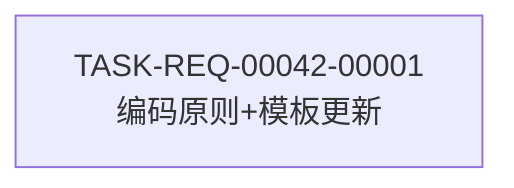

# 编码计划 — REQ-00042 · 代码产出中禁止包含追踪编号

> 上游:`./assistants/V0.0.4/plan/REQ-00042/RESULT.md`
> 遵循规范:`./assistants/rules/`(若存在)

## 文档头
- 需求编码:REQ-00042
- 所属版本:V0.0.4
- 状态:已完成
- 任务总数:1
- 创建:2026-06-29 00:00

## 任务总览

| 任务编号 | 类型 | 触发/来源 | 标题 | 涉及文件 | 开发状态 | 测试状态 | 前置任务 |
| --- | --- | --- | --- | --- | --- | --- | --- |
| TASK-REQ-00042-00001 | 修改 | 需求新增 | [修改] code-it:编码原则新增"禁止追踪编号"规则 + 模板约束 | references/common.md, templates/RESULT.md | 已完成 | 不适用 | 2026-06-29 | — | — |

## 任务依赖图



## 里程碑

| 里程碑 | 包含任务 | 完成定义 | 状态 |
| --- | --- | --- | --- |
| M1:规则落地 | TASK-REQ-00042-00001 | references/common.md 和 templates/RESULT.md 修改完成 | 待开始 |

## 任务详情

### TASK-REQ-00042-00001: [修改] code-it:编码原则新增"禁止追踪编号"规则 + 模板约束

- **任务编码**:TASK-REQ-00042-00001
- **需求编码**:REQ-00042
- **类型**:修改
- **触发/来源**:需求新增
- **涉及文件**:
  1. `plugins/code-skills/skills/code-it/references/common.md`(§5 追加 ~12 行)
  2. `plugins/code-skills/skills/code-it/templates/RESULT.md`(§3 追加 1 行)
- **开发状态**:待开始
- **测试状态**:不适用(文档类改动)
- **前置任务**:无

#### 具体改动步骤

**步骤 A — 修改 references/common.md §5**

1. 读取 `references/common.md`,定位到 `### 通用编码原则` 子节
2. 在 `- 代码内注释解释"为什么"` 行之后,插入 1 行:
   ```
   - 代码注释不引用内部追踪编号:用功能描述替代 REQ-/BUG-/TASK- 编号
   ```
3. 定位到 `### 审查改修任务特殊规则` 行
4. 在其上方插入完整子节:
   ```
   ### 追踪编号禁用规则
   `/code-it` 产出的代码中不得出现 REQ-NNNNN / BUG-NNNNN / TASK-* 格式的编号。
   代码注释应使用功能梗概替代编号:
   - ✅ `// 用户登录:验证用户名密码,返回 JWT token`
   - ❌ `// REQ-00042: 实现用户登录`
   - ✅ `// 修复:空用户名导致 NullPointerException`
   - ❌ `// BUG-00001: 修复空指针`
   此约束不覆盖 commit message 和 `./assistants/` 工作产物。
   ```

**步骤 B — 修改 templates/RESULT.md §3**

1. 读取 `templates/RESULT.md`,定位到 `### 详细改动` 代码块
2. 在 `- **依据规范**:... §X` 行之后,代码块闭合前,插入 1 行:
   ```
   > **约束**:上述"关键逻辑"描述中不得包含需求/缺陷/任务编号;使用功能描述替代。
   ```

**步骤 C — 验证**

1. 确认 `references/common.md` 中新增内容格式正确,4 个示例无错别字
2. 确认 `templates/RESULT.md` 中新增约束提示位置正确

## 变更记录

| 时间 | 版本 | 变更类型 | 变更摘要 | 变更人 |
| --- | --- | --- | --- | --- |
| 2026-06-29 00:00 | v1 | 初始创建 | 编码计划完成,共 1 个任务 | wangmiao |