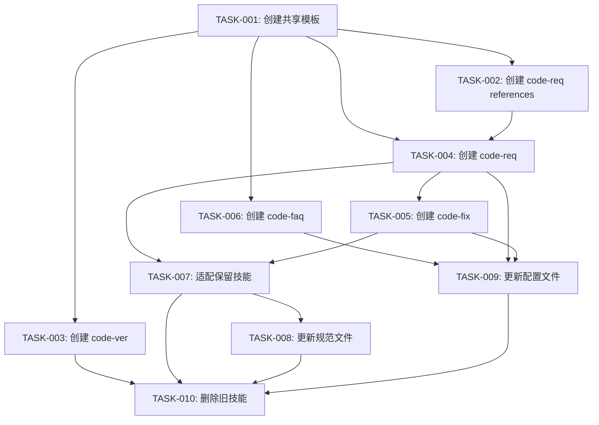

# 编码计划 — REQ-00044 · 技能系统 v2 大改版

> 上游:`./assistants/V0.0.4/plan/REQ-00044/RESULT.md`
> 遵循规范:`./assistants/rules/`(若存在)

## 文档头
- 需求编码:REQ-00044
- 所属版本:V0.0.4
- 状态:已完成
- 任务总数:10
- 创建:2026-06-30 00:00

## 任务总览

| 任务编号 | 类型 | 触发/来源 | 标题 | 涉及文件 | 开发状态 | 测试状态 | 前置任务 |
| --- | --- | --- | --- | --- | --- | --- | --- |
| TASK-REQ-00044-00001 | 新增 | 需求新增 | [基础] 创建共享模板文件(8 个模板) | code-req/templates/*.md, code-fix/templates/BUG.md | 待开始 | 不适用 | — |
| TASK-REQ-00044-00002 | 新增 | 需求新增 | [基础] 创建 code-req references(6 个阶段文档) | code-req/references/*.md | 待开始 | 不适用 | TASK-00001 |
| TASK-REQ-00044-00003 | 新增 | 需求新增 | [技能] 创建 code-ver 技能 | code-ver/SKILL.md + references/common.md | 待开始 | 不适用 | TASK-00001 |
| TASK-REQ-00044-00004 | 新增 | 需求新增 | [技能] 创建 code-req 技能 | code-req/SKILL.md | 待开始 | 不适用 | TASK-00001, TASK-00002 |
| TASK-REQ-00044-00005 | 新增 | 需求新增 | [技能] 创建 code-fix 技能 | code-fix/SKILL.md + references/fix-register.md | 待开始 | 不适用 | TASK-00004 |
| TASK-REQ-00044-00006 | 新增 | 需求新增 | [技能] 创建 code-faq 技能 | code-faq/SKILL.md + references/common.md + templates/*.md | 待开始 | 不适用 | TASK-00001 |
| TASK-REQ-00044-00007 | 修改 | 需求新增 | [适配] 适配 code-rule/code-merge/code-dashboard 到新结构 | 3 个技能 SKILL.md + references/ | 待开始 | 不适用 | TASK-00004, TASK-00005 |
| TASK-REQ-00044-00008 | 修改 | 需求新增 | [规范] 更新 rules/ 下 4 个规范文件 | encoding-conventions, skill-conventions, directory-conventions, dashboard-conventions | 待开始 | 不适用 | TASK-00007 |
| TASK-REQ-00044-00009 | 修改 | 需求新增 | [配置] 更新 plugin.json + marketplace.json | .claude-plugin/plugin.json, .claude-plugin/marketplace.json | 待开始 | 不适用 | TASK-00004, TASK-00005, TASK-00006 |
| TASK-REQ-00044-00010 | 删除 | 需求新增 | [清理] 删除 10 个旧技能目录 | code-require/design/plan/it/check/auto/version/publish/init/answer | 待开始 | 不适用 | TASK-00003~00009 |

## 任务依赖图

## 里程碑

| 里程碑 | 包含任务 | 完成定义 | 状态 |
| --- | --- | --- | --- |
| M1:基础就绪 | TASK-001, TASK-002 | 8 个模板 + 6 个 references 创建完成 | 待开始 |
| M2:新技能上线 | TASK-003~006 | 4 个新技能 SKILL.md 创建完成 | 待开始 |
| M3:全量适配 | TASK-007~009 | 旧技能适配 + 规范更新 + 配置更新 | 待开始 |
| M4:旧技能清理 | TASK-010 | 10 个旧技能目录删除 | 待开始 |

## 任务详情

### TASK-REQ-00044-00001: [基础] 创建共享模板文件

**涉及文件**(新建 8 个):
1. `plugins/code-skills/skills/code-req/templates/REQUIRE.md` — 需求分析模板
2. `plugins/code-skills/skills/code-req/templates/DESIGN.md` — 软件设计模板
3. `plugins/code-skills/skills/code-req/templates/PLAN.md` — 任务排期模板
4. `plugins/code-skills/skills/code-req/templates/TASK.md` — 任务完成模板
5. `plugins/code-skills/skills/code-req/templates/CHECK.md` — 代码审查模板
6. `plugins/code-skills/skills/code-req/templates/PROCESS.md` — 执行进程模板
7. `plugins/code-skills/skills/code-req/templates/LOG.md` — 过程记录模板
8. `plugins/code-skills/skills/code-fix/templates/BUG.md` — 缺陷分析模板

### TASK-REQ-00044-00002: [基础] 创建 code-req references

**涉及文件**(新建 6 个):
1. `plugins/code-skills/skills/code-req/references/common.md` — 公共流程(版本检测/PROCESS.md 恢复)
2. `plugins/code-skills/skills/code-req/references/require.md` — 需求分析阶段
3. `plugins/code-skills/skills/code-req/references/design.md` — 软件设计阶段
4. `plugins/code-skills/skills/code-req/references/plan.md` — 任务排期阶段
5. `plugins/code-skills/skills/code-req/references/coding.md` — 编码执行阶段
6. `plugins/code-skills/skills/code-req/references/check.md` — 代码审查阶段

### TASK-REQ-00044-00003: [技能] 创建 code-ver 技能

**涉及文件**(新建 2 个):
1. `plugins/code-skills/skills/code-ver/SKILL.md` — 版本管理技能(含初始化/切换/发布三场景)
2. `plugins/code-skills/skills/code-ver/references/common.md` — 场景检测 + 初始化 + 发布流程

### TASK-REQ-00044-00004: [技能] 创建 code-req 技能

**涉及文件**(新建 1 个):
1. `plugins/code-skills/skills/code-req/SKILL.md` — 需求开发全流程(含 --auto 参数解析/阶段执行器/断点续跑)

### TASK-REQ-00044-00005: [技能] 创建 code-fix 技能

**涉及文件**(新建 2 个):
1. `plugins/code-skills/skills/code-fix/SKILL.md` — 缺陷修复全流程
2. `plugins/code-skills/skills/code-fix/references/fix-register.md` — 缺陷登记阶段

### TASK-REQ-00044-00006: [技能] 创建 code-faq 技能

**涉及文件**(新建 5 个):
1. `plugins/code-skills/skills/code-faq/SKILL.md` — 知识查询+导出
2. `plugins/code-skills/skills/code-faq/references/common.md` — 查询+导出逻辑
3. `plugins/code-skills/skills/code-faq/templates/REQUIRE-EXPORT.md`
4. `plugins/code-skills/skills/code-faq/templates/DESIGN-EXPORT.md`
5. `plugins/code-skills/skills/code-faq/templates/SUMMARY-EXPORT.md`

### TASK-REQ-00044-00007: [适配] 适配保留技能

**涉及文件**(修改 3-6 个):
1. `plugins/code-skills/skills/code-rule/SKILL.md` — 更新文件路径引用
2. `plugins/code-skills/skills/code-merge/SKILL.md` — 更新文件路径引用
3. `plugins/code-skills/skills/code-dashboard/SKILL.md` — 更新看板解析逻辑

### TASK-REQ-00044-00008: [规范] 更新 rules/

**涉及文件**(修改 4 个):
1. `assistants/rules/encoding-conventions.md` — 更新目录结构示例
2. `assistants/rules/skill-conventions.md` — 更新技能名列表
3. `assistants/rules/directory-conventions.md` — 更新为 req/+fix/ 结构
4. `assistants/rules/dashboard-conventions.md` — 更新看板解析锚点

### TASK-REQ-00044-00009: [配置] 更新 plugin.json + marketplace.json

**涉及文件**(修改 2 个):
1. `.claude-plugin/plugin.json` — 更新 skills 列表(7 个新技能)
2. `.claude-plugin/marketplace.json` — 更新 plugins[].skills 列表

### TASK-REQ-00044-00010: [清理] 删除旧技能

**删除目录**(10 个):
1. `plugins/code-skills/skills/code-require/`
2. `plugins/code-skills/skills/code-design/`
3. `plugins/code-skills/skills/code-plan/`
4. `plugins/code-skills/skills/code-it/`
5. `plugins/code-skills/skills/code-check/`
6. `plugins/code-skills/skills/code-auto/`
7. `plugins/code-skills/skills/code-version/`
8. `plugins/code-skills/skills/code-publish/`
9. `plugins/code-skills/skills/code-init/`
10. `plugins/code-skills/skills/code-answer/`

## 变更记录

| 时间 | 版本 | 变更类型 | 变更摘要 | 变更人 |
| --- | --- | --- | --- | --- |
| 2026-06-30 00:00 | v1 | 初始创建 | 编码计划完成,10 任务 / 4 里程碑 | wangmiao |