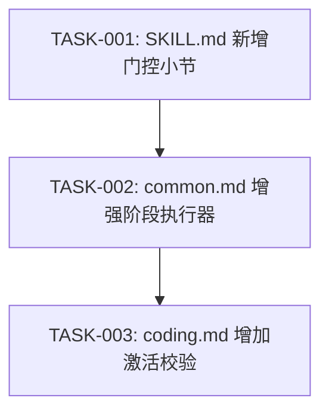

# 任务排期 — BUG-00001 · code-req 未按阶段顺序执行

> 所属版本:V0.0.5
> 创建时间:2026-06-30 20:27
> 任务总数:3

## 任务总览

| 任务编号 | 类型 | 标题 | 涉及文件 | 开发状态 | 测试状态 | 前置任务 |
| --- | --- | --- | --- | --- | --- | --- |
| TASK-BUG-00001-00001 | 修改 | [入口] SKILL.md 新增"强制阶段门控"小节 | code-req/SKILL.md | 待开始 | 不适用 | — |
| TASK-BUG-00001-00002 | 修改 | [公共] common.md 增强阶段执行器(前置产出物校验) | code-req/references/common.md | 待开始 | 不适用 | — |
| TASK-BUG-00001-00003 | 修改 | [编码] coding.md 增加 CODING 阶段激活校验 | code-req/references/coding.md | 待开始 | 不适用 | — |

## 任务依赖

## 里程碑

| 里程碑 | 包含任务 | 完成定义 | 预计时间 |
| --- | --- | --- | --- |
| M1: 全量修复 | TASK-001~003 | 3 个文件修改完成,门控机制生效 | 2026-06-30 |

## 任务详情

### TASK-BUG-00001-00001: [入口] SKILL.md 新增"强制阶段门控"小节

- **类型**:修改
- **涉及文件**:`plugins/code-skills/skills/code-req/SKILL.md`
- **详细步骤**:
  1. 在"## 工作流程"标题后、"### 步骤 0"之前插入"### 强制阶段门控(最高优先级)"小节
  2. 内容:代码修改权限声明(PROCESS.md 显示 CODING 才允许修改 CWD 源码)
  3. 内容:产出物存在性校验(DESIGN→REQUIRE.md, PLAN→DESIGN.md, CODING→PLAN.md, CHECK→TASK-N.md)
  4. 内容:PROCESS.md 同步强制(每次阶段切换必须追加)
- **验证方式**:Read SKILL.md 确认新小节在"步骤 0"之前

### TASK-BUG-00001-00002: [公共] common.md 增强阶段执行器

- **类型**:修改
- **涉及文件**:`plugins/code-skills/skills/code-req/references/common.md`
- **详细步骤**:
  1. 在 §4 阶段执行器的"执行流程"伪代码中增加"前置产出物校验"步骤
  2. 新增"阶段前置校验"表格:列出每个阶段的校验项和失败处理
  3. 校验失败时自动退回到上一阶段
- **验证方式**:Read common.md 确认 §4 包含前置校验表格

### TASK-BUG-00001-00003: [编码] coding.md 增加 CODING 阶段激活校验

- **类型**:修改
- **涉及文件**:`plugins/code-skills/skills/code-req/references/coding.md`
- **详细步骤**:
  1. 在"## 工作流程"标题后、"### 步骤 1"之前插入"### 步骤 0 — CODING 阶段激活校验(强制)"小节
  2. 内容:读取 PROCESS.md 最后一行,解析阶段字段
  3. 阶段 = CODING → 通过;阶段 ≠ CODING → 拒绝并输出错误信息
  4. PROCESS.md 不存在 → 视为 INIT 阶段,拒绝修改代码
- **验证方式**:Read coding.md 确认新步骤 0 在步骤 1 之前

## 变更记录

| 时间 | 版本 | 变更类型 | 变更摘要 | 变更人 |
| --- | --- | --- | --- | --- |
| 2026-06-30 20:27 | v1 | 初始创建 | 任务排期完成,3 任务 / 1 里程碑 | wangmiao |