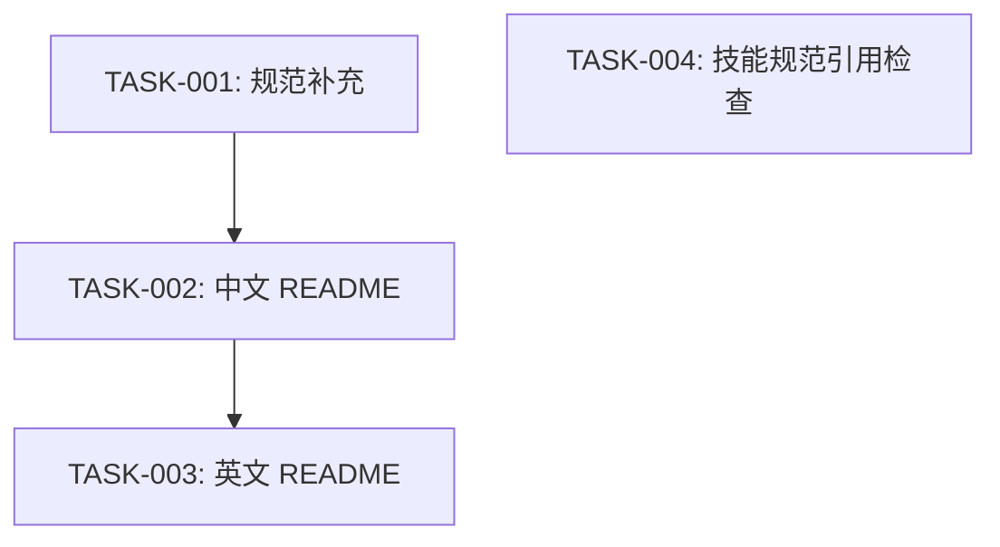

# 任务排期 — BUG-00002 · README 未更新

> 所属版本:V0.0.5
> 创建时间:2026-06-30 21:06
> 任务总数:4

## 任务总览

| 任务编号 | 类型 | 标题 | 涉及文件 | 开发状态 | 测试状态 | 前置任务 |
| --- | --- | --- | --- | --- | --- | --- |
| TASK-BUG-00002-00001 | 修改 | [规范] doc-conventions.md 新增规则 3 | assistants/rules/doc-conventions.md | 待开始 | 不适用 | — |
| TASK-BUG-00002-00002 | 修改 | [文档] 重写中文 README.md 为 7 技能体系 | plugins/code-skills/README.md | 待开始 | 不适用 | TASK-00001 |
| TASK-BUG-00002-00003 | 修改 | [文档] 同步重写英文 README.en.md | plugins/code-skills/README.en.md | 待开始 | 不适用 | TASK-00002 |
| TASK-BUG-00002-00004 | 修改 | [技能] 检查各技能规范读取,补充缺失 | SKILL.md + languages/*.md | 待开始 | 不适用 | — |

## 任务依赖

## 里程碑

| 里程碑 | 包含任务 | 完成定义 |
| --- | --- | --- |
| M1: 全量修复 | TASK-001~004 | 规范+README+技能全部更新 |

## 变更记录

| 时间 | 版本 | 变更类型 | 变更摘要 | 变更人 |
| --- | --- | --- | --- | --- |
| 2026-06-30 21:06 | v1 | 初始创建 | 任务排期完成,4 任务 / 1 里程碑 | wangmiao |