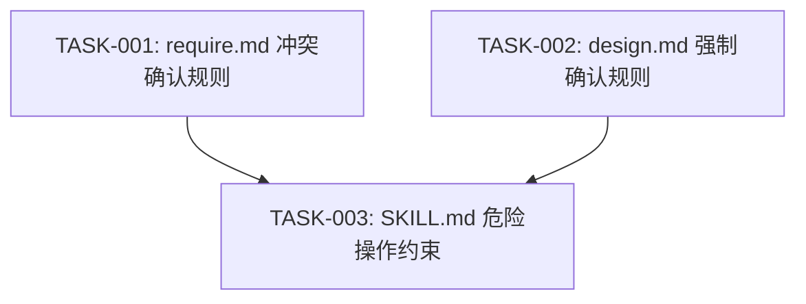

# 任务排期 — BUG-00007 · REQ-00049 执行中遗漏用户确认环节

> 所属版本:V0.0.5
> 创建时间:2026-06-30
> 任务总数:3

## 任务总览

| 任务编号 | 类型 | 标题 | 涉及文件 | 开发状态 | 测试状态 | 前置任务 |
| --- | --- | --- | --- | --- | --- | --- |
| TASK-BUG-00007-00001 | 修改 | require.md:增加需求冲突强制确认规则 | `skills/code-req/references/require.md` | 待开始 | 不适用 | — |
| TASK-BUG-00007-00002 | 修改 | design.md:步骤 9 强制化 + 危险操作确认规则 | `skills/code-req/references/design.md` | 待开始 | 不适用 | — |
| TASK-BUG-00007-00003 | 修改 | code-req/code-fix SKILL.md:增加危险操作确认约束 | `skills/code-req/SKILL.md`, `skills/code-fix/SKILL.md` | 待开始 | 不适用 | TASK-001, TASK-002 |

## 任务依赖

## 里程碑

| 里程碑 | 包含任务 | 完成定义 | 预计时间 |
| --- | --- | --- | --- |
| M1:reference 修复 | TASK-001, TASK-002 | require.md/design.md 确认规则补全 | 2026-06-30 |
| M2:SKILL.md 同步 | TASK-003 | code-req/code-fix SKILL.md 约束同步 | 2026-06-30 |

## 任务详情

### TASK-BUG-00007-00001: require.md 增加需求冲突强制确认规则

- **类型**:修改
- **涉及文件**:`plugins/code-skills/skills/code-req/references/require.md`
- **详细步骤**:
  1. 在步骤 5(用户澄清)中新增"5c. 需求冲突确认"小节
  2. 规则:当提取的 FR 之间存在潜在冲突(如两个 flag 语义重叠/互斥)，MUST 触发 AskUserQuestion 确认关系
  3. 明确"设计推断"来源不可用于冲突类 FR，冲突类 FR 必须标注"用户确认"或"假设(待确认)"
  4. 更新步骤 5a-1 技术选型过滤:增加"冲突检测"逻辑——两个 flag/参数间存在语义冲突时，不可过滤为"延迟到 DESIGN"
- **验证方式**:Read require.md 确认"5c. 需求冲突确认"小节存在

### TASK-BUG-00007-00002: design.md 步骤 9 强制化 + 危险操作确认规则

- **类型**:修改
- **涉及文件**:`plugins/code-skills/skills/code-req/references/design.md`
- **详细步骤**:
  1. 步骤 9 标题改为"步骤 9 — 用户确认(强制)"，增加"本步骤不可跳过"声明
  2. 新增"9d. 危险操作确认"小节:当设计方案涉及移除/废弃/大幅改修现有行为时，MUST 触发 AskUserQuestion
  3. 危险操作判定标准:移除现有功能、变更默认行为、标记过时、影响其他技能
  4. 在步骤 9a/9b/9c 前增加"小需求(1 任务)至少执行 9b 方案选型确认"
- **验证方式**:Read design.md 确认"9d. 危险操作确认"和"强制"标记存在

### TASK-BUG-00007-00003: code-req/code-fix SKILL.md 增加危险操作确认约束

- **类型**:修改
- **涉及文件**:`plugins/code-skills/skills/code-req/SKILL.md`, `plugins/code-skills/skills/code-fix/SKILL.md`
- **前置任务**:TASK-001, TASK-002
- **详细步骤**:
  1. 在 code-req SKILL.md "不要做的事"章节新增:不要在设计方案涉及移除/变更现有行为时跳过用户确认
  2. 在 code-fix SKILL.md "不要做的事"章节同步新增
  3. 在 code-req SKILL.md DESIGN 阶段描述中增加:涉及危险操作时 MUST 触发步骤 9d
  4. 在 code-fix SKILL.md DESIGN 阶段描述中同步增加
- **验证方式**:Grep 确认两个 SKILL.md 含"危险操作"相关约束

## 变更记录

| 时间 | 版本 | 变更类型 | 变更摘要 | 变更人 |
| --- | --- | --- | --- | --- |
| 2026-06-30 | v1 | 初始创建 | 任务排期完成 | wangmiao |