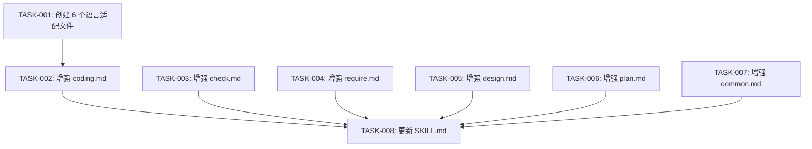

# 任务排期 — REQ-00045 · 补充 REQ-00044 重构后丢失的旧技能能力

> 所属版本:V0.0.5
> 创建时间:2026-06-30 19:43
> 任务总数:8

## 任务总览

| 任务编号 | 类型 | 标题 | 涉及文件 | 开发状态 | 测试状态 | 前置任务 |
| --- | --- | --- | --- | --- | --- | --- |
| TASK-REQ-00045-00001 | 新增 | [基础] 创建 6 个语言适配文件 | references/languages/{go, python, nodejs, rust, java-gradle, java-maven}.md | 待开始 | 不适用 | — |
| TASK-REQ-00045-00002 | 修改 | [编码] 增强 coding.md — 语言检测+过程文档+可测性+单测+逻辑行统计+错误分类+审查改修 | references/coding.md | 待开始 | 不适用 | TASK-00001 |
| TASK-REQ-00045-00003 | 修改 | [审查] 增强 check.md — 评审-编码循环+代码行数超标维度 | references/check.md | 待开始 | 不适用 | — |
| TASK-REQ-00045-00004 | 修改 | [需求] 增强 require.md — 用户确认环节(clarifications/边界确认) | references/require.md | 待开始 | 不适用 | — |
| TASK-REQ-00045-00005 | 修改 | [设计] 增强 design.md — 用户确认环节(扩展性/方案选型/改修方案) | references/design.md | 待开始 | 不适用 | — |
| TASK-REQ-00045-00006 | 修改 | [排期] 增强 plan.md — 用户确认环节(任务拆分/优先级) | references/plan.md | 待开始 | 不适用 | — |
| TASK-REQ-00045-00007 | 修改 | [公共] 增强 common.md — 标题解析 | references/common.md | 待开始 | 不适用 | — |
| TASK-REQ-00045-00008 | 修改 | [入口] 更新 SKILL.md — 引用新能力 | SKILL.md | 待开始 | 不适用 | TASK-00001~00007 |

## 任务依赖

## 里程碑

| 里程碑 | 包含任务 | 完成定义 | 预计时间 |
| --- | --- | --- | --- |
| M1: 语言适配就绪 | TASK-001 | 6 个语言文件创建完成 | 2026-06-30 |
| M2: 核心能力补全 | TASK-002, TASK-003 | coding.md + check.md 增强完成 | 2026-06-30 |
| M3: 交互确认补全 | TASK-004, TASK-005, TASK-006 | require/design/plan.md 增强完成 | 2026-06-30 |
| M4: 入口整合 | TASK-007, TASK-008 | common.md + SKILL.md 更新完成 | 2026-06-30 |

## 任务详情

### TASK-REQ-00045-00001: [基础] 创建 6 个语言适配文件

- **类型**:新增
- **涉及文件**(新建 6 个):
  1. `plugins/code-skills/skills/code-req/references/languages/go.md`
  2. `plugins/code-skills/skills/code-req/references/languages/python.md`
  3. `plugins/code-skills/skills/code-req/references/languages/nodejs.md`
  4. `plugins/code-skills/skills/code-req/references/languages/rust.md`
  5. `plugins/code-skills/skills/code-req/references/languages/java-gradle.md`
  6. `plugins/code-skills/skills/code-req/references/languages/java-maven.md`
- **详细步骤**:
  1. 创建 `references/languages/` 目录
  2. 从旧 `code-it/references/` 中恢复 6 个语言文件内容
  3. 更新文件头注释(从 `code-design` 改为 `code-req`)
  4. 统一 7 个章节结构(§1-§7)
- **验证方式**:Glob 检查 6 个文件存在;Read 验证每个文件包含 7 个章节

### TASK-REQ-00045-00002: [编码] 增强 coding.md

- **类型**:修改
- **涉及文件**:`plugins/code-skills/skills/code-req/references/coding.md`
- **详细步骤**:
  1. 追加"语言检测"步骤(步骤 4.0),自动检测项目语言并加载对应 languages/<lang>.md
  2. 追加"过程文档自适应判定"步骤(步骤 4.5a),5 类文档判定
  3. 追加"项目可测性守卫"步骤(步骤 4.7a),7 项检查
  4. 追加"按需写单测"步骤(步骤 4.7b),3 类自动判定
  5. 追加"逻辑行统计"步骤(步骤 4.11),tokei > cloc > heuristic
  6. 增强"错误修复循环"(步骤 7),区分 bug/设计缺陷/环境问题
  7. 追加"审查改修任务特殊规则"(步骤 4.4 附录)
  8. 补全"追踪编号禁用规则"
- **验证方式**:Read 验证新增章节;Grep 验证语言检测/可测性/单测/逻辑行统计关键词

### TASK-REQ-00045-00003: [审查] 增强 check.md

- **类型**:修改
- **涉及文件**:`plugins/code-skills/skills/code-req/references/check.md`
- **详细步骤**:
  1. 追加"代码行数超标"审查维度(P2)
  2. 追加"评审-编码循环"步骤(步骤 4-7),含循环上限/改修任务生成/CODING 调用/重新审查
  3. 追加"循环上限处理"(5 轮后停止,非 --auto 询问)
  4. 更新"发现格式"增加超标比例字段
- **验证方式**:Read 验证评审-编码循环流程;Grep 验证"代码行数超标"维度

### TASK-REQ-00045-00004: [需求] 增强 require.md

- **类型**:修改
- **涉及文件**:`plugins/code-skills/skills/code-req/references/require.md`
- **详细步骤**:
  1. 增强"步骤 5 — 与用户澄清",增加子步骤 5a(需求细节澄清)、5b(边界条件确认)
  2. 追加"clarifications.md 记录机制"(追加式,记录问答)
  3. 追加"步骤 6 待澄清标注"(REQUIRE.md 中标注"待澄清"和"假设")
  4. 追加"确认环节约束"(每轮 1-3 个问题,非 --auto 触发)
- **验证方式**:Read 验证确认环节;Grep 验证"clarifications.md"关键词

### TASK-REQ-00045-00005: [设计] 增强 design.md

- **类型**:修改
- **涉及文件**:`plugins/code-skills/skills/code-req/references/design.md`
- **详细步骤**:
  1. 在步骤 8 后追加"步骤 9 — 用户确认"
  2. 9a:扩展性确认(预留扩展点/未来变更/模块粒度)
  3. 9b:方案选型确认(多方案时给出选项)
  4. 9c:改修方案确认(模块修改范围/接口变更影响/数据兼容性)
  5. 追加"确认环节约束"(非 --auto 触发)
- **验证方式**:Read 验证确认环节;Grep 验证"扩展性确认"关键词

### TASK-REQ-00045-00006: [排期] 增强 plan.md

- **类型**:修改
- **涉及文件**:`plugins/code-skills/skills/code-req/references/plan.md`
- **详细步骤**:
  1. 在步骤 2 后追加"步骤 3 — 用户确认"
  2. 3a:任务拆分确认(粒度/依赖/里程碑)
  3. 3b:优先级确认(排序/关键路径)
  4. 重新编号后续步骤(原步骤 3→步骤 4,以此类推)
  5. 追加"确认环节约束"(非 --auto 触发)
- **验证方式**:Read 验证确认环节;Grep 验证"任务拆分确认"关键词

### TASK-REQ-00045-00007: [公共] 增强 common.md

- **类型**:修改
- **涉及文件**:`plugins/code-skills/skills/code-req/references/common.md`
- **详细步骤**:
  1. 追加"标题解析"章节(§9),含 truncateTitle/parseResultTitle 函数
  2. 追加"屏幕输出格式契约"(启动/完成/中止/错误场景)
  3. 追加"边界与异常"(标题截断/缺失降级)
- **验证方式**:Read 验证标题解析章节;Grep 验证"truncateTitle"关键词

### TASK-REQ-00045-00008: [入口] 更新 SKILL.md

- **类型**:修改
- **涉及文件**:`plugins/code-skills/skills/code-req/SKILL.md`
- **详细步骤**:
  1. 更新 CODING 阶段引用(增加语言检测/可测性/单测/逻辑行统计)
  2. 更新 CHECK 阶段引用(增加评审-编码循环)
  3. 更新 REQUIRE/DESIGN/PLAN 阶段引用(增加用户确认环节)
  4. 更新"工具使用约定"(增加 Glob languages/ 目录)
  5. 更新"不要做的事"(增加新约束)
- **验证方式**:Read 验证 SKILL.md 更新;确保不破坏现有章节锚点

## 变更记录

| 时间 | 版本 | 变更类型 | 变更摘要 | 变更人 |
| --- | --- | --- | --- | --- |
| 2026-06-30 19:43 | v1 | 初始创建 | 任务排期完成,8 任务 / 4 里程碑 | wangmiao |