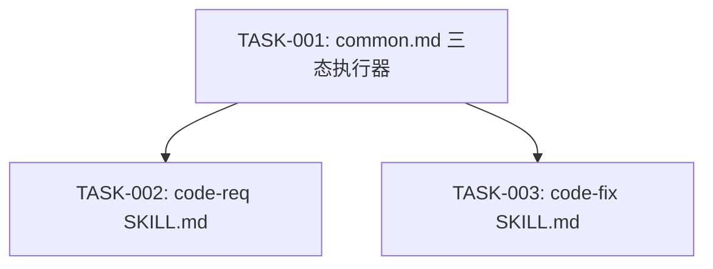

# 任务排期 — REQ-00049 · 为 code-req、code-fix 增加 --confirm 模式

> 所属版本:V0.0.5
> 创建时间:2026-06-30
> 任务总数:3

## 任务总览

| 任务编号 | 类型 | 标题 | 涉及文件 | 开发状态 | 测试状态 | 前置任务 |
| --- | --- | --- | --- | --- | --- | --- |
| TASK-REQ-00049-00001 | 修改 | common.md §4/§7 三态阶段执行器 | `skills/code-req/references/common.md` | 待开始 | 不适用 | — |
| TASK-REQ-00049-00002 | 修改 | code-req SKILL.md 增加 --confirm | `skills/code-req/SKILL.md` | 待开始 | 不适用 | TASK-001 |
| TASK-REQ-00049-00003 | 修改 | code-fix SKILL.md 增加 --confirm | `skills/code-fix/SKILL.md` | 待开始 | 不适用 | TASK-001 |

## 任务依赖

## 里程碑

| 里程碑 | 包含任务 | 完成定义 | 预计时间 |
| --- | --- | --- | --- |
| M1:全部完成 | TASK-001~003 | 3 文件修改完成,10 AC 通过 | 2026-06-30 |

## 任务详情

### TASK-REQ-00049-00001: common.md §4/§7 三态阶段执行器

- **类型**:修改
- **涉及文件**:`plugins/code-skills/skills/code-req/references/common.md`
- **详细步骤**:
  1. 重写 §4 阶段执行器伪代码:支持三态分支(--confirm/--auto/默认)
  2. --confirm 分支:提示产出物路径 → AskUserQuestion(继续/中止) → 重读产出物
  3. --auto 分支:保持不变(前缀输出)
  4. 默认分支:自动继续(无输出,替代原有 AskUserQuestion)
  5. 重写 §7 交互确认:三态确认模型,阶段边界 vs 阶段内确认分离
  6. 新增 §11 --confirm 模式:完整描述增强确认流程
- **验证方式**:Read common.md 确认三态分支 + --confirm 流程

### TASK-REQ-00049-00002: code-req SKILL.md 增加 --confirm

- **类型**:修改
- **涉及文件**:`plugins/code-skills/skills/code-req/SKILL.md`
- **前置任务**:TASK-001
- **详细步骤**:
  1. 输入章节:新增 `--confirm` 参数描述,更新 `--auto` 描述(标注互斥)
  2. 参数解析章节:新增 `### --confirm 模式` 小节,描述三态行为
  3. 阶段执行器章节:更新为三态分支描述
  4. 步骤 6 DONE 兜底提交:默认模式下自动提交
- **验证方式**:AC-1, AC-3, AC-7, AC-8

### TASK-REQ-00049-00003: code-fix SKILL.md 增加 --confirm

- **类型**:修改
- **涉及文件**:`plugins/code-skills/skills/code-fix/SKILL.md`
- **前置任务**:TASK-001
- **详细步骤**:
  1. 输入章节:新增 `--confirm` 参数描述,更新 `--auto` 描述(标注互斥)
  2. 参数解析章节:新增 `### --confirm 模式` 小节
  3. 阶段执行器章节:更新为三态分支描述
  4. 步骤 6 DONE 兜底提交:默认模式下自动提交
- **验证方式**:AC-2, AC-4, AC-7, AC-8

## 变更记录

| 时间 | 版本 | 变更类型 | 变更摘要 | 变更人 |
| --- | --- | --- | --- | --- |
| 2026-06-30 | v1 | 初始创建 | 任务排期完成 | wangmiao |