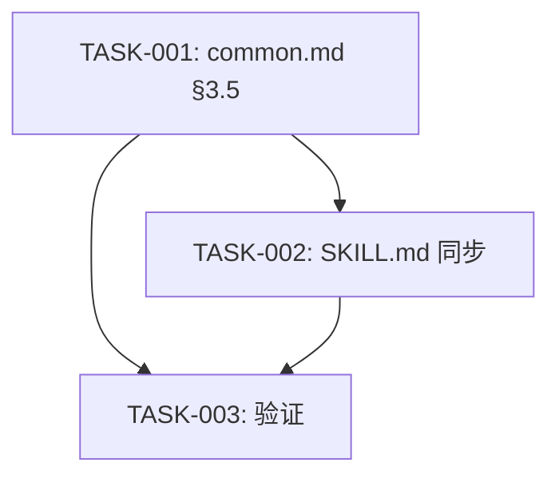

# 任务排期 — BUG-00009

## 任务列表

| 任务编号 | 标题 | 依赖 | 优先级 | 估计 |
| --- | --- | --- | --- | --- |
| TASK-BUG-00009-00001 | 修改 references/ver/common.md §3.5 加入 executeFallbackCommit | — | 高 | S |
| TASK-BUG-00009-00002 | 修改 plugins cache 中 SKILL.md ver 子命令步骤 6B | 00001 | 高 | S |
| TASK-BUG-00009-00003 | 验证修复:执行 git status 确认无遗漏 + 模拟非 git 仓库场景 | 00001, 00002 | 高 | S |

## 依赖图

## 里程碑

- **M1(基础设施)**:TASK-001 完成(2026-07-20)
- **M2(同步)**:TASK-002 完成(2026-07-20)
- **M3(验证)**:TASK-003 完成 + CHECK 通过(2026-07-20)

## 验收标准回顾

- AC-1: `/code ver` 后 git status 为空
- AC-2: 非 git 仓库不报错
- AC-3: 无变更不触发 commit
- AC-4: commit message 格式正确
- AC-5: 用户可选择跳过

## 编码原则

- 贴合项目既有风格:`git add -A` + commit message 模板与 req/fix 一致
- 边界显式处理:非 git 仓库 / 无变更两种降级路径
- 代码注释不引用追踪编号(BUG-00009 仅在文档中体现,不进代码)
