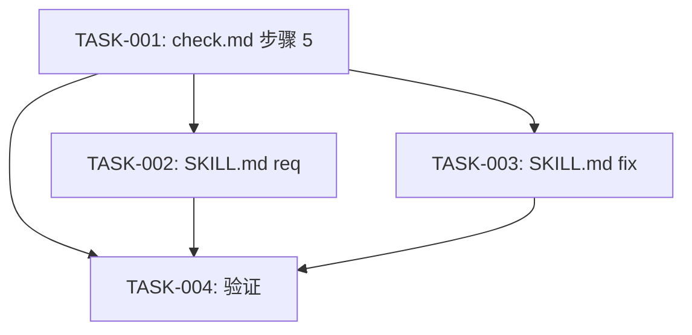

# 任务排期 — BUG-00010

## 任务列表

| 任务编号 | 标题 | 依赖 | 优先级 | 估计 |
| --- | --- | --- | --- | --- |
| TASK-BUG-00010-00001 | 修改 references/req/check.md 步骤 5 + 新增 executeOptionalFix | — | 高 | M |
| TASK-BUG-00010-00002 | 修改 plugins cache SKILL.md req 子命令步骤 5 | 00001 | 高 | S |
| TASK-BUG-00010-00003 | 修改 plugins cache SKILL.md fix 子命令步骤 5 | 00001 | 高 | S |
| TASK-BUG-00010-00004 | 验证修改一致性 | 00001-00003 | 中 | S |

## 依赖图

## 里程碑

- **M1(核心修复)**:TASK-001 完成(2026-07-20)
- **M2(同步)**:TASK-002/003 完成(2026-07-20)
- **M3(验证)**:TASK-004 完成 + CHECK 通过(2026-07-20)

## 验收标准回顾

- AC-1~8 见 DESIGN.md §6

## 编码原则

- 贴合既有评审-编码循环风格(已有步骤 4 的伪代码可参照)
- 函数命名 `executeOptionalFix` 与 `executeCodingTask` 风格一致
- source 字段严格区分,便于审计
- 默认模式逐项弹窗保持可见性;`--auto` 一键应用保持无人值守
