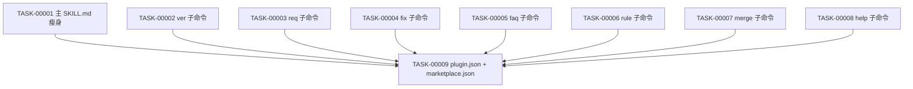

# 任务排期 — REQ-00051 · 主 SKILL.md 拆分与 help 子命令化

> 所属版本:V0.0.6
> 创建时间:2026-07-21 15:46
> 任务总数:9

## 任务总览

| 任务编号 | 类型 | 标题 | 涉及文件 | 开发状态 | 测试状态 | 前置任务 |
| --- | --- | --- | --- | --- | --- | --- |
| TASK-REQ-00051-00001 | 新增 | 抽取 §0 不变式 + 创建主 SKILL.md 路由版 | skills/code/SKILL.md | 待开始 | 不适用 | — |
| TASK-REQ-00051-00002 | 新增 | 抽取 ver 子命令 → references/ver/SKILL.md | skills/code/references/ver/SKILL.md(新增) | 待开始 | 不适用 | — |
| TASK-REQ-00051-00003 | 新增 | 抽取 req 子命令 → references/req/SKILL.md | skills/code/references/req/SKILL.md(新增) | 待开始 | 不适用 | — |
| TASK-REQ-00051-00004 | 新增 | 抽取 fix 子命令 → references/fix/SKILL.md | skills/code/references/fix/SKILL.md(新增) | 待开始 | 不适用 | — |
| TASK-REQ-00051-00005 | 新增 | 抽取 faq 子命令 → references/faq/SKILL.md | skills/code/references/faq/SKILL.md(新增) | 待开始 | 不适用 | — |
| TASK-REQ-00051-00006 | 新增 | 抽取 rule 子命令 → references/rule/SKILL.md | skills/code/references/rule/SKILL.md(新增) | 待开始 | 不适用 | — |
| TASK-REQ-00051-00007 | 新增 | 抽取 merge 子命令 → references/merge/SKILL.md | skills/code/references/merge/SKILL.md(新增) | 待开始 | 不适用 | — |
| TASK-REQ-00051-00008 | 新增 | 抽取 HELP §A/§B/§C/§D → references/help/SKILL.md | skills/code/references/help/SKILL.md(新增) | 待开始 | 不适用 | — |
| TASK-REQ-00051-00009 | 修改 | 更新 plugin.json + marketplace.json 的 skills 数组 | plugins/code-skills/.claude-plugin/plugin.json + .claude-plugin/marketplace.json | 待开始 | 不适用 | 00001-00008 |

## 任务依赖

- 所有子命令抽取任务 **相互独立**,可并行执行
- TASK-00009 必须等待所有抽取任务完成

## 里程碑

| 里程碑 | 包含任务 | 完成定义 | 预计时间 |
| --- | --- | --- | --- |
| M1: 拆分准备 | TASK-00001 | 主 SKILL.md 路由版就绪 | 2026-07-21 |
| M2: 子命令抽取 | TASK-00002 ~ TASK-00008 | 7 个子命令 SKILL.md 全部就位 | 2026-07-21 |
| M3: 路由配置 | TASK-00009 | plugin.json + marketplace.json 已更新 | 2026-07-21 |

## 任务详情

### TASK-00001: 主 SKILL.md 瘦身(路由版)
- **类型**:修改(替换原 93KB 主文件)
- **涉及文件**:`plugins/code-skills/skills/code/SKILL.md`
- **详细步骤**:
  1. 备份当前主 SKILL.md(用于子命令抽取时核对原文)
  2. 抽取 §0 不变式 5 条硬规则保留
  3. 抽取首 token 路由表(7 个子命令 + 各自描述)
  4. 写入主 SKILL.md,目标 ≤ 10KB
  5. 验证文件大小
- **验证方式**:`wc -c` ≤ 10240;grep 验证不再包含子命令专属章节(如"看板模式" / "强制阶段门控")

### TASK-00002: 抽取 ver 子命令
- **类型**:新增
- **涉及文件**:`plugins/code-skills/skills/code/references/ver/SKILL.md`
- **详细步骤**:
  1. 从备份的主 SKILL.md 复制"子命令:ver"段(从 `## 子命令:ver` 到下一 `## 子命令:` 之前)
  2. 适配 frontmatter:`name: code-ver` + description
  3. 删除"替代原 `/code-ver`"等历史表述
  4. 改写顶部标题为 `# /code ver` + 子命令简介
  5. 保留"详见 references/ver/common.md"等内引用
- **验证方式**:文件存在 + 可被 Claude Code 解析;description 不重叠

### TASK-00003: 抽取 req 子命令
- **类型**:新增
- **涉及文件**:`plugins/code-skills/skills/code/references/req/SKILL.md`
- **详细步骤**:
  1. 从备份的主 SKILL.md 复制"子命令:req"段
  2. 适配 frontmatter:`name: code-req`
  3. 移除"替代原 /code-req"历史表述
  4. 改写顶部标题
  5. 保留 `references/req/{common,require,design,plan,coding,check}.md` 与 `references/req/languages/*.md` 引用
- **验证方式**:文件存在;7 阶段流程完整(INIT/REQUIRE/DESIGN/PLAN/CODING/CHECK/DONE)

### TASK-00004: 抽取 fix 子命令
- **类型**:新增
- **涉及文件**:`plugins/code-skills/skills/code/references/fix/SKILL.md`
- **详细步骤**:
  1. 复制"子命令:fix"段
  2. 适配 frontmatter:`name: code-fix`
  3. 移除"替代原 /code-fix"历史表述
  4. 改写顶部标题
  5. 保留 `references/req/*` + `references/fix/fix-register.md` 引用
- **验证方式**:文件存在;6 阶段流程完整

### TASK-00005: 抽取 faq 子命令
- **类型**:新增
- **涉及文件**:`plugins/code-skills/skills/code/references/faq/SKILL.md`
- **详细步骤**:
  1. 复制"子命令:faq"段
  2. 适配 frontmatter:`name: code-faq`
  3. 移除"替代原 /code-faq"历史表述
  4. 改写顶部标题
  5. 保留 `references/faq/common.md` + `templates/faq/*` 引用
- **验证方式**:文件存在;查询/导出双模式完整

### TASK-00006: 抽取 rule 子命令
- **类型**:新增
- **涉及文件**:`plugins/code-skills/skills/code/references/rule/SKILL.md`
- **详细步骤**:
  1. 复制"子命令:rule"段
  2. 适配 frontmatter:`name: code-rule`
  3. 移除"替代原 /code-rule"历史表述
  4. 改写顶部标题
  5. 保留 `templates/rule/*` 引用
- **验证方式**:文件存在;仅追加原则清晰

### TASK-00007: 抽取 merge 子命令
- **类型**:新增
- **涉及文件**:`plugins/code-skills/skills/code/references/merge/SKILL.md`
- **详细步骤**:
  1. 复制"子命令:merge"段
  2. 适配 frontmatter:`name: code-merge`
  3. 移除"替代原 /code-merge"历史表述
  4. 改写顶部标题
- **验证方式**:文件存在;worktree 强约束完整

### TASK-00008: 抽取 HELP 章节
- **类型**:新增
- **涉及文件**:`plugins/code-skills/skills/code/references/help/SKILL.md`
- **详细步骤**:
  1. 复制主 SKILL.md 中 HELPs 章节(§A 完整 / §B 参数错误 / §C 子命令异常下沉 / §D 输出规范)
  2. 适配 frontmatter:`name: code-help` + description(触发场景:无法识别首 token 或无参数)
  3. 改写顶部标题为 `# /code help`
  4. 删除 §C 表中"ver / req / fix / faq / rule / merge"6 个字面,改为引用子命令 SKILL.md
- **验证方式**:文件存在;4 个 §段完整;触发场景描述清晰

### TASK-00009: 更新 plugin.json + marketplace.json
- **类型**:修改
- **涉及文件**:
  - `plugins/code-skills/.claude-plugin/plugin.json`
  - `.claude-plugin/marketplace.json`
- **详细步骤**:
  1. 读取当前两个 JSON 文件
  2. 在 `skills` 数组追加 7 个新入口:`./skills/code/references/{ver,req,fix,faq,rule,merge,help}`
  3. 保持原有 `./skills/code` 不变
  4. 用 Edit 替换 JSON 数组(不重写整个文件)
- **验证方式**:`cat` 验证 JSON 合法 + `python -c "import json; ..."` 解析通过;`skills` 数组长度为 8

## 变更记录

| 时间 | 版本 | 变更类型 | 变更摘要 | 变更人 |
| --- | --- | --- | --- | --- |
| 2026-07-21 15:46 | v1 | 初始创建 | 任务排期完成(9 任务 / 3 里程碑) | wm |
