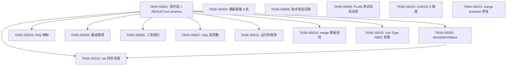

# 任务排期 — REQ-OPT-00001 · code-skills 技能能力优化建议报告 P0+P1 整改

> 所属版本:V0.0.6
> 创建时间:2026-07-22 11:05
> 任务总数:15
> 测试状态初始化规则:本 REQ 是文档/契约整改,无源代码/单测;按 FR-7 规则,**所有任务测试状态 = `不适用`**

## 设计目标

> 沿用 DESIGN 阶段的设计目标(NFR-6 强制约束:不预留新扩展点,所有改动局限在已有文件 + 1 个新增 `_shared/contracts.md`)

| 维度 | 优先级 | 说明 |
| --- | --- | --- |
| 功能性 | 高 | 14 FR 全部修复,每个 AC 必须可验证 |
| 扩展性 | 低 | 不预留扩展点(NFR-6);契约层为下游 P2/P3 留接口即可 |
| 健壮性 | 高 | 派生层 fallback / merge unresolved 返回非 0 / --sync-project-version 失败回滚 |
| 可维护性 | 高 | 契约单一来源;README/SKILL/模板对同一行为只说一种话 |
| 封装性 | 不适用 | 文档/契约类 |
| 可复用性 | 不适用 | 文档/契约类 |
| 可读性 | 高 | 模板与 reference 的字段、状态字面统一 |

## 任务总览

| 任务编号 | 类型 | 标题 | 涉及 FR | 涉及文件(关键) | 开发状态 | 测试状态 | 前置任务 |
| --- | --- | --- | --- | --- | --- | --- | --- |
| TASK-REQ-OPT-00001-00001 | 基础 | 建立契约层 `_shared/contracts.md` + RESULT.md dashboard-v2 schema | FR-1, FR-13 | 新增 `references/_shared/contracts.md`;修改 `templates/ver/RESULT.md`(加 schema 标记 + 修复为 dashboard-v2 纯索引) | 待开始 | 不适用 | — |
| TASK-REQ-OPT-00001-00002 | 修改 | 实现 `deriveItemStatus()` + 删除 RESULT 状态列读取伪代码 | FR-1 | 修改 `references/ver/common.md`(publish + 看板算法);引用契约层 | 待开始 | 不适用 | TASK-00001 |
| TASK-REQ-OPT-00001-00003 | 修改 | FAQ 章节映射改为锚点/标题键 | FR-2 | 修改 `references/faq/common.md`;为 `templates/req/REQUIRE.md` 加 `<!-- code-skills:field=* -->` 锚点 | 待开始 | 不适用 | TASK-00001 |
| TASK-REQ-OPT-00001-00004 | 修改 | 修正 6 处模板引用路径 | FR-3 | 修改 `references/req/require.md`、`design.md`、`plan.md`、`coding.md`、`check.md`、`references/fix/fix-register.md` | 待开始 | 不适用 | — |
| TASK-REQ-OPT-00001-00005 | 修改 | 统一基线路径到 `req/EXISTING-NNN/`(带 require/ 兼容读取) | FR-4 | 修改 `references/ver/common.md`(基线算法);新增 `require/` 兼容读取(V0.0.7 之内有效) | 待开始 | 不适用 | TASK-00001 |
| TASK-REQ-OPT-00001-00006 | 修改 | 三态确认契约同步到全部文档 | FR-5 | 修改根 `CLAUDE.md`、`README.md`、`README.en.md`、`skills/code/SKILL.md`、`references/req/SKILL.md`、`references/fix/SKILL.md`、`references/req/common.md`、`references/help/SKILL.md` | 待开始 | 不适用 | TASK-00001 |
| TASK-REQ-OPT-00001-00007 | 修改 | 统一帮助选项数量为"7 个路由选项" | FR-6 | 修改 `skills/code/SKILL.md`、`references/help/SKILL.md`、`README.md`、`README.en.md` | 待开始 | 不适用 | TASK-00001 |
| TASK-REQ-OPT-00001-00008 | 修改 | 需求分析技术选型词表统一为 decisionKeywords + conflictKeywords | FR-11 | 修改 `references/req/require.md`(移除重复词表 + 移除"20 个"人工计数) | 待开始 | 不适用 | — |
| TASK-REQ-OPT-00001-00009 | 修改 | PLAN 模板测试状态列补齐流转规则 | FR-7 | 修改 `templates/req/PLAN.md`(测试状态列+初值表+转移图);修改 `references/req/plan.md`(初值定义);修改 `references/req/coding.md`(转移点) | 待开始 | 不适用 | — |
| TASK-REQ-OPT-00001-00010 | 修改 | CHECK 模板补齐 9 个维度 | FR-8 | 修改 `templates/req/CHECK.md`(补齐 3 个缺失维度);修改 `references/req/check.md`(共享维度表) | 待开始 | 不适用 | — |
| TASK-REQ-OPT-00001-00011 | 修改 | 运行时状态枚举统一为 5 项机器值 | FR-10 | 修改 `templates/req/TASK.md` + `references/runtime-environment.md` | 待开始 | 不适用 | TASK-00001 |
| TASK-REQ-OPT-00001-00012 | 修改 | /code ver 加"差异预览/确认/回滚/提交"四步 + SKILL.md 声明同步 | FR-9 | 修改 `references/ver/SKILL.md`(声明从"只读"改为"默认同步 + 加四步");`references/ver/common.md`(为自动同步加四步前置) | 待开始 | 不适用 | TASK-00001, TASK-00002 |
| TASK-REQ-OPT-00001-00013 | 修改 | /code merge worktree 操作修复 + dirty 检查 + unresolved 退出码 | FR-12 | 修改 `references/merge/SKILL.md` + `references/merge/common.md` | 待开始 | 不适用 | — |
| TASK-REQ-OPT-00001-00014 | 修改 | /code merge 看板自检只校验 dashboard-v2 | FR-13(后半) | 修改 `references/merge/SKILL.md`(自检逻辑);迁移现存 RESULT.md 到 dashboard-v2 格式 | 待开始 | 不适用 | TASK-00001 |
| TASK-REQ-OPT-00001-00015 | 修改 | /code rule Type A/B/C 表格化写权限与完成条件 | FR-14 | 修改 `references/rule/SKILL.md`(新增 Type A/B/C 表格) | 待开始 | 不适用 | TASK-00001 |

## 任务依赖图

## 里程碑

| 里程碑 | 包含任务 | 完成定义 | 预计时间 |
| --- | --- | --- | --- |
| M1 契约基础 | TASK-00001 | `references/_shared/contracts.md` 落地 + `templates/ver/RESULT.md` 加 `schema: dashboard-v2` + 模板纯索引化 | 2026-07-23 |
| M2 派生层 | TASK-00002 | `deriveItemStatus()` 实现 + 所有"从 RESULT 状态列读取"的伪代码清除;publish / 看板 / FAQ 走契约层 | 2026-07-23 |
| M3 文档同步 | TASK-00003 ~ TASK-00008 | FAQ 映射 / 模板链接 / 基线路径 / 三态契约 / help 计数 / 词表统一全部落盘 | 2026-07-24 |
| M4 模板与流程 | TASK-00009 ~ TASK-00011 | PLAN / CHECK / TASK 模板与对应 reference 字段对齐 | 2026-07-24 |
| M5 子命令行为 | TASK-00012 ~ TASK-00015 | /code ver 四步 / /code merge worktree 修复 / /code merge 看板自检 / /code rule Type 表全部落盘;现存 RESULT.md 迁移到 dashboard-v2 | 2026-07-25 |

## 任务详情

### TASK-REQ-OPT-00001-00001: 契约层 + RESULT.md dashboard-v2 schema

- **类型**:基础
- **涉及文件**:
  - 新增 `skills/code/references/_shared/contracts.md`
  - 修改 `skills/code/templates/ver/RESULT.md`(加 schema 标记 + 修复为 dashboard-v2 纯索引)
- **详细步骤**:
  1. 创建 `references/_shared/` 目录
  2. 写 `contracts.md`,包含:
     - `deriveItemStatus()` 接口契约(JS 风格伪代码 + 入参出参)
     - `dashboard-v2` schema(强制结构 + 禁止列)
     - 状态字面表(阶段 / 开发状态 / 测试状态 / 运行时状态 4 套)
     - FAQ 字段映射(FR_LIST / NFR_LIST / AC_LIST / RELATED + 锚点语法)
     - 三态确认契约表格(默认 / --confirm / --auto)
     - `/code rule` Type A/B/C 表格
  3. 改 `templates/ver/RESULT.md`:
     - 头部加 `<!-- schema: dashboard-v2 -->`
     - 删除"统计"行(迁移指南改到 README)
     - 表头固定为"需求编码 / 标题 / 进度文档"(需求清单)、"缺陷编号 / 标题 / 进度文档"(缺陷清单)
- **验证方式**:
  - `ls references/_shared/` 返回 `contracts.md`
  - `grep "schema: dashboard-v2" templates/ver/RESULT.md` 命中
  - 契约层不包含任何项目源代码引用

### TASK-REQ-OPT-00001-00002: 实现 deriveItemStatus + 清除 RESULT 状态列读取

- **类型**:修改
- **涉及文件**:`skills/code/references/ver/common.md`
- **详细步骤**:
  1. 实现 `deriveItemStatus(reqOrBugId)` 函数(契约层接口契约的代码化):
     - 读 `<V>/req/<REQ>/PROCESS.md` → 阶段
     - 读 `<V>/req/<REQ>/PLAN.md` → 各任务开发状态 / 测试状态
     - 读 `<V>/fix/<BUG>/BUG.md` → 缺陷状态
     - 编号不存在 → 返回 `{stage:'UNKNOWN', completed:false}`
  2. 在 publish 检查算法中替换所有"从 RESULT.md 状态列读取"为 `deriveItemStatus()`
  3. 在看板高优先级缺陷统计 / 建议生成中同样替换
  4. 屏显 `grep -nE "RESULT\.md.*状态|状态.*RESULT\.md" references/ver/` 应无业务读取代码
- **验证方式**:
  - 在全新空目录跑 `deriveItemStatus('REQ-NOT-EXIST')` 返回 UNKNOWN,exit 0
  - 屏显 grep 结果为空

### TASK-REQ-OPT-00001-00003: FAQ 章节映射改为锚点/标题键

- **类型**:修改
- **涉及文件**:
  - `skills/code/references/faq/common.md`(修改导出映射表)
  - `skills/code/templates/req/REQUIRE.md`(加锚点)
- **详细步骤**:
  1. 在 `requirements/req/REQUIRE.md` 模板的 `## 3. 功能需求(FR)` 标题前加 `<!-- code-skills:field=FR_LIST -->` 锚点;NFR/AC/关联需求同理
  2. 修改 FAQ 解析逻辑:
     - 先匹配 `<!-- code-skills:field=FR_LIST -->` 锚点
     - 锚点不存在则匹配 `## 3. 功能需求(FR)` 标题
     - 都不存在 → 标记"未识别字段"
  3. `## 10`/`## 11`/`## 12` 等错位章节号从 common.md 中全部移除
- **验证方式**:
  - `grep -E "## [0-9]+ \. 功能需求" references/faq/common.md` 不应作为键存在
  - 锚点语法 `code-skills:field=FR_LIST` 在 REQUIRE.md 模板中出现 1 次

### TASK-REQ-OPT-00001-00004: 修正 6 处模板引用路径

- **类型**:修改
- **涉及文件**:
  - `skills/code/references/req/require.md`(改第 166 行的 `templates/REQUIRE.md` → `templates/req/REQUIRE.md`)
  - `skills/code/references/req/design.md`(改第 266 行)
  - `skills/code/references/req/plan.md`(改第 193 行)
  - `skills/code/references/req/coding.md`(改第 336 行)
  - `skills/code/references/req/check.md`(改第 180 行)
  - `skills/code/references/fix/fix-register.md`(改第 110 行)
- **详细步骤**:
  1. 逐文件用 Edit 把相对路径修正
  2. 用 `ls templates/req/` 与 `ls templates/fix/` 确认所有目标文件存在
  3. 用脚本验证:`for ref in references/req/*.md references/fix/*.md; do grep -oE 'templates/[a-z]+/[A-Z]+\.md' "$ref" | while read tpl; do test -f "skills/code/$tpl" || echo "MISSING: $ref -> $tpl"; done; done`
- **验证方式**:
  - 上述脚本无任何 `MISSING:` 输出

### TASK-REQ-OPT-00001-00005: 统一基线路径

- **类型**:修改
- **涉及文件**:`skills/code/references/ver/common.md`
- **详细步骤**:
  1. 在基线初始化算法中:基线需求写入 `req/EXISTING-NNN/`,不再写 `require/`
  2. 新增兼容读取逻辑:扫描时若发现 `require/EXISTING-NNN/` 且无对应 `req/EXISTING-NNN/`,提示用户"检测到旧命名空间,自动迁移到 req/"(迁移 = mv 而非 cp,因为 NFR-7 限 V0.0.7 之内有效)
  3. 在 SKILL.md 输出说明中更新为"基线需求落在 req/EXISTING-NNN/"
- **验证方式**:
  - 模拟初始化:确认 `req/EXISTING-NNN/RESULT.md` 被创建,`require/` 目录为空
  - 放一个 stub 到 `require/EXISTING-NNN/RESULT.md` 后重跑,确认自动迁移

### TASK-REQ-OPT-00001-00006: 三态确认契约同步到全部文档

- **类型**:修改
- **涉及文件**:
  - 根 `CLAUDE.md`
  - `plugins/code-skills/README.md`
  - `plugins/code-skills/README.en.md`
  - `plugins/code-skills/skills/code/SKILL.md`
  - `plugins/code-skills/skills/code/references/req/SKILL.md`
  - `plugins/code-skills/skills/code/references/fix/SKILL.md`
  - `plugins/code-skills/skills/code/references/req/common.md`
  - `plugins/code-skills/skills/code/references/help/SKILL.md`
- **详细步骤**:
  1. 按契约层"三态确认契约表格"统一所有文档的描述
  2. 关键边界:默认模式 ≠ 全部跳过询问;--auto 才是两个都跳过(用户 2026-07-22 10:42 确认)
  3. 删除根 `CLAUDE.md` "默认模式每阶段询问"等旧表述
- **验证方式**:
  - `grep -nE "默认.*每阶段询问|阶段边界.*自动继续" *.md **/*.md | sort -u` 内容统一指向契约层同一表格

### TASK-REQ-OPT-00001-00007: 统一帮助选项数量

- **类型**:修改
- **涉及文件**:
  - `plugins/code-skills/skills/code/SKILL.md`(改"6 选项"为"7 选项")
  - `plugins/code-skills/skills/code/references/help/SKILL.md`
  - `plugins/code-skills/README.md`
  - `plugins/code-skills/README.en.md`
- **详细步骤**:
  1. 把所有"6 个子命令"、"6 选项"改为"7 个路由选项(6 个业务命令 + help)"
  2. 命令矩阵与 help/SKILL.md 的 A-G 列表对齐
- **验证方式**:
  - `grep -nE "[67]\s*个?(路由选项|业务命令|子命令)" *.md **/*.md | sort -u` 数字与名称一致

### TASK-REQ-OPT-00001-00008: 需求分析技术选型词表统一

- **类型**:修改
- **涉及文件**:`skills/code/references/req/require.md`
- **详细步骤**:
  1. 在文件顶部定义 `decisionKeywords`(只用于延迟到 DESIGN)
  2. 定义 `conflictKeywords`(即使属于技术词也必须在 REQUIRE 确认)
  3. 删除 require.md:197-200 的第二份较短词表
  4. 删除"20 个"这类人工计数,改为引用定义长度或不再强调数字
- **验证方式**:
  - `grep -c "^decisionKeywords" references/req/require.md` = 1
  - `grep -c "^conflictKeywords" references/req/require.md` = 1
  - require.md 内 `决策关键词:` 出现次数 ≤ 1(原有多处分散定义应被合并)

### TASK-REQ-OPT-00001-00009: PLAN 模板测试状态流转规则

- **类型**:修改
- **涉及文件**:
  - `skills/code/templates/req/PLAN.md`
  - `skills/code/references/req/plan.md`
  - `skills/code/references/req/coding.md`
- **详细步骤**:
  1. 在 `templates/req/PLAN.md` 表后追加"测试状态流转规则"附录:
     - 初值表:文档型 = `不适用`;代码型 = `未编写`;其他 = `未编写`
     - "不适用"判定条件:任务范围不含可执行代码或测试
     - CODING 阶段状态转移:编译通过 → 测试未跑 = `已编写`;运行测试通过 → `已运行-通过`;失败 → `已运行-失败`;运行时缺失 → `阻塞`
     - CHECK 与 publish 消费:仅 `已运行-通过` 或 `不适用` 视为可发布
  2. 在 `plan.md` 任务表说明中引用契约层枚举
  3. 在 `coding.md` 阶段描述中明确"每次编译/运行/测试后必须更新测试状态"
- **验证方式**:
  - `grep -nE "不适用|未编写|已编写|已运行|阻塞" templates/req/PLAN.md` 命中流转规则章节
  - `grep -nE "测试状态" references/req/coding.md` 至少 3 处(初值/转移/消费)

### TASK-REQ-OPT-00001-00010: CHECK 模板补齐 9 个维度

- **类型**:修改
- **涉及文件**:
  - `skills/code/templates/req/CHECK.md`
  - `skills/code/references/req/check.md`
- **详细步骤**:
  1. 在 `templates/req/CHECK.md` 补齐 3 个缺失维度:需求一致性 / 测试覆盖 / 代码行数超标
  2. 每个维度表头含"结果 / 证据 / 发现数 / 必须改数"
  3. 结论生成条件:`必须改` 数量 = 0 → 通过;否则阻塞
  4. 在 `check.md` 顶部添加共享维度表(契约层引用)
- **验证方式**:
  - `grep -nE "需求一致性|测试覆盖|代码行数超标" templates/req/CHECK.md` 全部命中
  - 模板每个维度表头包含"结果"列

### TASK-REQ-OPT-00001-00011: 运行时状态枚举统一

- **类型**:修改
- **涉及文件**:
  - `skills/code/templates/req/TASK.md`
  - `skills/code/references/runtime-environment.md`
- **详细步骤**:
  1. 把 `templates/req/TASK.md` 的中文枚举改为机器值:`已配置` → `configured`、`用户提供路径` → `user-provided`、`自动安装` → `auto-installed`、`用户跳过` → `skipped`、`未配置` → `unavailable`
  2. 文档展示区提供"机器值 → 中文"映射表
  3. `runtime-environment.md` 移除"只能记录枚举,不记录路径"这条不一致的表述,改为"机器值唯一,展示值映射自机器值"
- **验证方式**:
  - `grep -nE "configured|user-provided|auto-installed|skipped|unavailable" templates/req/TASK.md` 全部命中
  - `grep -nE "configured|user-provided|auto-installed|skipped|unavailable" references/runtime-environment.md` 全部命中

### TASK-REQ-OPT-00001-00012: /code ver 加四步流程 + SKILL.md 声明同步

- **类型**:修改
- **涉及文件**:
  - `skills/code/references/ver/SKILL.md`(改"只读"声明)
  - `skills/code/references/ver/common.md`(为自动同步加四步前置)
- **详细步骤**:
  1. 改 `ver/SKILL.md:48-53` 的"只读"声明为:"`/code ver` 默认会扫描并同步 CWD 描述文件;同步走'差异预览 → 用户确认 → 失败回滚 → 提交记录'四步;若需跳过同步,使用 `--no-sync` 参数"
  2. 在 `ver/common.md` 的版本切换主流程中,在 `git add` / `git commit` 之前插入四步流程
  3. 新增 `--no-sync` 参数的 SKILL.md 文档
- **验证方式**:
  - `grep -nE "只读|绝不修改" references/ver/SKILL.md` 无命中
  - 流程伪代码包含"差异预览 → 用户确认 → 失败回滚 → 提交记录"四步

### TASK-REQ-OPT-00001-00013: /code merge worktree 操作修复

- **类型**:修改
- **涉及文件**:
  - `skills/code/references/merge/SKILL.md`
  - `skills/code/references/merge/common.md`(如有)
- **详细步骤**:
  1. 在 merge 主流程前插入 dirty 检查:
     - 当前 worktree dirty → 拒绝
     - feature worktree dirty → 拒绝
     - target worktree dirty → 拒绝
  2. 替换"git checkout target → merge"为"git worktree list --porcelain 找主工作区 → git -C <main-worktree> merge <feature-branch> --no-ff"
  3. unresolved 冲突处理:返回非 0 + 屏显冲突文件列表,不报告成功
  4. 把 `CODE_MERGE_TARGET` 的分支名、远端 ref、本地 checkout 目标分开建模
- **验证方式**:
  - 流程伪代码包含 `git worktree list --porcelain` 与 `git -C <main-worktree> merge`
  - unresolved 路径:`exit code != 0` 且屏显含"unmerged files"
- **需验证**:由于无法在当前 sandbox 验证 worktree 操作,该任务完成后由用户在真实环境跑 opt.md §7.6 场景矩阵验证

### TASK-REQ-OPT-00001-00014: /code merge 看板自检只校验 dashboard-v2

- **类型**:修改
- **涉及文件**:
  - `skills/code/references/merge/SKILL.md`(改自检逻辑)
  - 现存 `assistants/V0.0.6/RESULT.md`(就地升级)
- **详细步骤**:
  1. 把 merge 自检改为只校验 `dashboard-v2` schema:头部含 `schema: dashboard-v2`、表头符合、统计行格式
  2. 迁移现存 RESULT.md:删除"统计"行(因为动态数据从 PROCESS 派生);需求/缺陷清单保持纯索引(无动态状态列)
  3. 不保留旧 schema 兼容模式(用户 2026-07-22 10:55 确认)
- **验证方式**:
  - `grep -nE "兼容模式|旧 schema" references/merge/SKILL.md` 无业务代码命中
  - 现存 RESULT.md 头部含 `schema: dashboard-v2` + 表头只有 3 列

### TASK-REQ-OPT-00001-00015: /code rule Type A/B/C 表格化

- **类型**:修改
- **涉及文件**:`skills/code/references/rule/SKILL.md`
- **详细步骤**:
  1. 在 `rule/SKILL.md` 新增 Type A/B/C 表格:
     - A:目标 `assistants/rules/<category>.md`,允许新建/末尾追加,完成条件"分类、级别、范围、例外已记录"
     - B:目标"明确指定的 CLAUDE.md",允许"仅追加 AI 工作约定区段",完成条件"指引编号唯一,未改仓库说明区"
     - C:目标"明确指定的 template",允许"末尾/字段内二选一并记录",完成条件"提示位置和触发字段可定位"
  2. 移除 `rule/SKILL.md:121-130` 的 5-6 句简短描述
- **验证方式**:
  - `grep -nE "目标文件|允许动作|完成条件" references/rule/SKILL.md` 命中表格
  - 表格行数 = 3(Type A + Type B + Type C)

## 风险与回退

| 风险 | 影响 | 回退方案 |
| --- | --- | --- |
| TASK-00013 /code merge worktree 操作在 sandbox 不可验证 | FR-12 的 AC-12 需在真实环境冒烟 | CODING 后由用户在 git worktree 环境跑 opt.md §7.6 场景矩阵;CHECK 阶段对 TASK-N.md 标注"待用户冒烟" |
| TASK-00014 移除旧 schema 兼容模式 | 现存 V0.0.6 RESULT.md 若不符合 dashboard-v2,迁移直接改写 | 迁移前先 `cp RESULT.md RESULT.md.bak`,改写失败时 `mv RESULT.md.bak RESULT.md` 回退 |
| TASK-00006 / TASK-00007 涉及多文档同步 | 易出现"漏改一处" | 完成前用 `grep -rE "默认.*每阶段询问|6\s*个?(路由选项|子命令)"` 全仓库扫描,确认无残留 |

## 关联计划

| 计划编码 | 版本 | 关联点 | 影响 |
| --- | --- | --- | --- |
| REQ-00051 PLAN | V0.0.6 | 主 SKILL.md 拆分 + help 子命令化 | TASK-00006 / TASK-00007 涉及 SKILL.md 时,可能与 REQ-00051 的拆分结果有交叉;若 REQ-00051 已基本完成,本 REQ 直接覆盖 |
| BUG-00009 | V0.0.6 | /code ver 切换版本后未在最后阶段提交代码 | TASK-00012 加四步流程时,引入新的 commit 时机;CHECK 阶段验证 BUG-00009 修复不退化 |

## 变更记录

| 时间 | 版本 | 变更类型 | 变更摘要 | 变更人 |
| --- | --- | --- | --- | --- |
| 2026-07-22 11:05 | v1 | 初始创建 | PLAN 阶段完成;15 任务 / 5 里程碑;TASK-00001 为唯一基础前置;测试状态全部初始化为'不适用'(本 REQ 无源代码/单测) | wangmiao |
