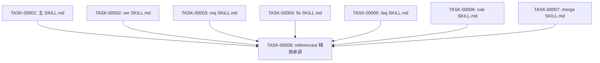

# 任务排期 — REQ-OPT-00002 · 技能"不要做"事项整治 + 全技能精简单调

> 所属版本:V0.0.6
> 创建时间:2026-07-22 13:50
> 任务总数:8
> 测试状态初始化规则:本 REQ 是文档类整改,无源代码/单测;按 FR-7 规则,**所有任务测试状态 = `不适用`**

## 设计目标

> 沿用 DESIGN 阶段的设计目标(NFR-1 行为兼容 / NFR-3 行数不增长 / NFR-4 可验证)

| 维度 | 优先级 |
| --- | --- |
| 功能性 | 高 — 95 条全部处置;每条去向明确 |
| 健壮性 | 高 — NFR-1 行为兼容(不改 frontmatter/§0/契约层) |
| 可维护性 | 高 — 精简单调后行数不增长 |
| 封装性 | 不适用 |
| 可复用性 | 不适用 |
| 可读性 | 高 — 模板与 reference 的字段、状态字面统一 |
| 扩展性 | 低 — 不预留新扩展点(同 REQ-OPT-00001 NFR-6) |

## 任务总览

| 任务编号 | 类型 | 标题 | 涉及文件 | 开发状态 | 测试状态 | 前置任务 |
| --- | --- | --- | --- | --- | --- | --- |
| TASK-REQ-OPT-00002-00001 | 修改 | 主 SKILL.md 整治 | `skills/code/SKILL.md` | 待开始 | 不适用 | — |
| TASK-REQ-OPT-00002-00002 | 修改 | ver SKILL.md 整治 | `skills/code/references/ver/SKILL.md` | 待开始 | 不适用 | — |
| TASK-REQ-OPT-00002-00003 | 修改 | req SKILL.md 整治 | `skills/code/references/req/SKILL.md` | 待开始 | 不适用 | — |
| TASK-REQ-OPT-00002-00004 | 修改 | fix SKILL.md 整治 | `skills/code/references/fix/SKILL.md` | 待开始 | 不适用 | — |
| TASK-REQ-OPT-00002-00005 | 修改 | faq SKILL.md 整治 | `skills/code/references/faq/SKILL.md` | 待开始 | 不适用 | — |
| TASK-REQ-OPT-00002-00006 | 修改 | rule SKILL.md 整治 | `skills/code/references/rule/SKILL.md` | 待开始 | 不适用 | — |
| TASK-REQ-OPT-00002-00007 | 修改 | merge SKILL.md 整治 | `skills/code/references/merge/SKILL.md` | 待开始 | 不适用 | — |
| TASK-REQ-OPT-00002-00008 | 修改 | 全 references/ 精简单调 | references/{ver,req,fix,faq,rule,merge,help,runtime-environment}/ 下的 .md | 待开始 | 不适用 | TASK-00001 ~ TASK-00007 |

## 任务依赖图

## 里程碑

| 里程碑 | 包含任务 | 完成定义 |
| --- | --- | --- |
| M1 8 个 SKILL.md 整治 | TASK-00001 ~ TASK-00007 | 每个 SKILL.md "不要做"项 ≤ 3 条 + 含"必须做事项清单"段 |
| M2 全 references/ 精简单调 | TASK-00008 | references/ 下各文件行数不增长 |

## 任务详情

### TASK-00001: 主 SKILL.md 整治

- **类型**:修改
- **涉及文件**:`plugins/code-skills/skills/code/SKILL.md`
- **详细步骤**:
  1. 整治 M-1 ~ M-6(6 条)
  2. 在 "## 不要做的事" 段之前插入"## 必须做事项清单"段
  3. 类 1 项(M-1/3/4/5)从"不要做"清单删除
  4. 类 2 项(M-2/6)改写为正向句式,加入"必须做"清单
  5. 精简单调:消除 §0 不变式与"关键执行纪律"小节重复内容(2 处都说了 I-2/I-3,留 §0 不变式,"关键执行纪律"段删除或精简)
- **验证方式**:`grep "^- 不要" SKILL.md | wc -l` ≤ 3;`grep "## 必须做事项清单" SKILL.md` 命中;`wc -l SKILL.md` ≤ 现状

### TASK-00002: ver SKILL.md 整治

- **类型**:修改
- **涉及文件**:`plugins/code-skills/skills/code/references/ver/SKILL.md`
- **详细步骤**:
  1. 整治 V-1 ~ V-13(13 条)
  2. 类 1 项(V-8/9/10/11/12/13)从"不要做"清单删除
  3. 类 2 项(V-1/2/3/4/5/6/7)改写为正向句式,加入"必须做"清单
  4. 无类 3 项(全部可处置)
- **验证方式**:`grep "^- 不要" SKILL.md | wc -l` ≤ 3;`grep "## 必须做事项清单" SKILL.md` 命中

### TASK-00003: req SKILL.md 整治

- **类型**:修改
- **涉及文件**:`plugins/code-skills/skills/code/references/req/SKILL.md`
- **详细步骤**:
  1. 整治 R-1 ~ R-23(23 条)
  2. 类 1 项(R-2/5/9/20/21)从"不要做"清单删除
  3. 类 2 项(R-1/3/4/6/7/8/10/11/12/13/14/15/16/17/18/19/22)改写为正向句式
  4. R-23 与 R-22 同义,合并入 R-22
- **验证方式**:`grep "^- 不要" SKILL.md | wc -l` ≤ 3;`grep "## 必须做事项清单" SKILL.md` 命中

### TASK-00004: fix SKILL.md 整治

- **类型**:修改
- **涉及文件**:`plugins/code-skills/skills/code/references/fix/SKILL.md`
- **详细步骤**:
  1. 整治 F-1 ~ F-18(18 条)
  2. 类 1 项(F-1 ~ F-7,与 R-1 ~ R-7 同义,fix 复用 req references)从"不要做"清单删除
  3. 类 2 项(F-8 ~ F-15)改写为正向句式
  4. 类 3 项(F-16 ~ F-18)合并精简到 ≤ 3 条
- **验证方式**:`grep "^- 不要" SKILL.md | wc -l` ≤ 3;`grep "## 必须做事项清单" SKILL.md` 命中

### TASK-00005: faq SKILL.md 整治

- **类型**:修改
- **涉及文件**:`plugins/code-skills/skills/code/references/faq/SKILL.md`
- **详细步骤**:
  1. 整治 Q-1 ~ Q-8(8 条)
  2. 类 1 项(无)
  3. 类 2 项(Q-1 ~ Q-8)全部改写为正向句式
  4. 无类 3 项
- **验证方式**:`grep "^- 不要" SKILL.md | wc -l` ≤ 3;`grep "## 必须做事项清单" SKILL.md` 命中

### TASK-00006: rule SKILL.md 整治

- **类型**:修改
- **涉及文件**:`plugins/code-skills/skills/code/references/rule/SKILL.md`
- **详细步骤**:
  1. 整治 U-1 ~ U-9(9 条)
  2. 类 1 项(U-3)从"不要做"清单删除(§0 I-5 已强制)
  3. 类 2 项(U-1/2/4/5/6/7/8/9)改写为正向句式
- **验证方式**:`grep "^- 不要" SKILL.md | wc -l` ≤ 3;`grep "## 必须做事项清单" SKILL.md` 命中

### TASK-00007: merge SKILL.md 整治

- **类型**:修改
- **涉及文件**:`plugins/code-skills/skills/code/references/merge/SKILL.md`
- **详细步骤**:
  1. 整治 G-1 ~ G-18(18 条)
  2. 类 1 项(已在流程中,详见 DESIGN.md §4.2 merge 段)从"不要做"清单删除
  3. 类 2 项(G-4/6/7/12/15)改写为正向句式
  4. 类 3 项合并精简到 ≤ 3 条
- **验证方式**:`grep "^- 不要" SKILL.md | wc -l` ≤ 3;`grep "## 必须做事项清单" SKILL.md` 命中

### TASK-00008: 全 references/ 精简单调

- **类型**:修改
- **涉及文件**:references/{ver,req,fix,faq,rule,merge,help,runtime-environment}/ 下的所有 .md
- **详细步骤**:
  1. 对每个文件执行 §5.2 精简判定流程
  2. 删除空段、1 行段、重复强调段
  3. 检查 NFR-3(行数不增长)
- **验证方式**:`wc -l` 前后对比不增长

## 风险与回退

| 风险 | 影响 | 回退方案 |
| --- | --- | --- |
| 类 2 改写可能引入歧义 | "必须做"句式可能不如"不要做"清晰 | 在 CHECK 阶段用 diff 评审;若改写后语义偏离,回退并重新分类为类 3 |
| 精简单调过度删除有效约束 | 行数不增长但丢内容 | NFR-4 可验证性要求每条事项去向明确;CHECK 阶段抽查 |
| 8 个 SKILL.md 互相引用的章节号可能失效 | 段号引用断链 | 精简单调不修改章节标题(只删除空段);章节号变更须在 CHECK 阶段全仓库 grep 验证 |

## 关联计划

| 计划编码 | 版本 | 关联点 | 影响 |
| --- | --- | --- | --- |
| REQ-OPT-00001 | V0.0.6 | 契约层 + 流程整改 | 本 REQ 不动契约层,但可引用其简化表述 |

## 变更记录

| 时间 | 版本 | 变更类型 | 变更摘要 | 变更人 |
| --- | --- | --- | --- | --- |
| 2026-07-22 13:50 | v1 | 初始创建 | PLAN 阶段完成;8 任务 / 2 里程碑;TASK-00008 依赖前 7 任务完成;所有任务测试状态 = `不适用` | wangmiao |
