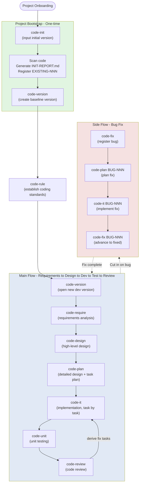

# code-skills

[中文说明 (Chinese)](./README.md) | **English**

A suite of Claude Code skills that guide AI through the complete software development lifecycle, with **built-in version-aware workspace management**.

## Skills Overview

| Skill | Purpose | Reads | Writes | Downstream |
| --- | --- | --- | --- | --- |
| [`code-init`](skills/code-init/SKILL.md) | Project Initialization — onboards a project, creates the baseline version, analyzes existing code and registers it as `EXISTING-NNN` requirements | Project source code (read-only) | `assistants/.current-version` + `assistants/<baseline>/{RESULT.md, INIT-REPORT.md, require/EXISTING-NNN/RESULT.md}` | code-rule / code-version |
| [`code-version`](skills/code-version/SKILL.md) | Version Management — switches/creates the version workspace | (none) | `assistants/.current-version` + `assistants/<version>/RESULT.md` | (prerequisite for all other code-*) |
| [`code-rule`](skills/code-rule/SKILL.md) | Coding-Standard Management — maintains the project-wide shared standards under `assistants/rules/` | User description (natural language) | `assistants/rules/<category>.md` | (shared input for all code-*) |
| [`code-require`](skills/code-require/SKILL.md) | Requirements Analysis | User materials + `assistants/rules/` | `assistants/<version>/require/<req-id>/RESULT.md` | code-design |
| [`code-design`](skills/code-design/SKILL.md) | High-level Design | `requirements.md` + `assistants/rules/` | `design.md` | code-plan |
| [`code-plan`](skills/code-plan/SKILL.md) | Detailed Design & Implementation Plan — accepts a "requirement ID" or a "bug ID" | `requirements.md` + `design.md` or `fix/<BUG>/RESULT.md` + `assistants/rules/` | `plan.md` + `task-plan.md` or `fix/<BUG>/fix-plan.md` | code-it |
| [`code-it`](skills/code-it/SKILL.md) | Implementation — accepts a "task ID" or a "bug ID" | `plan.md` or `fix-plan.md` + `assistants/rules/` | Source code + per-task `RESULT.md` or `fix/<BUG>/fix-*.md` | code-unit / code-review |
| [`code-unit`](skills/code-unit/SKILL.md) | Unit Testing | `plan.md` + `code/RESULT.md` + `assistants/rules/` | Test code + per-task `RESULT.md` | code-review |
| [`code-fix`](skills/code-fix/SKILL.md) | Bug Registration & Tracking — maintains `fix/RESULT.md` and each `BUG-NNN/RESULT.md` | User description or existing `fix/` files | `assistants/<version>/fix/{RESULT.md, <BUG-NNN>/RESULT.md}` | code-plan / code-it |
| [`code-review`](skills/code-review/SKILL.md) | Code Review | `code/RESULT.md` + `test/RESULT.md` + `assistants/rules/` | Overall `REVIEW-REPORT.md` + derived fix tasks | code-it (fix tasks) |

## Pipeline

```
code-version → code-require → code-design → code-plan → code-it → code-unit → code-review
Version Mgmt   Requirements   High-level   Detailed    Implement   Unit Tests   Code Review
                            Design        Plan
```

`code-version` is the **prerequisite gateway** for all other `code-*` skills: before calling any downstream skill, an active version workspace (`./assistants/<version>/`) must exist.

`code-rule` is **not** in the main pipeline — it is an independent "standard infrastructure" skill, responsible for maintaining the project-wide shared standards under `./assistants/rules/`. **All** other `code-*` skills (from `code-require` to `code-review`) read `rules/` as a read-only hard constraint at execution time. It is recommended to call `code-rule` to establish standards at the beginning of a project, then enter the main pipeline; you may also call `code-rule` at any point during the main pipeline to append new standards.

`code-init` is the project's **"one-time bootstrap"** and is **not** in the main pipeline:
- Run it once when onboarding a new project: scan existing code, generate `INIT-REPORT.md`, register all existing functionality as `require/EXISTING-NNN/`, create the baseline version
- Equivalent to "auto-run one `code-version` (create baseline) + one 'batch `code-require` (treat existing features as requirements)'"
- After running, the user should call `code-version` to open a new development version; all subsequent changes will land in the new version
- A project **should only be `code-init`'d once**

`code-fix` is the **side-flow entry point**, also **not** in the main pipeline, but has clear handover points with the main pipeline:
- Responsible for bug **registration and status tracking**, does not modify code directly
- Typical flow: user reports bug → `code-fix` (register) → `code-plan <BUG-NNN>` (plan the fix) → `code-it <BUG-NNN>` (implement the fix) → `code-fix <BUG-NNN>` (advance to "Fixed-Verified") → `code-fix <BUG-NNN>` (close)
- `code-plan` and `code-it` have been extended: pass a "requirement ID" to take the main flow; pass a "bug ID" to take the bug branch

## Repository Structure

This repository follows the Claude Code **marketplace** layout: the repo root hosts the marketplace manifest, and the plugin itself lives under `plugins/code-skills/`. This lets us publish the whole thing as a marketplace, while still allowing `claude plugin install` to point directly at the plugin subdirectory.

```
code-skills/                          ← marketplace repo root
├── .claude-plugin/
│   └── marketplace.json              # Marketplace manifest (plugins[] array)
└── plugins/
    └── code-skills/                  ← Plugin body (same name as the plugin)
        ├── .claude-plugin/
        │   └── plugin.json           # Plugin's own metadata
        ├── README.md                 # This file, workflow overview + skills table
        ├── README.en.md              # English version of this file
        ├── CLAUDE.md                 # Development guide for Claude Code
        └── skills/
            ├── code-init/            # Project initialization (one-time project bootstrap)
            │   ├── SKILL.md
            │   └── templates/
            │       ├── INIT-REPORT.md
            │       ├── existing-requirement.md
            │       └── assistants-layout.md
            ├── code-version/         # Version management (version-aware entry)
            │   ├── SKILL.md
            │   └── templates/
            │       ├── version-RESULT.md
            │       └── assistants-layout.md
            ├── code-rule/            # Coding-standard management (project-wide shared)
            │   ├── SKILL.md
            │   └── templates/
            │       ├── rule.md
            │       └── assistants-layout.md
            ├── code-require/         # Requirements analysis
            │   ├── SKILL.md
            │   └── templates/
            │       ├── requirements.md
            │       └── assistants-layout.md
            ├── code-design/          # High-level design
            │   ├── SKILL.md
            │   └── templates/
            │       ├── design.md
            │       └── assistants-layout.md
            ├── code-plan/            # Detailed design + task plan / bug fix plan
            │   ├── SKILL.md
            │   └── templates/
            │       ├── plan.md
            │       ├── task-plan.md
            │       ├── fix-plan.md
            │       └── assistants-layout.md
            ├── code-it/              # Implementation / bug-fix execution
            │   ├── SKILL.md
            │   ├── guidelines/coding-style.md
            │   └── templates/
            │       ├── RESULT.md
            │       └── assistants-layout.md
            ├── code-unit/            # Unit testing
            │   ├── SKILL.md
            │   └── templates/
            │       ├── RESULT.md
            │       ├── test-spec.md
            │       └── assistants-layout.md
            ├── code-fix/             # Bug registration & tracking
            │   ├── SKILL.md
            │   └── templates/
            │       ├── bug.md
            │       ├── fix-registry.md
            │       └── assistants-layout.md
            └── code-review/          # Code review
                ├── SKILL.md
                ├── checklists/review-checklist.md
                └── templates/
                    ├── REVIEW-REPORT.md
                    ├── REVIEW-FIX.md
                    └── assistants-layout.md
```

## Key Concepts

### 1. Version Workspace

All `code-*` skills (except `code-version` itself) operate under the layer `./assistants/<version>/`:

```
assistants/
├── rules/                  ← Project-wide standards (shared across versions)
├── .current-version        ← Active version marker
└── <version>/              ★ Version workspace
    ├── RESULT.md           ← Version development dashboard
    ├── require/<req-id>/
    ├── design/<req-id>/
    ├── plan/<req-id>/
    ├── code/<task-id>/
    ├── test/<task-id>/
    └── review/
        ├── <req-id>/
        └── <task-id>/
```

- **`rules/`** is shared across versions and does not belong to any version
- **`.current-version`** is the "context switch point" for other skills
- Every `code-*` skill's **first step** is to read `.current-version` to confirm the workspace

### 2. Dual Status

Each task has **two orthogonal status fields**:
- **Development Status**: `Not Started` / `In Progress` / `Completed` / `Cancelled` / `Blocked`
- **Test Status**: `Not Written` / `Written` / `Run-Passed` / `Run-Failed` / `Not Applicable` / `Blocked`

**A task is truly shippable = Development=Completed ∧ Test∈{Run-Passed, Not Applicable}**.

### 3. Trigger/Source (13 enum values)

Every task has a `Trigger/Source` field that determines the input source for `code-it`:
- Most cases → `./assistants/<version>/plan/<req-id>/RESULT.md` (detailed design)
- **`Review Fix`** → `./assistants/<version>/review/<task-id>/RESULT.md` (fix requirements)

## How to Use

> **Quick Start**: This section first provides a concise overview to get you up and running quickly; for each command's **parameter details, applicable scenarios, output descriptions, and caveats**, jump to [Command Reference](#command-reference) and [Common Scenarios](#common-scenarios) below.

0a. **First-time project onboarding**: Call `code-init` in CWD, enter the initial version number (default `V0.0.0`)
    - Generate the `INIT-REPORT.md` feature analysis report
    - Register existing functionality as `require/EXISTING-NNN/`
    - Create the baseline version workspace
0b. **Establish Standards (optional, recommended for new projects first)**: Call `code-rule`, describe the coding standards in natural language, this skill will follow up with questions then write to `assistants/rules/`
1. **First Use** / **Open a new development version**: In the project root, call `code-version`, enter the version number (e.g. `V0.1.0`), create the version workspace
2. **Create a Requirement**: Call `code-require`, provide a requirement ID, put in the requirement materials
3. **High-level Design**: Call `code-design`, produce the high-level design based on the requirement
4. **Detailed Plan**: Call `code-plan`, produce the detailed design and task plan
5. **Development**: Call `code-it` task by task, advance status after each task's code change
6. **Testing**: Call `code-unit`, complete/write unit tests
7. **Review**: Call `code-review`, produce the overall review report and derived fix tasks
8. **Bug Fix** (any stage):
    - Register: Call `code-fix "<bug description>"` or `code-fix BUG-NNN`
    - Plan: Call `code-plan BUG-NNN` to produce `fix-plan.md`
    - Implement: Call `code-it BUG-NNN` to modify the code
    - Status Advance: Call `code-fix BUG-NNN` again to advance the status (Fixed-Pending-Verify → Fixed-Verified → Closed)

You can call `code-rule` at any point during the main pipeline to add new standards; call `code-version` to switch to another version workspace.

See each skill's `SKILL.md` for the detailed workflow.

---

## Complete Workflow

### Global View



### Standard Main Flow (From Requirements to Release)

Connect the following in order, each step only cares about the previous step's output:

```
1. code-init (one-time)
     ↓ Generate baseline
2. code-version <new-dev-version>      ← Switch to new version
     ↓ Active = new version
3. code-rule "<natural-language standard description>"   ← (Optional, but strongly recommended) Establish standards
     ↓ rules/ has files
4. code-require <REQ-YYYY-NNNN>   ← Create requirement, put materials in
     ↓ require/<req>/RESULT.md
5. code-design <REQ-YYYY-NNNN>    ← High-level design
     ↓ design/<req>/RESULT.md
6. code-plan <REQ-YYYY-NNNN>      ← Detailed design + task breakdown
     ↓ plan/<req>/{RESULT.md, PLAN.md}
7. code-it <REQ-YYYY-NNNN-001>    ← Implement the 1st task
     ↓ code/<task>/RESULT.md (Dev=Completed)
8. code-unit <REQ-YYYY-NNNN-001>  ← Add/run unit tests for this task
     ↓ test/<task>/RESULT.md (Test=Run-Passed)
9. code-review <REQ-YYYY-NNNN>    ← Review the entire requirement
     ↓ review/<req>/REVIEW-REPORT.md
     ├─ No issues → Jump to 10
     └─ Issues → Derive "Review Fix" tasks, jump back to 7
10. Mark milestone M3=Shippable
```

### Standard Bug-Fix Flow (Triggered at Any Stage)

```
1. code-fix "<bug description>"          ← Register bug, auto-generate BUG-NNN
   or  code-fix BUG-NNN                  ← Re-enter existing bug
     ↓ fix/RESULT.md + fix/<BUG-NNN>/RESULT.md
2. code-fix BUG-NNN                      ← (Again) advance status "Reported"→"Investigating"
     ↓ User supplements root cause / reproduction steps
3. code-plan BUG-NNN                     ← Plan the fix
     ↓ fix/<BUG-NNN>/fix-plan.md, status →"Fix Planning"
4. code-it BUG-NNN                       ← Implement the fix
     ↓ fix/<BUG-NNN>/fix-*.md, status →"Fixed-Pending-Verify"
5. Run tests, confirm passing
6. code-fix BUG-NNN                      ← Advance "Fixed-Pending-Verify"→"Fixed-Verified"
7. code-fix BUG-NNN                      ← Advance "Fixed-Verified"→"Closed"
```

### Cross-Version Operations

- **View historical version**: Use `code-version <old-version>` to switch; that version's `RESULT.md` and all subdirectories are fully preserved
- **Open a new requirement on a new version**: No need to go back to the old version; just call `code-require <new REQ-YYYY-NNNN>`
- **Look back at how a bug was handled**: `code-version <version-that-bug-belongs-to>` → read `fix/RESULT.md` and `fix/<BUG-NNN>/RESULT.md`

---

## Command Reference

> The 10 `code-*` skills are organized by "responsibility layer".
> Invocation: in a Claude Code conversation, type `code-<name> [args]`, the AI Agent will execute following the SKILL.md workflow.
> Most skills **proactively use `AskUserQuestion` to follow up**; parameters can be omitted and the AI will collect them interactively.

### I. Project Bootstrap (Run Only at Startup)

#### `code-init` — Project Initialization

**Applicable Scenarios**:
- Onboarding a brand-new empty project (no code at all, just init directly)
- **Legacy project onboarding** (most common) — code already exists, want to bring it into the `code-*` system
- Project reset (already initialized but want to re-analyze; requires strong user confirmation)

**Not Applicable**:
- Already initialized, want to switch version → use `code-version`
- Already initialized, want to register a new requirement → use `code-require`
- Already initialized, want to add a new standard → use `code-rule`

**Parameters**:

| Parameter | Required | Description |
| --- | --- | --- |
| Initial version | Yes (interactive) | Default `V0.0.0`; recommend semver or date; no path separator |
| Project description | No | What the project does (collected interactively) |

**Examples**:
- `code-init` (interactive)
- `code-init V0.0.0` (direct)
- `code-init 2026-06` (date style)

**Output**:
- `./assistants/.current-version` = initial version
- `./assistants/<initial-version>/RESULT.md` (version dashboard)
- `./assistants/<initial-version>/INIT-REPORT.md` (feature analysis report)
- `./assistants/<initial-version>/require/EXISTING-NNN/RESULT.md` × N (existing features)

**Next-Step Suggestions**:
- Call `code-rule` to complete coding standards (if `rules/` is empty)
- Call `code-version <new-dev-version>` to switch to a new dev version
- **A project should only be `code-init`'d once**

---

### II. Infrastructure (Callable at Any Time)

#### `code-version` — Version Management

**Applicable Scenarios**:
- Start a new version (product release, independent feature package, quarterly iteration)
- Switch between multiple parallel versions
- Archive/look back at historical versions
- **Before any call to `code-require` / `code-design` / `code-plan` / `code-it` / `code-unit` / `code-fix` / `code-review`**

**Not Applicable**:
- Want to initialize a single project → use `code-init`
- Already have an active version, just want to continue working → call other `code-*` directly, no need to re-run

**Parameters**:

| Parameter | Required | Description |
| --- | --- | --- |
| Version | Yes (interactive) | Recommend `v1.0.0` / `V0.1.0` / `2026-Q2`; must not contain `/` `\` `:` `*` `?` `"` `<` `>` `\|`; cannot share name with an existing version (if it does, will ask) |

**Examples**:
- `code-version` (interactive, can choose "list existing versions")
- `code-version v1.0.0`
- `code-version 2026-Q2`

**Output**:
- Switch/Create: `./assistants/.current-version` is overwritten
- Create: additionally create the `./assistants/<version>/` directory + `RESULT.md` dashboard

**Next-Step Suggestions**:
- New version with no requirements → call `code-require <REQ-YYYY-NNNN>` to create the first requirement
- Have requirements → call `code-design` / `code-plan` to continue

---

#### `code-rule` — Coding-Standard Management

**Applicable Scenarios**:
- Start a new project, need to establish the first batch of coding standards
- Append new standards during a project (naming / error handling / security / performance / ...)
- Discover that existing standards have gaps, need to extend clauses under some category
- New standard items formed after team review, uniformly consolidated

**Not Applicable**:
- Want to modify the wording of a specific standard (please edit `rules/<category>.md` directly)
- Want to put a "temporary patch standard" on a single version (standards are shared across versions)

**Parameters**:

| Parameter | Required | Description |
| --- | --- | --- |
| Standard description | Yes (interactive) | One or two sentences, can use line breaks for multiple; e.g. "function names unified as camelCase" |

**Examples**:
- `code-rule "Python function names unified as snake_case"`
- `code-rule "All DB operations must go through ORM\nNo raw SQL"`
- `code-rule` (interactive, AI will proactively follow up with details)

**Output**:
- `./assistants/rules/<category>.md` (new or append "Rule N" section)
- Does not modify `require/` / `design/` / `plan/` / `code/` etc.

**Categories** (AI will use `AskUserQuestion` to let the user confirm):
- Functional Architecture / Module Planning / Naming / Error Handling / Interface Definition / Data Structure / Security / Performance / Testing / Observability / Commit Convention / Other (custom)

**Next-Step Suggestions**:
- Continue appending standards → call `code-rule` again
- Standards are sufficient → enter the main flow `code-require` / `code-plan` / `code-it` etc.
- During the main flow, you find you need to add a standard → call `code-rule` at any time (new rules apply to all unfinished tasks)

---

### III. Main Flow (Chained in Order)

#### `code-require` — Requirements Analysis

**Applicable Scenarios**:
- New feature, new module, new product's first-time requirement clarification
- Major change to existing functionality
- Cross-module / cross-system requirement alignment
- Have existing RESULT.md, want to add new materials for incremental update

**Not Applicable**:
- Known and clear, involves only a single file / single function modification
- Emergency online fix (use the `code-fix` side flow)
- No active version (please call `code-version` first)

**Parameters**:

| Parameter | Required | Description |
| --- | --- | --- |
| Requirement ID | Yes (interactive) | Recommend `REQ-YYYY-NNNN`; AI will check existence of `require/<req-id>/RESULT.md` |

**Examples**:
- `code-require REQ-2026-0001`
- `code-require` (interactive)

**Prerequisite Materials** (user pre-places in `./assistants/<version>/require/<req-id>/` directory):
- Requirement documents (.md / .docx / .pdf)
- Design mockups (.png / .jpg / .figma links)
- Demo videos (.mp4 / links)
- Meeting notes, chat records, emails
- Communication recordings (.mp3 / .wav / .m4a)
- Any other reference materials

**Output**:
- `./assistants/<version>/require/<req-id>/RESULT.md` — requirement prompt document
- Synced to version dashboard "Requirement List" / "Change Log"

**Next**:
- Call `code-design <req-id>`

---

#### `code-design` — High-level Design

**Applicable Scenarios**:
- Architecture design for new modules / new services
- Solution selection across modules
- Solution demonstration for major refactoring
- Re-evaluate design after requirement change
- Have existing RESULT.md, want to incrementally update (requirement-side / code-side / standard-side changes)

**Not Applicable**:
- No active version / no upstream requirement
- Known and clear, involves only a single file / single function modification
- Emergency online fix

**Parameters**:

| Parameter | Required | Description |
| --- | --- | --- |
| Requirement ID | Yes | Same ID used in `code-require`; AI will check `require/<req-id>/RESULT.md` and `design/<req-id>/RESULT.md` |

**Examples**:
- `code-design REQ-2026-0001`

**Input**:
- `./assistants/<version>/require/<req-id>/RESULT.md` (upstream)
- `./assistants/rules/` (project standards, read-only)
- Current project code

**Output**:
- `./assistants/<version>/design/<req-id>/RESULT.md` — high-level design
- Synced to version dashboard "High-level Design List" / "Change Log"

**Next**:
- Call `code-plan <req-id>`

---

#### `code-plan` — Detailed Design & Implementation Plan (Dual Path)

**Applicable Scenarios**:
- Cross multi-file / multi-module changes
- Need multi-person collaboration or phased delivery
- Any scenario where you want to reduce rework cost before starting coding
- Have existing RESULT.md/PLAN.md, want to update the plan and status based on progress

**Not Applicable**:
- No active version
- Requirement or high-level design not yet ready
- Known and clear, involves only a single file / single function modification
- Emergency online fix (use the `code-fix` side flow)

**Parameters**:

| Parameter | Required | Description |
| --- | --- | --- |
| Input ID | Yes | **AI auto-determines by format** |

**Input ID Determination Rules**:

| Format | Path | Upstream | Output |
| --- | --- | --- | --- |
| `REQ-YYYY-NNNN` | Main flow | `require/<id>/RESULT.md` + `design/<id>/RESULT.md` | `plan/<id>/{RESULT.md, PLAN.md}` |
| `BUG-NNN` | Bug branch | `fix/<id>/RESULT.md` | `fix/<id>/fix-plan.md` |

**Examples**:
- `code-plan REQ-2026-0001` (main-flow path)
- `code-plan BUG-001` (bug-branch path)
- `code-plan` (interactive)

**Output**:
- Main flow: `./assistants/<version>/plan/<req-id>/RESULT.md` + `PLAN.md`
- Bug branch: `./assistants/<version>/fix/<bug-id>/fix-plan.md`
- Synced to version dashboard:
  - Main flow: "Detailed Design & Task Plan Summary" / "Task List" / "Milestones" / "Change Log"
  - Bug branch: "Bug List" / "Change Log"
- Synced to `fix/RESULT.md` (bug branch)

**Next**:
- Main flow → call `code-it <REQ-YYYY-NNNN-001>` to implement task by task
- Bug branch → call `code-it BUG-NNN` to implement the fix

---

#### `code-it` — Implementation (Dual Path)

**Applicable Scenarios**:
- Any coding work executed per a single task in `PLAN.md`
- Refactor or feature development landing
- Bug-fix landing
- `code-review`-derived "Review Fix" task execution
- Bug-fix implementation under the `code-fix` side flow

**Not Applicable**:
- No active version
- Task not yet in `PLAN.md`
- Cross-multi-task batch changes (should be split into multiple calls to this skill)
- Emergency online fix (use the `code-fix` side flow)

**Parameters**:

| Parameter | Required | Description |
| --- | --- | --- |
| Input ID | Yes | **AI auto-determines by format** |

**Input ID Determination Rules**:

| Format | Path | Upstream Input | Output |
| --- | --- | --- | --- |
| `REQ-YYYY-NNNN-NNN` (task ID) | Task branch | `plan/<req-id>/RESULT.md` + `PLAN.md` | `code/<task-id>/{RESULT.md, work-log.md, ...}` |
| `BUG-NNN` (bug ID) | Bug branch | `fix/<BUG-NNN>/RESULT.md` + `fix-plan.md` | `fix/<BUG-NNN>/{fix-work-log.md, fix-compile-and-run.md, fix-test-results.md, ...}` |

**Trigger/Source** (within task branch, affects which upstream to read):
- Most cases (`Requirement Added` / `Requirement Changed` / `Proactive Optimization` / `Bug Fix` / ...) → read `plan/<req>/RESULT.md`
- `Review Fix` → read `review/<task-id>/RESULT.md` (**do not** read `plan/`)

**Examples**:
- `code-it REQ-2026-0001-001` (main flow: 1st task)
- `code-it BUG-001` (bug fix)
- `code-it REQ-2026-0001-005` (if this task is a "Review Fix" derived from `code-review`)

**Key Constraints**:
- **Must ensure the software can compile and start normally**, iterate to fix when errors appear until they are eliminated
- **5-consecutive-failure hard limit**: each failure is recorded in `work-log.md` / `fix-work-log.md`; exceeding the limit must stop and ask the user
- **Prohibited** from using `--no-verify` / `--force` / commenting out failing code etc. to bypass errors

**Output**:
- Actual code changes (diff/commit) under CWD
- Main flow: `./assistants/<version>/code/<task-id>/RESULT.md`, this task's development status advanced in PLAN.md
- Bug branch: `./assistants/<version>/fix/<BUG-NNN>/fix-*.md`, `fix/<BUG-NNN>/RESULT.md` status advanced
- Synced to version dashboard "Task List" / "Bug List" / "Executed Dev Command Log" / "Change Log"

**Next**:
- Main flow → call `code-unit <task-id>` to run unit tests
- Bug branch → run tests, after passing call `code-fix <BUG-NNN>` to advance status
- All tasks done → call `code-review <req-id>` to review

---

#### `code-unit` — Unit Testing

**Applicable Scenarios**:
- Complete unit tests for a task
- Verify tests pass
- Improve coverage

**Not Applicable**:
- No active version
- Task's development is not yet completed in `code-it`

**Parameters**:

| Parameter | Required | Description |
| --- | --- | --- |
| Task ID | Yes | Format `REQ-YYYY-NNNN-NNN` |

**Examples**:
- `code-unit REQ-2026-0001-001`

**Output**:
- Test code
- `./assistants/<version>/test/<task-id>/RESULT.md`
- Synced to version dashboard "Task List" (test status) / "Change Log"

**Next**:
- Tests pass → next task `code-it` / overall `code-review`
- Tests fail → back to `code-it` to fix code / register a new bug `code-fix`

---

#### `code-review` — Code Review

**Applicable Scenarios**:
- After a group of related tasks (same requirement) complete, do an overall review
- Derive "Review Fix" tasks for `code-it` to follow up
- Wrap up the code quality of a requirement

**Not Applicable**:
- No active version
- No code to review (no `code/` output in this version)

**Parameters**:

| Parameter | Required | Description |
| --- | --- | --- |
| Requirement ID | Yes | Format `REQ-YYYY-NNNN` |

**Examples**:
- `code-review REQ-2026-0001`

**Output**:
- `./assistants/<version>/review/<req-id>/REVIEW-REPORT.md`
- Derived "Review Fix" tasks: `./assistants/<version>/review/<task-id>/RESULT.md`
- Synced to version dashboard "Review Findings Summary" / "Derived Task Log" / "Bug List" / "Task List" / "Change Log"

**Next**:
- No issues → mark milestone M3 = Shippable
- Issues → call `code-it <derived-task-id>` (its `Trigger/Source = Review Fix`)

---

### IV. Side Flow (Bug Fix)

#### `code-fix` — Bug Registration & Tracking

**Applicable Scenarios**:
- User reported a bug, need to register and track
- During bug fix, need to refresh status (Reported → Fixing → Fixed)
- Bug fixed, need to confirm verification or close
- View the current list and status of all bugs

**Not Applicable**:
- Want to **implement** code fix (that's the job of `code-plan BUG-NNN` + `code-it BUG-NNN`)
- Want to **review** a fixed bug (that's the job of `code-review`)
- Want to **proactively** plan a requirement (that's the job of `code-plan`)

**Parameters**:

| Parameter | Required | Description |
| --- | --- | --- |
| Bug ID or bug description | Yes (either) | `BUG-NNN` (existing) or natural language (new) |

**Examples**:
- `code-fix "User report: login page password field not showing"`<br/>(new, auto-generate BUG-001)
- `code-fix BUG-001`<br/>(view/advance existing bug)
- `code-fix` (interactive)

**Optional Supplements** (collected interactively):
- Severity: `P0` / `P1` / `P2` / `P3` (default `P2`)
- Reporter / Module / Path / Reproduction steps

**Bug State Machine** (10 states):

```
Reported → Investigating → Fix Planning → Fix Implementing → Fixed-Pending-Verify → Fixed-Verified → Closed
                                                                                └→ Closed-Not-a-Bug
                                                                                └→ Closed-Won't-Fix
Any state → Blocked / Cancelled
```

**Output**:
- New: `./assistants/<version>/fix/<BUG-NNN>/RESULT.md` + `fix/RESULT.md`
- Update: use `Edit` to incrementally refresh status, fix log, change log
- Synced to version dashboard "Bug List" / "Change Log"

**Collaboration with `code-plan` / `code-it`**:
- `code-fix` only **tracks**, does not **implement**
- Implementation requires: `code-plan BUG-NNN` to produce `fix-plan.md` → `code-it BUG-NNN` to change code → `code-fix BUG-NNN` to advance status

**Next** (based on current state):
| Current State | Suggestion |
| --- | --- |
| Reported | Call `code-fix BUG-NNN` to enter "Investigating" |
| Investigating | Call `code-plan BUG-NNN` to plan the fix |
| Fix Planning | Call `code-it BUG-NNN` to implement the fix |
| Fix Implementing | Run tests, confirm pass |
| Fixed-Pending-Verify | Call `code-fix BUG-NNN` → "Fixed-Verified" |
| Fixed-Verified | Call `code-fix BUG-NNN` → "Closed" |
| Blocked | After unblocking, call `code-fix` to clear |

---

## Common Scenarios

### Scenario 1: Brand-New Project From Scratch

```
1. Call code-init V0.0.0
   → Generate empty V0.0.0 baseline version (no existing features registered)
2. Call code-rule "TypeScript function names use camelCase\nErrors must throw custom exceptions\nCommit messages use Conventional Commits format"
   → Write 3 standards to rules/
3. Call code-version v0.1.0
   → Switch to v0.1.0 development version
4. Call code-require REQ-2026-0001
   → Put requirement materials into require/REQ-2026-0001/
   → AI produces requirement RESULT.md
5. Call code-design REQ-2026-0001
6. Call code-plan REQ-2026-0001
   → Break into 5 tasks
7. Sequentially call code-it REQ-2026-0001-001 ... 005
   → After each task, call code-unit <task>
8. Call code-review REQ-2026-0001
   → Pass → Prepare to release
```

---

### Scenario 2: Legacy Project Onboarding

```
1. Call code-init
   → Scan existing code (assume discover 3 modules, 12 API endpoints)
   → Generate INIT-REPORT.md
   → Register as EXISTING-001 ~ EXISTING-012
   → V0.0.0 status: 12 completed requirements
2. Call code-rule "Add a few project-specific standards"
3. Call code-version v0.1.0
   → Switch to v0.1.0
4. Call code-require REQ-2026-0001 "Add new feature X"
   → ... go through main flow
5. (If find a bug) Call code-fix "User report: ..." → BUG-001
   → code-plan BUG-001 → code-it BUG-001
6. Call code-review REQ-2026-0001
```

---

### Scenario 3: Fix a Production Bug (Urgent)

```
1. Call code-fix "Production: users get occasional 500 error during payment"
   → Auto-generate BUG-001
2. Call code-fix BUG-001
   → AI asks to advance to which state
   → Choose "Investigating"
   → Supplement root cause (inferred from logs/monitoring)
3. Call code-plan BUG-001
   → Produce fix-plan.md (selected solution + risks + rollback)
4. Call code-it BUG-001
   → Implement code change
   → Compile/start/test all pass
   → Bug status → "Fixed-Pending-Verify"
5. Deploy to pre-prod, run regression
6. Call code-fix BUG-001
   → Advance "Fixed-Pending-Verify" → "Fixed-Verified"
   → Record verification info
7. Call code-fix BUG-001
   → Advance "Fixed-Verified" → "Closed"
```

---

### Scenario 4: Cross-Version Work

```
# Assume v0.1.0 was opened, working on v0.2.0, temporarily need to look back at a requirement in v0.1.0

1. Call code-version v0.1.0
   → Switch to v0.1.0 (read-only browsing, modifying not recommended)
2. Read v0.1.0/require/REQ-2026-0001/RESULT.md
3. Call code-version v0.2.0
   → Switch back to current
4. Call code-require REQ-2026-0050 "Based on v0.1.0's feature, extend ..."
   → Continue working on the new version
```

---

### Scenario 5: Find a Bug in Main Flow, Switch to Side Flow

```
# Currently working on REQ-2026-0001-003 (code-it)

1. code-it REQ-2026-0001-003
   → During implementation, find a bug not belonging to this task
   → Don't fix on your own (avoid scope creep)
   → Write to deviations.md
2. Call code-fix "During code-it REQ-2026-0001-003 found: ..."
   → Register BUG-005
3. Call code-version v0.2.0
   → Switch back to current version (may already be in v0.2.0)
4. Call code-plan BUG-005 → code-it BUG-005
5. After completing, call code-fix BUG-005 to advance/close
6. Call code-version v0.2.0 (if switched away) + code-it REQ-2026-0001-003
   → Continue the original task
```

---

### Scenario 6: Add Standards Without Affecting Current Task

```
# Main flow is half done, find that a standard needs to be added (e.g. some module uses an eslint disabled item)

1. Call code-rule "ESLint prohibits using console.log, uniformly use logger"
   → AI asks for category (choose Coding Style / Tool Config)
   → Write to rules/coding-style.md
2. (Continue main flow) Call code-it for the next task
   → The new rule applies to new tasks
   → Old tasks are not affected (only a hard constraint on new commits/new code)
```

---

## Quick Reference

| I want to... | Call which command |
| --- | --- |
| Onboard a project into the `code-*` system | `code-init` |
| Switch version | `code-version <version>` |
| Add a coding standard | `code-rule "<description>"` |
| Create a requirement | `code-require <REQ-YYYY-NNNN>` |
| High-level design for a requirement | `code-design <REQ-YYYY-NNNN>` |
| Break a requirement into tasks | `code-plan <REQ-YYYY-NNNN>` |
| Implement a task | `code-it <REQ-YYYY-NNNN-NNN>` |
| Add/run unit tests for a task | `code-unit <REQ-YYYY-NNNN-NNN>` |
| Review a requirement | `code-review <REQ-YYYY-NNNN>` |
| Register a new bug | `code-fix "<bug description>"` |
| Advance/view bug status | `code-fix <BUG-NNN>` |
| Plan a bug fix | `code-plan <BUG-NNN>` |
| Implement a bug fix | `code-it <BUG-NNN>` |

| I see the status... | It means... | Next step |
| --- | --- | --- |
| Task "Dev=Completed, Test=Run-Passed" | The task is truly shippable | Next task or `code-review` |
| Task "Dev=Completed, Test=Run-Failed" | Regression appeared | Back to `code-it` to fix or register a new `code-fix` |
| Bug status "Fixed-Pending-Verify" | Code changed, waiting for test/manual confirmation | Run tests, after passing call `code-fix` to advance |
| Requirement "Completed" with high-level/detailed design | The whole requirement has gone through the main flow | `code-review` |

---

## Detailed Documentation

Each skill has its own `SKILL.md` with the complete workflow, decision trees, template descriptions, and constraint lists:

- [`code-init/SKILL.md`](skills/code-init/SKILL.md)
- [`code-version/SKILL.md`](skills/code-version/SKILL.md)
- [`code-rule/SKILL.md`](skills/code-rule/SKILL.md)
- [`code-require/SKILL.md`](skills/code-require/SKILL.md)
- [`code-design/SKILL.md`](skills/code-design/SKILL.md)
- [`code-plan/SKILL.md`](skills/code-plan/SKILL.md)
- [`code-it/SKILL.md`](skills/code-it/SKILL.md)
- [`code-unit/SKILL.md`](skills/code-unit/SKILL.md)
- [`code-fix/SKILL.md`](skills/code-fix/SKILL.md)
- [`code-review/SKILL.md`](skills/code-review/SKILL.md)
