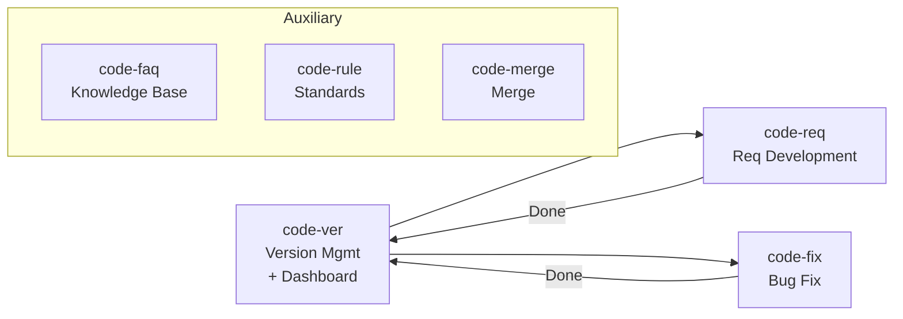

# code-skills

[中文说明 (Chinese)](./README.md) | **English**

A suite of Claude Code skills that guide AI through the complete software development lifecycle, with **built-in version-aware workspace management**.

## Install

```bash
# 1. Register the marketplace
claude plugin marketplace add https://github.com/wm123450405/code-skills.git

# 2. Install the plugin
claude plugin install code-skills@code-skills-marketplace

# 3. Activate the skills
/reload-plugins
```

After installation, invoke each skill as `/code-skills:<skill-name>`, e.g. `/code-skills:code-ver`, `/code-skills:code-req`.

> ⚠️ The form `claude plugin install code-skills@https://github.com/...` (splicing a GitHub URL directly after `@`) **does not work** in current Claude Code versions. You must first `marketplace add` to register, then install via `@marketplace-name`.

## Skills Overview

This plugin provides **6 skills**, organized into main flow and auxiliary tools:

**Main Flow**:

| Skill | Purpose | One-liner |
| --- | --- | --- |
| [`code-ver`](skills/code-ver/SKILL.md) | Version Management & Dashboard | Project init / switch version / publish check / progress dashboard — the prerequisite gateway for all skills |
| [`code-req`](skills/code-req/SKILL.md) | Requirement Development | Full lifecycle: analysis → design → plan → coding → review |
| [`code-fix`](skills/code-fix/SKILL.md) | Bug Fix | Full lifecycle: registration → design → plan → coding → review |

**Auxiliary Tools**:

| Skill | Purpose | One-liner |
| --- | --- | --- |
| [`code-faq`](skills/code-faq/SKILL.md) | Knowledge Base | Cross-version query of requirements/bugs, with document export |
| [`code-rule`](skills/code-rule/SKILL.md) | Coding Standards | Describe standards in natural language, auto-structured into clauses |
| [`code-merge`](skills/code-merge/SKILL.md) | Branch Merge | Auto-merge worktree changes back to main with smart conflict resolution |

## Quick Start

### First Time (New Project)

```
Step 1: code-ver           ← Initialize project, scan code, create baseline
Step 2: code-rule          ← (Optional but recommended) Establish coding standards
Step 3: code-ver V0.0.5    ← Switch to a new development version
Step 4: code-req "your req" ← Start requirement development
```

### Daily Development

```
code-ver       ← Ensure you're on the correct version (or view progress)
code-req "xxx" ← Describe your requirement in one sentence, AI guides you through
code-fix "xxx" ← Report a bug, AI guides you through the fix
```

### Silent Mode

```
code-req "xxx" --auto  ← Fully automatic, no manual confirmation needed
code-fix "xxx" --auto  ← Same as above
```

## Workflow Overview



### Core Flow: `code-req` Requirement Development

When you call `/code-req "Add user login feature"`, the AI advances through these stages:

```
Requirement → Design → Plan → Coding → Review
(REQUIRE)    (DESIGN)  (PLAN)  (CODING)  (CHECK)
```

- **Default mode**: Each stage asks "continue?" — you can pause or cancel anytime
- **`--auto` mode**: Fully unattended, runs through all stages automatically
- **Resume**: If interrupted, restarting picks up from the last completed stage (tracked via `PROCESS.md`)

### Side Flow: `code-fix` Bug Fix

```
Registration → Design → Plan → Coding → Review
(INIT)         (DESIGN)  (PLAN)  (CODING)  (CHECK)
```

Shares the DESIGN/PLAN/CODING/CHECK stage logic with `code-req`.

## Version Workspace

All skills operate under `./assistants/<version>/`:

```
assistants/
├── rules/                  ← Project-wide coding standards (shared across versions)
├── .current-version        ← Active version marker
└── V0.0.5/                 ← Version workspace
    ├── RESULT.md           ← Version dashboard (req list + bug list)
    ├── req/<REQ-00045>/    ← Requirement outputs (REQUIRE/DESIGN/PLAN/TASK/CHECK/PROCESS)
    └── fix/<BUG-00001>/    ← Bug outputs (BUG/DESIGN/PLAN/TASK/CHECK/PROCESS)
```

## Quick Reference

| I want to... | Call |
| --- | --- |
| Initialize project | `/code-ver` |
| Switch version | `/code-ver V0.0.5` |
| View progress | `/code-ver` |
| Develop a feature | `/code-req "description"` |
| Silent development | `/code-req "description" --auto` |
| Fix a bug | `/code-fix "description"` |
| Query requirements | `/code-faq "keyword"` |
| Add coding standard | `/code-rule "description"` |
| Merge branch | `/code-merge` |
| Publish version | `/code-ver --publish` |

## Detailed Documentation

Each skill has its own `SKILL.md` with complete workflow details:

- [`code-ver/SKILL.md`](skills/code-ver/SKILL.md) — Version management & dashboard (init + switch + publish + dashboard)
- [`code-req/SKILL.md`](skills/code-req/SKILL.md) — Full requirement development lifecycle
- [`code-fix/SKILL.md`](skills/code-fix/SKILL.md) — Full bug fix lifecycle
- [`code-faq/SKILL.md`](skills/code-faq/SKILL.md) — Knowledge base query & document export
- [`code-rule/SKILL.md`](skills/code-rule/SKILL.md) — Coding standard management
- [`code-merge/SKILL.md`](skills/code-merge/SKILL.md) — Worktree auto-merge