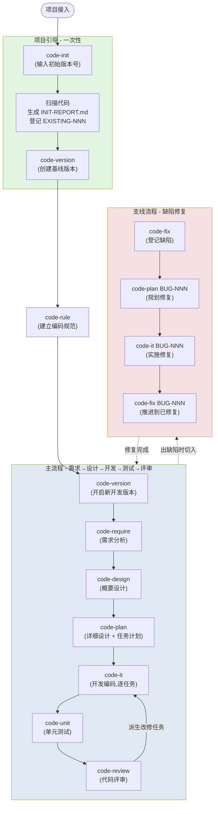

# code-skills

**中文** | [English](./README.en.md)

一套用于引导 AI 走完完整软件开发生命周期的 Claude Code 技能集合,内置**版本感知工作空间管理**。

## 安装

```bash
# 1. 注册 marketplace(把仓库加到本地 marketplace 列表)
claude plugin marketplace add https://github.com/wm123450405/code-skills.git

# 2. 安装插件
claude plugin install code-skills@code-skills-marketplace

# 3. 激活技能
/reload-plugins
```

安装完成后,所有技能以 `/code-skills:<技能名>` 形式调用,例如 `/code-skills:code-version`、`/code-skills:code-require`。

> ⚠️ `claude plugin install code-skills@https://github.com/...` 这种把 GitHub URL 直接拼到 `@` 后面的形式在当前 Claude Code 版本下**不会工作** —— 必须先 `marketplace add` 注册,再用 `@marketplace-name`(本仓库的 marketplace name 是 `code-skills-marketplace`,来自 `marketplace.json` 的 `name` 字段)安装。

## 技能概览

| 技能 | 用途 | 读取 | 写入 | 下游 |
| --- | --- | --- | --- | --- |
| [`code-init`](skills/code-init/SKILL.md) | 工程初始化— 项目接入,创建基线版本,分析现有代码并登记为 `EXISTING-NNN` 需求 | 项目源代码(只读) | `assistants/.current-version` + `assistants/<基线版本>/{RESULT.md, INIT-REPORT.md, require/EXISTING-NNN/RESULT.md}` | code-rule / code-version |
| [`code-version`](skills/code-version/SKILL.md) | 版本管理(Version Management)— 切换/创建版本工作空间 | (无) | `assistants/.current-version` + `assistants/<版本号>/RESULT.md` | (其他 code-* 的前置) |
| [`code-rule`](skills/code-rule/SKILL.md) | 编码规范管理— 维护 `assistants/rules/` 下的项目级共享规范 | 用户描述(自然语言) | `assistants/rules/<分类>.md` | (所有 code-* 共享输入) |
| [`code-require`](skills/code-require/SKILL.md) | 需求分析(Requirements Analysis) | 用户材料 + `assistants/rules/` | `assistants/<版本号>/require/<需求编码>/RESULT.md` | code-design |
| [`code-design`](skills/code-design/SKILL.md) | 概要设计(High-level Design) | `requirements.md` + `assistants/rules/` | `design.md` | code-plan |
| [`code-plan`](skills/code-plan/SKILL.md) | 详细设计 / 实施计划— 接收"需求编码"或"缺陷编号" | `requirements.md` + `design.md` 或 `fix/<BUG>/RESULT.md` + `assistants/rules/` | `plan.md` + `task-plan.md` 或 `fix/<BUG>/fix-plan.md` | code-it |
| [`code-it`](skills/code-it/SKILL.md) | 开发编码— 接收"任务编码"或"缺陷编号" | `plan.md` 或 `fix-plan.md` + `assistants/rules/` | 源码 + 任务级 `RESULT.md` 或 `fix/<BUG>/fix-*.md` | code-unit / code-review |
| [`code-unit`](skills/code-unit/SKILL.md) | 单元测试(Unit Testing) | `plan.md` + `code/RESULT.md` + `assistants/rules/` | 测试代码 + 任务级 `RESULT.md` | code-review |
| [`code-fix`](skills/code-fix/SKILL.md) | 缺陷登记与跟踪— 维护 `fix/RESULT.md` 与各 `BUG-NNN/RESULT.md` | 用户描述或既有 `fix/` 文件 | `assistants/<版本号>/fix/{RESULT.md, <BUG-NNN>/RESULT.md}` | code-plan / code-it |
| [`code-review`](skills/code-review/SKILL.md) | 代码评审(Code Review) | `code/RESULT.md` + `test/RESULT.md` + `assistants/rules/` | 整体 `REVIEW-REPORT.md` + 派生改修任务 | code-it(改修任务) |

## 工作流管道

```
code-version → code-require → code-design → code-plan → code-it → code-unit → code-review
   版本管理       需求分析       概要设计      详细计划    开发编码    单元测试      代码评审
```

`code-version` 是其他所有 `code-*` 技能的**前置门**:在调用任何下游技能前,必须先有一个激活的版本工作空间(`./assistants/<版本号>/`)。

`code-rule` **不**在主流程管道中 — 它是独立的"规范基建"技能,负责维护 `./assistants/rules/` 下的项目级共享规范。**所有**其他 `code-*` 技能(从 `code-require` 到 `code-review`)在执行时都会读取 `rules/` 作为只读强约束。建议在项目初期先调 `code-rule` 建立规范,再进入主流程;主流程进行中也可随时调 `code-rule` 追加新规范。

`code-init` **是项目的"一次性引导"**,**不**在主流程管道中:
- 在新项目接入时跑一次:扫描现有代码、生成 `INIT-REPORT.md`、把所有现有功能登记为 `require/EXISTING-NNN/`,创建基线版本
- 等价于"自动跑一次 `code-version`(创基线) + 一次'批量 `code-require`(把现有功能当需求)'"
- 跑完后,用户应调 `code-version` 开启新开发版本,后续所有改动都落在新版本上
- 一个项目**只应被 `code-init` 一次**

`code-fix` **是支线流程入口**,也**不**在主流程管道中,但与主流程有清晰的接驳点:
- 负责缺陷的**登记与状态跟踪**,不直接改代码
- 典型流程:用户报告 bug → `code-fix`(登记) → `code-plan <BUG-NNN>`(规划修复方案) → `code-it <BUG-NNN>`(实施修复) → `code-fix <BUG-NNN>`(推进到"已修复-已验证") → `code-fix <BUG-NNN>`(关闭)
- `code-plan` 与 `code-it` 都已扩展:接收"需求编码"走主流程;接收"缺陷编号"走缺陷分支

## 仓库结构

本仓库按 Claude Code **marketplace** 协议布局:仓库根承载 marketplace 清单,插件本体放在 `plugins/code-skills/` 子目录中。这样既可以整体发布到 marketplace,也支持直接以子目录作为 `claude plugin install` 的源。

```
code-skills/                          ← marketplace 仓库根
├── .claude-plugin/
│   └── marketplace.json              # 插件市场清单(plugins[] 数组)
└── plugins/
    └── code-skills/                  ← 插件本体(与插件名同名)
        ├── .claude-plugin/
        │   └── plugin.json           # 插件自身元信息
        ├── README.md                 # 本文件,工作流总览 + 技能表
        ├── README.en.md              # 本文件的英文版本
        ├── CLAUDE.md                 # 给 Claude Code 使用的开发指南
        └── skills/
            ├── code-init/            # 工程初始化(项目级一次性引导)
            │   ├── SKILL.md
            │   └── templates/
            │       ├── INIT-REPORT.md
            │       ├── existing-requirement.md
            │       └── assistants-layout.md
            ├── code-version/         # 版本管理(版本感知入口)
            │   ├── SKILL.md
            │   └── templates/
            │       ├── version-RESULT.md
            │       └── assistants-layout.md
            ├── code-rule/            # 编码规范管理(项目级共享)
            │   ├── SKILL.md
            │   └── templates/
            │       ├── rule.md
            │       └── assistants-layout.md
            ├── code-require/         # 需求分析
            │   ├── SKILL.md
            │   └── templates/
            │       ├── requirements.md
            │       └── assistants-layout.md
            ├── code-design/          # 概要设计
            │   ├── SKILL.md
            │   └── templates/
            │       ├── design.md
            │       └── assistants-layout.md
            ├── code-plan/            # 详细设计 + 任务计划 / 缺陷修复方案
            │   ├── SKILL.md
            │   └── templates/
            │       ├── plan.md
            │       ├── task-plan.md
            │       ├── fix-plan.md
            │       └── assistants-layout.md
            ├── code-it/              # 开发编码 / 缺陷修复实施
            │   ├── SKILL.md
            │   ├── guidelines/coding-style.md
            │   └── templates/
            │       ├── RESULT.md
            │       └── assistants-layout.md
            ├── code-unit/            # 单元测试
            │   ├── SKILL.md
            │   └── templates/
            │       ├── RESULT.md
            │       ├── test-spec.md
            │       └── assistants-layout.md
            ├── code-fix/             # 缺陷登记与跟踪
            │   ├── SKILL.md
            │   └── templates/
            │       ├── bug.md
            │       ├── fix-registry.md
            │       └── assistants-layout.md
            └── code-review/          # 代码评审
                ├── SKILL.md
                ├── checklists/review-checklist.md
                └── templates/
                    ├── REVIEW-REPORT.md
                    ├── REVIEW-FIX.md
                    └── assistants-layout.md
```

## 核心概念

### 1. 版本工作空间

所有 `code-*` 技能(除 `code-version` 本身)都运行在 `./assistants/<版本号>/` 这一层之下:

```
assistants/
├── rules/                  ← 项目级规范(跨版本共享)
├── .current-version        ← 当前激活版本标记
└── <版本号>/               ★ 版本工作空间
    ├── RESULT.md           ← 版本开发进度看板
    ├── require/<需求编号>/
    ├── design/<需求编号>/
    ├── plan/<需求编号>/
    ├── code/<任务编码>/
    ├── test/<任务编码>/
    └── review/
        ├── <需求编号>/
        └── <任务编码>/
```

- **`rules/`** 跨版本共享,不属于任何版本
- **`.current-version`** 是其他技能的"上下文切换点"
- 每个 `code-*` 技能在执行前**第一步**都是读取 `.current-version` 确认工作空间

### 2. 双状态

每条任务有**两个正交的状态字段**:
- **开发状态**:`待开始` / `进行中` / `已完成` / `已取消` / `阻塞`
- **测试状态**:`未编写` / `已编写` / `已运行-通过` / `已运行-失败` / `不适用` / `阻塞`

**任务真正可发布 = 开发状态=已完成 ∧ 测试状态∈{已运行-通过, 不适用}**。

### 3. 触发/来源(13 个枚举值)

每条任务都有 `触发/来源` 字段,决定 `code-it` 的输入源:
- 大多数 → `./assistants/<版本号>/plan/<需求编号>/RESULT.md`(详细设计)
- **`审查改修`** → `./assistants/<版本号>/review/<任务编码>/RESULT.md`(改修要求)

## 使用说明

> **快速上手**:本节先用一段精简的总览指引帮你快速上手;若需每个命令的**参数细节、适用场景、产出说明、注意事项**,直接跳到下方的 [命令参考](#命令参考) 与 [典型场景](#典型场景)。

0a. **首次接入项目**:在 CWD 调 `code-init`,输入初始版本号(默认 `V0.0.0`)
    - 生成 `INIT-REPORT.md` 功能分析报告
    - 把现有功能登记为 `require/EXISTING-NNN/`
    - 创建基线版本工作空间
0b. **建立规范(可选,推荐新项目先做)**:调 `code-rule`,用自然语言描述编码规范,本技能会追问补充后写入 `assistants/rules/`
1. **首次使用** / **开新开发版本**:在项目根目录调 `code-version`,输入版本号(如 `V0.1.0`),创建版本工作空间
2. **新建需求**:调 `code-require`,提供需求编码,放入需求材料
3. **概要设计**:调 `code-design`,基于需求产出概要设计
4. **详细计划**:调 `code-plan`,产出详细设计与任务计划
5. **开发**:逐任务调 `code-it`,每条任务改完代码后推进状态
6. **测试**:调 `code-unit`,补齐/编写单元测试
7. **评审**:调 `code-review`,产出整体评审报告与派生改修任务
8. **缺陷修复**(任一阶段):
    - 登记:调 `code-fix "<bug 描述>"` 或 `code-fix BUG-NNN`
    - 规划:调 `code-plan BUG-NNN` 产出 `fix-plan.md`
    - 实施:调 `code-it BUG-NNN` 改代码
    - 状态推进:再次调 `code-fix BUG-NNN` 把状态推前(已修复-待验证 → 已修复-已验证 → 已关闭)

主流程进行中可随时调 `code-rule` 追加新规范;调 `code-version` 切换到其他版本工作空间。

详细工作流见各技能的 `SKILL.md`。

---

## 完整工作流程

### 全局视图



### 标准主流程(从需求到发布)

按以下顺序串接,每一步只关心前一步的产出:

```
1. code-init (一次性)
     ↓ 生成 baseline
2. code-version <新开发版本号>      ← 切到新版本
     ↓ 当前激活 = 新版本
3. code-rule "<自然语言规范描述>"   ← (可选,但强烈推荐)建立规范
     ↓ rules/ 已有文件
4. code-require <REQ-YYYY-NNNN>   ← 创建需求,把材料放进去
     ↓ require/<req>/RESULT.md
5. code-design <REQ-YYYY-NNNN>    ← 概要设计
     ↓ design/<req>/RESULT.md
6. code-plan <REQ-YYYY-NNNN>      ← 详细设计 + 任务拆分
     ↓ plan/<req>/{RESULT.md, PLAN.md}
7. code-it <REQ-YYYY-NNNN-001>    ← 实施第 1 个任务
     ↓ code/<task>/RESULT.md (开发=已完成)
8. code-unit <REQ-YYYY-NNNN-001>  ← 给该任务补/跑单测
     ↓ test/<task>/RESULT.md (测试=已运行-通过)
9. code-review <REQ-YYYY-NNNN>    ← 整需求评审
     ↓ review/<req>/REVIEW-REPORT.md
     ├─ 无问题 → 跳到 10
     └─ 有问题 → 派生"审查改修"任务,跳回 7
10. 标记里程碑 M3=可发布
```

### 标准缺陷修复流程(任一阶段触发)

```
1. code-fix "<bug 描述>"          ← 登记 bug,自动生成 BUG-NNN
   或  code-fix BUG-NNN          ← 重新进入已有 bug
     ↓ fix/RESULT.md + fix/<BUG-NNN>/RESULT.md
2. code-fix BUG-NNN              ← (再次)推进状态"报告"→"调查中"
     ↓ 用户补充根因 / 复现步骤
3. code-plan BUG-NNN             ← 规划修复方案
     ↓ fix/<BUG-NNN>/fix-plan.md,状态 →"修复规划中"
4. code-it BUG-NNN               ← 实施修复
     ↓ fix/<BUG-NNN>/fix-*.md,状态 →"已修复-待验证"
5. 跑测试,确认通过
6. code-fix BUG-NNN              ← 推进"已修复-待验证"→"已修复-已验证"
7. code-fix BUG-NNN              ← 推进"已修复-已验证"→"已关闭"
```

### 跨版本操作

- **查看历史版本**:切换用 `code-version <旧版本号>`,该版本的 `RESULT.md` 与所有子目录完整保留
- **在新版本上开新需求**:不需要回到旧版本;直接 `code-require <新 REQ-YYYY-NNNN>`
- **回看某 bug 的处理过程**:`code-version <该 bug 所在版本>` → 读 `fix/RESULT.md` 与 `fix/<BUG-NNN>/RESULT.md`

---

## 命令参考

> 10 个 `code-*` 技能按"职责分层"组织。
> 调用方式:在 Claude Code 对话中输入 `code-<name> [参数]`,AI Agent 会按 SKILL.md 工作流执行。
> 多数技能**会主动用 `AskUserQuestion` 追问**;参数可省略,由 AI 在交互中收集。

### 一、项目引导(仅启动时跑)

#### `code-init` — 工程初始化

**适用场景**:
- 全新空项目接入(无任何代码,直接 init 即可)
- **老项目接入**(最常见) — 已有代码,想纳入 `code-*` 体系
- 项目重置(已初始化过但要重新分析;需用户强确认)

**不适用**:
- 已初始化过项目,想切换版本 → 用 `code-version`
- 已初始化过项目,想登记新需求 → 用 `code-require`
- 已初始化过项目,想加新规范 → 用 `code-rule`

**参数**:

| 参数 | 必填 | 说明 |
| --- | --- | --- |
| 初始版本号 | 是(交互式) | 默认 `V0.0.0`;推荐 semver 或日期;不能含路径分隔符 |
| 项目描述 | 否 | 项目做什么(交互式收集) |

**示例**:
- `code-init`(交互式)
- `code-init V0.0.0`(直接指定)
- `code-init 2026-06`(日期风格)

**输出**:
- `./assistants/.current-version` = 初始版本号
- `./assistants/<初始版本号>/RESULT.md`(版本看板)
- `./assistants/<初始版本号>/INIT-REPORT.md`(功能分析报告)
- `./assistants/<初始版本号>/require/EXISTING-NNN/RESULT.md` × N(现有功能)

**下一步建议**:
- 调 `code-rule` 补齐编码规范(若 `rules/` 为空)
- 调 `code-version <新开发版本号>` 切到新开发版本
- **一个项目只应被 `code-init` 一次**

---

### 二、基础设施(可任意时刻调用)

#### `code-version` — 版本管理

**适用场景**:
- 启动新版本(产品发版、独立功能包、季度迭代)
- 在多个并行版本之间切换
- 归档/回看历史版本
- **任何 `code-require` / `code-design` / `code-plan` / `code-it` / `code-unit` / `code-fix` / `code-review` 调用前**

**不适用**:
- 想对单个项目做初始化 → 用 `code-init`
- 已有激活版本,只是要继续工作 → 直接调其他 `code-*` 即可,无需重跑

**参数**:

| 参数 | 必填 | 说明 |
| --- | --- | --- |
| 版本号 | 是(交互式) | 推荐 `v1.0.0` / `V0.1.0` / `2026-Q2`;不能含 `/` `\` `:` `*` `?` `"` `<` `>` `\|`;不能与已存在版本同名(若同名会询问) |

**示例**:
- `code-version`(交互式,可选择"列出已有版本")
- `code-version v1.0.0`
- `code-version 2026-Q2`

**输出**:
- 切换/新建:`./assistants/.current-version` 被覆写
- 新建:额外创建 `./assistants/<版本号>/` 目录 + `RESULT.md` 看板

**下一步建议**:
- 新版本无需求 → 调 `code-require <REQ-YYYY-NNNN>` 创建首个需求
- 已有需求 → 调 `code-design` / `code-plan` 继续

---

#### `code-rule` — 编码规范管理

**适用场景**:
- 启动新项目,需要建立首批编码规范
- 在项目进行中追加新规范(命名/错误处理/安全/性能/...)
- 发现现有规范有缺口,需要扩展某分类下的条款
- 团队 review 后形成新规范条目,统一沉淀

**不适用**:
- 修改某条具体规范的措辞(请直接编辑 `rules/<分类>.md`)
- 给单个版本打"临时补丁规范"(规范是跨版本共享的)

**参数**:

| 参数 | 必填 | 说明 |
| --- | --- | --- |
| 规范描述 | 是(交互式) | 一两句话,可用换行写多条;例如"函数命名统一用 camelCase" |

**示例**:
- `code-rule "Python 函数命名统一用 snake_case"`
- `code-rule "所有数据库操作必须走 ORM\n禁止裸 SQL"`
- `code-rule`(交互式,AI 会主动追问细节)

**输出**:
- `./assistants/rules/<分类>.md`(新建或追加"规则 N"小节)
- 不修改 `require/` / `design/` / `plan/` / `code/` 等

**分类**(AI 会用 `AskUserQuestion` 让用户确认):
- 功能架构 / 模块规划 / 命名 / 错误处理 / 接口定义 / 数据结构 / 安全 / 性能 / 测试 / 可观测性 / 提交规范 / 其他(自定义)

**下一步建议**:
- 继续追加规范 → 再调一次 `code-rule`
- 规范已足够 → 进入主流程 `code-require` / `code-plan` / `code-it` 等
- 主流程进行中,发现需要补规范 → 随时可调 `code-rule`(新规则对所有未完成任务都生效)

---

### 三、主流程(按顺序串联)

#### `code-require` — 需求分析

**适用场景**:
- 新功能、新模块、新产品的首次需求澄清
- 现有功能的重大变更
- 跨模块/跨系统的需求对齐
- 已有 RESULT.md,要追加新材料做增量更新

**不适用**:
- 已知明确的、只涉及单一文件/单一函数的修改
- 紧急线上修复(走 `code-fix` 支线)
- 没有激活的版本(请先调 `code-version`)

**参数**:

| 参数 | 必填 | 说明 |
| --- | --- | --- |
| 需求编码 | 是(交互式) | 推荐 `REQ-YYYY-NNNN`;AI 会校验 `require/<需求编码>/RESULT.md` 存在性 |

**示例**:
- `code-require REQ-00001`
- `code-require`(交互式)

**前置材料**(用户预先放入 `./assistants/<版本号>/require/<需求编码>/` 目录):
- 需求文档(.md / .docx / .pdf)
- 设计稿(.png / .jpg / .figma 链接)
- 演示视频(.mp4 / 链接)
- 会议记录、聊天记录、邮件
- 沟通录音(.mp3 / .wav / .m4a)
- 任何其他参考资料

**输出**:
- `./assistants/<版本号>/require/<需求编码>/RESULT.md` — 需求提示词文档
- 同步到版本看板"需求清单" / "变更记录"

**下一步**:
- 调 `code-design <需求编码>`

---

#### `code-design` — 概要设计

**适用场景**:
- 新模块/新服务的架构设计
- 跨模块的方案选型
- 重大重构的方案论证
- 需求变更后重新评估设计
- 已有 RESULT.md,要增量更新(需求侧/代码侧/规范侧变化)

**不适用**:
- 没有激活的版本 / 没有上游需求
- 已知明确的、只涉及单一文件/单一函数的修改
- 紧急线上修复

**参数**:

| 参数 | 必填 | 说明 |
| --- | --- | --- |
| 需求编码 | 是 | 同 `code-require` 用的编码;AI 会校验 `require/<需求编码>/RESULT.md` 与 `design/<需求编码>/RESULT.md` |

**示例**:
- `code-design REQ-00001`

**输入**:
- `./assistants/<版本号>/require/<需求编码>/RESULT.md`(上游)
- `./assistants/rules/`(项目级规范,只读)
- 当前项目代码

**输出**:
- `./assistants/<版本号>/design/<需求编码>/RESULT.md` — 概要设计
- 同步到版本看板"概要设计清单" / "变更记录"

**下一步**:
- 调 `code-plan <需求编码>`

---

#### `code-plan` — 详细设计 & 实施计划(双路径)

**适用场景**:
- 跨多文件/多模块的改动
- 需要多人协作或分阶段交付
- 任何在动手编码前希望降低返工成本的场景
- 已有 RESULT.md/PLAN.md,要根据进展更新计划与状态

**不适用**:
- 没有激活的版本
- 需求或概要设计尚未就绪
- 已知明确的、只涉及单一文件/单一函数的修改
- 紧急线上修复(走 `code-fix` 支线)

**参数**:

| 参数 | 必填 | 说明 |
| --- | --- | --- |
| 输入 ID | 是 | **AI 按格式自动判定** |

**输入 ID 判定规则**:

| 格式 | 路径 | 上游 | 产物 |
| --- | --- | --- | --- |
| `REQ-YYYY-NNNN` | 主流程 | `require/<id>/RESULT.md` + `design/<id>/RESULT.md` | `plan/<id>/{RESULT.md, PLAN.md}` |
| `BUG-NNN` | 缺陷分支 | `fix/<id>/RESULT.md` | `fix/<id>/fix-plan.md` |

**示例**:
- `code-plan REQ-00001`(主流程路径)
- `code-plan BUG-00001`(缺陷分支路径)
- `code-plan`(交互式)

**输出**:
- 主流程:`./assistants/<版本号>/plan/<需求编码>/RESULT.md` + `PLAN.md`
- 缺陷分支:`./assistants/<版本号>/fix/<缺陷编号>/fix-plan.md`
- 同步到版本看板:
  - 主流程:"详细设计与任务计划汇总" / "任务清单" / "里程碑" / "变更记录"
  - 缺陷分支:"缺陷清单" / "变更记录"
- 同步到 `fix/RESULT.md`(缺陷分支)

**下一步**:
- 主流程 → 调 `code-it <REQ-YYYY-NNNN-001>` 逐任务实施
- 缺陷分支 → 调 `code-it BUG-NNN` 实施修复

---

#### `code-it` — 开发编码(双路径)

**适用场景**:
- 任何按 `PLAN.md` 单条任务执行的编码工作
- 重构或特性开发的具体落地
- Bug 修复的具体落地
- `code-review` 派生的"审查改修"任务的执行
- `code-fix` 支线下,实施缺陷修复

**不适用**:
- 没有激活的版本
- 任务尚未在 `PLAN.md` 中存在
- 跨多任务的批量改动(应拆分为多次本技能调用)
- 紧急线上修复(走 `code-fix` 支线)

**参数**:

| 参数 | 必填 | 说明 |
| --- | --- | --- |
| 输入 ID | 是 | **AI 按格式自动判定** |

**输入 ID 判定规则**:

| 格式 | 路径 | 上游输入 | 产物 |
| --- | --- | --- | --- |
| `REQ-YYYY-NNNN-NNN`(任务编码) | 任务分支 | `plan/<需求编码>/RESULT.md` + `PLAN.md` | `code/<任务编码>/{RESULT.md, work-log.md, ...}` |
| `BUG-NNN`(缺陷编号) | 缺陷分支 | `fix/<BUG-NNN>/RESULT.md` + `fix-plan.md` | `fix/<BUG-NNN>/{fix-work-log.md, fix-compile-and-run.md, fix-test-results.md, ...}` |

**触发/来源**(任务分支内,影响读哪个上游):
- 大多数(`需求新增` / `需求变更` / `主动优化` / `缺陷修复` / ...)→ 读 `plan/<需求>/RESULT.md`
- `审查改修` → 读 `review/<任务编码>/RESULT.md`(**不读** `plan/`)

**示例**:
- `code-it TASK-REQ-00001-00001`(主流程:第 1 个任务)
- `code-it BUG-00001`(缺陷修复)
- `code-it TASK-REQ-00001-00005`(如果该任务是从 `code-review` 派生的"审查改修")

**关键约束**:
- **必须确保软件可正常编译、可启动运行**,出现错误时迭代修复直到消除
- **5 次连续失败硬上限**:每次失败记录到 `work-log.md` / `fix-work-log.md`,超限必须停下询问用户
- **禁止**用 `--no-verify` / `--force` / 注释失败代码等方式绕过错误

**输出**:
- CWD 下实际代码改动(diff/提交)
- 主流程:`./assistants/<版本号>/code/<任务编码>/RESULT.md`,PLAN.md 中本任务开发状态推进
- 缺陷分支:`./assistants/<版本号>/fix/<BUG-NNN>/fix-*.md`,fix/<BUG-NNN>/RESULT.md 状态推进
- 同步到版本看板"任务清单" / "缺陷清单" / "执行的开发命令记录" / "变更记录"

**下一步**:
- 主流程 → 调 `code-unit <任务编码>` 跑单测
- 缺陷分支 → 跑测试,确认通过后调 `code-fix <BUG-NNN>` 推进状态
- 全部任务完成 → 调 `code-review <需求编码>` 评审

---

#### `code-unit` — 单元测试

**适用场景**:
- 补齐某任务的单元测试
- 验证测试是否通过
- 提升覆盖率

**不适用**:
- 没有激活的版本
- 任务尚未在 `code-it` 中完成开发

**参数**:

| 参数 | 必填 | 说明 |
| --- | --- | --- |
| 任务编码 | 是 | 格式 `REQ-YYYY-NNNN-NNN` |

**示例**:
- `code-unit TASK-REQ-00001-00001`

**输出**:
- 测试代码
- `./assistants/<版本号>/test/<任务编码>/RESULT.md`
- 同步到版本看板"任务清单"(测试状态)/ "变更记录"

**下一步**:
- 测试通过 → 下一任务 `code-it` / 整体 `code-review`
- 测试失败 → 回 `code-it` 修代码 / 登记新 bug `code-fix`

---

#### `code-review` — 代码评审

**适用场景**:
- 一组相关任务(同一需求)完成后做整体评审
- 派生"审查改修"任务让 `code-it` 跟进
- 收尾某需求的代码质量

**不适用**:
- 没有激活的版本
- 没有可评审的代码(本版本无 `code/` 输出)

**参数**:

| 参数 | 必填 | 说明 |
| --- | --- | --- |
| 需求编码 | 是 | 格式 `REQ-YYYY-NNNN` |

**示例**:
- `code-review REQ-00001`

**输出**:
- `./assistants/<版本号>/review/<需求编码>/REVIEW-REPORT.md`
- 派生"审查改修"任务:`./assistants/<版本号>/review/<任务编码>/RESULT.md`
- 同步到版本看板"评审发现汇总" / "派生任务记录" / "缺陷清单" / "任务清单" / "变更记录"

**下一步**:
- 无问题 → 标记里程碑 M3 = 可发布
- 有问题 → 调 `code-it <派生任务编码>`(其 `触发/来源 = 审查改修`)

---

### 四、支线流程(缺陷修复)

#### `code-fix` — 缺陷登记与跟踪

**适用场景**:
- 用户报告了一个 bug,需要登记跟踪
- bug 修复过程中,需要刷新状态(报告 → 修复中 → 已修复)
- bug 已修复,需要确认验证或关闭
- 查看当前所有 bug 的清单与状态

**不适用**:
- 想**实施**代码修复(那是 `code-plan BUG-NNN` + `code-it BUG-NNN` 的事)
- 想**评审**已修复的 bug(那是 `code-review` 的事)
- 想**主动**规划某项需求(那是 `code-plan` 的事)

**参数**:

| 参数 | 必填 | 说明 |
| --- | --- | --- |
| 缺陷编号 或 缺陷描述 | 是(二选一) | `BUG-NNN`(已有)或自然语言(新建) |

**示例**:
- `code-fix "用户报告:登录页密码框不显示"`<br/>(新建,自动生成 BUG-00001)
- `code-fix BUG-00001`<br/>(查看/推进已有 bug)
- `code-fix`(交互式)

**可选补充**(交互式收集):
- 严重度:`P0` / `P1` / `P2` / `P3`(默认 `P2`)
- 报告人 / 模块 / 路径 / 复现步骤

**缺陷状态机**(10 个状态):

```
报告 → 调查中 → 修复规划中 → 修复编码中 → 已修复-待验证 → 已修复-已验证 → 已关闭
                                                                       └→ 已关闭-非缺陷
                                                                       └→ 已关闭-不修复
任何状态 → 阻塞 / 已取消
```

**输出**:
- 新建:`./assistants/<版本号>/fix/<BUG-NNN>/RESULT.md` + `fix/RESULT.md`
- 更新:用 `Edit` 增量刷新状态、修复日志、变更记录
- 同步到版本看板"缺陷清单" / "变更记录"

**与 `code-plan` / `code-it` 的协作**:
- `code-fix` 只**跟踪**,不**实施**
- 实施需:`code-plan BUG-NNN` 产出 `fix-plan.md` → `code-it BUG-NNN` 改代码 → `code-fix BUG-NNN` 推进状态

**下一步**(根据当前状态):
| 当前状态 | 建议 |
| --- | --- |
| 报告 | 调 `code-fix BUG-NNN` 进入"调查中" |
| 调查中 | 调 `code-plan BUG-NNN` 规划修复 |
| 修复规划中 | 调 `code-it BUG-NNN` 实施修复 |
| 修复编码中 | 跑测试,确认通过 |
| 已修复-待验证 | 调 `code-fix BUG-NNN` → "已修复-已验证" |
| 已修复-已验证 | 调 `code-fix BUG-NNN` → "已关闭" |
| 阻塞 | 解决阻塞后调 `code-fix` 解除 |

---

## 典型场景

### 场景 1:全新项目从零开始

```
1. 调 code-init V0.0.0
   → 生成空白的 V0.0.0 基线版本(无现有功能登记)
2. 调 code-rule "TypeScript 函数命名用 camelCase\n错误必须抛自定义异常\n提交信息用 Conventional Commits 格式"
   → 写入 3 条规范到 rules/
3. 调 code-version v0.1.0
   → 切到 v0.1.0 开发版本
4. 调 code-require REQ-00001
   → 把需求材料放进 require/REQ-00001/
   → AI 产出需求 RESULT.md
5. 调 code-design REQ-00001
6. 调 code-plan REQ-00001
   → 拆出 5 个任务
7. 依次调 code-it TASK-REQ-00001-00001 ... 005
   → 每个任务完成后调 code-unit <任务>
8. 调 code-review REQ-00001
   → 通过 → 准备发布
```

---

### 场景 2:老项目接入

```
1. 调 code-init
   → 扫描现有代码(假设发现 3 个模块、12 个 API 端点)
   → 生成 INIT-REPORT.md
   → 登记为 EXISTING-001 ~ EXISTING-012
   → V0.0.0 状态:12 个已完成的需求
2. 调 code-rule "补几条项目特有的规范"
3. 调 code-version v0.1.0
   → 切到 v0.1.0
4. 调 code-require REQ-00001 "添加新功能 X"
   → ... 走主流程
5. (若发现 bug)调 code-fix "用户报告:..." → BUG-00001
   → code-plan BUG-00001 → code-it BUG-00001
6. 调 code-review REQ-00001
```

---

### 场景 3:修复一个生产 bug(紧急)

```
1. 调 code-fix "生产环境:用户支付时偶发 500 错误"
   → 自动生成 BUG-00001
2. 调 code-fix BUG-00001
   → AI 询问推进到哪个状态
   → 选"调查中"
   → 补充根因(根据日志/监控推断)
3. 调 code-plan BUG-00001
   → 产出 fix-plan.md(选定方案 + 风险 + 回退)
4. 调 code-it BUG-00001
   → 实施代码修改
   → 编译/启动/测试全部通过
   → 缺陷状态 → "已修复-待验证"
5. 部署到预发,跑回归
6. 调 code-fix BUG-00001
   → 推进"已修复-待验证" → "已修复-已验证"
   → 记录验证信息
7. 调 code-fix BUG-00001
   → 推进"已修复-已验证" → "已关闭"
```

---

### 场景 4:跨版本工作

```
# 假设已开过 v0.1.0,正在做 v0.2.0,临时需要回看 v0.1.0 的某需求

1. 调 code-version v0.1.0
   → 切到 v0.1.0(只读浏览,不建议修改)
2. 读 v0.1.0/require/REQ-00001/RESULT.md
3. 调 code-version v0.2.0
   → 切回当前
4. 调 code-require REQ-00050 "基于 v0.1.0 的功能,扩展..."
   → 继续在新版本工作
```

---

### 场景 5:主流程中发现 bug,转支线

```
# 当前在做 TASK-REQ-00001-00003 (code-it)

1. code-it TASK-REQ-00001-00003
   → 实施过程中发现一个非本任务的 bug
   → 不擅自修复(避免范围蔓延)
   → 记入 deviations.md
2. 调 code-fix "在 code-it TASK-REQ-00001-00003 过程中发现:..."
   → 登记 BUG-00005
3. 调 code-version v0.2.0
   → 切回当前版本(可能已经在 v0.2.0)
4. 调 code-plan BUG-00005 → code-it BUG-00005
5. 完成后再调 code-fix BUG-00005 推进/关闭
6. 调 code-version v0.2.0(若切走过)+ code-it TASK-REQ-00001-00003
   → 继续原任务
```

---

### 场景 6:补规范,不影响当前任务

```
# 主流程跑到一半,发现需要补一条规范(例如某模块用了 eslint 禁用项)

1. 调 code-rule "ESLint 禁止使用 console.log,统一用 logger"
   → AI 询问分类(选 编码风格 / 工具配置)
   → 写入 rules/coding-style.md
2. (继续主流程)调 code-it 下一个任务
   → 本次新规则对新任务都生效
   → 老任务不受影响(只对新提交/新增代码强约束)
```

---

## 速查表

| 我想... | 调哪个命令 |
| --- | --- |
| 把项目接入 `code-*` 体系 | `code-init` |
| 切版本 | `code-version <版本号>` |
| 加一条编码规范 | `code-rule "<描述>"` |
| 创建需求 | `code-require <REQ-YYYY-NNNN>` |
| 给需求做概要设计 | `code-design <REQ-YYYY-NNNN>` |
| 给需求拆任务 | `code-plan <REQ-YYYY-NNNN>` |
| 实施一个任务 | `code-it <REQ-YYYY-NNNN-NNN>` |
| 给任务补/跑单测 | `code-unit <REQ-YYYY-NNNN-NNN>` |
| 评审一个需求 | `code-review <REQ-YYYY-NNNN>` |
| 登记一个新 bug | `code-fix "<bug 描述>"` |
| 推进/查看 bug 状态 | `code-fix <BUG-NNN>` |
| 规划 bug 修复 | `code-plan <BUG-NNN>` |
| 实施 bug 修复 | `code-it <BUG-NNN>` |

| 我看到的状态... | 意味着... | 下一步 |
| --- | --- | --- |
| 任务"开发=已完成,测试=已运行-通过" | 该任务真正可发布 | 进下一任务或 `code-review` |
| 任务"开发=已完成,测试=已运行-失败" | 出现回归 | 回 `code-it` 修或登记新 `code-fix` |
| Bug 状态"已修复-待验证" | 代码已改完,等测试/人工确认 | 跑测试,确认通过后 `code-fix` 推进 |
| 需求"已完成"且有概要/详细设计 | 整需求走完主流程 | `code-review` |

---

## 详细文档

每个技能都有自己的 `SKILL.md`,包含完整的工作流、决策树、模板说明、约束清单:

- [`code-init/SKILL.md`](skills/code-init/SKILL.md)
- [`code-version/SKILL.md`](skills/code-version/SKILL.md)
- [`code-rule/SKILL.md`](skills/code-rule/SKILL.md)
- [`code-require/SKILL.md`](skills/code-require/SKILL.md)
- [`code-design/SKILL.md`](skills/code-design/SKILL.md)
- [`code-plan/SKILL.md`](skills/code-plan/SKILL.md)
- [`code-it/SKILL.md`](skills/code-it/SKILL.md)
- [`code-unit/SKILL.md`](skills/code-unit/SKILL.md)
- [`code-fix/SKILL.md`](skills/code-fix/SKILL.md)
- [`code-review/SKILL.md`](skills/code-review/SKILL.md)

