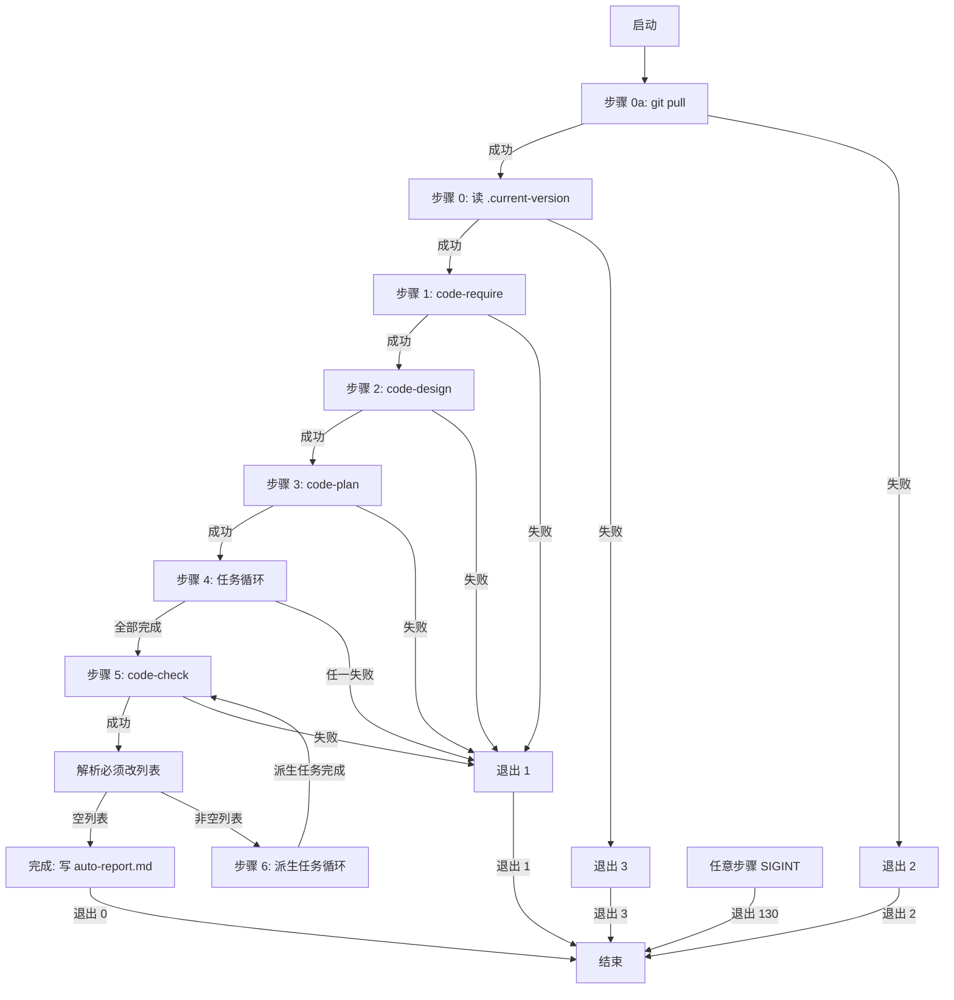

# code-auto — 自动开发编排(版本感知)

## 目标

为 `code-skills` 9 个开发周期技能(`code-version` / `code-require` / `code-design` / `code-plan` / `code-it` / `code-unit` / `code-check` / `code-dashboard` / `code-publish`)提供**编排者**角色:用户输入 1 个需求内容,本技能**串行**驱动 `code-require` → `code-design` → `code-plan` → 任务循环(`code-it` + `code-unit`)→ `code-check` 循环(派生任务自动修复)→ 完成报告,实现"从需求到代码 + 单测 + 评审无必须改"的全自动跑通。**完全无人确认**(所有 `AskUserQuestion` 自动选推荐项);**可中止**(`Ctrl+C` 输出报告);**异常立即中断**(任一子技能崩溃立即停止 + 报告)。

## 适用场景

- 一键跑通完整开发周期:从用户口述需求,到 `code-check` 报告无"必须改"
- 长会话 / 多需求场景:用户先调本技能触发,期间可观察进度,完成后审阅报告
- CI / 批处理场景:把"从需求到 PR"作为单次可调用流程(未来扩展)
- 演示 / 培训场景:让新用户快速看到 6 个 `code-*` 技能如何串联

## 不适用

- 当前**没有激活的版本工作空间**(请先调 `code-version`)
- 跨多需求编排(本技能 1 次执行 = 1 个需求)
- 实际"执行"部署(`code-auto` 完成后,建议用户调 `code-publish`,但自身不调)
- 增量恢复:本技能**不实现**中断后从断点恢复(用户需重跑,从头开始)
- 修改 9 个子技能:本技能**零修改**既有 `code-*` SKILL.md(FR-8.AC-8.1)
- 引入批量模式:本技能**不为**子技能提供"批量模式"开关(子技能按原设计运行)
- 智能填充中间产物细节:本技能不替子技能做"决策",只驱动
- 用户**希望**看到"是否确认"对话框(本技能完全无人确认)

## 工作目录约定(强制)

**版本工作空间**:`./assistants/<版本号>/`(由 `./assistants/.current-version` 决定)。
本技能的目录粒度是**单次执行**(1 个需求 = 1 个完整流程);不创建独立目录,所有产物由被驱动子技能写入各自的 `require/` / `design/` / `plan/` / `code/` / `test/` / `review/` 目录。

```
./assistants/
├── rules/                                # 项目级规范(跨版本共享,本技能只读)
├── .current-version                      # 当前激活版本标记(本技能读)
└── <版本号>/
    ├── RESULT.md                         # 版本看板(本技能只读消费 + 由各子技能更新)
    ├── require/<需求编码>/               # code-require 产物
    ├── design/<需求编码>/                # code-design 产物
    ├── plan/<需求编码>/                  # code-plan 产物(任务列表来源)
    ├── code/<任务编码>/                  # code-it 产物
    ├── test/<任务编码>/                  # code-unit 产物
    ├── review/<需求编码>/                # code-check 产物(派生任务来源)
    └── require/<需求编码>/auto-report.md # 本技能产物(完成时一次性 Write)
```

- 路径以**当前工作目录(CWD)**为基准
- 本技能**不修改** `./assistants/rules/` 下任何文件
- 本技能**不修改** `<版本号>/RESULT.md`(由各子技能按各自规则同步)
- 本技能**不修改** 9 个子技能 SKILL.md(FR-8.AC-8.1)
- 本技能**仅**在步骤 7 完成分支 `Write` 1 个 `auto-report.md`(NFR-7)

## 输入与输出

### 输入

| 参数 | 类型 | 必填 | 约束 | 缺省行为 |
| --- | --- | --- | --- | --- |
| `<需求内容>` / `<需求编号>` / `<缺陷编号>` | string | 是 | 默认视为需求编号(最常见场景);若 `require/<input>/` 目录不存在,继续判 `fix/<input>/`;都不存在则视为需求内容 | 无参数 → 提示用法示例 + 退出码 4 |

**调用形式**(沿用既有 `/code-auto <input>` 单参数风格):
```
/code-auto "添加用户登录功能,支持手机号+密码"
/code-auto REQ-00020
/code-auto BUG-00001
/code-auto arg1 arg2 arg3 ...   # 多 token 拼接为单一字符串后参与路径判定
```
→ 等价于 `/code-auto "<input>"`(空格分隔,多 token 拼为单一字符串)

**4 种路径感知模式**(本需求 REQ-00024 改造,替代原"模式 A / 模式 B 关键字"):

| 模式 | 触发条件(按 `test -d` 路径检测顺序) | 含义 | 跳过步骤 1? |
| --- | --- | --- | --- |
| **req-skip-require** | `require/<input>/` 存在 + `RESULT.md` 存在 | 需求已登记,可续跑 | 是(跳过 code-require,直接进步骤 2 概要设计) |
| **req-run-require** | `require/<input>/` 存在 + `RESULT.md` 不存在 | 需求已分配编号但未完成需求设计 | 否(进入步骤 1 走 code-require) |
| **fix-skip-require** | `require/<input>/` 不存在 + `fix/<input>/` 存在 | 缺陷已登记,可走缺陷修复详设 | 是(跳过 code-require,直接进 code-plan 走缺陷分支) |
| **req-content** | `require/<input>/` 不存在 + `fix/<input>/` 不存在 | 视为需求内容(分配新编号) | 否(进入步骤 1 走 code-require) |

**路径感知判定算法**(在步骤 1 之前完成,沿用既有"模式识别"流程位置):

```
1. 拼接所有参数 token 为单一字符串(空格分隔)
2. 去除首尾空白
3. 检查 `require/<input>/` 目录(test -d):
   - 存在 → 继续检查 `require/<input>/RESULT.md` 文件(test -f):
     - 存在 → 模式:req-skip-require
     - 不存在 → 模式:req-run-require
4. 检查 `fix/<input>/` 目录(test -d):
   - 存在 → 模式:fix-skip-require
5. 既不是需求编号也不是缺陷编号 → 模式:req-content(视为需求内容,后续由 code-require 分配新编号)
```

**屏显契约**(沿用既有 3 行风格,新增 3 行"路径感知判定"前缀):
```
[code-auto] 步骤 1:路径感知判定
[code-auto]   → 模式:<req-skip-require / req-run-require / fix-skip-require / req-content>
[code-auto]   → 依据:require/<input>/ 存在/不存在;fix/<input>/ 存在/不存在
```

调用形式(需求续跑,模式 req-skip-require):
```
/code-auto REQ-00020
/code-auto REQ-00020 补充:本期不实现短信验证码   # 追加材料仅 echo 到屏幕日志
```

调用形式(缺陷续跑,模式 fix-skip-require):
```
/code-auto BUG-00001
```

调用形式(全流程,模式 req-content 或 req-run-require):
```
/code-auto "添加用户登录功能,支持手机号+密码"
/code-auto 添加 X 功能 Y  # 多 token 拼接
```

### 输出

#### 屏幕(stdout)输出

**3 段式**:

1. **进度日志**(每步一行,沿用 NFR-10):
   ```
   [code-auto] 步骤 0a:git pull(沿用 REQ-00005 模式)
   [code-auto] 步骤 0:读 .current-version → V0.0.2
   [code-auto] 步骤 1/6:code-require "<需求内容>"
   [code-auto]   → 产出 REQ-NNNNN
   ...
   ```

   模式 B 下的进度日志(跳过 code-require):
   ```
   [code-auto] 步骤 0a:git pull(沿用 REQ-00005 模式)
   [code-auto] 步骤 0:读 .current-version → V0.0.2
   [code-auto] 步骤 1/6:code-require(模式 B 跳过,沿用 RESULT.md)
   [code-auto]   → 校验通过:require/REQ-00017/RESULT.md ✓
   [code-auto] 步骤 2/6:code-design REQ-00017
   ...
   ```

2. **完成/中断/中止报告**(终态):详 §"状态机 / 流程"段

3. **后续建议**(完成时):
   ```
   后续建议:
     > 执行 /code-dashboard 查看完整状态
     > 执行 /code-publish 生成发布手册
   ```

#### 磁盘输出(完成时)

- **路径**:`./assistants/<版本号>/require/REQ-NNNNN/auto-report.md`
- **格式**:Markdown
- **覆盖语义**:同名文件**覆盖**(NFR-6 强约束)
- **不写入场景**:子技能退出码 ≠ 0 / SIGINT / 自身崩溃 / `Write` 工具失败(详 §"异常处理")

### 退出码

| 退出码 | 含义 | 触发场景 |
| --- | --- | --- |
| 0 | 正常完成 | 全部步骤通过 + 必须改列表空 |
| 1 | 子技能异常 | 子技能退出码 ≠ 0(具体子技能名 + 任务编码在报告中) |
| 2 | 步骤 0a 失败 | `git pull` 冲突 / 网络 / 凭据(沿用 REQ-00005 错误码) |
| 3 | 步骤 0 失败 | 无 `.current-version` |
| 4 | 缺参数 | 无 `<需求内容>` 参数(模式 A 必填项缺失) |
| 130 | 用户中止 | 收到 SIGINT (Ctrl+C) |

## 状态机总览



## 子技能调用表

| 步骤 | 子技能 | 输入参数 | 期望产物 | 失败处理 |
| --- | --- | --- | --- | --- |
| 0a | (Bash git pull) | — | 仓库最新 | 报错退出(2) |
| 0 | (Read .current-version) | — | `<版本号>` | 提示调 `code-version`(3) |
| 1 | `code-require` | `"<原需求内容>"` | `require/REQ-NNNNN/RESULT.md` | 中断 + 报告(1) |
| 2 | `code-design` | `REQ-NNNNN` | `design/REQ-NNNNN/RESULT.md` | 中断 + 报告(1) |
| 3 | `code-plan` | `REQ-NNNNN` | `plan/REQ-NNNNN/{RESULT,PLAN}.md` | 中断 + 报告(1) |
| 4 | `code-it` | `TASK-REQ-NNNNN-NNNNN`(或旧格式 `REQ-NNNNN-NNNNN`) | `code/TASK-.../RESULT.md` | 中断 + 报告(1) |
| 4 | `code-unit` | 同上(条件触发) | `test/TASK-.../RESULT.md` | 中断 + 报告(1) |
| 5 | `code-check` | `REQ-NNNNN` | `review/REQ-NNNNN/REVIEW-REPORT.md` | 中断 + 报告(1) |
| 6 | `code-it` | `<派生任务编码>` | `code/.../RESULT.md` | 中断 + 报告(1) |
| 6 | `code-unit` | `<派生任务编码>`(条件触发) | `test/.../RESULT.md` | 中断 + 报告(1) |

**附加约束**(注入到子技能 prompt 模板,FR-6 + D-2 选定 A):
> 在执行本任务时,若 Claude Code 触发 `AskUserQuestion` 询问用户,**总选第一项 / 标注 (推荐) 的项**;不向用户提问

**BUG 路径子技能调用表**(本轮 REQ-00027 新增,触发:`fix-skip-require` 模式):
| 步骤 | 子技能 | 输入参数 | 期望产物 | 失败处理 |
| --- | --- | --- | --- | --- |
| 1 | `code-plan` | `<BUG-NNN>` | `fix/<BUG-NNN>/fix-plan.md` | 中断 + 报告(1) |
| 2 | `code-it` | `<BUG-NNN>` | `fix/<BUG-NNN>/fix-work-log.md` 等 | 中断 + 报告(1) |
| 3 | `code-unit` | `<BUG-NNN>`(条件触发) | `fix/<BUG-NNN>/fix-test-results.md` | 中断 + 报告(1) |
| 4 | `code-check` | `<BUG-NNN>` | `fix/<BUG-NNN>/REVIEW-REPORT.md` | 中断 + 报告(1) |
| 5 | 解析"必须改"列表 | — | (派生任务清单) | — |
| 6 | 派生任务循环(若有) | — | (回归) | — |
| 7 | 完成报告 | — | `fix/<BUG-NNN>/auto-report.md` | 警告不中断 |

**不向子技能传任何特殊参数**(D-5 选定 A:无显式契约,子技能不感知被编排)。
**D-5 修订(BUG-00001 生效,2026-06-06)**:本技能**不**向子技能传 prompt 参数(**状态文件除外**) — 详见步骤 0b(设置 code-auto 运行标记文件)。

## 工作流步骤(详细)

### 步骤 0a:git pull(沿用 REQ-00005 模式)

```
Bash: git pull
```

- **失败处理**(沿用 REQ-00005 Q-2 锁定 A):
  - 冲突(stderr 含 "CONFLICT" / "Merge conflict" / "unmerged")→ 报错退出(2)
  - 网络(stderr 含 "Could not resolve host" / "Connection" / "timeout")→ 报错退出(2)
  - 凭据(stderr 含 "Permission denied" / "Authentication failed" / "403")→ 报错退出(2)
  - 其他错误 → 透传 stderr,退出(2)
- **成功**:`Already up to date` 也算成功

### 步骤 0:读 `.current-version`

```
Read: ./assistants/.current-version
```

- **失败处理**:文件不存在 → 提示"未找到 .current-version,请先调 /code-version" + 退出(3)
- **成功**:记录 `<版本号>`(如 `V0.0.2`)

### 步骤 0b:设置 code-auto 运行标记(BUG-00001 新增,2026-06-06)

> 本步骤是 BUG-00001 修复方案 A3(脏标记文件)的实施入口 — 与 D-5 修订配套。

```
Bash: touch ./assistants/.code-auto-running
```

- **目标**:在 `./assistants/` 下创建空标记文件 `.code-auto-running`
- **子技能感知**:子技能(主要 `code-design` 步骤 0b / `code-plan` 步骤 0b / `code-require` 步骤 1-3)Read 该文件判断是否在 `code-auto` 上下文中
  - 文件存在 → 自己在被 `code-auto` 调用 → 跳过 `AskUserQuestion`,采纳 `--balanced` 默认值
  - 文件不存在 → 用户手动调子技能 → 正常触发 `AskUserQuestion`
- **D-5 修订说明**:本步骤是"状态文件设置",**不**是"prompt 参数" — 沿用 V0.0.1 既有的"脏标记文件"模式(类比 V0.0.1 步骤 0a 拉取阶段的 `.git/index.lock` 检查思路)
- **失败处理**:`touch` 失败(权限/磁盘满)→ 屏幕输出 `⚠ 无法设置 code-auto 标记(./assistants/.code-auto-running),子技能可能仍会触发 AskUserQuestion,code-auto 完全无人确认约束可能受影响` + **不**中断主流程
- **清理保证**:本步骤设置的标记在步骤 7 收尾(SIGINT / 异常 / 中断 / 完成 4 种路径)均会被清理(详 §"### 步骤 7 收尾 — 清理 code-auto 运行标记")

### 步骤 1:code-require(条件化,本需求 REQ-00024 改造:沿用路径感知判定)

#### 1A. 模式 req-skip-require(需求已登记续跑) — 跳过 code-require

```
1. 路径感知判定结果 = req-skip-require(本步骤 0 之前已完成)
2. 屏幕日志:
   [code-auto] 步骤 1/6:code-require(模式跳过,沿用 RESULT.md)
   [code-auto]   → 校验通过:require/REQ-NNNNN/RESULT.md ✓
3. 进入步骤 2(code-require 调用次数 = 0,内部计数 +0)
```

- **前置条件**:`.current-version` 已存在(步骤 0 已保证)
- **强约束**:`RESULT.md` 必须存在才能跳过;目录存在但文件缺失视为"模式 req-run-require"(自动降级)
- **不**对 `RESULT.md` 内容做合法性校验(下游 `code-design` 会校验,本技能职责单一)
- **追加材料**(若输入含第二段非空):仅 echo 到屏幕日志,不影响后续流程(本技能不修改 `RESULT.md` 之外的 `code-require` 副作用)

#### 1B. 模式 req-run-require(需求已分配编号但未完成需求设计) — 正常执行 code-require

```
Skill: code-require
Args: <原需求编号 REQ-NNNNN>  # 沿用本路径感知的"input"字面值
```

- **期望产物**:`./assistants/<版本号>/require/REQ-NNNNN/RESULT.md`
- **解析产物**:从子技能输出中提取 `REQ-NNNNN` 编码
- **失败处理**:子技能退出码 ≠ 0 → 中断 + 报告(退出 1)

#### 1C. 模式 fix-skip-require(缺陷已登记续跑) — 跳过 code-require,走缺陷修复详设

```
1. 路径感知判定结果 = fix-skip-require
2. 屏幕日志:
   [code-auto] 步骤 1/6:code-require(模式跳过,缺陷续跑)
   [code-auto]   → 校验通过:fix/BUG-NNNNN/ 目录存在 ✓
3. 进入步骤 2,但步骤 2 / 步骤 3 走缺陷分支(code-design 接受 BUG 路径 / code-plan 读 fix/BUG-NNNNN/PLAN.md)
```

- **校验要求**:`fix/BUG-NNNNN/` 目录存在(本步骤已通过 `test -d` 确认)
- **缺 `RESULT.md` / `PLAN.md` 处理**:沿用 `code-plan` 缺陷分支既有"缺文件"错误处理(无需 `code-auto` 额外处理)

#### 1D. 模式 req-content(视为需求内容) — 正常执行 code-require

```
Skill: code-require
Args: <原需求内容整串>  # 整串视为自然语言需求
```

- **期望产物**:`./assistants/<版本号>/require/<新编号>/RESULT.md`(由 code-require 分配新编号)
- **解析产物**:从子技能输出中提取 `REQ-NNNNN` 编码
- **失败处理**:子技能退出码 ≠ 0 → 中断 + 报告(退出 1)

### 步骤 2:code-design

```
Skill: code-design
Args: REQ-NNNNN
```

- **期望产物**:`./assistants/<版本号>/design/REQ-NNNNN/RESULT.md`
- **失败处理**:子技能退出码 ≠ 0 → 中断 + 报告(退出 1)

### 步骤 3:code-plan

```
Skill: code-plan
Args: REQ-NNNNN
```

- **期望产物**:`./assistants/<版本号>/plan/REQ-NNNNN/{RESULT,PLAN}.md`
- **失败处理**:子技能退出码 ≠ 0 → 中断 + 报告(退出 1)

### 步骤 4:任务循环

```
1. 读 plan/REQ-NNNNN/PLAN.md,解析"任务总览"区段
2. 对每个任务编码(按表行顺序):
   a. Skill: code-it <任务编码>
   b. 若 code-it 输出含 "测试需要=Y" → Skill: code-unit <任务编码>
       否则 → 跳过 code-unit
```

- **解析锚点**(PLAN.md):
  - 区段:`^## 任务总览$`
  - 表格行:`^\| .* \|$`
  - 任务编码列:第 1 列
  - 双格式正则:新格式 `^TASK-(REQ|BUG)-\d{5}-\d{5}$`,旧格式 `^(REQ|BUG)-\d{5}-\d{5}$`(透传)
- **任务编码提取**:`encode-conventions.md §规则 1+3` 沿用
- **失败处理**:任一子技能退出码 ≠ 0 → 中断 + 报告(退出 1)
- **进度打印**:
  ```
  [code-auto] 步骤 4/6:任务循环(N 个)
  [code-auto]   → 1/N:code-it TASK-REQ-...-... ✓
  [code-auto]   → 1/N:code-unit TASK-REQ-...-... ✓ (跳过,无需测试)
  [code-auto]   → 2/N:code-it TASK-REQ-...-... ✓
  ```

### 步骤 5:code-check(第 1 轮)

```
Skill: code-check
Args: REQ-NNNNN
```

- **期望产物**:`./assistants/<版本号>/review/REQ-NNNNN/REVIEW-REPORT.md`
- **失败处理**:子技能退出码 ≠ 0 → 中断 + 报告(退出 1)

### 步骤 6:解析"必须改"列表 + 派生任务循环

```
1. 读 review/REQ-NNNNN/REVIEW-REPORT.md,解析"评审发现汇总"区段
2. 筛选:级别=必须改 且 状态≠已处理
3. 若列表空 → 跳到步骤 7(完成)
4. 若列表非空:
   a. 对每条派生任务:
      - Skill: code-it <派生任务编码>
      - 若 code-it 输出含 "测试需要=Y" → Skill: code-unit <派生任务编码>
          否则 → 跳过 code-unit
   b. 回到步骤 5(无轮数上限,Q-1 锁定 A)
```

- **解析锚点**(REVIEW-REPORT.md):
  - 区段:`^## 评审发现汇总$`
  - 表格行:`^\| .* \|$`
  - 筛选列:`级别` = `必须改` **且** `状态` ≠ `已处理`
  - 提取列:每行的"任务编码"列
- **依据**:`dashboard-conventions.md §规则 1` 沿用看板解析锚点
- **进度打印**:
  ```
  [code-auto] 步骤 5/6:code-check REQ-NNNNN(第 1 轮)
  [code-auto]   → "必须改"任务 2 个
  [code-auto] 步骤 6/6:评审循环
  [code-auto]   → 1/2:code-it F-1 ✓
  [code-auto]   → 2/2:code-it F-2 ✓ + code-unit F-2 ✓
  [code-auto]   → code-check 第 2 轮:无"必须改" → 结束
  ```

### 步骤 7:报告(完成 / 中断 / 中止分支)

#### 7.1 完成分支

```
status = "完成"
1. 拼装完成报告(含执行摘要 + 最终状态 + 后续建议)
2. 屏幕输出(stdout)
3. Write(按模式):
   - 需求路径:`require/REQ-NNNNN/auto-report.md`
   - BUG 路径(本轮 REQ-00027 新增):`fix/<BUG-NNN>/auto-report.md`
   - 失败 → stderr 警告"⚠ auto-report.md 写入失败(<原因>),报告仅输出在屏幕",不中断
4. exit 0
```

#### 7.2 中止分支(SIGINT)

```
status = "用户中止"
1. 拼装中止报告(中断位置 + 已完成工作 + 剩余工作)
2. 屏幕输出(stdout)
3. 不 Write auto-report.md(NFR-7 强约束)
4. exit 130
```

#### 7.3 中断分支(子技能失败)

```
status = "子技能异常"
1. 拼装中断报告(中断位置 + 错误信息 + 已完成工作 + 剩余工作)
2. 屏幕输出(stdout)
3. 不 Write auto-report.md(NFR-7 强约束)
4. exit 1
```

## 数据解析

### 解析 `plan/PLAN.md` 任务总览(算法 3)

```
1. Read: plan/REQ-NNNNN/PLAN.md
2. 定位区段: ^## 任务总览$
3. 解析表格行: ^\| .* \|$
4. 提取每行第 1 列(任务编码)
5. 双格式正则匹配:
   - 新格式: ^TASK-(REQ|BUG)-\d{5}-\d{5}$
   - 旧格式: ^(REQ|BUG)-\d{5}-\d{5}$(透传)
6. 返回 task_ids: string[]
```

### 解析 `review/REVIEW-REPORT.md` 必须改列表(算法 6)

```
1. Read: review/REQ-NNNNN/REVIEW-REPORT.md
2. 定位区段: ^## 评审发现汇总$
3. 解析表格行: ^\| .* \|$
4. 筛选行: 级别="必须改" ∧ 状态≠"已处理"
5. 提取每行的"任务编码"列
6. 返回 must_fix: string[]
```

### 解析失败的统一处理

- 文件不存在 → 中断 + 报告(退出 1)
- 缺区段(`^## 任务总览$` / `^## 评审发现汇总$` 不存在)→ 中断 + 报告(退出 1)
- 无匹配任务编码 → 视为"空任务列表",步骤 4 跳过直接到步骤 5
- 无"必须改" → 视为"空列表",步骤 6 跳过直接到步骤 7

## 中断与异常

### SIGINT 处理(E-6,FR-7.AC-7.5)

```
1. 检测到 SIGINT(Ctrl+C)
2. 立即停止当前子技能调用(由 Claude Code 模型层处理)
3. 拼装中止报告(中断位置 = 当前步骤 + 已完成子技能调用次数)
4. 屏幕输出
5. 不 Write auto-report.md
6. exit 130
```

### 子技能退出码 ≠ 0(E-5,FR-7.AC-7.1)

```
1. Skill 工具返回的子技能退出码 ≠ 0
2. 立即停止后续步骤(Q-2 锁定 A:不重试)
3. 拼装中断报告(中断位置 = 当前步骤 + 子技能名 + 任务编码 + stderr)
4. 屏幕输出
5. 不 Write auto-report.md
6. exit 1
```

### `auto-report.md` 写入失败(E-10,D-6 选定 A)

```
1. Write 工具返回失败(权限/磁盘满)
2. stderr 警告: "⚠ auto-report.md 写入失败(<原因>),报告仅输出在屏幕"
3. 不中断(用户核心需求"看到报告"已满足)
4. 继续 exit 0
```

### `code-auto` 自身崩溃(E-9)

```
1. Claude Code 模型层异常 / 网络中断 / token 上限
2. 打印"部分报告"(若有)
3. 不 Write auto-report.md
4. exit ≠ 0(由 Claude Code 决定具体值)
```

---

## 标题预读(REQ-00013 新增)

> 适用对象:`code-auto` 在调子技能前的进度日志拼接 + 屏幕报告 + `auto-report.md`
> 依据规范:FR-9.AC-9.1~9.3(`code-auto` 进度报告 / 完整报告 / 派生任务循环输出含"编号+标题")+ NFR-3 + D-8 选定 A 子技能零修改契约

**工具函数**(伪代码):

```ts
function truncateTitle(title: string, maxLen: number = 30): string {
  if ([...title].length <= maxLen) return title
  return [...title].slice(0, maxLen).join('') + '...'
}

function formatReqTitle(reqNum: string, title: string): string {
  return `${reqNum} · ${truncateTitle(title)}`
}

function formatTaskTitle(taskNum: string, title: string): string {
  return `${taskNum} · ${truncateTitle(title)}`
}

function formatBugTitle(bugNum: string, title: string): string {
  return `${bugNum} · ${truncateTitle(title)}`
}
```

**标题预读入口**:

```ts
function parseResultTitle(filePath: string): string {
  const content = require('fs').readFileSync(filePath, 'utf-8')
  const match = content.match(/^# 需求提示词文档 — (.+)$/m)
  return match ? match[1] : ''
}

function parsePlanTaskTitle(planPath: string, taskNum: string): string {
  const content = require('fs').readFileSync(planPath, 'utf-8')
  const lines = content.split('\n').filter(l => l.startsWith('|') && l.includes(taskNum))
  for (const line of lines) {
    const cols = line.split('|').map(c => c.trim())
    if (cols[1] === taskNum && cols[5]) return cols[5]
  }
  return ''
}

function parseFixTitle(fixPath: string): string {
  const content = require('fs').readFileSync(fixPath, 'utf-8')
  const match = content.match(/^## 缺陷标题\s*\n+(.+?)$/m)
  return match ? match[1] : ''
}
```

**屏幕日志格式升级**(FR-9.AC-9.1 强约束):

| 步骤 | 格式 |
| --- | --- |
| 步骤 1 (`code-require`) | `[code-auto] 步骤 1/6:code-require REQ-NNNNN · <需求标题>` |
| 步骤 2 (`code-design`) | `[code-auto] 步骤 2/6:code-design REQ-NNNNN · <需求标题>` |
| 步骤 3 (`code-plan`) | `[code-auto] 步骤 3/6:code-plan REQ-NNNNN · <需求标题>` |
| 步骤 4 (任务循环) | `[code-auto]   → 1/N:code-it TASK-... · <任务标题> ✓` |
| 步骤 4 (跳过) | `[code-auto]   → 1/N:code-unit TASK-... · <任务标题> ✓ (跳过,无需测试)` |
| 步骤 5 (`code-check`) | `[code-auto] 步骤 5/6:code-check REQ-NNNNN · <需求标题>(第 1 轮)` |
| 步骤 6 (派生循环) | `[code-auto]   → 1/2:code-it BUG-NNNNN · <缺陷标题> ✓` |
| 完成 | `✓ code-auto 完成: REQ-NNNNN · <需求标题>` |

**关键契约**(D-8 选定 A 子技能零修改):

- `code-auto` 在调子技能前**自读**"标题"源,**不**向子技能传任何特殊参数
- 子技能零感知被编排
- 解析失败时退化"编号+(无标题)"(E-7 边界)

**边界与异常**:
- E-7:`code-auto` 调子技能时标题解析失败 → 退化"编号+(无标题)"
- E-11:`code-auto` `auto-report.md` 写入失败 → 沿用 NFR-7 强约束,报告仅输出在屏幕

**约束**:
- **不**修改子技能 SKILL.md(D-8 零修改契约保持,FR-8.AC-8.1 强约束)
- **不**修改 `auto-report.md` 模板的字段(仅在内容中嵌入"编号+标题")
- **不**修改 7 步状态机既有结构(锚点 = "## 中断与异常" 段后 + "## 报告输出" 段前,本节为纯追加)

### 步骤 7 收尾 — 清理 code-auto 运行标记(BUG-00001 新增,2026-06-06)

> 本步骤与步骤 0b 配套,保证 `code-auto` 退出时清理 `./assistants/.code-auto-running`,避免残留污染子技能检测。

- **触发条件**:本步骤 7 的"完成分支" / "中止分支" / "中断分支"**三处**全部追加清理(覆盖 3 种退出路径)
- **清理命令**:
  ```
  Bash: rm -f ./assistants/.code-auto-running
  ```
- **失败处理**:`rm` 失败(权限/文件被锁定)→ 屏幕输出 `⚠ 清理 code-auto 标记失败(./assistants/.code-auto-running),需手动删除` + **不**中断主流程
- **幂等性**:`rm -f` 本身幂等(文件不存在**不**报错)
- **SIGINT 处理**:用户 Ctrl+C 时,`code-auto` 走步骤 7 中止分支,本步骤 7 收尾**不**执行(SIGINT 是异步信号,无法保证清理)— 此场景下子技能检测到残留标记时会按"已超过 24 小时视为脏数据"降级处理(详子技能步骤 0b.0)

---

## 报告输出

### 屏幕报告格式(完成时)

```
✓ code-auto 完成

执行摘要:
  需求分析(code-require):1 次
  概要设计(code-design):1 次
  详细设计(code-plan):1 次
  代码实现(code-it):N1 次
  单元测试(code-unit):N2 次
  代码审查(code-check):N3 次
  总计:N 次子技能调用

最终状态:
  REQ-NNNNN:已完成(需求分析)
  任务:TASK-... × N,均已完成
  缺陷:0
  派生任务:N,均已完成

后续建议:
  > 执行 /code-dashboard 查看完整状态
  > 执行 /code-publish 生成发布手册
```

### 屏幕报告格式(中断时,异常)

```
✗ code-auto 中断(子技能异常)

中断位置:code-it TASK-REQ-NNNNN-NNNNN
错误信息:<stderr 内容>
退出码:1

已完成工作(已保留):
  REQ-NNNNN 需求分析:✓
  REQ-NNNNN 概要设计:✓
  REQ-NNNNN 详细设计:✓
  任务 001 ~ 002:已完成
  任务 003:~ 中断

⚠ 本版本不实现增量恢复,请重跑 code-auto 从头开始
```

### 屏幕报告格式(中止时,SIGINT)

```
⏹ code-auto 用户中止

中断位置:code-unit TASK-REQ-NNNNN-NNNNN
已完成子技能调用:N 次

剩余工作:
  任务 005:未完成
  评审:未执行
  报告:未生成

⚠ 本版本不实现增量恢复,请重跑 code-auto 从头开始
```

### 磁盘报告格式(`auto-report.md`)

```markdown
# auto-report — REQ-NNNNN(<需求标题>)

- 需求编码:REQ-NNNNN
- 所属版本:V0.0.2
- code-auto 起始时间:YYYY-MM-DD HH:mm
- code-auto 结束时间:YYYY-MM-DD HH:mm
- 总状态:✓ 完成
- 总子技能调用次数:N

## 执行摘要
| 子技能 | 调用次数 |
| --- | --- |
| code-require | 1 |
| code-design | 1 |
| code-plan | 1 |
| code-it | N1 |
| code-unit | N2 |
| code-check | N3 |

## 最终状态
- REQ-NNNNN 状态:已完成
- 任务清单:TASK-... × N,均已完成
- 缺陷:0
- 派生任务:N,均已完成

## 后续建议
- 执行 /code-dashboard 查看完整状态
- 执行 /code-publish 生成发布手册
```

## 边界与异常

| ID | 场景 | 处理 | 对应 FR/NFR |
| --- | --- | --- | --- |
| **E-1** | 无 `.current-version` | 提示调 `code-version`,退出(3) | FR-3.AC-3.1 前置 |
| **E-2** | `git pull` 冲突 | 报错退出(2) | 沿用 REQ-00005 |
| **E-3** | `git pull` 网络失败 | 报错退出(2) | 沿用 REQ-00005 |
| **E-4** | `git pull` 凭据失败 | 报错退出(2) | 沿用 REQ-00005 |
| **E-5** | 子技能退出码 ≠ 0 | 立即中断 + 报告(不写 auto-report.md) | FR-7.AC-7.1 + NFR-7 |
| **E-6** | 用户 `Ctrl+C` | 报告(中止格式,不写 auto-report.md) | FR-7.AC-7.5 + NFR-7 |
| **E-7** | 评审循环无收敛 | 持续循环(Q-1 锁定 A:无上限);用户可 `Ctrl+C` | FR-5.AC-5.5 |
| **E-8** | 子技能耗时过长 | 接受;中止靠 `Ctrl+C` | NFR-7 |
| **E-9** | `code-auto` 自身崩溃 | 报告(部分);不写 auto-report.md | NFR-7 |
| **E-10** | `auto-report.md` 写入失败 | 警告不中断(报告已落屏幕) | D-6 选定 A |
| **E-11** | `plan/PLAN.md` 缺失 | 中断 + 报告 | FR-7 |
| **E-12** | `REVIEW-REPORT.md` 缺失 | 中断 + 报告 | FR-7 |
| **E-13** | 缺参数 | 提示用法 + 退出(4) | FR-7 |
| **E-14** | `git` 不可用 | 报错退出(2) | 沿用 REQ-00005 |
| **E-15** | (本需求 REQ-00024 撤销)模式 B 缺 `RESULT.md` | — | 沿用 `req-run-require` 模式自动降级(目录存在 + RESULT.md 不存在 → 视为"未完成需求设计",进入 code-require) |
| **E-16** | (本需求 REQ-00024 撤销)模式 B 需求编码格式非法 | — | 沿用"两个目录都不存在"路径,整串视为需求内容 |
| **E-17** | (本需求 REQ-00024 撤销)模式 B 模式识别歧义 | — | 路径感知无歧义(只检测目录存在性) |
| **E-18** | (本需求 REQ-00024 新增)无版本工作空间 | 屏显"未检测到激活的版本工作空间,先调 /code-version" + 退出码 3(沿用既有"步骤 0 失败"语义) | — |
| **E-19** | (本需求 REQ-00024 新增)路径类型异常(`<input>` 是文件而非目录) | 屏显 `⚠ 路径类型异常:<path> 不是目录` + 按"两个目录都不存在"路径走(视为需求内容) | 提示用户检查 `<input>` 是否为目录名而非文件路径 |
| **E-20** | (本需求 REQ-00027 新增)BUG 路径模式 C 错配(例如 args 含 `BUG-00001-00001` 而非 `BUG-00001`) | 屏显 `⚠ BUG 路径模式 C 错配:<input> 不是合法 BUG 编号` + 提示格式 `^BUG-\d{5}$` | 用户需重新调 `/code-auto BUG-NNNNN` |
| **E-21** | (本需求 REQ-00027 新增)`code-check` SKILL.md 缺失或与 `code-review` 不一致 | 沿用既有"`fix/<BUG-NNN>/RESULT.md` 缺失 → 提示先调 `code-fix`" 模式 | BUG 路径步骤 4 退化 |
| **E-22** | (本需求 REQ-00027 新增)BUG 路径中断恢复 | 沿用 `code-auto` 既有"无增量恢复"约定;用户可 `Ctrl+C` 后重跑 `/code-auto <BUG-NNN>` 从步骤 1 重启 | 中断前已写入的 `fix/<BUG-NNN>/{RESULT,fix-plan,fix-work-log}.md` 保留 |

## 上下游衔接

### 上游(必选)

- **`code-version`**:激活版本,提供 `.current-version`(本技能步骤 0 读取)

### 下游(建议)

- **`code-dashboard`**:查看完整状态(看板 3 区段)— `code-auto` 完成时在报告中建议
- **`code-publish`**:生成发布手册(DEPLOY/UPDATE/Q&A)— `code-auto` 完成时在报告中建议
- **本技能自身不调下游**(职责分离,Q-6 采纳默认)

### 横向(与既有技能的协同)

- **`code-require` / `code-design` / `code-plan`**:被驱动(FR-3 步骤 1-3);沿用 REQ-00005 加的"首步拉取 + 末步提交"模式
- **`code-it` / `code-unit`**:被驱动(FR-4 任务循环 + FR-5 派生任务循环)
- **`code-check`**:被驱动(FR-5 评审循环);解析其"必须改"列表作为派生任务来源
- **`code-fix` / `code-init` / `code-rule`**:本技能**不调**(`code-fix` 由 `code-check` 派生;`code-init` 项目级一次性;`code-rule` 跨版本规范)

## 关联需求

- **REQ-00004**(V0.0.2):`code-dashboard` 看板 3 区段解析锚点(本技能沿用)
- **REQ-00005**(V0.0.2):`code-require` / `code-design` / `code-plan` "首步拉取 + 末步提交"模式(本技能沿用)
- **REQ-00006**(V0.0.2):`code-publish` 前置检查与本技能 `auto-report.md` 数据源一致
- **REQ-00009**(V0.0.2):`code-unit` 守卫"项目可测性"(本技能依赖其判断"是否调 code-unit")

## 工具使用约定

- **Skill 工具**:跨技能调用(本技能驱动 6 个子技能的核心机制)
- **Read 工具**:读 `.current-version` / `plan/PLAN.md` / `review/REVIEW-REPORT.md`
- **Write 工具**:完成时写 `auto-report.md`
- **Bash 工具**:步骤 0a `git pull`(沿用 REQ-00005)
- **Glob 工具**:可选用(辅助定位子技能产物)
- **Grep 工具**:可选用(辅助解析表格行)

### 子技能 prompt 模板(注入"选推荐项"约束)

```yaml
constraints:
  behavior_on_askuserquestion: auto_pick_recommended
  description: |
    若 Claude Code 在执行过程中触发 `AskUserQuestion`,
    总选第一项(标注 (推荐) / (Recommended) 的项);
    不向用户提问。
```

## 不要做的事

- 不要在没有 `.current-version` 的情况下继续(步骤 0 强制)
- 不要并发调子技能(NFR-2 + Q-7 锁定)
- 不要向子技能传任何特殊参数(零修改契约)
- 不要修改 9 个子技能 SKILL.md(FR-8.AC-8.1)
- 不要修改 `code-plan` / `code-it` / `code-unit` / `code-check` 的核心工作流(BUG 路径仅扩展子技能调用流程,不修改既有子技能 SKILL.md)
- 不要在异常/中止时写 `auto-report.md`(NFR-7)
- 不要在 `code-auto` 完成时自动调 `code-publish`(职责分离)
- 不要在用户中止时尝试 flush `auto-report.md`(避免半成品)
- 不要在子技能失败时自动重试(Q-2 锁定 A)
- 不要把本技能的内部状态(任务编码列表 / 评审轮次)落盘(Q-A2 锁定 C:仅屏幕)
- 不要实现增量恢复(NFR-8 + Q-11 锁定:重跑从头开始)
- 不要修改 `./assistants/rules/` 下任何文件(本技能只读)
- 不要修改 `<版本号>/RESULT.md` 任务清单(由各子技能按各自规则同步)
- 不要"智能填充"中间产物细节(本技能只驱动,不决策)

## 变更记录

| 时间 | 版本 | 变更摘要 | 变更人 |
| --- | --- | --- | --- |
| 2026-06-05 10:45 | v1 | 初始创建:7 步骤状态机 + 6 子技能调用表 + 4 接口契约 + 13 异常路径 + 严格遵循 `skill-conventions §规则 1` + `module-conventions §规则 1`(无子目录) + 沿用 REQ-00005 步骤 0a 模式 + 沿用 `dashboard-conventions §规则 1` 解析锚点 + 沿用 `encoding-conventions §规则 1+3` 任务编码双格式 | wangmiao |
| 2026-06-05 17:00 | v2 | 增量增强:新增"模式 B — 从已有需求续跑"(`from REQ-NNNNN` 关键字);输入段拆分为 A/B 两模式 + 互斥识别规则;步骤 1 条件化为 1A/1B 两个子分支(1B 校验 `RESULT.md` 存在后跳过 code-require);退出码表新增 5(RESULT.md 缺失);边界异常表新增 E-15 / E-16 / E-17;屏幕日志示例补充模式 B 输出;零修改 9 个子技能 SKILL.md(向后兼容) | wangmiao |
