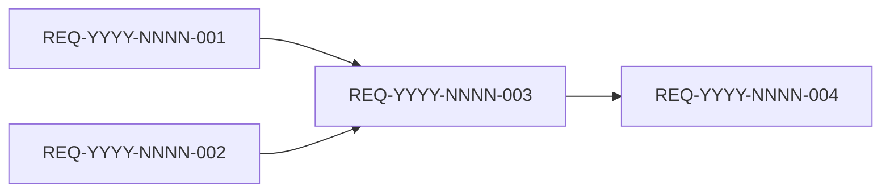

# PLAN.md 模板 — 编码计划

> 本文件是 `code-plan` 技能产出的 `PLAN.md` 章节结构与填写规范。
> 编码计划是开发协作的基线,每条任务有唯一编号 `<需求编号>-<任务序号>`,状态可追踪。
>
> **版本感知**:本文件存放在 `./assistants/<版本号>/plan/<需求编号>/PLAN.md`,文档头应明确记录版本号。

---

## 文档头
```
# 编码计划 — <需求编码> — <一句话标题>

- 需求编码:<REQ-YYYY-NNNN>
- 所属版本:<版本号>(如 v1.0.0)
- 详细设计:./assistants/<版本号>/plan/<需求编号>/RESULT.md (v<n>)
- 状态:草稿 / 已对齐 / 执行中 / 已完成
- **开发完成度**:<已完成任务数> / <总任务数>
- **测试完成度**:<测试已通过或不适用的任务数> / <总任务数>
- 创建:<YYYY-MM-DD>
- 最近更新:<YYYY-MM-DD HH:mm>
- 当前版本:v<n>
```

## 1. 计划概述
- 任务总数
- 类型分布(新增/修改/重构/...)
- 关键里程碑数
- **开发完成度**:已完成任务数 / 总数
- **测试完成度**:测试已通过或不适用的任务数 / 总数
- **真正可发布任务数**:开发状态=已完成 且 测试状态∈{已运行-通过, 不适用} 的任务数 / 总数

## 2. 任务总览
**主表,任何变更都必须先更新此表**。

| 任务编号 | 类型 | 触发/来源 | 标题 | 开发状态 | 测试状态 | 涉及文件/模块 | 前置任务 | 估算 | 责任人 | 关联任务 | 对应设计章节 |
| --- | --- | --- | --- | --- | --- | --- | --- | --- | --- | --- | --- |
| REQ-YYYY-NNNN-001 | 新增 | 需求新增 | ... | 待开始 | 未编写 | src/.../x.ts | - | 0.5d | <人> | - | RESULT.md §5 |
| REQ-YYYY-NNNN-002 | 修改 | 需求变更 | ... | 已完成 | 已运行-通过 | src/.../y.ts | - | 0.3d | <人> | - | RESULT.md §4 |
| REQ-YYYY-NNNN-003 | 修改 | 审查改修 | 基于评审,重做 T-002 | 待开始 | 未编写 | src/.../y.ts | - | 0.3d | <人> | T-002(被修正) | review/T-003/RESULT.md |
| REQ-YYYY-NNNN-004 | 文档 | 需求新增 | 补充 API 文档 | 已完成 | 不适用 | docs/api.md | - | 0.2d | <人> | - | - |

**字段说明**:
- **任务编号**:`<需求编号>-<任务序号>`,三位补零,递增分配,一经分配不再改变
- **类型**:`新增` / `修改` / `重构` / `修复` / `测试` / `文档`
- **触发/来源**:本任务为什么被创建,值见下方枚举
- **开发状态**:`待开始` / `进行中` / `已完成` / `已取消` / `阻塞` / `待重新评估`
- **测试状态**:`未编写` / `已编写` / `已运行-通过` / `已运行-失败` / `不适用` / `阻塞`
- **关联任务**:本任务取代/扩展/依赖的已存在任务(常用于"修改类"任务指向已完成的旧任务)
- **对应设计章节**:本任务在 `RESULT.md` 中的设计依据;**触发/来源=审查改修** 时此列指向 `./assistants/<版本号>/review/<任务编码>/RESULT.md`

> **双状态语义**:任务的开发状态与测试状态是**正交两轴**。
> 任务"真正可发布" = 开发状态 = `已完成` **且** 测试状态 ∈ {`已运行-通过`, `不适用`}。

### 2.1 触发/来源枚举
| 值 | 含义 | 默认类型 | 默认输入源 |
| --- | --- | --- | --- |
| `需求新增` | 因需求首次澄清产生 | 新增 | `plan/<需求>/RESULT.md` |
| `需求变更` | 因需求变化产生 | 修改 | `plan/<需求>/RESULT.md` |
| `需求撤回` | 因需求撤回产生 | (标"已取消") | — |
| `设计变更` | 因概要/详细设计变化产生 | 修改 | `plan/<需求>/RESULT.md` |
| `规范变更` | 因项目级规范变化产生 | 修改 | `plan/<需求>/RESULT.md` |
| `代码变更` | 因上游/既有代码变化产生 | 修改 | `plan/<需求>/RESULT.md` |
| `主动优化` | 主动改进(无外部触发) | 重构/新增 | `plan/<需求>/RESULT.md` |
| `审查改修` | 因 code-check 发现问题 | 修改/修复 | **`review/<任务>/RESULT.md`** ★ |
| `缺陷修复` | 因 bug 报告 | 修复 | `plan/<需求>/RESULT.md` |
| `性能优化` | 因性能问题 | 重构/修改 | `plan/<需求>/RESULT.md` |
| `安全加固` | 因安全评估 | 修改/新增 | `plan/<需求>/RESULT.md` |
| `测试补齐` | 因测试覆盖率分析 | 测试 | `plan/<需求>/RESULT.md` |
| `其他` | 其他原因(需在任务详情中说明) | (任意) | `plan/<需求>/RESULT.md` |

> **★ 关键**:`触发/来源=审查改修` 的任务输入源与其他任务不同。
> `code-it` 在执行这种任务时,只读 `./assistants/<版本号>/review/<任务编码>/RESULT.md`,
> **不读** `./assistants/<版本号>/plan/<需求编号>/RESULT.md`(详细设计,那是上游设计不是改修要求)。

## 3. 任务详情

每条任务独立成节,按任务编号顺序排列。

```
### <任务编号>:[<类型>] <标题>

#### 基础信息
- **类型**:新增 / 修改 / 重构 / 修复 / 测试 / 文档
- **触发/来源**:需求新增 / 需求变更 / 设计变更 / 规范变更 / 代码变更 / 主动优化 / **审查改修** / 缺陷修复 / 性能优化 / 安全加固 / 测试补齐 / 其他
- **触发任务**:(本任务被哪些上游任务/事件触发,可空)
- **开发状态**:待开始 / 进行中 / 已完成 / 已取消 / 阻塞 / 待重新评估
- **目标**:本任务要解决的具体问题(一句话)
- **涉及文件/模块**:<文件路径列表>
- **前置任务**:<其他任务编号列表,可空>
- **关联任务**:<被取代/扩展的旧任务编号,用于修改类任务>
- **关键变更**:
  - 接口/签名(若新增):
    ```
    function foo(arg: Type): Promise<ReturnType>
    ```
  - 数据结构(若新增):
    ```
    interface Foo {
      id: string;
      name: string;
    }
    ```
  - 关键逻辑:
    - 步骤 1:...
    - 步骤 2:...
- **边界与异常**:
  - 边界 1:... → 处理:...
  - 异常 1:... → 处理:...
- **验证手段**:单元测试 / 集成测试 / 手工测试 / 命令
- **回退方式**:如何回退本次变更
- **对应设计章节**:RESULT.md §X
- **依据规范**:... §X
- **创建时间**:YYYY-MM-DD HH:mm
- **最近更新**:YYYY-MM-DD HH:mm
- **完成时间**:(开发完成后填写)YYYY-MM-DD HH:mm
- **完成人**:<人>
- **提交哈希**:(完成后填写)<git sha>
- **备注**:(可选)

#### 单元测试状态
- **测试状态**:未编写 / 已编写 / 已运行-通过 / 已运行-失败 / 不适用 / 阻塞
- **测试文件**:
  - <path/to/test1.ts>(若已有)
  - <path/to/test2.ts>
- **覆盖的测试场景**:
  - 正常路径:...
  - 边界条件:...
  - 异常路径:...
- **测试用例数**:<n>(已编写时填写)
- **测试通过率**:<n>/<m>(已运行时填写)
- **最近测试运行时间**:YYYY-MM-DD HH:mm
- **最近测试运行命令**:<command>
- **测试阻塞原因**:(测试状态=阻塞时填写)
- **不适用理由**:(测试状态=不适用时填写,如"纯文档任务")
- **测试结果详情**:<指向 ./assistants/<版本号>/code/<任务编码>/test-results.md 或简要摘要>
- **测试提交哈希**:(测试代码本身的 git sha,可与开发提交不同)
- **测试负责人**:<人>
```

## 4. 任务依赖图
用 Mermaid 描述任务间的依赖关系:


## 5. 里程碑
| 里程碑 | 包含任务 | 完成定义 | 预期时间 |
| --- | --- | --- | --- |
| M1:基础就绪 | T-001, T-002 | 核心数据/接口定义完成,开发状态=已完成 | YYYY-MM-DD |
| M2:可演示 | T-001 ~ T-005 | 关键用户路径走通,开发状态全部=已完成 | YYYY-MM-DD |
| M3:可发布 | T-001 ~ T-XXX | **所有任务开发状态=已完成 且 测试状态 ∈ {已运行-通过, 不适用}**,通过回归 | YYYY-MM-DD |

> 里程碑的"完成定义"显式列出两轴状态要求,避免把"开发完成"误当"可发布"。

## 6. 状态管理规则

### 6.1 开发状态(主状态)
- **状态推进**:`待开始` → `进行中` → `已完成`,或经 `阻塞` 后回到 `进行中`
- **已完成不可逆**:开发状态为"已完成"的任务,其**描述/关键变更/依赖等字段不可修改**
- **已取消不可逆**:已取消任务作为历史保留,后续任务不应再依赖
- **阻塞**:必须填写阻塞原因,放在"备注"或单独的过程文档
- **状态变更记录**:每次状态变更在"变更记录"中记录(变更类型=开发状态更新)

### 6.2 测试状态(平行状态)
- **初始化**:新建任务时默认为 `未编写`;纯文档任务可设为 `不适用`
- **状态推进**:`未编写` → `已编写` → `已运行-通过`,可经 `已运行-失败` / `阻塞` 分支回到 `已编写` 或 `未编写`
- **独立于开发状态**:测试状态可独立于开发状态变化 —— 即使开发状态已是 `已完成`,测试状态仍可继续推进(因为测试可以在开发完成后补写/补跑)
- **不适用不可逆**:一旦标为 `不适用`,不应再变为其他值(除非业务变化重新评估)
- **阻塞**:必须填写"测试阻塞原因"(如"等待接口契约敲定")
- **状态变更记录**:每次状态变更在"变更记录"中记录(变更类型=测试状态更新)

### 6.3 任务"真正可发布"定义
```
任务真正可发布 ⟺
    开发状态 = 已完成
    ∧ 测试状态 ∈ {已运行-通过, 不适用}
```

- 单看开发状态=已完成,任务只是"开发完成",不是"可发布"
- 单看测试状态=已运行-通过,任务只是"测试通过",前提是开发也已完成
- 只有两轴同时满足,任务才算真正完成

### 6.4 状态字段更新责任分工
| 字段 | 主要更新方 | 触发时机 |
| --- | --- | --- |
| 开发状态(待开始→进行中) | `code-it` | 步骤 7 任务开始 |
| 开发状态(进行中→已完成) | `code-it` | 步骤 14 任务完成 |
| 测试状态(未编写→已编写) | `code-it` | 步骤 8 写完测试代码 |
| 测试状态(已编写→已运行-通过/失败) | `code-it` 或 `code-unit` | 步骤 11-12 跑完测试 |
| 测试状态(任意→不适用) | `code-plan` 或 `code-it` | 首次拆分/任务执行时确认 |
| 任务标题、关键变更等描述 | `code-plan` 增量更新 | 步骤 9B |
| 任务类型 | `code-plan` 增量更新 | 步骤 9B(通常不改) |
| 触发/来源 | `code-plan` 或 `code-check` | 首次拆分 / 派生"审查改修"任务时 |
| 触发任务 | `code-plan` 或 `code-check` | 首次拆分 / 派生"审查改修"任务时 |

> 状态推进是单向写入,**已完成的开发状态不可回退**;但**测试状态**可以来回推进(因为测试可以重跑、补写)。

## 7. 关联计划
| 关联计划编码 | 关联点 | 对本计划的影响 | 链接 |
| --- | --- | --- | --- |
| ... | 共享模块/接口/迁移顺序 | ... | [PLAN.md](../<其他计划编号>/PLAN.md) |

## 8. 变更记录
| 时间 | 版本 | 变更类型 | 变更摘要 | 变更人 |
| --- | --- | --- | --- | --- |
| 2026-06-03 18:00 | v1 | 初始创建 | 完成首次编码计划,共 12 条任务 | <用户> |
| 2026-06-04 09:30 | v1.1 | 开发状态更新 | T-002 开发状态由"待开始"→"进行中" | <用户> |
| 2026-06-04 15:00 | v1.2 | 开发状态更新 | T-002 开发状态"进行中"→"已完成",提交 abc1234 | <用户> |
| 2026-06-04 15:30 | v1.3 | 测试状态更新 | T-002 测试状态"未编写"→"已运行-通过",6/6 用例通过 | <用户> |
| 2026-06-05 11:00 | v2 | 增量更新 | 需求侧新增 FR-7,新增 T-013, T-014;T-001 被 T-013 取代(已完成的 T-001 不修改) | <用户> |

变更类型:
- **初始创建**:首次生成计划
- **开发状态更新**:仅开发状态变化(版本号小版本递增,如 v1.1)
- **测试状态更新**:仅测试状态变化(版本号小版本递增,如 v1.3)
- **新增任务**:增加任务(版本号大版本递增)
- **修改任务**:修改未完成任务的描述/依赖/估算(版本号大版本递增)
- **删除任务**:不删除,只标记"已取消"(版本号大版本递增)
- **规范触发**:因项目级规范变化而触发的任务调整
- **需求触发**:因需求变化而触发的任务调整
- **设计触发**:因概要设计变化而触发的任务调整
- **审查触发**:因 `code-check` 派生的"审查改修"任务(版本号大版本递增,记录新任务编号)

> 测试状态更新使用小版本号,这是因为它不影响任务结构,只是状态推进;
> 但如果测试状态变化伴随新任务/任务重排(例如"测试发现 bug,新增修复任务 T-XXX"),
> 则整体按"新增任务"使用大版本号。
