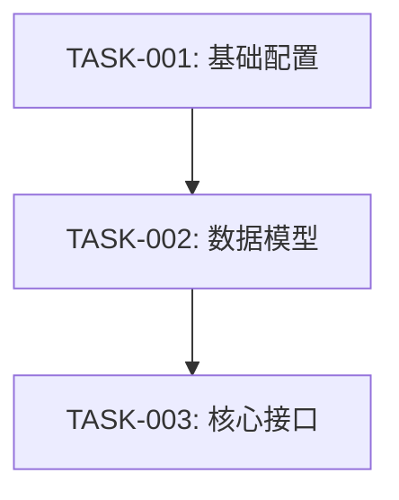

# 任务排期阶段 — code-req

> 本文件为 code-req 技能的 PLAN 阶段提供详细流程。在进入 PLAN 阶段时加载。

## 目标

将 DESIGN.md 中的模块/接口/流程拆分为可独立执行、可追踪状态的任务,产出 `PLAN.md`。

## 前置条件

- `DESIGN.md` 必须存在且 DESIGN 阶段已完成

## 输入

- `req/<REQ-NNNNN>/DESIGN.md`(上游设计)
- `req/<REQ-NNNNN>/REQUIRE.md`(上游需求,参考)
- 项目级规范:`./assistants/rules/` 下所有文件

## 输出

主产出物:`req/<REQ-NNNNN>/PLAN.md`
辅助产物:`req/<REQ-NNNNN>/LOG.md`(可选,非必要不记录)

## 工作流程

### 步骤 1 — 读取设计

1. `Read "req/<REQ-NNNNN>/DESIGN.md"`
2. 提取模块列表、接口列表、数据结构、关键流程

### 步骤 2 — 任务拆分

#### 拆分原则

| 原则 | 说明 |
| --- | --- |
| 按功能点拆分 | 一个任务 = 一个独立可验证的功能点 |
| 粒度适中 | 一个任务在 1 次 code-it 调用中可完成 |
| 独立性 | 尽量减少任务间耦合 |
| 可验证 | 每个任务有明确的完成标准 |

#### 任务编号规则

```
TASK-<REQ-NNNNN>-<序号>
序号: 5 位数字,从 00001 开始递增
```

#### 任务类型

| 类型 | 说明 | 示例 |
| --- | --- | --- |
| 新增 | 新建文件/模块 | 新增用户模块 |
| 修改 | 修改已有文件 | 修改登录接口 |
| 删除 | 删除文件/代码 | 移除废弃 API |
| 基础 | 前置基础工作 | 创建配置文件 |

#### 优先级排序

1. 基础设施类任务(配置/目录/模板)优先
2. 被依赖的任务优先
3. 核心功能任务次之
4. 辅助功能任务最后

### 步骤 3 — 任务依赖分析

对每条任务,确定其前置任务:

```
function findDependencies(task, allTasks):
  deps = []
  for other in allTasks:
    if task.requires(other.output):
      deps.push(other.id)
  return deps
```

### 步骤 4 — 里程碑划分

按功能交付节点划分里程碑:

| 里程碑 | 完成定义 | 包含任务 |
| --- | --- | --- |
| M1:基础就绪 | 基础设施/模板/配置完成 | TASK-001~002 |
| M2:核心功能 | 核心功能编码完成 | TASK-003~005 |
| M3:全量完成 | 全部任务完成 | TASK-006~008 |

### 步骤 5 — 绘制依赖图

用 Mermaid 绘制任务依赖图:



### 步骤 6 — 撰写 PLAN.md

按 `templates/PLAN.md` 结构生成:

```
# 任务排期 — <REQ-NNNNN> · <标题>

## 任务总览
| 任务编号 | 类型 | 标题 | 涉及文件 | 开发状态 | 前置任务 |
| --- | --- | --- | --- | --- | --- |
| TASK-<REQ>-00001 | 新增 | ... | ... | 待开始 | — |

## 任务依赖图
(见上方 Mermaid 图)

## 里程碑
| 里程碑 | 包含任务 | 完成定义 |
| --- | --- | --- |

## 任务详情
### TASK-<REQ>-00001: <标题>
**涉及文件**: ...
**完成标准**: ...
**前置任务**: ...
```

### 步骤 7 — 检索关联计划

1. `Glob "req/*/PLAN.md"` 列出同版本所有计划
2. 检查任务依赖是否跨需求
3. 在 PLAN.md 中记录关联

## 任务状态

### 双状态模型

| 字段 | 枚举值 | 说明 |
| --- | --- | --- |
| 开发状态 | 待开始/进行中/已完成/已取消/阻塞 | 编码执行状态 |
| 前置任务 | 任务编号列表 | 必须等前置任务完成后才能开始 |

### 状态流转

```
待开始 → 进行中 → 已完成
  ↓         ↓
已取消    阻塞 → 进行中
```

## 非 --auto 模式确认

阶段完成后弹出确认:
```
任务排期完成: <N> 任务 / <M> 里程碑
选项:
A. 继续 CODING 阶段(推荐)
B. 暂停
C. 取消
```