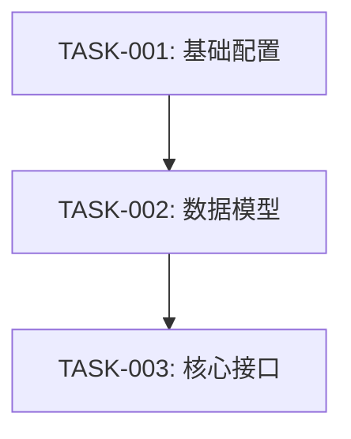

# 任务排期阶段 — code-req

> 本文件为 code-req 技能的 PLAN 阶段提供详细流程。在进入 PLAN 阶段时加载。

## 目标

将 DESIGN.md 中的模块/接口/流程拆分为可独立执行、可追踪状态的任务,产出 `PLAN.md`。

## 前置条件

- `DESIGN.md` 必须存在且 DESIGN 阶段已完成

## 输入

- `req/<REQ-NNNNN>/DESIGN.md`(上游设计)
- `req/<REQ-NNNNN>/REQUIRE.md`(上游需求,参考)
- 项目级规范:`./assistants/rules/` 下所有文件

## 输出

主产出物:`req/<REQ-NNNNN>/PLAN.md`
辅助产物:`req/<REQ-NNNNN>/LOG.md`(可选,非必要不记录)

## 工作流程

### 步骤 0 — 设计目标确认(与用户确认)

> 在读取设计之前,先与用户确认设计目标。非 `--auto` 模式触发 AskUserQuestion。

#### 从 DESIGN 读取设计目标

1. 读取 `DESIGN.md` 的 "## 设计目标" 小节
2. 存在 → 沿用 DESIGN 的设计目标,跳过本步骤的 AskUserQuestion
3. 不存在 → 触发 AskUserQuestion

#### 7 维度评估

> 向用户确认以下 7 个维度的优先级:

| 维度 | 说明 | 默认值 |
| --- | --- | --- |
| 功能性 | 功能完整,正确工作 | 高 |
| 扩展性 | 易于增加新功能 | 中 |
| 健壮性 | 异常处理,边界条件 | 中 |
| 可维护性 | 代码清晰,易于修改 | 中 |
| 封装性 | 模块内聚,接口清晰 | 不适用(本项目为文档类) |
| 可复用性 | 组件/函数可复用 | 不适用(本项目为文档类) |
| 可读性 | 命名清晰,注释充分 | 不适用(本项目为文档类) |

#### 自适应问题数

| 需求规模 | 任务数 | AskUserQuestion 数 |
| --- | --- | --- |
| 小需求 | 1 个 | 1 问 |
| 中等需求 | 2-5 个 | 4 问(功能性/扩展性/健壮性/可维护性) |
| 大需求 | ≥6 个 | 8 问(7 维度 + 风险偏好) |

#### 屏显模板

```
=== code-req PLAN 设计目标确认 ===
设计目标: <沿用 DESIGN 的 --minimal/--extensible/--balanced>
维度优先级:
  功能性: <高/中/低>
  扩展性: <高/中/低>
  健壮性: <高/中/低>
  可维护性: <高/中/低>
  封装性: 不适用
  可复用性: 不适用
  可读性: 不适用
已回写至 PLAN.md "## 设计目标" 小节
```

### 步骤 1 — 读取设计

1. `Read "req/<REQ-NNNNN>/DESIGN.md"`
2. 提取模块列表、接口列表、数据结构、关键流程

### 步骤 2 — 任务拆分

#### 拆分原则

| 原则 | 说明 |
| --- | --- |
| 按功能点拆分 | 一个任务 = 一个独立可验证的功能点 |
| 粒度适中 | 一个任务在 1 次 code-it 调用中可完成 |
| 独立性 | 尽量减少任务间耦合 |
| 可验证 | 每个任务有明确的完成标准 |

#### 任务编号规则

```
TASK-<REQ-NNNNN>-<序号>
序号: 5 位数字,从 00001 开始递增
```

#### 任务类型

| 类型 | 说明 | 示例 |
| --- | --- | --- |
| 新增 | 新建文件/模块 | 新增用户模块 |
| 修改 | 修改已有文件 | 修改登录接口 |
| 删除 | 删除文件/代码 | 移除废弃 API |
| 基础 | 前置基础工作 | 创建配置文件 |

#### 优先级排序

1. 基础设施类任务(配置/目录/模板)优先
2. 被依赖的任务优先
3. 核心功能任务次之
4. 辅助功能任务最后

### 步骤 3 — 用户确认(新增)

> 在分析依赖和里程碑前,与用户确认任务拆分和优先级。

#### 3a. 任务拆分确认

确认任务拆分是否合理:

- 任务粒度是否合适?(过细 → 管理成本高;过粗 → 单次执行困难)
- 任务间依赖关系是否准确?(是否有遗漏的依赖/虚假的依赖)
- 里程碑划分是否合理?(每个里程碑的完成定义是否清晰)

提问示例:
```
任务拆分确认:共拆分 8 个任务,4 个里程碑
| 任务 | 涉及文件 | 预估工作量 |
| --- | --- | --- |
| TASK-001: 创建语言文件 | 6 个新文件 | 小 |
...
选项:
A. 拆分合理,继续(推荐)
B. 需要调整粒度(请说明)
C. 需要调整依赖关系(请说明)
```

#### 3b. 优先级确认

确认任务优先级排序:

- 基础设施是否优先于功能开发?
- 关键路径是否识别正确?
- 是否有可并行执行的任务?

提问示例:
```
优先级确认:当前任务按依赖关系排序
选项:
A. 当前排序合理,继续(推荐)
B. 需要调整优先级(请说明)
C. 需要标记可并行任务
```

### 步骤 4 — 任务依赖分析

对每条任务,确定其前置任务:

```
function findDependencies(task, allTasks):
  deps = []
  for other in allTasks:
    if task.requires(other.output):
      deps.push(other.id)
  return deps
```

### 步骤 5 — 里程碑划分

按功能交付节点划分里程碑:

| 里程碑 | 完成定义 | 包含任务 |
| --- | --- | --- |
| M1:基础就绪 | 基础设施/模板/配置完成 | TASK-001~002 |
| M2:核心功能 | 核心功能编码完成 | TASK-003~005 |
| M3:全量完成 | 全部任务完成 | TASK-006~008 |

### 步骤 6 — 绘制依赖图

用 Mermaid 绘制任务依赖图:



### 步骤 7 — 撰写 PLAN.md

按 `templates/PLAN.md` 结构生成:

```
# 任务排期 — <REQ-NNNNN> · <标题>

## 任务总览
| 任务编号 | 类型 | 标题 | 涉及文件 | 开发状态 | 前置任务 |
| --- | --- | --- | --- | --- | --- |
| TASK-<REQ>-00001 | 新增 | ... | ... | 待开始 | — |

## 任务依赖图
(见上方 Mermaid 图)

## 里程碑
| 里程碑 | 包含任务 | 完成定义 |
| --- | --- | --- |

## 任务详情
### TASK-<REQ>-00001: <标题>
**涉及文件**: ...
**完成标准**: ...
**前置任务**: ...
```

### 步骤 8 — 检索关联计划

1. `Glob "req/*/PLAN.md"` 列出同版本所有计划
2. 检查任务依赖是否跨需求
3. 在 PLAN.md 中记录关联

## 任务状态

### 双状态模型

| 字段 | 枚举值 | 说明 |
| --- | --- | --- |
| 开发状态 | 待开始/进行中/已完成/已取消/阻塞 | 编码执行状态 |
| 前置任务 | 任务编号列表 | 必须等前置任务完成后才能开始 |

### 状态流转

```
待开始 → 进行中 → 已完成
  ↓         ↓
已取消    阻塞 → 进行中
```

## 非 --auto 模式确认

### 用户确认

步骤 3 中使用 `AskUserQuestion`:

```
任务拆分确认: <问题>
选项:
A. <选项 A>(推荐)
B. <选项 B>
C. <选项 C>
```

### 阶段完成确认

阶段完成后弹出确认:
```
任务排期完成: <N> 任务 / <M> 里程碑
选项:
A. 继续 CODING 阶段(推荐)
B. 暂停
C. 取消
```

## 确认环节约束(新增)

- 步骤 3a 和 3b 各为 1 个确认,共 2 个确认
- 非 `--auto` 模式触发 `AskUserQuestion`
- `--auto` 模式自动选推荐项(第一项),记录为"自动选择"
- 确认结果记录在 PLAN.md 中(标注"用户确认"或"自动选择")