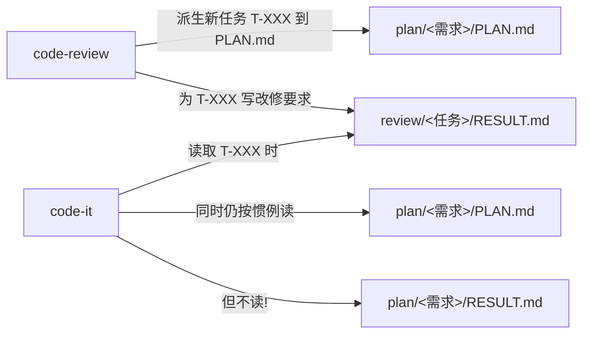

# 工作目录布局参考 — code-review(版本感知)

> `code-review` 技能强制约定。**本技能产生两类输出目录**:
> - 需求级(整体评审报告):`assistants/<版本号>/review/<需求编号>/`
> - 任务级(每个派生的"审查改修"任务):`assistants/<版本号>/review/<新任务编码>/`
>
> 本技能受 `code-version` 管理,实际工作空间 = `./assistants/<版本号>/`(由 `./assistants/.current-version` 决定)。

## 整体布局
```
<项目根目录>/
├── assistants/
│   ├── rules/                          ← 项目级规范(只读,跨版本共享)
│   │   ├── review-checklist.md         ★ 优先采用(若存在)
│   │   └── ...
│   ├── .current-version                ← 当前激活版本标记
│   └── <版本号>/                       ★ 版本工作空间
│       ├── RESULT.md                   ← 版本开发进度看板(可写,本技能会更新评审相关区段)
│       ├── require/<需求编号>/
│       │   └── RESULT.md              ← 上游需求(只读)
│       ├── design/<需求编号>/
│       │   └── RESULT.md              ← 上游概要设计(只读)
│       ├── plan/
│       │   └── <需求编号>/
│       │       ├── RESULT.md          ← 上游详细设计(只读)
│       │       └── PLAN.md            ← 上游任务计划(只读,但本技能会追加"审查改修"任务)
│       ├── code/
│       │   └── <任务编码>/              ← code-it 产出(只读,作为评审对象)
│       │       └── RESULT.md
│       ├── test/
│       │   └── <任务编码>/              ← code-unit 产出(只读,辅助评审)
│       │       └── RESULT.md
│       └── review/
│           ├── <需求编号>/              ← 本技能整体评审产物,可写
│           │   ├── REVIEW-REPORT.md   # 整体评审报告(主产出)
│           │   ├── work-log.md        # 过程文档
│           │   ├── review-checklist-applied.md
│           │   └── findings-no-task.md
│           └── <新任务编码>/            ← 每个派生的"审查改修"任务一个目录,可写
│               ├── RESULT.md          # 改修要求(给 code-it 直接消费)
│               ├── work-log.md        # 过程文档
│               └── ...
├── src/                                # 用户的项目源码(本技能只读,评审对象)
├── tests/                              # 用户的测试代码(本技能只读)
└── ...
```

## 与其他技能目录粒度的对比

| 技能 | 主输出目录 | 路径模式 |
| --- | --- | --- |
| code-require | 需求级 | `<版本号>/require/<需求编号>/` |
| code-design | 需求级 | `<版本号>/design/<需求编号>/` |
| code-plan | 需求级 | `<版本号>/plan/<需求编号>/` |
| code-it | 任务级 | `<版本号>/code/<任务编码>/` |
| code-unit | 任务级 | `<版本号>/test/<任务编码>/` |
| **code-review** | **需求级 + 任务级** | **`<版本号>/review/<需求编号>/` + `<版本号>/review/<新任务编码>/`** |

> code-review 独特:它**既在需求级产出一个整体报告,又在任务级为每个派生的改修任务产出 input 文件**。
> 后者是**给 code-it 直接消费的输入**,不是给人阅读的总结。
> 所有输出都在版本工作空间内,版本切换时一起归档/加载。

## 派生的"审查改修"任务的特殊之处



`code-it` 看到任务的 `触发/来源=审查改修` 时:
- ✅ 读 `./assistants/<版本号>/review/<任务编码>/RESULT.md`(改修要求,本任务的**全部输入**)
- ✅ 读 `./assistants/<版本号>/plan/<需求编号>/PLAN.md`(本任务的状态/上下文)
- ❌ **不读** `./assistants/<版本号>/plan/<需求编号>/RESULT.md`(那是详细设计,本任务是修补,不是新设计)

## 本技能会修改的文件清单

| 文件 | 修改内容 | 位置 |
| --- | --- | --- |
| `./assistants/<版本号>/review/<需求编号>/REVIEW-REPORT.md` | 整体评审报告 | 步骤 12 |
| `./assistants/<版本号>/review/<需求编号>/work-log.md` | 过程文档 | 步骤 3-13 |
| `./assistants/<版本号>/review/<需求编号>/review-checklist-applied.md` | 评审清单 | 步骤 7 |
| `./assistants/<版本号>/review/<需求编号>/findings-no-task.md` | 未派生任务的发现 | 步骤 9 |
| `./assistants/<版本号>/review/<新任务编码>/RESULT.md` | 改修要求 | 步骤 11 |
| `./assistants/<版本号>/review/<新任务编码>/work-log.md` | 过程文档 | 步骤 11-13 |
| `./assistants/<版本号>/plan/<需求编号>/PLAN.md` | **仅追加**新"审查改修"任务 + 变更记录 + 版本号 | 步骤 10 |
| `./assistants/<版本号>/RESULT.md` | **仅**评审发现汇总 / 派生任务记录 / 缺陷清单 / 任务清单(派生任务) / 变更记录 | 步骤 13, 14 |

## 本技能不会修改的文件清单

| 文件 | 原因 |
| --- | --- |
| `./assistants/rules/` 任何文件 | 规范只读(跨版本共享) |
| `./assistants/<版本号>/require/<需求编号>/` 任何文件 | 上游只读 |
| `./assistants/<版本号>/design/<需求编号>/` 任何文件 | 上游只读 |
| `./assistants/<版本号>/plan/<需求编号>/RESULT.md` | 详细设计只读 |
| `./assistants/<版本号>/code/<任务编号>/` 任何文件 | code-it 产出只读 |
| `./assistants/<版本号>/test/<任务编号>/` 任何文件 | code-unit 产出只读 |
| `./assistants/<版本号>/plan/<需求编号>/PLAN.md` 中**已有任务**的任何字段 | 只追加,不改 |
| `./assistants/<版本号>/RESULT.md` 中非本技能负责的区段 | 各技能分区维护 |
| CWD 下的任何代码 | 只评审,不改 |

## 多项目隔离
不同项目的 `assistants/` 完全独立。

## 跨任务检索
- 整体评审报告 `REVIEW-REPORT.md` 是本次需求所有任务评审的索引
- 派生的每个审查改修任务的 `RESULT.md` 是 `code-it` 的输入
- 跨需求时通过需求编码前缀关联
- 跨版本(可选):同需求的评审可同时存在于不同版本目录
